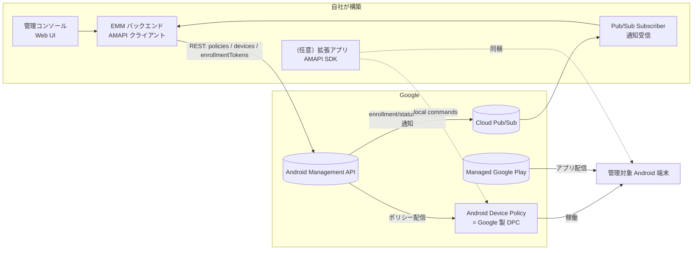

# Android Enterprise 機能カタログ — 独自 EMM 構築 検討用

> 目的: 独自 EMM（Enterprise Mobility Management）システムを Android Enterprise の機能を使って構築するにあたり、
> **「どの機能を / どのように組み込むか」** を検討するための機能一覧と組み込み方針メモ。
>
> 最終更新: 2026-06-22 / 情報源: Google for Developers (Android Management API リファレンス) ほか。末尾「参考リンク」参照。

---

## 0. 結論サマリ（先に読む用）

| 論点 | 結論 |
|---|---|
| 実装方式 | **Android Management API（AMAPI）一択**。旧 Play EMM API + 自前 DPC は新規採用しない（後述 §1） |
| 自前 DPC 開発 | **不要**。Google 製の `Android Device Policy`（ADP）にポリシーを配信する構成 |
| 自社が作るもの | (a) 管理コンソール（Web）、(b) AMAPI を叩くバックエンド、(c) Pub/Sub 受信、(d) 必要なら拡張アプリ（AMAPI SDK） |
| 対応する管理モード | まず **Fully Managed** と **Dedicated(Kiosk)** を MVP、次に **Work Profile(BYOD)** と **COPE** |
| MVP 機能 | enterprise 作成 → enrollment token → ポリシー配信 → デバイス一覧/状態 → 基本コマンド(LOCK/WIPE/REBOOT) |

---

## 1. 大方針: 実装アプローチの選択

### 1.1 2 つのアプローチ比較

| 観点 | **Android Management API (AMAPI)** ✅ 推奨 | 旧: Play EMM API + 自前 DPC ❌ 非推奨 |
|---|---|---|
| DPC（端末側管理エージェント） | Google 製 `Android Device Policy` を利用（自前開発不要） | EMM 各社が自前 DPC を開発・保守 |
| 新機能追従 | Google が ADP を更新 → すぐ使える | 自前 DPC にコード追加が必要（数ヶ月〜年の遅延） |
| 新規登録 | 受付中・現行の標準 | **新規 custom DPC 登録は停止済み** |
| Play Protect | ADP は allowlist 済みで問題なし | **2025 以降 DPC allowlist 必須**。未承認 DPC はプロビジョニング時にブロック |
| 旧 API 停止 | 影響なし | Play EMM API の主要メソッドは **2025/09/30 に turn-off 済み** |
| 実装コスト | 低（REST API 中心） | 高（Android 端末アプリ + サーバ両方） |

### 1.2 なぜ AMAPI 一択か（2025–2026 の状況）

- 旧 Play EMM API の deprecated メソッド群は **2025年9月30日に永久停止**。
- **新規の custom DPC 登録は受付停止**。既存の大手 DPC は当面動くが、新規構築には選べない。
- **Google Play Protect が DPC allowlist を強制**（2025〜）。Google 承認外の DPC はプロビジョニングで「有害なアプリをブロック」となる。
- → **独自 EMM を新規に作るなら AMAPI 一択**。自前 DPC は検討対象から外してよい。

### 1.3 AMAPI のアーキテクチャ全体像

**組み込み方針**: 自社の責務は「コンソール + バックエンド + Pub/Sub 受信」。端末側の制御は ADP に委譲する。
オフライン制御や直接 APK 配信など ADP だけで足りない部分のみ、**AMAPI SDK を組み込んだ拡張アプリ**を別途用意する（§8）。

---

## 2. 前提セットアップ（Google Cloud / API まわり）

| 項目 | 内容 | 組み込みメモ |
|---|---|---|
| API 有効化 | GCP プロジェクトで **Android Management API** を有効化 | サービスアカウント + OAuth2 で認証 |
| Enterprise 作成 | `signupUrls.create` → 管理者が Google にサインアップ → `enterprises.create` | テナント（顧客企業）= 1 enterprise。マルチテナント設計が要 |
| バインド方式 | EMM バインド（自社プロジェクトに紐付け）/ 顧客管理 | SaaS 型なら EMM バインドが基本 |
| Pub/Sub | enterprise に `pubsubTopic` を設定し通知購読 | enrollment / status / command / usage_logs を受信（§9） |
| 認証スコープ | `https://www.googleapis.com/auth/androidmanagement` | サービスアカウントに付与 |

**主要 REST リソース**: `enterprises` / `enterprises.policies` / `enterprises.devices` / `enterprises.enrollmentTokens` /
`enterprises.applications` / `enterprises.webApps` / `enterprises.webTokens`。

---

## 3. 管理モード（Solution Sets）— どのモードを対象にするか

| モード | 所有 | 報告される `managementMode` | ユースケース | 個人領域 | MVP 優先度 |
|---|---|---|---|---|---|
| **Fully Managed**（完全管理 / Device Owner） | 会社 | `DEVICE_OWNER` | 業務専用端末。端末全体を管理 | なし | ★★★ 高 |
| **Dedicated / COSU**（専用端末・Kiosk） | 会社 | `DEVICE_OWNER` | 単一用途（POS・サイネージ・現場端末）。Kiosk ポリシー適用 | なし | ★★★ 高 |
| **Work Profile**（仕事用プロファイル / BYOD） | 個人 | `PROFILE_OWNER` | 私物端末に仕事領域を分離。個人領域は不可侵 | あり（不可侵） | ★★☆ 中 |
| **COPE**（会社所有・個人利用可） | 会社 | `DEVICE_OWNER` + 仕事プロファイル | 会社端末だが私的利用も許可 | あり | ★☆☆ 低〜中 |

**組み込み方針**:
- **Dedicated と Fully Managed は実装が近い**（どちらも Device Owner）。Kiosk は「Fully Managed + kiosk ポリシー」で実現するので、両者を同じプロビジョニング経路に乗せられる → **MVP はここから**。
- Work Profile は BYOD のプライバシー制約（個人領域の操作・取得が一切できない）を UI/仕様に織り込む必要があるため、設計負荷が一段上がる。
- モードの分岐は**プロビジョニング時の enrollment token の `allowPersonalUsage` で決まる**（§4.2）。

---

## 4. エンロール / プロビジョニング — どう端末を登録させるか

### 4.1 プロビジョニング方式

| 方式 | 対応モード | 仕組み | 規模適性 | 組み込みメモ |
|---|---|---|---|---|
| **QR コード** | 全モード | 初期設定ウィザードで QR をスキャン → ADP を取得・enroll | 小〜中規模 | enrollment token を QR 化。最も汎用。**まず実装すべき** |
| **Zero-touch** | Fully Managed / Dedicated / COPE | 正規リセラー購入端末が初回起動で自動プロビジョン | 大規模 | zero-touch ポータルに設定を登録。リセラー連携が前提 |
| **サインイン URL / Web enrollment** | Work Profile (BYOD) | ユーザーが URL からブラウザ経由で enroll（2025 で BYOD は Web フローが既定化） | 中規模 BYOD | `signinDetails` を policy に設定 |
| **DPC 識別子 (`afw#setup`)** | Fully Managed | 初期設定でメール欄に `afw#setup` 入力 → ADP DL | 小規模・手動 | フォールバック手段 |
| **NFC** | Fully Managed のみ | NFC バンプで設定転送 | レガシー | **非推奨**（COPE 非対応・運用が古い）。新規採用しない |
| **Knox Mobile Enrollment** | Samsung 端末 | Samsung のゼロタッチ相当 | Samsung 大規模 | Samsung 限定。必要なら後追い |

### 4.2 Enrollment Token（中核オブジェクト）

`enterprises.enrollmentTokens.create` で発行。主なフィールド:

| フィールド | 用途 |
|---|---|
| `policyName` | enroll 時に適用する初期ポリシー |
| `allowPersonalUsage` | **モード分岐の鍵**。`PERSONAL_USAGE_DISALLOWED`→Fully Managed/Dedicated、`PERSONAL_USAGE_ALLOWED`→COPE/Work Profile |
| `duration` | トークン有効期間 |
| `oneTimeOnly` | 1 端末限定か |
| `additionalData` | 自社で端末に紐付けたいメタ情報（部署・ユーザー ID 等）を埋め込む |
| `qrCode` | レスポンスで返る QR 用 JSON |

**組み込み方針**: 「ポリシー雛形 → トークン発行 → QR/zero-touch へ流し込み」を 1 本のフローにする。
`additionalData` に自社の資産管理キーを埋めておくと、enroll 通知（§9）で端末と社内マスタを自動突合できる。

---

## 5. ポリシー機能カタログ（中核）— `Policy` リソース

ポリシーは `enterprises.policies.patch` で upsert し、`device.policyName` か enrollment token で端末に適用する。
**1 ポリシーあたりアプリ最大 3,000 件**。以下、カテゴリ別の主要フィールド。

### 5.1 アプリ管理
| フィールド | 機能 |
|---|---|
| `applications[]` | アプリ単位ポリシー（インストール種別・権限・managed config 等） |
| `applications[].installType` | `FORCE_INSTALLED` / `PREINSTALLED` / `BLOCKED` / `AVAILABLE` / `REQUIRED_FOR_SETUP` / `KIOSK` |
| `applications[].defaultPermissionPolicy` | ランタイム権限の自動付与/拒否/ユーザー判断 |
| `applications[].managedConfiguration` | アプリへの設定値注入（§7.3） |
| `applications[].permissionGrants[]` | 個別権限の付与制御 |
| `installAppsDisabled` / `uninstallAppsDisabled` | ユーザーによる導入/削除の禁止 |
| `playStoreMode` | `WHITELIST`（許可アプリのみ）/ `BLACKLIST` |
| `appAutoUpdatePolicy` | 自動更新の挙動（常時/Wi-Fiのみ/夜間 等） |

### 5.2 パスワード / 認証
| フィールド | 機能 |
|---|---|
| `passwordPolicies[]` | パスワード品質・長さ・履歴・有効期限・失敗時ワイプ等（プロファイル別に複数指定可） |
| `passwordRequirements` | （旧・非推奨。`passwordPolicies` を使う） |
| `choosePrivateKeyRules[]` | アプリに証明書アクセスを許可するルール |
| `credentialsConfigDisabled` | 資格情報設定のロック |

### 5.3 ネットワーク / 接続
| フィールド | 機能 |
|---|---|
| `openNetworkConfiguration` | Wi-Fi / Ethernet / 証明書（ONC 形式）の一括配布 |
| `wifiConfigDisabled` | Wi-Fi 設定変更のロック |
| `wifiSsidPolicy`（allowlist/denylist） | 接続可能 SSID の制限（Android 13+ 会社所有） |
| `vpnConfigDisabled` / `alwaysOnVpnPackage` | VPN 設定ロック / 常時 VPN 強制 |
| `recommendedGlobalProxy` | グローバル HTTP プロキシ |
| `dataRoamingDisabled` | ローミング禁止 |
| `deviceConnectivityManagement` | USB・テザリング・Wi-Fi 直接等の包括制御 |
| `deviceRadioState` | Wi-Fi/Bluetooth/モバイル/UWB の ON/OFF 状態 |

### 5.4 ハードウェア / デバイス制御
| フィールド | 機能 |
|---|---|
| `cameraAccess` / `cameraDisabled` | カメラ制御 |
| `microphoneAccess` | マイク制御 |
| `bluetoothDisabled` / `bluetoothConfigDisabled` | Bluetooth 無効化 / 設定ロック |
| `usbFileTransferDisabled` | USB ファイル転送禁止 |
| `mountPhysicalMediaDisabled` | 物理外部メディアのマウント禁止 |
| `adjustVolumeDisabled` | 音量変更禁止 |
| `outgoingBeamDisabled` | NFC ビーム禁止 |
| `screenCaptureDisabled` | スクリーンショット禁止 |

### 5.5 セキュリティ / 暗号化 / 検証
| フィールド | 機能 |
|---|---|
| `encryptionPolicy` | 端末暗号化の要求 |
| `ensureVerifyAppsEnabled` | Play Protect（アプリ検証）の強制 ON |
| `advancedSecurityOverrides` | 不明ソース・開発者設定・Play Protect 強制等の詳細制御 |
| `untrustedAppsPolicy` | サイドロード（不明ソース）アプリの扱い |
| `factoryResetDisabled` / `safeBootDisabled` | 工場出荷リセット / セーフブートの禁止 |
| `frpAdminEmails` | Factory Reset Protection の管理者アカウント |
| `commonCriteriaMode` | 高セキュリティ（Common Criteria）モード |

### 5.6 Kiosk / 専用デバイス
| フィールド | 機能 |
|---|---|
| `applications[].installType = KIOSK` | 単一アプリを Kiosk として固定 |
| `kioskCustomLauncherEnabled` | 複数アプリ可の Kiosk ランチャー |
| `kioskCustomization` | 電源ボタン・システムナビ・ステータスバー・通知の挙動 |
| `statusBarDisabled` / `keyguardDisabled` | ステータスバー / ロック画面の無効化 |
| `keyguardDisabledFeatures[]` | ロック画面の個別機能の無効化 |
| `setupActions[]` | 専用端末セットアップ時のアクション |

### 5.7 システム更新（OS アップデート）
| フィールド | 機能 |
|---|---|
| `systemUpdate.type` | `AUTOMATIC` / `WINDOWED`（時間帯指定）/ `POSTPONE`（最大 30 日延期）/ `KEEP_CURRENT` |
| `systemUpdate.freezePeriods[]` | 更新凍結期間（繁忙期に OS 更新を止める） |
| `minimumApiLevel` | 最低 Android API レベルの要求（未満は非準拠） |

### 5.8 証明書 / アカウント
| フィールド | 機能 |
|---|---|
| `oncCertificateProviders[]` | 証明書プロバイダ連携（SCEP/動的配布） |
| `accountTypesWithManagementDisabled[]` | 追加可能なアカウント種別の制限 |
| `modifyAccountsDisabled` / `addUserDisabled` | アカウント変更 / ユーザー追加の禁止 |

### 5.9 位置情報
| フィールド | 機能 |
|---|---|
| `locationMode` | 位置検出の精度/許可レベル（高精度/センサーのみ/OFF/ユーザー判断） |
| `shareLocationDisabled` | 位置情報共有の禁止 |

> 注: 端末の**リアルタイム測位**は Lost Mode（§6）や別途エージェントが絡む。ポリシーは「位置機能の有効/無効」制御が中心。

### 5.10 Work Profile / クロスプロファイル / 個人利用
| フィールド | 機能 |
|---|---|
| `crossProfilePolicies` | 仕事⇔個人間のデータ共有・連絡先表示・コピペ制御 |
| `personalUsagePolicies` | COPE の個人領域の制限（個人アプリ・カメラ・最大日数等） |
| `personalUsagePolicies.personalPlayStoreMode` | 個人領域 Play ストアの許可/制限 |

### 5.11 表示 / UI / 補足
| フィールド | 機能 |
|---|---|
| `displaySettings` | 画面の明るさ・タイムアウト |
| `setWallpaperDisabled` / `setUserIconDisabled` | 壁紙 / アイコン変更禁止 |
| `shortSupportMessage` / `longSupportMessage` | 制限時に表示する管理者メッセージ |
| `deviceOwnerLockScreenInfo` | ロック画面に表示する所有者情報 |
| `networkEscapeHatchEnabled` | ネットワーク無設定時の緊急接続許可 |

### 5.12 コンプライアンス / 強制
| フィールド | 機能 |
|---|---|
| `complianceRules[]` | 非準拠条件（API レベル不足・非準拠アプリ等）の定義 |
| `policyEnforcementRules[]` | 違反時の動作（警告 / アプリブロック / ワイプ等）とエスカレーション |
| `statusReportingSettings` | どの状態を報告させるか（§9） |

**ポリシー設計の組み込み方針**:
- ポリシーは「テンプレート（部署/用途別）」として持ち、端末には `policyName` で割当 → 端末ごとの上書きは最小限に。
- **MVP では §5.1（アプリ）/ §5.2（パスワード）/ §5.5（セキュリティ）/ §5.7（更新）** を押さえれば実用最小。
- Kiosk（§5.6）は Dedicated を狙うなら MVP に含める。

---

## 6. デバイスコマンド（リモート操作）— `devices.issueCommand`

| コマンド | 機能 | 条件 |
|---|---|---|
| `LOCK` | 端末/プロファイルを即ロック | Work Profile は基本プロファイルのみ |
| `RESET_PASSWORD` | パスワード変更（事前確認/即ロック等フラグ可） | — |
| `REBOOT` | 端末再起動 | Fully Managed・Android 7.0+ |
| `WIPE` | 初期化（会社端末=工場出荷リセット / 個人=仕事プロファイル削除） | — |
| `RELINQUISH_OWNERSHIP` | 管理解除して私物化（個人データ温存） | 会社所有・Android 8.0+ |
| `CLEAR_APP_DATA` | 指定アプリのデータ消去 | Android 9+ |
| `START_LOST_MODE` / `STOP_LOST_MODE` | 紛失モード開始/解除（連絡先表示・測位） | Fully Managed / 会社所有 work profile |
| `ADD_ESIM` / `REMOVE_ESIM` | eSIM プロファイルの追加/削除 | Android 15+ |
| `REQUEST_DEVICE_INFO` | 端末情報（eSIM 識別子等）の要求 | BYOD は Android 13+ でユーザー承認要 |

**組み込み方針**: コマンドは**非同期**（発行 → Pub/Sub の `COMMAND` 通知で結果受信）。
コンソールには「即時実行 + 結果ポーリング/通知反映」の UI を用意。`WIPE` / `RELINQUISH_OWNERSHIP` は不可逆なので二段階確認を必須に。

---

## 7. アプリ配信（Managed Google Play）

| 機能 | 内容 | 組み込みメモ |
|---|---|---|
| **公開アプリ配信** | Play ストアの一般アプリを承認・配布 | `applications[].installType` で強制/任意を制御 |
| **限定公開 / プライベートアプリ** | 自社開発 APK を自社テナント限定で公開 | Google Play Console or AMAPI 経由で登録 |
| **Web アプリ（PWA ショートカット）** | `enterprises.webApps` で URL をアプリ化して配布 | 軽量な社内ツール配布に便利 |
| **直接 APK 配信** | Play を介さず APK を直接配布（**AMAPI SDK 1.6+**） | Play 非掲載アプリの配信に。拡張アプリ（§8）が必要 |
| **iframe 埋め込み** | 管理 Google Play の UI を自社コンソールに埋め込み（`webTokens`） | アプリ承認/検索/managed config 設定を自前 UI 化せず流用できる |

### 7.3 Managed Configuration（アプリ設定の遠隔注入）
- `applications[].managedConfiguration` または `managedConfigurationTemplate` で、対象アプリに設定値（サーバ URL・ログイン情報・機能フラグ等）を注入。
- アプリ側が公開する設定スキーマは `enterprises.applications.get` で取得可能。
- **組み込み方針**: iframe を使うとスキーマ駆動の設定 UI を自作せずに済む。MVP では iframe 活用が省力。

---

## 8. 拡張性（AMAPI SDK / Extension App）

ADP だけでは届かない領域を、**自社アプリに AMAPI SDK を組み込み**ADP と直接通信させて補う。

| 用途 | 内容 |
|---|---|
| **ローカルコマンド** | ネットワーク不通でも端末内でコマンド実行（例: `ClearAppData`） |
| **コンパニオンアプリ** | オフラインで ADP と連携する自社アプリ（`COMPANION_APP` ロール） |
| **直接 APK インストール** | Play を介さない配信（SDK 1.6.0+） |
| **コマンド状態取得** | 発行済みコマンドの status をローカル照会・コールバック受信 |
| **DPC マイグレーション** | 既存 custom DPC から AMAPI へ移行 |

**設定要件**: 端末に `extensionConfig` ポリシー（拡張アプリの署名鍵・通知レシーバ）を配信して認可する。

**組み込み方針**: MVP では不要。「オフライン制御」「Play 非掲載アプリの確実配信」「現場端末の MTD/EDR 連携」などの要件が出た段階で追加する**第 2 フェーズ機能**。

---

## 9. 監視・レポート・通知

### 9.1 Pub/Sub 通知（イベント駆動の中核）
enterprise に `pubsubTopic` を設定し、`enabledNotificationTypes` を選択:

| 通知種別 | タイミング | 使い道 |
|---|---|---|
| `ENROLLMENT` | 端末 enroll 完了 | 社内マスタへの自動登録（`additionalData` で突合） |
| `STATUS_REPORT` | 端末状態の変化 | コンプライアンス・在庫の最新化 |
| `COMMAND` | コマンド完了 | コマンド結果の反映 |
| `USAGE_LOGS` | 使用ログ出力時 | 監査・セキュリティ分析 |

### 9.2 Device リソースの取得情報（`devices.get/list`）
`hardwareInfo` / `softwareInfo` / `memoryInfo` / `networkInfo`（IMEI・MEID・Wi-Fi MAC 等）/ `displays` /
`applicationReports`（導入アプリ・バージョン）/ `securityPosture`（セキュリティ評価）/ `commonCriteriaModeInfo` /
`appliedPolicyName` / `appliedState` / `nonComplianceDetails[]`（非準拠の詳細）/ `powerManagementEvents` ほか。

報告対象は `statusReportingSettings`（§5.12）で取捨選択。

**組み込み方針**: **ポーリングではなく Pub/Sub 駆動**で在庫・状態を更新するのが王道。
`nonComplianceDetails` をダッシュボードに集約してコンプライアンス可視化を作る。BYOD は取得可能情報が絞られる点に注意（プライバシー）。

---

## 10. 組み込み優先度ロードマップ（MVP → 拡張）

| フェーズ | スコープ | 含む機能 |
|---|---|---|
| **P0: MVP（管理基盤）** | Fully Managed / Dedicated を QR で enroll し基本制御 | enterprise 作成・enrollment token・QR・ポリシー配信(§5.1/5.2/5.5/5.7)・Kiosk(§5.6)・基本コマンド(LOCK/WIPE/REBOOT)・Pub/Sub(ENROLLMENT/STATUS) |
| **P1: アプリ配信** | Managed Google Play 連携 | アプリ承認・強制配信・managed config・iframe 埋め込み(§7) |
| **P2: BYOD 対応** | Work Profile / COPE | サインイン URL enroll・cross-profile/personal usage ポリシー(§5.10)・プライバシー配慮 UI |
| **P3: 大規模・高度化** | スケール & 高度機能 | zero-touch・compliance/enforcement(§5.12)・Lost Mode・eSIM・監査ログ |
| **P4: 拡張アプリ** | ADP 範囲外の補完 | AMAPI SDK 拡張アプリ・ローカルコマンド・直接 APK 配信(§8) |

---

## 11. 制約・注意点（設計時に効くもの）

- **アプリ上限**: 1 ポリシーあたり最大 3,000 アプリ。
- **Android バージョン差**: 機能ごとに最低 API レベルが異なる（eSIM=15+、CLEAR_APP_DATA=9+、Wi-Fi allowlist=13+ 等）。対象端末の OS 分布を要把握。
- **BYOD プライバシー**: Work Profile では個人領域の情報取得・操作は**原理的に不可**。仕様・UI で「できないこと」を明示する。
- **Play Protect allowlist**: AMAPI（ADP）なら問題なし。**自前 DPC は新規不可**（§1）。
- **マルチテナント**: 顧客 = enterprise 単位。テナント分離・サービスアカウント権限・Pub/Sub サブスクリプション設計を初期に固める。
- **API クォータ**: AMAPI のレート上限あり。大規模一括操作はバッチ/バックオフ設計を。
- **不可逆操作**: `WIPE` / `RELINQUISH_OWNERSHIP` / factory reset は二段階確認・監査ログ必須。

---

## 12. 参考リンク

- [Android Management API（概要）](https://developers.google.com/android/management)
- [Policy リソース リファレンス（全フィールド）](https://developers.google.com/android/management/reference/rest/v1/enterprises.policies)
- [端末のプロビジョニング](https://developers.google.com/android/management/provision-device)
- [Android Enterprise 機能一覧](https://developers.google.com/android/work/requirements)
- [Deprecations（旧 API の停止情報）](https://developers.google.com/android/work/deprecations)
- [既存 EMM 向け移行ガイド](https://developers.google.com/android/management/existing-emms)
- [AMAPI SDK 連携](https://developers.google.com/android/management/sdk-integration)
- [拡張アプリとローカルコマンド](https://developers.google.com/android/management/sdk-local-commands)
- [カスタムアプリ管理（直接 APK）](https://developers.google.com/android/management/manage-custom-apps)
- [リリースノート](https://developers.google.com/android/management/release-notes)
- [Zero-touch enrollment（IT 管理者向け）](https://support.google.com/work/android/answer/7514005)
