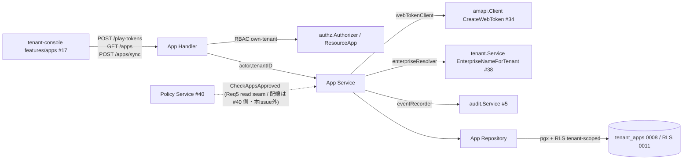

# Design Document

## Overview

**Purpose**: 本機能は、テナント管理者（TenantAdmin）が業務アプリを Managed Google Play 上で承認し
自テナントの端末群へ配信するための **App ドメイン backend**（`internal/app/`）を提供する。具体的には
(1) Managed Google Play 承認 UI を iframe 表示するための webToken 発行、(2) 承認結果を自テナントの
アプリカタログ（`tenant_apps`）へ反映する同期、(3) 承認済みカタログの参照、(4) ポリシー紐付け時の
「承認済みカタログ内のアプリのみ受付」不変条件の read seam を担う。

**Users**: TenantAdmin が tenant-console（#17）の `features/apps` から webToken を取得して Managed Play
iframe を開き、承認結果を `/api/apps/sync` でカタログへ反映し、`/api/apps` で承認済みカタログを一覧する。
Policy Service（#40）は承認済み不変条件（Requirement 5）の判定に App Service の read seam を消費する
（実 enforcement 配線は本 Issue スコープ外。後述 確認事項）。

**Impact**: 既存 backend は Tenant / Policy / Audit / Notification ドメインを備えるが、App ドメインは
未実装（`internal/app/` 不在）。本設計は先行実装 `internal/policy/`（#40）と同一のレイヤ構成
（doc/handler/service/repository/service_types + co-located test）・依存方向・consumer-defines-interface
・RLS テナント分離・共有 AMAPI ラッパ経由の外部呼び出しを踏襲し、新規 API 3 本を `/api` chain へ配線する。
既存スキーマ `tenant_apps`（migration 0008 / RLS 0011）を再利用し、新規 migration は作らない。

> 分量注記: 3 フロー（webToken / list / sync）+ 外部 AMAPI 連携 + 2 つの設計ギャップ（カタログ取得経路・
> webToken 有効期限）の意思決定説明を要するため標準目安（≤300 行）をやや超える。逐語コード転載を避け
> `file:line` 参照と表で圧縮している。

### Goals

- webToken 発行 / カタログ参照 / カタログ同期 / 承認済み read seam の 4 ユースケースを、policy と同一規約で
  実装可能な粒度に落とす
- 既存建材（`amapi.Client.CreateWebToken` / `tenant.Service.EnterpriseNameForTenant` / `tenant_apps` /
  `authz.ResourceApp` / RLS / `audit.Service`）を再利用し、再実装しない
- requirements.md の全 AC / NFR を orphan なく設計要素へマッピングする

### Non-Goals

- tenant-console のアプリ配信 UI（#17）/ Managed Play iframe 内部 UI の再実装
- installType（FORCE_INSTALLED / AVAILABLE）の AMAPI ポリシー `applications[]` 実反映（#40 の責務）
- 承認済み不変条件（Requirement 5）の **enforcement 配線**（Policy Service が read seam を呼ぶ改修 = #40 側）
- AMAPI Client 共有ラッパ（#34）/ 監査ログ永続化（#5）/ RBAC マトリクス・RLS ポリシー定義自体の変更

## Architecture

### Existing Architecture Analysis

- **レイヤ構成**: `internal/<domain>/` に doc.go / handler.go（HTTP I/O + RBAC + エラー写像、chi 内包または
  `Mount`）/ service.go（ユースケース + consumer-defines-interface）/ repository.go（pgx + RLS）/
  service_types.go（DTO・sentinel）/ co-located `*_test.go`。App は `internal/policy/` を参照モデルとする。
- **尊重するドメイン境界**: App Service は httpserver を import しない（Handler のみ）。actor / tenantID は
  Handler が `httpserver.AuthClaimsFromContext` で取得し引数で渡す（policy と同方針）。
- **維持する統合点**: `amapi.Client`（#34）/ `tenant.Service`（#38 の `EnterpriseNameForTenant`）/
  `audit.Service`（#5）/ `authz.Authorizer` + `ResourceApp`（#33）/ `tenant_apps`（0008）+ RLS（0011）を
  そのまま消費する。これらのコードは本 Issue の実装 PR で書き換えない。
- **回避する technical debt**: AMAPI 認証・再試行・エラー写像は #34 に閉じているため独自再実装しない（NFR 2.1）。

### Architecture Pattern & Boundary Map



**Architecture Integration**:
- 採用パターン: Layered domain module + consumer-defines-interface（policy と同一）。理由: 既存規約に整合し
  fake 差し込みで各層を単体テスト可能にするため。
- ドメイン／機能境界: Handler=presentation（RBAC/HTTP 写像）、Service=ユースケース、Repository=永続化。
  外部依存（AMAPI/tenant/audit）は Service 側で最小 interface に閉じる。
- 既存パターンの維持: RLS tenant-scoped（SuperAdmin 昇格しない）/ `Mount` 配線 / `errors.WriteHTTP` 写像。
- 新規コンポーネントの根拠: App ドメインは未実装であり、3 API + read seam を担う責務主体が存在しないため新設。

### Technology Stack

| Layer | Choice / Version | Role in Feature | Notes |
|-------|------------------|-----------------|-------|
| CLI / Frontend | (対象外) | — | UI は #17 |
| Backend / Services | Go 1.22 + chi/v5 + zap | Handler / Service / RBAC / ログ | policy と同一 |
| Data / Storage | PostgreSQL + pgx/v5（RLS） | `tenant_apps` 永続化 + テナント分離 | 0008 再利用・0011 RLS |
| Messaging / Events | audit.Service（同期記録） | 同期実行の監査記録（NFR 3.1） | 新規 topic なし |
| Infrastructure / Runtime | 既存 api プロセス（cmd/api） | `/api` chain へ Mount | 新規プロセスなし |
| External | Managed Google Play / AMAPI（#34 ラッパ経由） | webToken 発行 | 認証・再試行は #34 |

## File Structure Plan

### Directory Structure

```
backend/internal/app/               # App ドメイン（新規）。internal/policy/ と同一レイヤ構成
├── doc.go                          # パッケージ doc + 依存方向ルール（policy/doc.go に倣う）
├── service_types.go                # DTO（PlayTokenRequest/View, SyncRequest/SyncApp/SyncResult,
│                                   #   TenantAppRow/TenantAppView）+ sentinel（ErrAppNotApproved）
├── service.go                      # Service interface（CreatePlayToken/ListApps/SyncApps/CheckAppsApproved）
│                                   #   + consumer interface（webTokenClient/enterpriseResolver/eventRecorder）+ 実装
├── repository.go                   # tenant_apps の Upsert/List/ApprovedPackages（pgx + RLS, tenant-scoped）
├── handler.go                      # 3 endpoint の HTTP I/O + RBAC + エラー写像。Mount(r chi.Router)
├── service_test.go                 # CreatePlayToken/SyncApps/CheckAppsApproved の正常系・異常系
├── repository_test.go              # scan 写像・エラー写像・tenant_id 述語（rowScanner seam / policy と同型）
└── handler_test.go                 # RBAC allow/deny・401/403・body decode・エラー写像・own-tenant list
```

- 非自明ファイルなし（すべて policy と同パターン）。App には raw body → ドメイン変換が無いため
  `mapper.go` / `validator.go` は作らない（row→view の軽量写像は service.go / service_types.go に閉じる）。

### Modified Files

- `backend/cmd/api/main.go` — bootstrap に (12) app domain DI ブロックを追加。`buildAppHandler(pool,
  amapiClient, auditSvc, authorizer, tenantSvc, log)` helper を新設（`buildPolicyHandler` に倣い既存共有
  インスタンスを再利用し新規構築しない）し、`appHandler.Mount(routers.API)` で `/api/play-tokens` /
  `/api/apps` / `/api/apps/sync` を配線。
- `backend/cmd/api/main_test.go` — `buildAppHandler` の本番配線退行を型レベルで回帰検知するテストを追記
  （`buildPolicyHandler` / `buildTenantRecorder` と同 testability 方針）。

**新規 migration は作らない**: `tenant_apps`（0008）の列（id/tenant_id/package_name/title/icon_url/
approved_at + UNIQUE(tenant_id,package_name) + index）で Requirement 2/3 を充足でき、同期時刻は応答の
`synced_at = now()`（非永続）で返せるため `last_synced_at` 等の追加列は不要。0008 を再利用する
（追加が必要になった場合の次番号は 0018 だが本設計では使用しない）。

## Requirements Traceability

| Requirement | Summary | Components | Interfaces / Impl | Flows |
|-------------|---------|------------|-------------------|-------|
| 1.1 | webToken 発行して返す | AppService, AppHandler | `CreatePlayToken` → `webTokenClient.CreateWebToken` → PlayTokenView | webToken 発行 |
| 1.2 | parent_frame_url 欠落/空を拒否 | AppService, AppHandler | Service で空検査 → 400 / decodeJSON 400 | webToken 発行 |
| 1.3 | 未バインドテナントは発行拒否 | AppService | `enterpriseResolver.EnterpriseNameForTenant` の error 伝達（未 bind→422） | webToken 発行 |
| 2.1 | 承認済みカタログ一覧を返す | AppService, AppRepository, AppHandler | `ListApps` → `Repository.List` → []TenantAppView | カタログ参照 |
| 2.2 | 0 件は空一覧を正常応答 | AppService, AppRepository | `Repository.List` が非 nil 空 slice | カタログ参照 |
| 2.3 | 他テナントのアプリを含めない | AppRepository, AppHandler | RLS tenant-scoped + own-tenant RBAC | テナント分離 |
| 3.1 | 承認結果を取得しカタログへ反映 | AppService, AppRepository | `SyncApps` → `Repository.Upsert`（client-relayed 取得 / Option A） | カタログ同期 |
| 3.2 | 重複 package は更新（重複作成しない） | AppRepository | `Upsert` = INSERT ON CONFLICT(tenant_id,package_name) DO UPDATE | カタログ同期 |
| 3.3 | 反映件数と同期時刻を返す | AppService, AppHandler | `SyncResult{synced_at, count}` | カタログ同期 |
| 3.4 | 承認 0 件時は反映件数 0 を正常応答 | AppService | 空リストで upsert 0 件 → count 0 | カタログ同期 |
| 3.5 | 未バインドテナントは同期拒否 | AppService | `enterpriseResolver` の bind gate error 伝達 | カタログ同期 |
| 3.6 | 取得失敗時はカタログ非更新+伝達 | AppService, AppRepository | 単一 tx でアトミック upsert・失敗時 rollback + 伝達（502 は 確認事項） | カタログ同期 |
| 4.1 | 越境の参照/同期/操作を拒否 | AppHandler, AppRepository | own-tenant RBAC + RLS（越境入力面を持たない設計） | テナント分離 |
| 4.2 | 存在有無を露出しない | AppHandler, AppRepository | RLS で他テナントは不可視 / cross-tenant probe なし | テナント分離 |
| 5.1 | 承認済みカタログ存在を検証 | AppService, AppRepository | `CheckAppsApproved` → `Repository.ApprovedPackages` | 承認済み read seam |
| 5.2 | 未承認アプリの紐付けを拒否 | AppService | `CheckAppsApproved` が `ErrAppNotApproved`（422）を返す | 承認済み read seam |
| NFR 1.1 | webToken 値を平文ログに出さない | AppService, AppHandler | Value をログ/監査 Detail に載せない（#34 と同規律） | webToken 発行 |
| NFR 1.2 | テナント分離を恒常維持 | AppHandler, AppRepository | own-tenant RBAC + RLS | テナント分離 |
| NFR 2.1 | AMAPI 呼び出しは共有ラッパ経由のみ | AppService | `webTokenClient` = `amapi.Client`（認証/再試行を再実装しない） | webToken 発行 |
| NFR 3.1 | 同期実行を監査記録（実行者/テナント/件数/結果） | AppService | `eventRecorder.Record`（sync 実行単位の粒度） | カタログ同期 |
| NFR 3.2 | 資格情報/OAuth トークン生値を構造化ログに含めない | AppService | ログ規律（Value/creds を載せない） | 全フロー |

## Components and Interfaces

### App Domain

#### App Service (`internal/app/service.go`)

| Field | Detail |
|-------|--------|
| Intent | webToken 発行・カタログ参照/同期・承認済み read seam のユースケース単一所有者 |
| Requirements | 1.1, 1.2, 1.3, 2.1, 2.2, 3.1〜3.6, 5.1, 5.2, NFR 1.1, 2.1, 3.1, 3.2 |

**Responsibilities & Constraints**
- 主責務: (a) parent_frame_url 検証 → enterprise 解決 → AMAPI webToken 発行、(b) カタログ一覧委譲、
  (c) bind gate → 入力検証 → アトミック upsert → 監査記録、(d) 承認済み package の read seam。
- ドメイン境界 / トランザクション: sync の upsert は Repository 内の単一 tx でアトミック（Req 3.6）。
  authz は持たず Handler の責務（policy と同方針）。httpserver を import しない。
- データ所有権 / invariants: `tenant_apps` の所有者。テナント分離は RLS + tenant-scoped context（自テナント
  境界を越える入力面を Service/Handler が持たない）。webToken.Value は秘匿値でログ/監査に載せない（NFR 1.1）。

**Dependencies**
- Inbound: App Handler — HTTP ユースケース起動 (Critical); Policy Service #40 — `CheckAppsApproved` 参照 (Important, 配線は #40 側)
- Outbound: App Repository — `tenant_apps` 永続化 (Critical); `enterpriseResolver`（tenant.Service）— enterprise 解決/bind gate (Critical); `webTokenClient`（amapi.Client）— webToken 発行 (Critical); `eventRecorder`（audit.Service）— 同期監査 (Important)
- External: Managed Google Play（#34 ラッパ経由のみ）(Critical)

**Contracts**: Service [x] / API [ ] / Event [ ] / Batch [ ] / State [ ]

##### Service Interface

```go
// consumer-defines-interface（policy の upsertClient/eventRecorder/enterpriseResolver に倣う最小ポート）
type webTokenClient interface {
    CreateWebToken(ctx context.Context, enterpriseName, parentFrameURL string) (amapi.WebToken, error)
}
type enterpriseResolver interface {
    EnterpriseNameForTenant(ctx context.Context, id uuid.UUID) (string, error)
}
type eventRecorder interface {
    Record(ctx context.Context, ev audit.Event) error
}

type Service interface {
    // CreatePlayToken は iframe 表示用 webToken を発行する（Req 1.1/1.2/1.3 / NFR 1.1/2.1）。
    // 空 parent_frame_url は CodeInvalidRequest(400)。未バインドは enterpriseResolver の error 伝達(422)。
    // AMAPI 失敗は #34 正規化済み error（502 等）をそのまま伝達する。
    CreatePlayToken(ctx context.Context, actor, tenantID uuid.UUID, in PlayTokenRequest) (PlayTokenView, error)

    // ListApps は自テナントの承認済みカタログを返す（Req 2.1/2.2/2.3）。0 件は非 nil 空 slice。read 監査なし。
    ListApps(ctx context.Context, tenantID uuid.UUID) ([]TenantAppView, error)

    // SyncApps は承認結果（client-relayed）を tenant_apps へアトミックに upsert する
    // （Req 3.1〜3.6 / NFR 3.1/3.2）。bind gate 失敗(3.5)・入力不正(400)・DB 失敗(3.6) は upsert せず伝達。
    SyncApps(ctx context.Context, actor, tenantID uuid.UUID, in SyncRequest) (SyncResult, error)

    // CheckAppsApproved は packages が全て自テナントの承認済みカタログに存在するか検証する
    // （Req 5.1/5.2）。未承認が 1 件でもあれば ErrAppNotApproved(422)。Policy Service が消費する read seam。
    CheckAppsApproved(ctx context.Context, tenantID uuid.UUID, packageNames []string) error
}
```
- Preconditions: ctx に tenant-scoped `TenantContext` が確立済み（`/api` chain の TenantContextMiddleware。
  `EnterpriseNameForTenant` / Repository がこれに依拠）。
- Postconditions: sync 成功時のみ `tenant_apps` が更新され監査イベント 1 件記録。webToken/CheckApproved は
  永続化副作用なし。
- Invariants: 越境操作不可（RLS + own-tenant）。Value/creds をログ・監査 Detail に載せない。

#### App Repository (`internal/app/repository.go`)

| Field | Detail |
|-------|--------|
| Intent | `tenant_apps` の Upsert / List / ApprovedPackages を pgx + RLS で集約 |
| Requirements | 2.1, 2.2, 2.3, 3.1, 3.2, 3.4, 3.6, 5.1, 4.1, 4.2 |

**Responsibilities & Constraints**
- 主責務: `List`（created/approved 昇順、非 nil 空 slice）/ `Upsert`（複数件を単一 tx で INSERT ON CONFLICT
  (tenant_id,package_name) DO UPDATE、Req 3.2/3.6 のアトミック性）/ `ApprovedPackages`（package 集合 lookup、Req 5.1）。
- 境界: policy.Repository と同様、tenant-scoped context のまま `db.BeginTxFunc` で tx を開き RLS に分離を委ねる
  （SuperAdmin 昇格しない）。他テナント行は SELECT で 0 行、INSERT/UPDATE は RLS WITH CHECK で物理拒否（Req 4.x）。
- データ所有権: `tenant_apps`（0008）。DB 失敗は `errors.Wrap(CodeUnavailable, ...)`（503）。

**Contracts**: Service [x] / API [ ] / Event [ ] / Batch [ ] / State [ ]

```go
type Repository interface {
    List(ctx context.Context, tenantID uuid.UUID) ([]TenantAppRow, error)
    // Upsert は複数 SyncApp を単一 tx でアトミックに反映し反映件数を返す（Req 3.1/3.2/3.4/3.6）。
    // いずれか 1 件でも失敗すれば rollback し 0 件反映のまま error を返す（部分反映を残さない / Req 3.6）。
    Upsert(ctx context.Context, tenantID uuid.UUID, apps []SyncApp) (count int, err error)
    // ApprovedPackages は packageNames のうち自テナントで承認済みの package 集合を返す（Req 5.1）。
    ApprovedPackages(ctx context.Context, tenantID uuid.UUID, packageNames []string) (map[string]struct{}, error)
}
```

#### App Handler (`internal/app/handler.go`)

| Field | Detail |
|-------|--------|
| Intent | 3 endpoint の HTTP I/O + own-tenant RBAC + エラー写像 |
| Requirements | 1.1, 1.2, 2.1, 2.3, 3.3, 4.1, 4.2, NFR 1.2 |

**Responsibilities & Constraints**
- 主責務: `Mount(r chi.Router)` で route 登録（policy/tenant の Mount パターン）。各 endpoint で
  `AuthClaimsFromContext` → `authz.Authorizer.AuthorizeAndLog`（`ResourceApp` × Action）で own-tenant 判定。
  claims 不在は 401、deny は 403（policy.Handler.authorize と同方式）。body decode は 400。
- Service が返す `*errors.Error`（tenant/AMAPI/DB 由来）は `errors.WriteHTTP` で Code→HTTP 写像。存在差は
  sentinel/汎用 message に委ね露出しない（Req 4.2）。Value をログに出さない（NFR 1.1/1.2）。

**Contracts**: Service [ ] / API [x] / Event [ ] / Batch [ ] / State [ ]

##### Endpoint ↔ RBAC 対応表

| Method | Endpoint | Action | Resource | Handler | 許可ロール（既存マトリクス） |
|--------|----------|--------|----------|---------|------------------------------|
| POST | /api/play-tokens | ActionRead | ResourceApp | createPlayToken | SuperAdmin/TenantAdmin/Operator/Viewer（app:read） |
| GET | /api/apps | ActionRead | ResourceApp | listApps | 同上 |
| POST | /api/apps/sync | ActionUpdate | ResourceApp | syncApps | TenantAdmin のみ（app:update） |

> play-tokens / apps 一覧は参照系（ActionRead）、sync は更新系（ActionUpdate）で使い分ける（triage 指示 /
> `authz/permissions.go` の app:read/app:update マトリクスに整合）。webToken 発行を ActionRead とするのは
> 「承認 iframe を開く read 操作」であり、実際の承認反映（書込）は app:update の sync に閉じるため。

##### API Contract

| Method | Endpoint | Request | Response | Errors |
|--------|----------|---------|----------|--------|
| POST | /api/play-tokens | `{parent_frame_url}` | `{value}`（PlayTokenView） | 400, 401, 403, 422, 502 |
| GET | /api/apps | — | `[]TenantAppView`（package_name/title/icon_url/approved_at） | 401, 403, 503 |
| POST | /api/apps/sync | `{apps:[{package_name,title,icon_url?}]}` | `{synced_at, count}`（SyncResult） | 400, 401, 403, 422, 503 |

> umbrella #24 の暫定 Contract（play-tokens `{value,expires_at}` / sync body なし / errors {401,403,502}）
> からの差分: (i) sync は body（承認 package リスト）を受ける（Option A / 後述）。(ii) 未バインドは 422
> （`EnterpriseNameForTenant` の CodeBusinessRule）、入力不正 400、DB 失敗 503 を追加。(iii) `expires_at` は
> #34 ラッパが expiry を公開しないため未提供（確認事項）。これらは requirements Open Questions が「取得経路
> 確定に伴い変わり得る」と明記した範囲内の設計確定である。

## Data Models

### Domain Model

- **アグリゲート**: `TenantApp`（テナントの承認済みアプリ 1 件）。トランザクション境界は sync の
  Repository.Upsert（複数件を単一 tx）。
- **DTO / 値オブジェクト**（`service_types.go`）:
  - `PlayTokenRequest{parent_frame_url string}` / `PlayTokenView{value string}`（Value は秘匿・ログ非出力）
  - `SyncRequest{apps []SyncApp}` / `SyncApp{package_name, title string; icon_url *string}` /
    `SyncResult{synced_at time.Time; count int}`
  - `TenantAppRow`（DB 行 = id/tenant_id/package_name/title/icon_url/approved_at）/
    `TenantAppView{package_name,title,icon_url,approved_at}`（JSON tag 付き）
  - sentinel: `ErrAppNotApproved = errors.New(CodeBusinessRule, "app is not in the approved catalog")`（422 / Req 5.2）
- **入力検証**: `SyncApp.package_name` / `title` は空不可（`tenant_apps.title` NOT NULL 制約に整合）。空は 400。

### Physical Data Model

- `tenant_apps`（migration 0008 再利用・**新規 migration なし**）: `id uuid PK` / `tenant_id uuid FK→tenants
  ON DELETE CASCADE` / `package_name text` / `title text NOT NULL` / `icon_url text NULL` / `approved_at
  timestamptz DEFAULT now()` / `UNIQUE(tenant_id, package_name)` / `INDEX(tenant_id)`。
- RLS: `tenant_isolation_tenant_apps`（migration 0011）が `app.tenant_id` GUC で SELECT/INSERT/UPDATE/DELETE を
  自テナント限定（Req 2.3 / 4.x / NFR 1.2）。Upsert の `INSERT ... ON CONFLICT` は WITH CHECK で越境 INSERT を
  物理拒否する。
- 同期時刻（Req 3.3）は応答の `synced_at = now()`（非永続）。`approved_at` は upsert 時 `now()` に更新し
  「最終反映時刻」を兼ねる。

## Error Handling

### Error Strategy

`internal/errors`（pkgerrors）の Code → HTTP 写像を `errors.WriteHTTP` で一元化（policy と同一）。App 固有の
新規 error 型は作らず、既存 Code と sentinel（`ErrAppNotApproved`）を用いる。AMAPI 由来 error は #34 が
正規化済み（CodeUpstream=502 等）でそのまま伝達し、App 側で再分類しない（NFR 2.1）。

### Error Categories and Responses

- **User Errors (4xx)**:
  - 400 `CodeInvalidRequest`: parent_frame_url 空（Req 1.2）/ sync body の package_name・title 空 / malformed JSON。
  - 401 `CodeUnauthenticated`: claims 不在（防御的、通常は middleware が先行）。
  - 403 `CodeForbidden`: RBAC deny（app:update を持たないロールの sync 等 / Req 4.1）。
  - 422 `CodeBusinessRule`: 未バインドテナント（`EnterpriseNameForTenant` の ErrNotBound/ErrTenantDisabled/
    ErrInvalidState / Req 1.3・3.5）/ 未承認アプリ紐付け（`ErrAppNotApproved` / Req 5.2）。
- **System Errors (5xx)**:
  - 502 `CodeUpstream`: AMAPI webToken 発行の上流エラー（#34 正規化 / play-tokens）。
  - 503 `CodeUnavailable`: `tenant_apps` の DB 障害（list / sync）。sync の DB 失敗は単一 tx rollback で
    カタログ非更新 + 伝達（Req 3.6）。
- **存在差の非露出**: 越境参照は RLS で 0 行 → List は空、他テナント資源への操作は 404/汎用 message に委ね、
  存在有無を露出しない（Req 4.2）。
- **監査**: sync は成否いずれの経路でも `eventRecorder.Record`（event_type=`app_sync`, Detail={count, result}、
  Value/creds を載せない / NFR 3.1・3.2）。Record 失敗は WARN に留めユースケース結果を覆さない（policy/tenant と同方針）。

## Testing Strategy

- **Unit Tests**:
  1. `CreatePlayToken`: 正常（Value を返す）/ 空 parent_frame_url→400 / 未バインド→error 伝達 / AMAPI error→伝達。
  2. NFR 1.1: fake logger で webToken.Value がログ出力に含まれないことを検証。
  3. `SyncApps`: 正常 count / 空リスト→count 0（Req 3.4）/ 未バインド→upsert 呼ばれず error（Req 3.5）/
     Repository error→count 0 + 伝達（Req 3.6）/ Record 失敗でも成功結果を覆さない。
  4. `CheckAppsApproved`: 全承認→nil / 1 件未承認→`ErrAppNotApproved` / 越境 package→未承認扱い。
  5. `Repository`（rowScanner seam）: scan 写像 / List 非 nil 空 slice / DB error→CodeUnavailable / SQL に
     tenant_id 述語を含む・SuperAdmin 昇格しないこと。
- **Integration Tests**（handler 経由）:
  1. RBAC: 各 endpoint の allow/deny（Operator の sync→403 / TenantAdmin の sync→許可）。
  2. body decode 400 / 未バインド 422 / AMAPI 502 が HTTP status に正しく写像される。
  3. `GET /api/apps` が自テナント行のみ返す（own-tenant list）。
- **E2E/RLS Tests**（real PG、deferrable）:
  1. 越境テナントの `tenant_apps` が list/sync/approved-check で不可視（Req 4.1/4.2 / RLS 実挙動）。
  2. Upsert の ON CONFLICT 冪等性（同一 package 二重同期で 1 行・title 更新 / Req 3.2）を実 DB で確認。

## Security Considerations

- **秘匿値**: webToken.Value を PlayTokenView 以外に流さず、構造化ログ・監査 Detail に平文出力しない
  （NFR 1.1 / #34 `webtokens.go` の規律を踏襲）。サービスアカウント資格情報・OAuth トークン生値もログに
  含めない（NFR 3.2）。
- **テナント分離**: own-tenant RBAC（Handler が `TargetTenantID=claims.TenantID`）+ RLS の二重防御。App は
  tenant_id を入力パラメータに取らず、claims 由来のみを使うため越境入力面を持たない（NFR 1.2 / Req 4.x）。

## 確認事項（人間レビュー観点）

1. **カタログ取得経路（Requirement 3.1 / Open Question / NFR 2.1）— 採用案: Option A（client-relayed）**:
   共有 AMAPI クライアント（#34）に承認済みアプリ一覧取得メソッドが存在しない（`CreateWebToken` 等のみ、
   `platform/amapi/client.go:29-51` で確認）。本設計は **Option A** を採用し、`POST /api/apps/sync` は
   Managed Play iframe で選択された package リストをフロントエンド（#17）が request body で relay し、App
   Service が `tenant_apps` へ upsert する。
   - 根拠: 承認は Google の iframe（webToken フロー）で行われ、選択結果（package_name + 表示メタ）は
     フロントエンドが保持するため、これが自然な取得元。Option B（AMAPI/Play EMM に list メソッド追加）は
     #34 のスコープ拡張（本 Issue で #34 を書き換えない制約に抵触）。
   - **残リスク（NFR 2.1）**: Option A では sync が App Service 発の AMAPI 呼び出しを持たないため、NFR 2.1 の
     「承認カタログ取得を共有ラッパ経由で行う」節は sync では発火しない（webToken 発行のみが AMAPI 経由）。
     独自 AMAPI 再実装は無いため NFR 2.1 に反しないと解釈するが、人間判断を仰ぐ。
   - **残リスク（Req 3.6）**: 「Managed Google Play からの取得が上流エラー(502)で失敗」という trigger は
     Option A では App Service 発 AMAPI 呼び出しが sync に無いため genuine には発火しない。本設計は 3.6 の
     behavioral contract（取得/反映失敗 → カタログ非更新 → 伝達）を **単一 tx のアトミック upsert + 失敗時
     rollback + error 伝達**（DB 失敗=503）で担保する。502 flavor の取得失敗が必要なら server-side 取得
     メソッド追加（#34 拡張 or follow-up Issue）を要する — この解釈の許容可否を確認されたい。

2. **webToken 有効期限（Requirement 1.1）**: Req 1.1 は「トークン値と有効期限」の返却を要求するが、#34 の
   `amapi.WebToken` は `{Name, Value}` のみで expiry フィールドを公開しない（`platform/amapi/types.go:102-112`）。
   本設計は PlayTokenView を `{value}` とし expires_at を提供しない。Managed Play webToken は AMAPI 仕様上
   短命で、クライアントは失効時に再発行する運用を想定。有効期限の返却が必須なら #34 拡張（follow-up）が必要 —
   value-only での許容可否を確認されたい（推測での nominal expiry 捏造は行わない）。

3. **Requirement 5 の責務境界（enforcement 配線）**: App Service は承認済み判定の read seam
   `CheckAppsApproved`（Req 5.1/5.2）を提供・単体テストするに留め、Policy Service がポリシー編集時に本 seam を
   呼ぶ **enforcement 配線は本 Issue スコープ外**（#40 の `policy.Service.Create/Update` 改修を要し、本 Issue の
   実装 PR で #40 を書き換えない制約に従うため）。read seam を投機的抽象化にしないため、本 Issue 内で直接
   テスト可能な公開契約として実装する。enforcement を本 Issue に含めるか follow-up とするかを確認されたい。

4. **監査記録の粒度（NFR 3.1 / Open Question）— 採用案: sync 実行単位**: 同期の監査を「同期実行 1 回 = 1
   イベント（event_type=`app_sync`, Detail={count, result}）」の粒度で記録する（個別アプリ追加単位にしない）。
   根拠: 運用者可視のアクションは sync 実行であり、個別 upsert 単位は audit_logs を肥大化させる。webToken 発行は
   NFR 3.1 の対象外（同 NFR は「アプリカタログの同期実行」のみを明示）かつ Value 秘匿の観点から監査しない。
