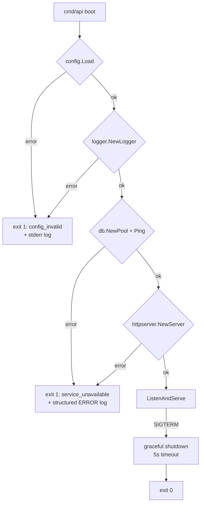
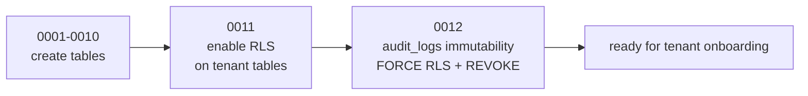

# Design Document

## Overview

**Purpose**: 本機能は ae-mdm（Android Enterprise EMM SaaS）の全プロセス（`api` / `worker` /
補助 CLI）が共通利用する 6 つの基盤モジュール — 設定（config）・構造化ログ（logger）・独自
エラー型（errors）・DB 接続プール + Tenant Context 強制（platform/db）・HTTP サブルータ群
（platform/httpserver）・マイグレーション + RLS + audit_logs append-only — を整備し、
後続 Issue（A3 以降）の各ドメイン（tenant / auth / enrollment / policy / device / command /
app / notification）が「config を読む → トランザクション境界を取る → テナント分離が保証された
状態で DB アクセスする → 構造化ログを吐く → 独自 Error を HTTP/Pub-Sub 応答に写像する」だけで
ドメインロジックに集中できる土台を提供する。

**Users**: 直接の利用者は後続 Issue を実装する開発者であり、`internal/config` `internal/logger`
`internal/errors` `internal/platform/db` `internal/platform/httpserver` を import するだけで
本要件 1〜7 が満たされる API を享受する。間接的には SaaS 運用者（RLS による分離・改竄不可な
監査ログの保証を享受）と顧客企業の管理者（テナント分離による他テナント越境の物理的禁止を享受）。

**Impact**: 現状 #1 で作られたソースツリー（`backend/cmd/api/main.go` `backend/cmd/worker/main.go`
は scaffold の `/healthz` のみ、`backend/internal/depspin/depspin.go` が依存保持の placeholder、
`backend/db/migrations/.gitkeep` `backend/db/queries/.gitkeep` は空）から、本 Issue で
`internal/{config,logger,errors,platform/db,platform/httpserver}` の各 package を新規に追加し、
`db/migrations/0001-0011_*.{up,down}.sql` の 11 ペアでテナント・端末・コマンド・監査ログ等の
全テーブルを作成・RLS 有効化・audit_logs append-only 化する。`cmd/api/main.go` は config/logger
を読んで chi router を bootstrap する形に置き換え（scaffold の `net/http.ServeMux` は撤去）、
`cmd/worker/main.go` も config/logger だけは導入する（Pub/Sub subscriber 本体は後続 Issue）。
`depspin/depspin.go` は本 Issue で chi/pgx/golang-migrate/zap/coreos-go-oidc が **実利用**
されるため、これらの blank import を削除し、未利用の `pubsub` `androidmanagement` のみを残す。

### Goals
- 後続 Issue が config/logger/errors/db/httpserver を import するだけで二重防御
  （アプリ層 tenant_id フィルタ + PostgreSQL RLS）が成立する状態を提供する（requirements
  Req 4, 5, 6, 7, NFR 1）
- テナントコンテキスト未確立の DB トランザクションを **panic ガード**で物理的に止める
  （RLS の `SET LOCAL` 漏れによる cross-tenant read を発生させない / Req 4.5, NFR 1.2）
- `audit_logs` を DB レベルで append-only 化し、アプリ DB ロールから UPDATE/DELETE を発行しても
  失敗するようにする（Req 7.1, 7.2, 7.4, NFR 1.2 と整合する NFR 4.3 〔umbrella〕）
- 起動時 fail-fast: 必須環境変数欠落・DB 接続不能・マイグレーション未適用のいずれかで
  exit code 非 0 + 判別可能なログを出す（NFR 3）
- `/api` と `/api/admin` の **2 サブルータの mount 点**を確立する（中身のハンドラは後続 Issue。
  SuperAdmin 専用ガードのフック点のみ提供 / Req 5.3, 5.4）

### Non-Goals
- 各ドメインの handler / service / repository 実装（A3 以降）
- OIDC Verifier / Session Manager の実装本体（umbrella tasks 3.1 / 後続 Issue）。本 Issue では
  Tenant Context Middleware の入力契約（JWT 検証済みの claims）の **インタフェース定義のみ**
- RBAC Authorizer の許可マトリクス実装（umbrella tasks 3.2 / 後続 Issue）。本 Issue では
  `/api/admin` 配下に挟む SuperAdmin ガードのフック点のみ提供（実 RBAC ロジックは後続）
- Pub/Sub クライアントの実装（umbrella tasks 6.1）
- AMAPI Client / Managed Play / 端末・コマンド・ポリシードメインのいずれの実装も対象外
- 初期 SuperAdmin の seed CLI（umbrella tasks 14.2）
- フロントエンド（tenant-console / admin-console）の実装

## Architecture

### Existing Architecture Analysis

#1 で確立されたリポジトリ構造（`backend/` 配下に Go module、`docker-compose.yml` で
`postgres` / `keycloak` / `pubsub-emulator` / `api` / `worker` / `tenant-console` /
`admin-console` の 7 サービスが起動可能、`.env.example` に DB / OIDC × 2 / Pub/Sub / AMAPI /
セッション秘密鍵 / 監査ログ保持期間 / 端末同期遅延閾値の全環境変数 placeholder）を前提とする。
本 Issue は umbrella design.md の **Platform Layer**（Tenant Context Middleware /
OIDC Verifier・Session Manager のうち config/db/error/log 基盤に該当する部分）を Issue 個別 spec
に切り出して具体化したものであり、umbrella と矛盾しない範囲で本 Issue のスコープに閉じた
粒度に再構成する。

**尊重する制約**
- umbrella design.md `## File Structure Plan`（`internal/config/` `internal/platform/db/`
  `internal/platform/httpserver/` `internal/errors/` `internal/logger/` の配置）
- umbrella design.md `## Data Models`（12 テーブル + RLS ポリシー）
- umbrella requirements.md の Requirement 1.4 / 1.5 / NFR 2.1（テナント分離）, NFR 4.3
  （audit_logs 改竄不可）
- `CLAUDE.md` のコード規約（関数 40 行目安・JSDoc/TSDoc 相当として Go ではエクスポート関数に
  godoc を必ず付ける・エラーは独自型で wrap）

**解消する technical debt**
- `backend/internal/depspin/depspin.go` の blank import 保持を、本 Issue の実利用への移行に
  伴って **chi / pgx / golang-migrate / zap / coreos-go-oidc 分を削除**（実利用に置換）。
  `cloud.google.com/go/pubsub` と `google.golang.org/api/androidmanagement/v1` は本 Issue では
  実利用しないため残置（後続 Issue で削除）

### Architecture Pattern & Boundary Map

採用パターン: **モジュラーモノリス（Go）の Platform Layer 切り出し**。各 package は単一責務に
閉じ、cross-domain な direct struct 参照を禁止し、interface での依存倒置のみを許す
（umbrella design.md の方針を継承）。本 Issue が定義する境界は次の 5 つ:

```mermaid
flowchart LR
    Cfg[internal/config] --> Log[internal/logger]
    Cfg --> DB[internal/platform/db]
    Cfg --> HS[internal/platform/httpserver]
    Log --> DB
    Log --> HS
    Err[internal/errors] --> DB
    Err --> HS
    DB -. SET LOCAL app.tenant_id<br/>panic if absent .-> PG[(PostgreSQL<br/>+ RLS)]
    HS -. mount /api .-> ApiSub[Tenant Subrouter]
    HS -. mount /api/admin .-> AdminSub[Admin Subrouter<br/>SuperAdmin guard]
    ApiSub -. uses .-> DB
    AdminSub -. uses .-> DB
    Mig[db/migrations/0001-0011] -.-> PG
```

**Architecture Integration**
- 採用パターン: **モジュラーモノリス + Platform Layer**。後続 Issue の各 domain package は
  Platform Layer の interface を介して DB / HTTP / ログ / エラーに到達する
- ドメイン／機能境界:
  - `internal/config` — env 読み込み・検証だけを行う。**他 package に依存しない**
  - `internal/logger` — zap ラッパ。config の `LogLevel` `LogFormat` のみ参照
  - `internal/errors` — 独自 Error 型と HTTP/Pub-Sub マッピング。config/logger/db に依存しない
  - `internal/platform/db` — pgx pool・TxManager・RLS ヘルパ。config を参照、errors / logger を
    利用するが domain package に依存しない
  - `internal/platform/httpserver` — chi router・middleware chain・2 サブルータの mount 点を
    提供。config / logger / errors / platform/db に依存
- 既存パターンの維持: umbrella design.md の Platform Layer / Domain Layer の境界規約を維持
- 新規コンポーネントの根拠:
  - `TxManager` の単一ヘルパ `BeginTxFunc(ctx, fn)` 化: 全 DB アクセスを必ず tx 経由にし、
    `SET LOCAL app.tenant_id` の発行を **1 箇所**に集中させて漏れを構造的に防ぐ
  - `TenantContextMiddleware` の panic ガード: テナント context 未確立で DB に到達したら
    request を停止することで、RLS が万一 mis-configure された場合のフェイルセーフを構造化する

### Web フロント境界（参考）

本 Issue はバックエンド共通基盤のみを扱う。tenant-console / admin-console の SPA は #1 で
コンテナとして既に起動済みであり、本 Issue では SPA から見える `/api/...` `/api/admin/...` の
**ルート群が `404` ではなく中間ミドルウェアで一貫した応答を返す**（authz スタブによる 401/403、
未実装ハンドラに対する 404 等）状態の **入口を確立**する。各ドメインハンドラの実装は後続。

### Technology Stack

| Layer | Choice / Version | Role in Feature | Notes |
|-------|------------------|-----------------|-------|
| Frontend / CLI | （該当なし — 本 Issue は backend のみ） | — | tenant-console / admin-console は #1 で確立済み |
| Backend / Services | Go 1.22+, `github.com/go-chi/chi/v5`, `github.com/jackc/pgx/v5` + `pgxpool`, `github.com/sqlc-dev/sqlc` v1.27（CLI）, `github.com/golang-migrate/migrate/v4`, `go.uber.org/zap`, `github.com/google/uuid` | config / logger / errors / db pool / TxManager / RLS / chi 2 サブルータ / マイグレーション実行 | バージョンは #1 で `backend/go.mod` に固定済み |
| Data / Storage | PostgreSQL 16 (alpine) | 12 テーブル + RLS + `audit_logs` append-only | `docker-compose.yml` の `postgres` サービスを使用 |
| Messaging / Events | （該当なし — 本 Issue は対象外） | — | Pub/Sub クライアント実装は後続 Issue |
| Infrastructure / Runtime | Docker Compose（#1 で確立）、`make migrate-up` / `make migrate-down`（本 Issue で実体化） | マイグレーション実行 | host から `MIGRATE_DATABASE_URL` 経由で接続 |
| Authentication | （該当なし — 本 Issue では Tenant Context の入力契約のみ定義） | — | OIDC Verifier / Session Manager 本体は後続 |

## File Structure Plan

### Directory Structure

```
backend/
├── cmd/
│   ├── api/main.go                      # 置換: config 読込 → logger 初期化 → DB pool 構築 →
│   │                                    # chi router(2 サブルータ mount) → graceful shutdown
│   └── worker/main.go                   # 置換: config + logger 初期化のみ（subscriber は後続）
├── internal/
│   ├── config/                          # Req 1（env 読込）
│   │   ├── config.go                    # Config struct, Load() entry, immutable な戻り値
│   │   ├── env.go                       # env 解析ヘルパ（required/optional/duration/int）
│   │   └── config_test.go               # missing-required / parse error / 正常系
│   ├── logger/                          # Req 2（構造化ログ）
│   │   ├── logger.go                    # zap.Logger ファクトリ・Field ヘルパ
│   │   ├── redact.go                    # 機密キー（session_secret / id_token 等）の redaction
│   │   └── logger_test.go               # field 付与 / redaction / level 切替
│   ├── errors/                          # Req 3（独自 Error 型）
│   │   ├── errors.go                    # Error{Code, Message, Cause, HTTPStatus, IsTransient}
│   │   ├── http_mapping.go              # WriteHTTP(w, err): HTTP ステータス + JSON 応答
│   │   ├── worker_mapping.go            # ShouldAck(err, log): Pub/Sub worker の ack/nack 判定（Req 3.4）
│   │   ├── codes.go                     # Code 定数（invalid_request, forbidden, ...）
│   │   └── errors_test.go               # errors.Is/As 互換 / HTTP マッピング / ack-nack 判定
│   ├── platform/
│   │   ├── db/                          # Req 4（DB プール + Tenant Context 強制）
│   │   │   ├── pool.go                  # pgxpool.New(ctx, cfg.DatabaseURL)、接続検証
│   │   │   ├── txmanager.go             # BeginTxFunc(ctx, fn) — tx 境界を関数で囲う
│   │   │   ├── rls.go                   # SetLocalTenant(tx, tenantID, isSuperAdmin) / panic ガード
│   │   │   ├── context.go               # TenantContext 型と context.Context への put/get
│   │   │   ├── sqlcgen/                 # sqlc 生成出力（本 Issue では空ディレクトリ確保のみ）
│   │   │   │   └── .gitkeep
│   │   │   └── *_test.go                # tx + RLS の round-trip / panic ガード
│   │   └── httpserver/                  # Req 5（HTTP サブルータ）
│   │       ├── server.go                # NewServer(cfg, logger, db) → *http.Server, Mount(/api, /api/admin)
│   │       ├── middleware.go            # recover, request_id, structured access log,
│   │       │                            # TenantContextMiddleware (auth スタブ前提)
│   │       ├── admin_middleware.go      # RequireSuperAdmin ガード（実 RBAC は後続、本 Issue は
│   │       │                            # SuperAdmin 判定の境界点のみ定義 + デフォルト deny）
│   │       └── *_test.go                # サブルータ mount / middleware chain / panic 復旧
│   └── depspin/depspin.go               # 修正: chi/pgx/golang-migrate/zap/coreos-go-oidc を削除
│                                        # （本 Issue で実利用に移行）。pubsub / androidmanagement は残置
├── db/
│   ├── migrations/                      # Req 6, 7（DDL + RLS + append-only）
│   │   ├── 0001_create_tenants.up.sql
│   │   ├── 0001_create_tenants.down.sql
│   │   ├── 0002_create_admin_users_and_roles.up.sql       # admin_users + admin_role_assignments
│   │   ├── 0002_create_admin_users_and_roles.down.sql
│   │   ├── 0003_create_sessions.up.sql
│   │   ├── 0003_create_sessions.down.sql
│   │   ├── 0004_create_enrollment_tokens.up.sql
│   │   ├── 0004_create_enrollment_tokens.down.sql
│   │   ├── 0005_create_policies.up.sql
│   │   ├── 0005_create_policies.down.sql
│   │   ├── 0006_create_devices.up.sql
│   │   ├── 0006_create_devices.down.sql
│   │   ├── 0007_create_device_commands.up.sql
│   │   ├── 0007_create_device_commands.down.sql
│   │   ├── 0008_create_tenant_apps.up.sql
│   │   ├── 0008_create_tenant_apps.down.sql
│   │   ├── 0009_create_audit_logs.up.sql
│   │   ├── 0009_create_audit_logs.down.sql
│   │   ├── 0010_create_notification_dedupe_and_unassigned.up.sql
│   │   ├── 0010_create_notification_dedupe_and_unassigned.down.sql
│   │   ├── 0011_enable_rls.up.sql                          # 全 tenant_id 持ち table に RLS + ポリシー
│   │   ├── 0011_enable_rls.down.sql
│   │   ├── 0012_audit_log_immutability.up.sql              # FORCE RLS + REVOKE UPDATE/DELETE
│   │   └── 0012_audit_log_immutability.down.sql
│   ├── queries/                         # sqlc 用 SQL（本 Issue では各 domain プレースホルダ
│   │   │                                # `.gitkeep` のみ。実 query は後続 Issue で追加）
│   │   └── .gitkeep
│   └── roles/
│       └── 0001_create_app_and_migration_roles.sql         # `migration_user` / `app_user` の
│                                                            # ロール定義（手順は runbook で）
├── sqlc.yaml                            # 既存（#1 で配置済み）。本 Issue では編集不要
└── test/
    └── integration/
        ├── db_tenant_isolation_test.go  # RLS による分離 / panic ガード / append-only の verify
        └── http_subrouter_mount_test.go # /api と /api/admin の mount + middleware chain
```

### Modified Files
- `backend/cmd/api/main.go` — `net/http.ServeMux` を撤去し、`config.Load()` → `logger.New()` →
  `db.NewPool()` → `httpserver.NewServer()` → `ListenAndServe()` → `Shutdown()` の bootstrap に
  置換。`-healthcheck` サブコマンドは維持（distroless 対応 / #1 由来）
- `backend/cmd/worker/main.go` — `config.Load()` + `logger.New()` の初期化を導入。Pub/Sub
  subscriber 実装は後続 Issue（NFR 4.1 / 4.2 に従い同モジュールを import するだけで完結する形
  を示すための最小変更に留める）
- `backend/internal/depspin/depspin.go` — 本 Issue で実利用される依存（chi, pgx, pgxpool,
  golang-migrate, zap, coreos-go-oidc）の blank import を **削除**。残る blank import は
  `cloud.google.com/go/pubsub` `google.golang.org/api/androidmanagement/v1` の 2 件のみ
  （後続 Issue で消える前提のコメントを更新）
- `.env.example` — **編集あり**（Req 6.5 の DDL/app ロール分離を MVP スコープに含めた契約変更に
  伴い）:
  - `DATABASE_URL` の user 部分を `ae_mdm` → `app_user` に変更（RLS バインド・`audit_logs` の
    UPDATE/DELETE が REVOKE 済の DML 用ロール）
  - `MIGRATE_DATABASE_URL` の user 部分を `ae_mdm` → `migration_user` に変更（DDL 用ロール）
  - 当該 2 ロールは `backend/db/roles/0001_create_app_and_migration_roles.sql` で定義され、
    `make db-init-roles` でセットアップする旨を `.env.example` 冒頭コメントに追記
  - 上記以外の placeholder（`AUDIT_LOG_RETENTION_DAYS` / `DEVICE_SYNC_DELAY_THRESHOLD_HOURS` 等）は
    #1 で網羅済みのため本 Issue では編集しない
- `docker-compose.yml` — **編集なし**（migrate は host 側 `make migrate-up` で実行。compose に
  one-shot migrate job を追加するかは本 Issue では見送り。後述「リスク・トレードオフ」参照）

## Requirements Traceability

| Requirement | Summary | Components | Interfaces / Files | Flows / Data |
|---|---|---|---|---|
| 1.1 | 構造体としての env 読み込み | Config | `internal/config/config.go` | Load() returns Config |
| 1.2 | DB/OIDC/Pub-Sub/AMAPI/秘密鍵/保持期間/同期遅延閾値 | Config | `config.go` の Config フィールド | env → struct |
| 1.3 | 必須欠落 / 不正フォーマットで fail-fast | Config | `env.go` の Required/Parse | exit code != 0 + どの env か判別可 |
| 1.4 | 稼働中 immutable | Config | `Load()` は値型 Config を返す（pointer 共有を避ける） | runtime 書換不可 |
| 1.5 | api / worker / CLI から共通 import 可 | Config | `internal/config` に集約 | cmd/api, cmd/worker, 補助 CLI 共用 |
| 2.1 | 構造化ログファクトリ | Logger | `internal/logger/logger.go` | NewLogger(cfg) |
| 2.2 | tenant_id / request_id / message_id field ヘルパ | Logger | `logger.go` の `With(...)` | zap.Field 化 |
| 2.3 | エラー観測時 WARN/ERROR 記録 | Logger, Errors | `logger.go` + `errors.WriteHTTP` の log フック | structured fields + cause |
| 2.4 | レベル/出力先/フォーマットを env から | Config, Logger | `LogLevel` `LogFormat` `LogOutput` env | JSON or console |
| 2.5 | 機密の平文出力禁止（redaction） | Logger | `redact.go` | session_secret / id_token / sa key を `***` |
| 3.1 | Code / Message / Cause を持つ Error 型 | Errors | `internal/errors/errors.go` | struct Error |
| 3.2 | errors.Is / As 互換 | Errors | `errors.go` の `Unwrap()` | Go 標準 errors 互換 |
| 3.3 | HTTP ステータスマッピング | Errors | `http_mapping.go` の WriteHTTP | Code → HTTP status |
| 3.4 | worker 最外層で ack/nack 判定を platform が決定する | Errors | `errors.go` の `IsTransient` フィールド + `worker_mapping.go` の `ShouldAck(err, log) bool` | nil/恒常失敗→ack、IsTransient→nack、独自型外は default 経路で判定 |
| 3.5 | 予期しないエラーは 5xx + 構造化ログ | Errors, Logger | `WriteHTTP` default branch | 500 + ERROR ログ |
| 4.1 | pgx 接続プール構築 | DB Pool | `platform/db/pool.go` | pgxpool.New |
| 4.2 | tx 境界を単一ヘルパで管理 | TxManager | `platform/db/txmanager.go` | `BeginTxFunc(ctx, fn)` |
| 4.3 | tx 内で `SET LOCAL app.tenant_id` | RLS Helper, TxManager | `platform/db/rls.go` | 全 tx で発行 |
| 4.4 | SuperAdmin は `app.is_superadmin=true` 併発行 | RLS Helper | `rls.go` の SuperAdmin 分岐 | TenantContext.IsSuperAdmin |
| 4.5 | tenant context 不在で panic ガード | TxManager, TenantContext | `txmanager.go` + `rls.go` | panic + ERROR ログ |
| 4.6 | 型安全 SQL 設定ファイル | sqlc.yaml | `backend/sqlc.yaml`（#1 で配置済み、本 Issue では query 配置先のみ確保） | sqlc generate |
| 5.1 | Tenant Context Middleware | TenantContextMiddleware | `platform/httpserver/middleware.go` | chi middleware |
| 5.2 | tenant_id / admin_user_id / roles / SuperAdmin 判定を ctx に格納 | TenantContextMiddleware | `middleware.go` + `db.TenantContext` | request ctx に put |
| 5.3 | `/api` と `/api/admin` の 2 サブルータ | HTTP Server | `platform/httpserver/server.go` の `Mount()` | chi の Route() を 2 回 |
| 5.4 | `/api/admin` 配下に SuperAdmin ガード | AdminRouteGuard | `platform/httpserver/admin_middleware.go` | RequireSuperAdmin |
| 5.5 | SuperAdmin 以外の `/api/admin` 到達を 403 + リソース存在非露出 | AdminRouteGuard, Errors | `admin_middleware.go` + `errors` 403 | RBAC fail-closed |
| 5.6 | recover / request_id / access log 登録 | HTTP middleware chain | `platform/httpserver/middleware.go` | chi.Use() 連鎖 |
| 6.1 | 12 テーブル作成マイグレーション | Migrations | `db/migrations/0001-0010_*.up.sql` | DDL |
| 6.2 | up / down ペア | Migrations | 全マイグレーションに `*.down.sql` | reversible |
| 6.3 | 全 tenant_id 持ち table に RLS + ポリシー（`sessions` は `admin_user_id` 経由の subselect で分離） | Migrations | `0011_enable_rls.up.sql` | ENABLE RLS + policy（汎用 + sessions 専用） |
| 6.4 | app ロールで他テナント行に SELECT/UPDATE/DELETE 不可（`sessions` 含む） | Migrations + RLS Helper | `0011_*`（汎用 + sessions 専用）+ `rls.go` の `SET LOCAL` | 結合テストで verify |
| 6.5 | DDL 用ロールと app ロールを分離 | DB Roles | `backend/db/roles/0001_create_app_and_migration_roles.sql` | runbook で記述 |
| 7.1 | audit_logs INSERT のみ許可 | Migrations | `0012_audit_log_immutability.up.sql` の REVOKE | REVOKE UPDATE/DELETE |
| 7.2 | app ロールから UPDATE/DELETE 拒否 | Migrations | `0012_*.up.sql` | DB レベル拒否 |
| 7.3 | audit_logs SELECT も RLS 分離 | Migrations | `0011_*.up.sql` + `0012_*.up.sql` の SELECT ポリシー | tenant_isolation + superadmin |
| 7.4 | FORCE ROW LEVEL SECURITY 強制 | Migrations | `0012_*.up.sql` の `FORCE ROW LEVEL SECURITY` | owner も回避不可 |
| NFR 1.1 | アプリ層 + RLS の両方有効 | TenantContext + RLS Helper + Migrations | `middleware.go` + `rls.go` + `0011_*` | 二重防御 |
| NFR 1.2 | テナント A セッションがテナント B 行に到達不可（`tenants` を除く全テーブル＝ `sessions` 含む） | RLS Helper + Migrations | `rls.go` + `0011_*`（`tenant_isolation_sessions` 含む）| integration test |
| NFR 2.1 | up シーケンス冪等 | Migrations | `golang-migrate` の version 管理 | 再適用しても no-op |
| NFR 2.2 | up に対応する down 提供 | Migrations | 全 12 ペア | down → up 1 サイクル |
| NFR 3.1 | 初期化失敗で exit != 0 + 判別可能ログ | Config, DB Pool, cmd/api | `cmd/api/main.go` の bootstrap 順 | fail-fast |
| NFR 3.2 | リクエスト処理前に外部依存初期化完了 | cmd/api | `cmd/api/main.go` の bootstrap 順 | DB ping → ListenAndServe |
| NFR 4.1 | 各モジュール api / worker 共通 import 可 | Config, Logger, Errors, DB, HTTP | `internal/` 配下に集約 | 後続 Issue から再利用 |
| NFR 4.2 | ローカル状態を持たず env 経由 | Config | `internal/config/config.go` | Fargate 移行可 |

## Components and Interfaces

### Platform Layer

#### Config Loader

| Field | Detail |
|-------|--------|
| Intent | env 変数から `Config` 構造体を構築し、必須欠落 / フォーマット不正で起動を fail-fast |
| Requirements | 1.1, 1.2, 1.3, 1.4, 1.5, 2.4, NFR 3.1, NFR 4.1, NFR 4.2 |

**Responsibilities & Constraints**
- 主責務: `.env.example` の全 env を Config struct にマップ。required な値は値型で、optional は
  ポインタまたは default ありの値型で保持
- ドメイン境界: 他 internal package に依存しない。逆に config は logger / db / httpserver の
  入力になる
- データ所有権: Config struct の不変インスタンス。`Load()` 後に書き換える API は提供しない
- Invariants: 必須欠落で `Load()` は `errors.Error{Code: "config_invalid"}` を返し、`cmd/api`
  および `cmd/worker` は exit code 1 で落ちる

**Dependencies**
- Inbound: `cmd/api/main.go`, `cmd/worker/main.go`, 後続 Issue の補助 CLI (Critical)
- Outbound: なし
- External: 環境変数（process env）

**Contracts**: Service [x] / API [ ] / Event [ ] / Batch [ ] / State [ ]

##### Service Interface

```go
// Config は全プロセスで共通利用される設定値の不変スナップショット。
type Config struct {
    DatabaseURL                    string        // POSTGRES (required)
    MigrateDatabaseURL             string        // ホスト経由 migrate 用（optional, default=DatabaseURL）
    OIDCTenantIssuerURL            string        // required
    OIDCTenantClientID             string        // required
    OIDCTenantRedirectURL          string        // required
    OIDCAdminIssuerURL             string        // required
    OIDCAdminClientID              string        // required
    OIDCAdminRedirectURL           string        // required
    PubSubProjectID                string        // required
    PubSubTopic                    string        // required
    PubSubSubscription             string        // required
    PubSubEmulatorHost             string        // optional（本番は空）
    AMAPIProjectID                 string        // required
    GoogleApplicationCredentials   string        // required（パス）
    SessionSecret                  string        // required, len >= 32
    AuditLogRetentionDays          int           // default=180
    DeviceSyncDelayThresholdHours  int           // default=24
    LogLevel                       string        // default="info"
    LogFormat                      string        // default="json" ("json"|"console")
    LogOutput                      string        // default="stderr"
    HTTPListenAddr                 string        // default=":8080"
}

// Load は環境変数から Config を構築する。
// 必須欠落またはフォーマット不正の場合 *errors.Error（Code="config_invalid"）を返す。
func Load() (Config, error)
```

- Preconditions: process env が読み取り可能であること
- Postconditions: 戻り値の Config は immutable（呼び出し側で書き換えない契約）
- Invariants: 同じ process 内で複数回 `Load()` を呼んでも副作用なし

#### Logger

| Field | Detail |
|-------|--------|
| Intent | zap ベースの構造化ログファクトリ。tenant_id / request_id / message_id / actor_id を field 化、機密 redaction |
| Requirements | 2.1, 2.2, 2.3, 2.4, 2.5 |

**Responsibilities & Constraints**
- 主責務: `NewLogger(cfg)` で zap.Logger を構築。`WithRequest(reqID)`, `WithTenant(tenantID)`,
  `WithMessageID(msgID)`, `WithActor(adminUserID)` の helper を提供
- ドメイン境界: config だけに依存。**`internal/logger` は `internal/errors` を import する**
  （`Err(err error) Field` ヘルパで `*errors.Error` の Code/Message/Cause を構造化するため）。
  逆方向（errors → logger）は **禁止**。これにより Go の import cycle を物理的に回避する
- データ所有権: 当該 process の global default logger（必要に応じて）と、context 経由で渡される
  per-request logger
- Invariants:
  - 機密キー（session_secret / id_token / refresh_token / google sa json / cookie 値）は
    field 名・値の両側で redaction される
  - `Logger` interface の `Warn` / `Error` メソッドは **`errors.ErrLogger` interface を暗黙的に
    満たすシグネチャ**（`func(msg string, fields ...any)`）として定義する。これにより
    errors.WriteHTTP に `logger.Logger` をそのまま渡せる（structural typing）

**Dependencies**
- Inbound: 全 internal package（logger は横断的）, cmd/api, cmd/worker (Critical)
- Outbound: stderr / stdout / file（cfg.LogOutput）
- External: なし

**Contracts**: Service [x] / API [ ] / Event [ ] / Batch [ ] / State [ ]

##### Service Interface

```go
// Logger は process 内で使用する構造化ログのインタフェース。
// Warn / Error のシグネチャは `errors.ErrLogger` と一致させてあり、structural typing で
// errors.WriteHTTP に直接渡せる（cycle 回避のため errors → logger の直接依存は持たない）。
type Logger interface {
    Debug(msg string, fields ...any)
    Info(msg string, fields ...any)
    Warn(msg string, fields ...any)
    Error(msg string, fields ...any)
    With(fields ...any) Logger
    Sync() error
}

// Field は logger ヘルパ生成用の薄いラッパ。helper の戻り値型として保持し、
// Logger 各メソッドの可変長引数 (...any) に渡される際に内部で zap.Field として
// type-switch される。
type Field = zap.Field

// 標準的な field ヘルパ。
func TenantID(id uuid.UUID) Field
func RequestID(id string) Field
func MessageID(id string) Field
func ActorID(id uuid.UUID) Field
func Err(err error) Field // *errors.Error の Code/Message/Cause を構造化

// NewLogger は config から logger を構築する。
func NewLogger(cfg config.Config) (Logger, error)

// FromContext は context.Context に乗った logger を取り出す（未設定時は default）。
func FromContext(ctx context.Context) Logger
func WithContext(ctx context.Context, l Logger) context.Context
```

- Preconditions: cfg.LogLevel / cfg.LogFormat / cfg.LogOutput が config 側で validate 済み
- Postconditions: 戻り値 Logger は goroutine-safe
- Invariants: redaction 対象 key は内部 allowlist で固定（後述 Security Considerations）

#### Domain Error 型と HTTP/Pub-Sub マッピング

| Field | Detail |
|-------|--------|
| Intent | ドメインエラーを HTTP ステータス / Pub-Sub ack-nack に一貫写像。`errors.Is` / `errors.As` 互換 |
| Requirements | 3.1, 3.2, 3.3, 3.4, 3.5 |

**Responsibilities & Constraints**
- 主責務: `Error{Code, Message, Cause, HTTPStatus, IsTransient}` を提供。`WriteHTTP(w, r, err, log)`
  で HTTP ハンドラの最外層から呼ぶと、Code に応じた status と JSON body を返す
- ドメイン境界: 全 internal package が import 可。**`internal/errors` は他の internal package を
  import しない**（特に `internal/logger` を import しない / Go の import cycle を物理的に回避）
- 依存解消の方針: `WriteHTTP` の `log` 引数は **`errors` パッケージ内で定義する極小 interface
  `ErrLogger`**（後述 Service Interface 節）として受け取る。`logger.Logger` の具象実装は本
  interface を **暗黙的に**満たす（Go の structural typing）ため、呼び出し側（HTTP ハンドラ /
  middleware）が `logger.Logger` を渡すだけで配線が完結する
- データ所有権: Code 定数（`invalid_request` / `unauthenticated` / `forbidden` / `not_found` /
  `conflict` / `business_rule_violation` / `internal_error` / `amapi_upstream_error` /
  `service_unavailable` / `config_invalid` / `tenant_context_missing`）
- Invariants: 独自 Error 型でない予期しないエラーは default で HTTPStatus=500、`IsTransient=true`
  として扱い、ERROR ログを出す

**Dependencies**
- Inbound: 全 internal package, cmd/api, cmd/worker (Critical)
- Outbound: **なし**（logger には依存しない。`ErrLogger` interface 経由で呼び出し側から注入される）
- External: なし

**Contracts**: Service [x] / API [ ] / Event [ ] / Batch [ ] / State [ ]

##### Service Interface

```go
type Code string

const (
    CodeInvalidRequest     Code = "invalid_request"        // 400
    CodeUnauthenticated    Code = "unauthenticated"        // 401
    CodeForbidden          Code = "forbidden"              // 403
    CodeNotFound           Code = "not_found"              // 404
    CodeConflict           Code = "conflict"               // 409
    CodeBusinessRule       Code = "business_rule_violation"// 422
    CodeInternal           Code = "internal_error"         // 500
    CodeUpstream           Code = "amapi_upstream_error"   // 502
    CodeUnavailable        Code = "service_unavailable"    // 503
    CodeConfigInvalid      Code = "config_invalid"         // exit-only
    CodeTenantCtxMissing   Code = "tenant_context_missing" // panic-only
)

// Error は内部の独自エラー型。
type Error struct {
    Code        Code
    Message     string  // ユーザ向け（多言語化はしない / 日本語 or 英語の短文）
    HTTPStatus  int     // 0 の場合 Code から自動決定
    IsTransient bool    // worker の ack/nack 判定に利用
    Cause       error
}

func New(code Code, message string) *Error
func Wrap(code Code, message string, cause error) *Error
func (e *Error) Error() string
func (e *Error) Unwrap() error

// ErrLogger は WriteHTTP がエラー記録に使う極小 interface。
// internal/errors は logger を import しない（import cycle 回避）。
// internal/logger.Logger の具象実装は本 interface を暗黙的に満たす（structural typing）。
type ErrLogger interface {
    Warn(msg string, fields ...any)
    Error(msg string, fields ...any)
}

// WriteHTTP は HTTP ハンドラ最外層で err を JSON 応答に変換し、必要なら ERROR ログを出す。
// err が *Error でない場合は CodeInternal として包む。
func WriteHTTP(w http.ResponseWriter, r *http.Request, err error, log ErrLogger)

// ShouldAck は worker（Pub/Sub subscriber 等）の最外層で err を ack / nack 判定に
// 写像する（Req 3.4）。戻り値が true なら ack（再配信しない）、false なら nack（再配信させる）。
// 判定規則:
//   * err == nil                       → ack
//   * *Error で IsTransient=true       → nack（一時的失敗、再試行を期待）
//   * *Error で IsTransient=false      → ack（恒常的失敗、再配信しても結果は変わらない）
//   * 独自 Error 型でない error        → ack（default: CodeInternal/IsTransient=true として
//                                          wrap される場合は WriteHTTP 側と整合する経路で
//                                          ShouldAck(*Error{IsTransient:true}) を経由させる）
// log が非 nil の場合、判定結果と cause を WARN（nack）/ ERROR（ack-on-error）で構造化記録する。
func ShouldAck(err error, log ErrLogger) (ack bool)
```

- Preconditions: w が未書込みの ResponseWriter であること（WriteHTTP）
- Postconditions: `WriteHTTP` は同じ w に 2 回書き込まない（called-once 契約）。
  `ShouldAck` は副作用として log を 1 回呼ぶ（err == nil 時は呼ばない）
- Invariants: Code 定数と HTTP status の対応 / `ShouldAck` の判定マトリクスは test で網羅される

#### DB Connection Pool

| Field | Detail |
|-------|--------|
| Intent | env から pgx connection pool を構築。接続検証は起動時 ping で行い、失敗時 fail-fast |
| Requirements | 4.1, NFR 3.1, NFR 3.2 |

**Responsibilities & Constraints**
- 主責務: `NewPool(ctx, cfg) (*pgxpool.Pool, error)` で `cfg.DatabaseURL` から pool を構築し、
  `Pool.Ping(ctx)` で疎通確認
- ドメイン境界: TxManager / RLS Helper の前提として存在。直接の利用は禁止し、必ず TxManager
  経由で tx を取得する（後続 Issue でも同方針）
- データ所有権: `*pgxpool.Pool` の lifecycle
- Invariants: pool 構築失敗時は `*errors.Error{Code: CodeUnavailable}` を返し、cmd/api は exit 1

**Dependencies**
- Inbound: TxManager (Critical)
- Outbound: PostgreSQL（pgx 経由） (Critical)
- External: PostgreSQL (Critical)

**Contracts**: Service [x] / API [ ] / Event [ ] / Batch [ ] / State [ ]

##### Service Interface

```go
// NewPool は config から pgxpool を構築し、Ping で疎通確認する。
func NewPool(ctx context.Context, cfg config.Config) (*pgxpool.Pool, error)
```

#### Tenant Context Middleware（および TenantContext 型）

| Field | Detail |
|-------|--------|
| Intent | 認証済みリクエストから tenant_id / admin_user_id / roles / SuperAdmin 判定を抽出し、context に格納。後続 DB tx でこれを参照して `SET LOCAL app.tenant_id` を発行 |
| Requirements | 5.1, 5.2, 4.3, 4.4, 4.5, NFR 1.1 |

**Responsibilities & Constraints**
- 主責務: chi middleware として動作。**OIDC Verifier / Session Manager の実装本体は後続 Issue**
  だが、本 Issue では「auth middleware が `*authContext` を request ctx に注入する」という
  入力契約のみを規定し、それを `TenantContext` に変換するアダプタとして機能する
- ドメイン境界: HTTP middleware chain にのみ介在（worker からも `WithTenantContext(ctx, tc)` を
  呼ぶ静的な API を提供し、Pub/Sub handler でも同じ TenantContext を使えるようにする）
- データ所有権: tenant_id のフォーマット検証のみ。永続化なし
- Invariants: tenant_id 未設定の DB アクセスは `TxManager` 側で panic で停止される

**Dependencies**
- Inbound: HTTP middleware chain (Critical), 後続 Issue の Pub/Sub dispatcher (Critical)
- Outbound: TxManager（tx 開始時に GUC を設定） (Critical)
- External: なし

**Contracts**: Service [x] / API [ ] / Event [ ] / Batch [ ] / State [ ]

##### Service Interface

```go
// TenantContext は 1 リクエストにつき 1 つだけ確立される認可コンテキスト。
type TenantContext struct {
    TenantID     uuid.UUID  // SuperAdmin の cross-tenant 操作時のみ uuid.Nil
    AdminUserID  uuid.UUID
    Roles        []string   // ["SuperAdmin"|"TenantAdmin"|"Operator"|"Viewer"]
    IsSuperAdmin bool
}

// 本 Issue が定義する Tenant Context Middleware は、auth middleware が
// 注入した `*authClaims` を読み TenantContext を組み立てて context に put する。
// auth middleware 本体（OIDC 検証 / セッション読み出し）の実装は後続 Issue。
func TenantContextMiddleware(log logger.Logger) func(http.Handler) http.Handler

// 静的 API（HTTP / worker 共通）。
func WithTenantContext(ctx context.Context, tc TenantContext) context.Context
func FromContext(ctx context.Context) (TenantContext, error)
```

- Preconditions: HTTP では auth middleware が先に動いている、worker では handler が
  `WithTenantContext(ctx, tc)` を明示的に呼ぶ
- Postconditions: ctx に TenantContext がセットされる。失敗時は `*errors.Error{Code: CodeUnauthenticated}`
- Invariants: tenant_id を持たないリクエストが `/api/...` に到達した場合 401 を返す。
  `/api/admin/...` 配下では SuperAdmin ガードが追加で動く

#### TxManager + RLS Helper

| Field | Detail |
|-------|--------|
| Intent | DB トランザクション境界を **関数で囲う**形に統一し、開始時に `SET LOCAL app.tenant_id` を必ず発行する。テナント context 不在で tx を開始しようとした場合 panic ガードする |
| Requirements | 4.2, 4.3, 4.4, 4.5, NFR 1.1, NFR 1.2 |

**Responsibilities & Constraints**
- 主責務: `BeginTxFunc(ctx, fn)` パターンで tx の begin / commit / rollback を一元化。fn 実行前に
  `set_config('app.tenant_id', '<uuid>', true)` を発行（`SET LOCAL ... = $1` はバインドパラメータ不可のため
  `set_config(key, value, is_local=true)` を用いる。SuperAdmin なら `set_config('app.is_superadmin', 'true', true)`
  を追加）
- ドメイン境界: 全 DB アクセスの入口
- データ所有権: tx そのもの
- Invariants:
  - ctx に TenantContext が無い場合 panic（recover middleware で 500 + ERROR ログ + 構造化ログに
    `Code=tenant_context_missing` を記録）
  - fn が error を返したら rollback、panic したら rollback + re-panic（recover middleware が
    catch）

**Dependencies**
- Inbound: 後続 Issue の全 Repository (Critical)
- Outbound: pgxpool, RLS Helper (Critical)
- External: PostgreSQL (Critical)

**Contracts**: Service [x] / API [ ] / Event [ ] / Batch [ ] / State [ ]

##### Service Interface

```go
// BeginTxFunc は tx の begin / commit / rollback を一元化する。
// ctx に TenantContext が無い場合 panic（CodeTenantCtxMissing）し、recover で 500 に。
// 通常運用ではこの panic は発生しないことが invariant。
func BeginTxFunc(
    ctx context.Context,
    pool *pgxpool.Pool,
    fn func(tx pgx.Tx) error,
) error

// SetLocalTenant は tx 内で set_config('app.tenant_id', ..., true)（および is_superadmin）を発行する。
// BeginTxFunc から内部呼び出しされる前提で、外部から直接呼ぶことは想定しない。
func SetLocalTenant(ctx context.Context, tx pgx.Tx, tc TenantContext) error
```

- Preconditions: ctx に TenantContext が乗っている（HTTP middleware か Pub/Sub handler が事前に
  WithTenantContext 済み）
- Postconditions: fn 内で行われた全 DB アクセスは RLS により tenant 分離が物理担保される
- Invariants: tx は 1 リクエストにつき 1 つ。nested tx は本 Issue では未対応（後続検討）

#### HTTP Server Bootstrap（chi 2 サブルータ）

| Field | Detail |
|-------|--------|
| Intent | `/api` と `/api/admin` の 2 サブルータを mount する HTTP server を構築。middleware chain（recover / request_id / access log / TenantContext / SuperAdmin ガード）の登録順序を確定 |
| Requirements | 5.3, 5.4, 5.5, 5.6 |

**Responsibilities & Constraints**
- 主責務: `NewServer(cfg, log, pool) (*http.Server, *chi.Mux)` で chi router を構築し、`/api` と
  `/api/admin` の 2 サブルータをマウント。`/api/admin/*` 配下には SuperAdmin ガードを **router
  group の `Use()` で固定**して挟む
- ドメイン境界: 後続 Issue の各ドメインハンドラはここで露出した `apiRouter` / `adminRouter` に
  `Mount("/devices", ...)` のように追加する設計
- データ所有権: chi router の lifecycle
- Invariants:
  - `/api/...` チェーン: recover → request_id → access log → auth(stub) → TenantContext
  - `/api/admin/...` チェーン: 上記 + RequireSuperAdmin
  - 本 Issue では auth(stub) / RequireSuperAdmin は **常に 401 / 403 を返す default deny**
    実装とし、ハンドラ未実装の状態でも fail-closed を保証する（後続 Issue で実 OIDC / RBAC に
    差し替え）

**Dependencies**
- Inbound: `cmd/api/main.go` (Critical)
- Outbound: config, logger, errors, TenantContextMiddleware, TxManager (Critical)
- External: なし

**Contracts**: Service [x] / API [x] / Event [ ] / Batch [ ] / State [ ]

##### Service Interface

```go
// Routers は後続 Issue が domain ハンドラを mount するための公開ポイント。
type Routers struct {
    API   chi.Router // /api 配下
    Admin chi.Router // /api/admin 配下
}

// NewServer は chi router + middleware chain + 2 サブルータを組み立てて *http.Server を返す。
// Routers は後続 Issue が `r.API.Mount("/devices", deviceHandler)` のように使う。
func NewServer(
    cfg config.Config,
    log logger.Logger,
    pool *pgxpool.Pool,
) (*http.Server, Routers, error)

// RequireSuperAdmin は /api/admin/* 配下に固定で挟まれるガード。
// 本 Issue ではデフォルトで全リクエストを 403 で弾く実装とし、後続 Issue で実 RBAC に置換。
func RequireSuperAdmin(log logger.Logger) func(http.Handler) http.Handler
```

##### API Contract（本 Issue で確定するルートは middleware の応答契約のみ）

| Method | Endpoint | Request | Response | Errors |
|--------|----------|---------|----------|--------|
| ANY    | `/api/*`            | （ハンドラ未実装は 404） | — | 401（auth スタブ）/ 404 |
| ANY    | `/api/admin/*`      | （ハンドラ未実装は 404） | — | 401 / 403（SuperAdmin ガード）/ 404 |
| GET    | `/healthz`          | — | 200 `ok` | — |
| GET    | `/readyz`           | — | 200 if DB ping OK / 503 otherwise | 503 |

`/healthz` `/readyz` は middleware chain の **外側**に配置する（auth が無くても応答する）。

### Migrations / RLS / Audit-Logs Immutability

#### Migration 戦略

| Field | Detail |
|-------|--------|
| Intent | `golang-migrate` で 12 ペアの SQL を順番に適用し、全テーブル作成 + RLS + audit_logs append-only を確立する |
| Requirements | 6.1, 6.2, 6.3, 6.4, 6.5, 7.1, 7.2, 7.3, 7.4, NFR 2.1, NFR 2.2 |

**Responsibilities & Constraints**
- 主責務: `db/migrations/0001-0012_*.{up,down}.sql` を `golang-migrate` で適用。`Makefile` に
  `migrate-up` / `migrate-down` を提供
- ドメイン境界: テーブル作成は domain ごとにファイル分割（umbrella の Logical Data Model を踏襲）。
  RLS と audit_logs immutability は **専用マイグレーション**として独立させ、CREATE TABLE の後に
  確実に適用される順序を保証する
- データ所有権: PostgreSQL のスキーマ
- Invariants:
  - up の冪等性: `golang-migrate` の version 管理で 2 回目の up は no-op
  - down は対応する up が作成したオブジェクトのみを drop（共有オブジェクトを残す）
  - DDL は `migration_user` ロール（コミット元: `db/roles/0001_create_app_and_migration_roles.sql`
    で定義、適用は手順書 + Makefile target で）
  - アプリは `app_user` ロールで接続（DDL 権限なし、`audit_logs` への UPDATE/DELETE は REVOKE 済）

##### Migration ファイル概要

| File | Purpose |
|---|---|
| `0001_create_tenants` | `tenants` (id, name, status enum, enterprise_name, timestamps) |
| `0002_create_admin_users_and_roles` | `admin_users` + `admin_role_assignments`（複合 PK） |
| `0003_create_sessions` | `sessions` (token_hash PK, admin_user_id, idle_at, expires_at) |
| `0004_create_enrollment_tokens` | `enrollment_tokens` (id, tenant_id, mode enum, additional_data jsonb, expires_at) |
| `0005_create_policies` | `policies` (id, tenant_id, name, amapi_policy_name, body jsonb, version) |
| `0006_create_devices` | `devices` (id, tenant_id, amapi_device_name, mode, applied_policy_id, hardware_info jsonb, software_info jsonb, compliance_status enum, non_compliance_details jsonb, installed_apps jsonb, last_status_at, enrolled_at) |
| `0007_create_device_commands` | `device_commands` (id, tenant_id, device_id, type enum, status enum, amapi_command_id, issued_by, issued_at, completed_at, result_detail jsonb, confirmation_used bool) |
| `0008_create_tenant_apps` | `tenant_apps` (id, tenant_id, package_name, title, icon_url, approved_at, UNIQUE(tenant_id, package_name)) |
| `0009_create_audit_logs` | `audit_logs` (id, tenant_id nullable, actor_id, event_type, resource_id, detail jsonb, result enum, occurred_at) |
| `0010_create_notification_dedupe_and_unassigned` | `notification_dedupe` (message_id PK, ...) + `unassigned_notifications` |
| `0011_enable_rls` | **`audit_logs` を除く**全 tenant_id 持ち table に `ENABLE ROW LEVEL SECURITY` + `tenant_isolation_*` ポリシー（USING/WITH CHECK で `tenant_id = current_setting('app.tenant_id', true)::uuid OR current_setting('app.is_superadmin', true)::boolean`）。**`sessions` は `tenant_id` カラムを持たないが、`admin_user_id` を `admin_users.id` 経由で参照しテナント分離する専用ポリシー `tenant_isolation_sessions` を本マイグレーションで定義**（NFR 1.1 / 1.2 で `tenants` を除く全テーブルが二重防御対象のため）。`audit_logs` は append-only 要件のため本マイグレーションの汎用 FOR ALL ポリシー対象から除外し、0012 で SELECT/INSERT のみ個別定義する |
| `0012_audit_log_immutability` | `audit_logs` に `ENABLE`+`FORCE ROW LEVEL SECURITY`、SELECT ポリシー + INSERT ポリシー（**WITH CHECK: `tenant_id = current_setting('app.tenant_id', true)::uuid OR current_setting('app.is_superadmin', true)::boolean`**。通常テナント文脈では tenant_id mismatch / NULL の挿入を物理的に拒否し、SuperAdmin はシステム監査ログ〔tenant_id NULL 含む〕および cross-tenant 操作監査を挿入可能にする〔Req 7.3 / 7.4 と整合〕）、UPDATE/DELETE は **ポリシー未定義**（0011 の汎用ポリシーを audit_logs に作らないため許可されない）+ **`REVOKE UPDATE, DELETE ON audit_logs FROM app_user`** の二重防御 |

#### RLS ポリシー（テンプレート）

```sql
-- 全 tenant_id 持ち table 共通テンプレート（0011_enable_rls.up.sql）。audit_logs は対象外（下記 0012 で個別定義）
ALTER TABLE devices ENABLE ROW LEVEL SECURITY;
CREATE POLICY tenant_isolation_devices ON devices
    USING (
        tenant_id = current_setting('app.tenant_id', true)::uuid
        OR current_setting('app.is_superadmin', true)::boolean
    )
    WITH CHECK (
        tenant_id = current_setting('app.tenant_id', true)::uuid
        OR current_setting('app.is_superadmin', true)::boolean
    );

-- sessions は tenant_id カラムを持たないが、admin_user_id 経由で admin_users.tenant_id を参照
-- することでテナント分離する。NFR 1.1 / 1.2 で `tenants` を除く全テーブルが二重防御対象のため、
-- sessions も DB レベルの RLS でカバーする。
-- 注意: 認証 lookup（token_hash でセッションを引く経路）は TenantContext 確立前に動くため、
-- 該当経路は本 Issue では SuperAdmin / system 接続経由で実行する前提（後続 Issue で Session
-- Manager 実装時に確定。詳細は本節下の「sessions の認証 lookup 経路」散文を参照）。
ALTER TABLE sessions ENABLE ROW LEVEL SECURITY;
CREATE POLICY tenant_isolation_sessions ON sessions
    USING (
        EXISTS (
            SELECT 1 FROM admin_users
            WHERE admin_users.id = sessions.admin_user_id
              AND admin_users.tenant_id = current_setting('app.tenant_id', true)::uuid
        )
        OR current_setting('app.is_superadmin', true)::boolean
    )
    WITH CHECK (
        EXISTS (
            SELECT 1 FROM admin_users
            WHERE admin_users.id = sessions.admin_user_id
              AND admin_users.tenant_id = current_setting('app.tenant_id', true)::uuid
        )
        OR current_setting('app.is_superadmin', true)::boolean
    );

-- audit_logs の改竄防止（0012_audit_log_immutability.up.sql）
ALTER TABLE audit_logs ENABLE ROW LEVEL SECURITY;
ALTER TABLE audit_logs FORCE ROW LEVEL SECURITY;
CREATE POLICY audit_logs_select ON audit_logs FOR SELECT
    USING (
        tenant_id = current_setting('app.tenant_id', true)::uuid
        OR current_setting('app.is_superadmin', true)::boolean
    );
-- INSERT の意図:
--   * 通常テナント文脈（IsSuperAdmin=false、app.tenant_id=<uuid>）: tenant_id mismatch / NULL の
--     挿入を WITH CHECK で物理的に拒否し、他テナント宛 / 無テナント監査ログの混入を防ぐ
--   * SuperAdmin 文脈（IsSuperAdmin=true）: cross-tenant 操作の監査やシステム監査ログ
--     （tenant_id NULL 含む）を挿入できるよう OR 句で素通りさせる（Req 7.3 と整合）
CREATE POLICY audit_logs_insert ON audit_logs FOR INSERT WITH CHECK (
    tenant_id = current_setting('app.tenant_id', true)::uuid
    OR current_setting('app.is_superadmin', true)::boolean
);
-- UPDATE / DELETE はポリシーを定義せず（0011 の汎用 FOR ALL ポリシーも audit_logs には作らない）、
-- 追加で REVOKE で物理拒否（二重防御）
REVOKE UPDATE, DELETE ON audit_logs FROM app_user;
```

#### sessions の認証 lookup 経路

`sessions` を RLS 対象にしたことで、`token_hash` でセッションを引く認証 lookup（TenantContext
確立 **前**に動く必要がある経路）は通常の `app.tenant_id` 設定では `tenant_isolation_sessions`
のサブクエリが NULL を返し 0 行になる。本 Issue ではこの経路の実装本体（OIDC Verifier / Session
Manager）は提供しないが、後続 Issue で Session Manager を実装する際は以下の経路を採用する
前提とする:

- 認証 lookup（pre-tenant）: `app.is_superadmin=true` で SuperAdmin 文脈として lookup し、
  hit した admin_user_id から `admin_users.tenant_id` を取り、それを以降の TenantContext として
  establish する
- tenant-scoped session 操作（post-tenant）: 通常の `app.tenant_id=<uuid>` 文脈で 0011 の RLS が
  そのまま分離する

本 Issue では lookup ヘルパまでを実装しないため、上記方針は design.md と integration test で
担保し、認証経路の実装本体は **Out of Scope**（umbrella tasks 3.1 / 後続 Issue）として送る。

`current_setting(..., true)` の第 2 引数 `true` は missing_ok=true で「未設定なら NULL を返す」
意味。NULL は uuid キャストで失敗するため、RLS チェックは false に倒れ default deny になる
（panic ガードに加えて DB レベルでも fail-closed）。

## Data Models

### Domain Model（本 Issue のスコープ）

本 Issue 自体は domain アグリゲートを「定義」するのみで、操作 API は提供しない（後続 Issue が
担当）。物理スキーマ（tables / RLS policies）の所有権は本 Issue が持つ。

### Logical Data Model

umbrella design.md の `## Data Models` テーブルを正本とする。本 Issue の File Structure Plan
`db/migrations/0001-0010` がそれを物理化する。本 Issue で **新たに追加する物理制約**は以下:

- 全 tenant_id 持ち table: `tenant_id` カラムに NOT NULL（`tenants` を除く）
- `audit_logs.tenant_id` のみ NULL 許容（SuperAdmin の cross-tenant 操作を記録するため）
- `notification_dedupe` `unassigned_notifications` は tenant_id を持たない infra テーブル
  （RLS は SuperAdmin のみ可視に倒す）
- `sessions` は `tenant_id` カラムを持たない認証インフラテーブルだが、`admin_user_id` を
  `admin_users.id` 経由で参照することで `admin_users.tenant_id` ベースの分離ポリシーが定義可能。
  本 Issue では 0011 で `tenant_isolation_sessions` ポリシーを subselect で定義し、NFR 1.1 / 1.2
  の二重防御対象に含める（`tenants` を除く全テーブル分離の要件を物理化）

## Error Handling

### Error Strategy

- **独自 Error 型**: `internal/errors.Error{Code, Message, HTTPStatus, IsTransient, Cause}` を全
  internal package で共通利用。`errors.Is/As` 互換
- **fail-closed**:
  - HTTP: auth スタブが default deny（401）、SuperAdmin ガードが default deny（403）。本 Issue
    時点では実 RBAC が未実装でも、`/api/...` `/api/admin/...` への到達は全て 401/403 に倒れる
  - DB: TenantContext 未確立で tx を開始しようとしたら panic（recover middleware が 500 +
    `Code=tenant_context_missing` をログ）
  - RLS: `current_setting('app.tenant_id', true)` が未設定なら NULL → uuid キャスト失敗 → ポリシー
    false → 0 行返却
- **fail-fast**: cmd/api / cmd/worker は (1) config Load 失敗 (2) logger init 失敗 (3) DB pool
  構築 / ping 失敗 (4) HTTP listen 失敗 のいずれかで exit code 非 0 + 構造化エラーログ
- **再試行**: 本 Issue では未対応（AMAPI / Pub-Sub backoff は後続 Issue）
- **観測性**: zap で全ログに `tenant_id` / `request_id` / `actor_id` / `message_id` を field 化。
  エラー時は WARN / ERROR レベル + `cause` 全文（ただし機密 redaction を通過）

### Error Categories and Responses

- **User Errors (4xx)**:
  - 400 `invalid_request`（後続 Issue のハンドラから返される、本 Issue では writer のみ提供）
  - 401 `unauthenticated`（本 Issue の auth スタブ default deny）
  - 403 `forbidden`（本 Issue の SuperAdmin ガード default deny / 後続 Issue の RBAC）
  - 404 `not_found`（chi の default、テナント越境隠蔽は後続 Issue で `WriteHTTP` を使い 404 化）
  - 409 `conflict` / 422 `business_rule_violation`（後続 Issue で使用）
- **System Errors (5xx)**:
  - 500 `internal_error`（panic 復旧、独自 Error 型でない error）
  - 502 `amapi_upstream_error`（後続 Issue 用 Code 定義のみ）
  - 503 `service_unavailable`（migration 中・DB 不通時の `/readyz`）
- **Process Errors（exit-only）**:
  - `config_invalid` — process exit code 1 + stderr ログ
  - `tenant_context_missing` — panic 経由 500（通常運用では発生しない invariant 違反）

### 起動失敗時のフロー



## Testing Strategy

### Unit Tests
1. `config.Load`: 必須 env 欠落 / 不正フォーマット（int 解析失敗 / 短すぎる SESSION_SECRET）/
   default 適用（`AUDIT_LOG_RETENTION_DAYS` 未指定で 180、`LogLevel` 未指定で `info`）/ 正常系
2. `logger.Redact`: redaction 対象 key（session_secret / id_token / refresh_token / cookie /
   google sa json）が `***` に置換され、それ以外の field は通過すること
3. `errors.WriteHTTP`: 各 Code に対応する HTTP status / JSON body / 独自 Error 型でない error
   の default 500 / 同じ writer に 2 回書かない契約
3a. `errors.ShouldAck`: nil / `*Error{IsTransient:true}` / `*Error{IsTransient:false}` / 独自型外
    error の 4 ケース判定マトリクスと、log 副作用（nil 時に呼ばない、それ以外で WARN または ERROR
    が 1 回呼ばれる）。Req 3.4 の「worker 最外層で ack/nack 判定を platform が決定する」を担保
4. `db.SetLocalTenant`: SuperAdmin / 通常 tenant / TenantID=uuid.Nil + IsSuperAdmin=false の各
   組み合わせで発行される SQL（または引数バインド）が期待通りであること（mock pgx.Tx で検証）
5. `httpserver.RequireSuperAdmin`: TenantContext 未確立 → 401、TenantContext あるが
   IsSuperAdmin=false → 403、IsSuperAdmin=true → next handler 到達

### Integration Tests（実 PostgreSQL を docker-compose で起動）
1. **RLS によるテナント分離**: テナント A のコンテキストでテナント B の `devices` /
   `policies` / `audit_logs` に SELECT / UPDATE / DELETE を試行 → 0 行返却・0 行更新（Req 6.4,
   NFR 1.2）
2. **sessions の subselect 分離**: テナント A のコンテキストで B 配下の `admin_user_id` を
   持つ `sessions` 行に SELECT / UPDATE / DELETE を試行 → 0 行（`tenant_isolation_sessions` が
   `admin_users` 経由で分離 / Req 6.4, NFR 1.2）。`app.is_superadmin=true` では全 sessions が
   返ること
3. **SuperAdmin の cross-tenant 可視性**: `app.is_superadmin=true` で全テナントの `devices` /
   `audit_logs` / `sessions` が SELECT 可能（Req 6.3）
4. **audit_logs append-only**: `app_user` ロールで `audit_logs` に INSERT 成功 →
   UPDATE / DELETE → `permission denied` または `policy violation`（Req 7.1, 7.2, 7.4）
5. **audit_logs INSERT の二重防御 WITH CHECK**:
   - 通常テナント文脈（IsSuperAdmin=false / app.tenant_id=A）で `tenant_id=B` または NULL の
     audit_logs を INSERT → policy violation（cross-tenant / 無テナント挿入を物理的に拒否 /
     Req 7.4）
   - SuperAdmin 文脈（IsSuperAdmin=true）で `tenant_id=NULL` および任意の `tenant_id` の
     INSERT → 成功（cross-tenant 操作監査 / システム監査ログ用途、Req 7.3 と整合）
6. **panic ガード**: TenantContext を put しない ctx で `BeginTxFunc` を呼ぶと panic →
   HTTP recover middleware が 500 + `Code=tenant_context_missing` を構造化ログに記録（Req 4.5）
7. **マイグレーション可逆性**: `make migrate-up` → `make migrate-down` を 1 サイクル実行して
   スキーマが空に戻る、続いて再 `migrate-up` で同じ最終状態に到達（NFR 2.1, NFR 2.2）

### E2E/UI Tests（該当なし）

本 Issue は backend 共通基盤のみで UI を持たないため E2E は対象外。

### Performance/Load（該当なし）

本 Issue では性能目標を持たない（NFR 3.1 は後続 Issue の通知遅延、本 Issue は対象外）。

## Security Considerations

- **Redaction**: logger は内部 allowlist で以下のキーを redaction する（field 名のサブストリング
  一致）: `session_secret`, `id_token`, `access_token`, `refresh_token`, `cookie`,
  `google_application_credentials`, `sa_json`, `private_key`, `password`. 一致したフィールドは
  値を `***` に置換
- **DB ロール分離**: `migration_user`（DDL 専用）と `app_user`（DML 専用、`audit_logs` の
  UPDATE/DELETE は REVOKE 済）を分離。本 Issue ではロール定義 SQL とその適用手順（runbook
  経由 / 別 Makefile target）を提供
- **設定の immutable 化**: `Config` は値型で返し、ランタイム書換 API を提供しない（Req 1.4）
- **SuperAdmin ガードの default deny**: 本 Issue では実 RBAC 未実装のため、`/api/admin/*` への
  全リクエストを 403 にする。後続 Issue で OIDC claims から SuperAdmin 判定を取り、置換

## Migration Strategy



- 全 `up.sql` は冪等な書き方（`CREATE TABLE IF NOT EXISTS` / `CREATE POLICY` は IF NOT EXISTS が
  PostgreSQL 16 で未対応のため `DROP POLICY IF EXISTS ... ; CREATE POLICY ...` のイディオムを
  採用）。順番に適用しても、`golang-migrate` の version 管理で 2 回目以降は no-op
- 各 `up.sql` には対応する `down.sql` を提供（reversible）
- マイグレーション適用は `Makefile` の `migrate-up` / `migrate-down` ターゲット
  （`MIGRATE_DATABASE_URL` を参照、未設定なら `DATABASE_URL` にフォールバック）

## リスク・トレードオフ・代替案

### 採用判断

| 観点 | 採用案 | 代替案 | 理由 |
|---|---|---|---|
| RLS 強制方法 | `SET LOCAL app.tenant_id` + `current_setting()` + RLS USING/WITH CHECK | アプリ層 WHERE 句のみ / Postgres ロールをテナントごとに切替 | アプリ層のみでは漏れが残る、ロール切替は接続プール再利用と相性悪い。GUC + RLS が umbrella と整合 |
| `sessions` のテナント分離手段 | `admin_user_id → admin_users.tenant_id` の subselect ポリシー（0011 で定義） | (a) `sessions` 自体に `tenant_id` を denormalize / (b) アプリ層のみで保護 / (c) RLS 対象外 | (a) は umbrella の Logical Data Model 変更を伴う / (b) は NFR 1.1 の二重防御に反する / (c) は NFR 1.2 の「`tenants` を除く全テーブル分離」に反する。subselect は性能上の懸念があるが `admin_users.id` は PK で 1 行 lookup のみ・接続プールでの cache hit も期待でき、MVP の負荷では許容範囲と判断 |
| Tx 境界 API | `BeginTxFunc(ctx, fn)` の関数包み | 手動 begin/commit/rollback | 関数包み形で commit/rollback の漏れと SET LOCAL 漏れを構造的に防げる |
| panic ガード | TenantContext 不在で panic + recover で 500 | エラー戻り値で 500 | invariant 違反を強く可視化するため。recover middleware が 500 化するので呼び出し側は通常コードと同じ |
| audit_logs 改竄防止 | RLS ポリシー未定義 + REVOKE UPDATE/DELETE の二重 | `RULE` で UPDATE/DELETE を no-op に書き換え / トリガで拒否 | REVOKE が PostgreSQL 標準で最も明確。FORCE RLS でテーブル所有者からも回避不可 |
| RBAC ガード | 本 Issue では default deny の **スタブ** | 完全実装 | RBAC は umbrella tasks 3.2 / 後続 Issue。スタブにすることで本 Issue のスコープ膨張を防ぐ |
| マイグレーション実行 | host の `make migrate-up`（compose 外） | compose に `migrate` one-shot service | compose に one-shot service を追加すると `docker compose up` のたびに走り、down 時の挙動が複雑になる。host 実行で十分（runbook に手順） |

### 残存リスク

- **マイグレーション同時実行**: `golang-migrate` は schema_migrations テーブルでロックを取るが、
  複数 host から並行に `migrate-up` を実行する運用は想定しない（README で明記）
- **app_user ロール作成順序**: `db/roles/0001_*.sql` を `make migrate-up` の **前**に手で
  適用する必要がある。runbook で明記し、Makefile target `make db-init-roles` を別途提供する
- **panic ガードの観測性**: panic 経由の 500 は通常運用で発生しないため、発生した場合 ERROR
  ログ + `tenant_context_missing` Code が後続 Issue でアラート対象になる前提
- **本 Issue 時点の `/api/admin/*` は完全 deny**: 後続 Issue で実 RBAC に置換するまで、当該
  ルートで意味のある応答は返らない。これは fail-closed の意図的な状態
- **`audit_logs` の SELECT は SuperAdmin 横断ポリシー**: `tenant_isolation_audit` を SELECT 専用
  ポリシーとして定義し、cross-tenant SuperAdmin（IsSuperAdmin=true）には全行を返す。これは
  umbrella Req 9.5 と整合するが、当該経路の API は後続 Issue で追加

## 確認事項

本 Issue の確定前に PM / 人間レビュアーへ確認したい点（推測で決め打ちしない）:

1. **`app_user` / `migration_user` ロールの具体的な権限粒度**: requirements Req 6.5 / 7.1 / 7.2 は
   分離と REVOKE の方針までを要求するが、`tenant_apps` / `notification_dedupe` 等への
   `app_user` の DML 権限粒度（INSERT/UPDATE/DELETE の許可マトリクス）は明示されていない。
   本設計では「app_user は全テーブルへ INSERT/SELECT/UPDATE/DELETE 可、ただし audit_logs は
   INSERT/SELECT のみ」を仮置きしている。これで問題ないか
2. **`current_setting(..., true)` の missing_ok=true 採用**: 未設定時に NULL を返す挙動を
   利用して fail-closed にしているが、より明示的な default deny（例: `current_setting(..., false)`
   で例外発生）を採用する選択肢もある。本設計では panic ガードを上位で持つ前提で missing_ok=true
   を採用しているが、要件上どちらが望ましいか
3. **`/healthz` `/readyz` の認可**: 本設計では middleware chain の外側に配置（認証不要）。
   外部公開ポートで `/readyz` を晒すと DB 状態が露出するリスクがあるが、Fargate / k8s の
   readiness probe との相性から chain 外配置を採用。問題ないか
4. **`MIGRATE_DATABASE_URL` のロール選択**: Req 6.5（DDL 用ロールと app 用ロールの分離）は必須要件のため、
   本設計では分離を **MVP スコープに含める**。`MIGRATE_DATABASE_URL` は `migration_user`（DDL 権限あり、
   `db/roles/0001_create_app_and_migration_roles.sql` で定義）で接続し、`DATABASE_URL` は `app_user`
   （DDL 権限なし・RLS バインド・`audit_logs` の UPDATE/DELETE は REVOKE 済）で接続する。両ロールの作成手順は
   runbook に記述する（`ae_mdm` 兼用への後退は行わない）
