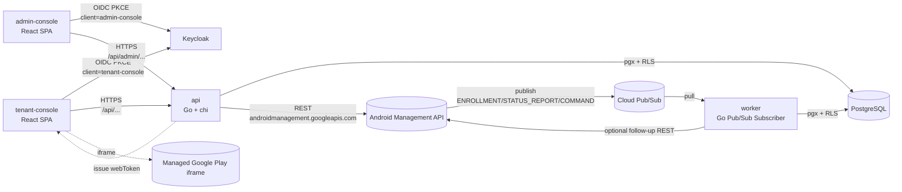
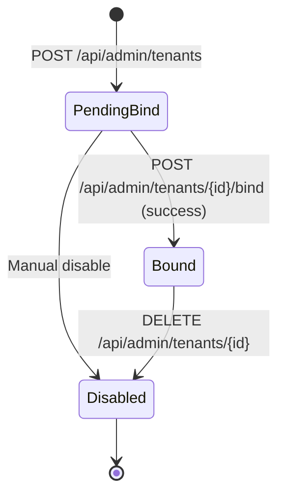
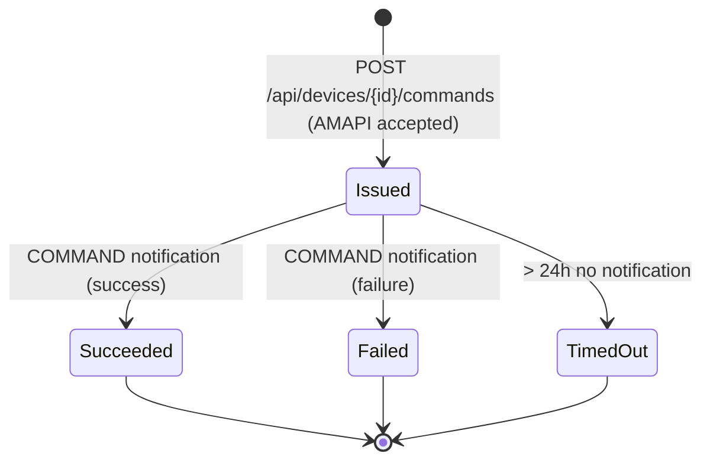
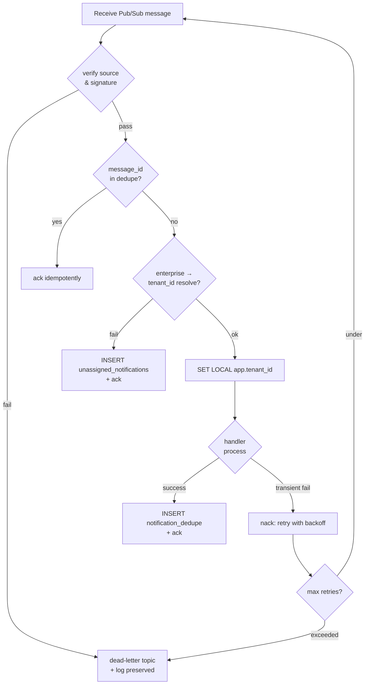
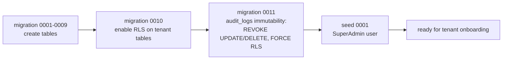

# Design Document

## Overview

**Purpose**: 本機能は、Android Management API（AMAPI）を基盤とする独自 EMM SaaS（ae-mdm）の MVP を構築し、SuperAdmin / TenantAdmin / Operator / Viewer の 4 ロールが、QR コードによる Fully Managed / Dedicated(Kiosk) 端末のエンロール、ポリシー配信、Managed Google Play を介したアプリ配信、LOCK / WIPE / REBOOT のリモートコマンド発行、Pub/Sub 通知駆動の端末状態可視化を、Web コンソールから一貫して実行できる環境を、テナント間のデータ・操作・通知の完全分離下で提供する。

**Users**: SaaS 運営者（SuperAdmin）が顧客企業ごとの Enterprise を代行作成・バインドし、顧客企業の管理者（TenantAdmin / Operator / Viewer）が自テナント配下の端末・ポリシー・アプリ・コマンドを管理する。Operator は LOCK / REBOOT のみ、TenantAdmin は WIPE を含む全操作、Viewer は参照のみ。Android 10 以上を実行する Fully Managed / Dedicated 端末が対象。

**Impact**: 現時点でリポジトリは要件定義のみ（`docs/specs/24-android-enterprise-emm-mvp/requirements.md` と `ae-api-feature.md`）の状態であり、本設計は **Go バックエンド（`api` / `worker` の 2 サービス） + React フロントエンド（**tenant-console** と **admin-console** の 2 SPA） + PostgreSQL（Row-Level Security 併用） + Cloud Pub/Sub（emulator は Docker Compose）** から成るマルチテナント SaaS スタックを新規に立ち上げる。EMM-bound 方式（自社 GCP プロジェクトのサービスアカウントで全テナントの Enterprise を操作）、AMAPI への REST 呼び出し集約、Pub/Sub に基づく at-least-once 非同期通知の冪等処理、12-factor 準拠の AWS Fargate 移行容易な構成、を初期から組み込む。Web フロントエンドは用途の異なる 2 つの SPA（顧客企業 IT 管理者向けの tenant-console と SaaS 運用者向けの admin-console）に分離し、backend は単一プロセスで `/api/...`（テナント系）と `/api/admin/...`（運用系）の 2 つのルート群に認可分離する。

### Goals
- **MVP 機能網羅**: requirements.md の Requirement 1〜9（テナント / 認証認可 / エンロール / ポリシー / デバイス / コマンド / アプリ / 通知 / Web コンソール）を、NFR 1〜5 の制約下で実装可能な粒度に設計分解する。
- **テナント分離の二重防御**: アプリ層で `tenant_id` を必ず付与した上で、PostgreSQL の Row-Level Security（RLS）により物理的にも他テナント行へアクセスできない構成を採る（NFR 2.1 / 2.2 / 2.3）。
- **通知駆動の信頼性**: Pub/Sub の at-least-once を前提に、通知 ID + AMAPI イベント ID による冪等処理、リトライ、dead-letter、テナント特定不能時の「未割当」退避キューを設計する（Requirement 8.7、NFR 2.3）。
- **コマンドのライフサイクル管理**: 非同期コマンド（LOCK / WIPE / REBOOT）の「発行済み」「成功」「失敗」「タイムアウト」を内部状態として追跡し、AMAPI 受理と COMMAND 通知の両方を契機に状態遷移させる（Requirement 6.6 / 6.7）。
- **監査ログの改竄防止**: WIPE・テナント削除・ポリシー変更・ロール変更・コマンド発行等を append-only テーブル + RLS の DELETE / UPDATE 拒否で保持する（NFR 4.3）。
- **AWS Fargate 移行容易性**: GCP 依存（AMAPI / Pub/Sub）以外はコンテナ・環境変数で完結し、ローカル状態を持たないステートレス設計とする。
- **2 コンソール分離**: 用途・ユーザー層・想定リスクの異なる「顧客企業 IT 管理者向け（tenant-console）」と「SaaS 運用者向け（admin-console）」を別 SPA かつ別 OIDC クライアントとして分離し、SuperAdmin 専用画面が誤って顧客側に露出するリスクを物理的に排除する。

### Non-Goals
- requirements.md の Out of Scope 全項目（zero-touch / Work Profile / COPE / Lost Mode / eSIM / RESET_PASSWORD・RELINQUISH_OWNERSHIP・CLEAR_APP_DATA 等のコマンド / 自社開発アプリ配信 / USAGE_LOGS）。
- テナント管理者のセルフサインアップ（Open Questions 1 の確定回答により SuperAdmin 代行運用に限定）。
- 通知欠落の能動アラート（Open Questions 5 の確定回答により MVP 対象外、「同期遅延」可視化のみ）。
- テナント横断の共通ポリシー雛形（Open Questions 6 の確定回答により MVP 対象外）。
- 監査ログの長期保存・WORM ストレージ統合（MVP では PostgreSQL の append-only テーブル + 180 日保持。将来 S3 Object Lock 等へ拡張可能な構造を取る）。
- 多言語化（MVP は日本語 UI のみ）。
- **backend の完全 2 分割**（運用系 API を独立プロセス／独立 repo に切り出すこと）。MVP では単一 Go プロセスで `/api` と `/api/admin` のルート分離 + 認可分離のみを行う。

## Architecture

### Existing Architecture Analysis

現時点のリポジトリは要件定義（`docs/specs/24-android-enterprise-emm-mvp/requirements.md`）と機能カタログ（`ae-api-feature.md`）のみ。実装コードは存在しない。したがって既存コードベースへの統合制約はなく、本設計は新規プロジェクトの初期アーキテクチャを定義する。

**尊重する制約**:
- リポジトリルートの `CLAUDE.md` のコード規約・テスト規約・禁止事項。
- `ae-api-feature.md` で定義された AMAPI の責務分担（DPC は ADP に委譲、自社の責務はコンソール + バックエンド + Pub/Sub 受信）。
- `requirements.md` の Requirement 1〜9 と NFR 1〜5、Out of Scope。

### Architecture Pattern & Boundary Map

採用パターン: **Modular Monolith on Go（service / worker 分離） + RESTful API（`/api` と `/api/admin` の 2 ルート群） + Pub/Sub Pull Subscriber + RLS 強制マルチテナント + 2 SPA フロントエンド（tenant-console / admin-console）**。複雑度を下げるためマイクロサービス分割は採らず、`api` プロセスと `worker` プロセスの 2 プロセスのみ。Web フロントエンドは用途分離のため別 SPA として 2 つ配置するが、backend は単一プロセスでルートと認可のみを分離する。コードは Go module 内で domain package（`tenant` / `auth` / `enrollment` / `policy` / `device` / `command` / `app` / `audit` / `notification`）に分割する。



**Architecture Integration**:
- 採用パターン: **モジュラーモノリス（Go）** — マルチテナント基盤・認証認可・通知処理が複数ドメインで共有されるため、最初はモノリスで凝集度を保ち、ドメイン package 境界を明確化する。将来必要時にプロセス分割可能な構造とする。
- ドメイン／機能境界: 各 domain package は (a) アプリケーションサービス、(b) リポジトリ、(c) DTO/型、(d) ハンドラ（API のみ） を内部に持ち、隣接 domain への参照は **interface を介した依存倒置** のみ（cross-domain な direct struct 参照を禁止）。
- **Web フロント境界**: 用途分離のため **2 SPA 構成**（tenant-console / admin-console）を採用。共通 UI / 型 / api-client / oidc ラッパは `frontend/shared/` に置き 2 SPA で共有する。各 SPA は独立した nginx コンテナで配信される。
- **HTTP ルート境界**: backend は単一プロセスだが、ルートを `/api/...`（テナント系 = TenantAdmin / Operator / Viewer 向け）と `/api/admin/...`（運用系 = SuperAdmin 向け）の 2 群に分け、認可ミドルウェアもルート群ごとに別チェーンを構築する。
- **OIDC クライアント境界**: tenant-console / admin-console は別 OIDC クライアント ID で発行され、callback URL・許可スコープ・ID トークン aud を分離する。SuperAdmin 専用画面が顧客側 SPA に物理的に存在しない構成となる。
- 既存パターンの維持: なし（新規プロジェクト）。
- 新規コンポーネントの根拠:
  - `api` / `worker` の 2 プロセス分離: API レスポンスタイム（同期）と通知処理（at-least-once 非同期）を別 SLO で扱うため。Pub/Sub pull subscriber を API プロセスに同居させると graceful shutdown が複雑化する。
  - `tenant_context` middleware: RLS の `SET LOCAL app.tenant_id` を全 DB トランザクションで強制するため。
  - `audit_log` ドメイン: NFR 4.2 / 4.3 の改竄防止と保持期間を担保するため独立 domain として切り出す。
  - **tenant-console / admin-console の 2 SPA 分離**: SuperAdmin 専用機能（テナント作成・無効化・横断監査・未割当通知の退避キュー閲覧）が顧客企業の管理者画面にバンドルされず、誤クリック・URL 直叩き・XSS による越境のリスクを物理的に下げる。1 SPA + RoleGate 方式と比較し、画面 bundle 自体が分離される。
  - **backend を完全 2 プロセスに分割しない理由**: ドメインロジック（tenant / audit / authz）は両ルート群で共有されており、プロセス分割すると DI と DB 接続プールが二重化されメンテナンス負荷が増える。MVP では認可とルートのみの分離で十分とする。

### Web フロント構成（2 コンソール）

| Console | 利用者 | 主な画面 | 対応 Requirement | OIDC クライアント | backend エンドポイント群 |
|---|---|---|---|---|---|
| **tenant-console** | TenantAdmin / Operator / Viewer | ダッシュボード、デバイス一覧・詳細、コマンド（LOCK / WIPE / REBOOT）、エンロール、ポリシー一覧・編集（5 領域）、アプリ配信、自テナント監査ログ、テナント内管理者 & ロール | 2 (TenantAdmin/Operator/Viewer 部分), 3, 4, 5, 6, 7, 8 (UI 連動), 9.1, 9.2, 9.3, 9.4 | `tenant-console` | `/api/...` |
| **admin-console** | SuperAdmin | テナント一覧・作成・Enterprise バインド・無効化、全テナント横断ダッシュボード、未割当通知・端末の退避キュー可視化、全テナント横断監査ログ | 1, 2 (SuperAdmin 部分), 9.5, NFR 2.3 (UI 可視化) | `admin-console` | `/api/admin/...` |

- 共通基盤（OIDC PKCE ラッパ / api-client / 型定義 / ConfirmDialog / RoleGate / Tailwind theme）は `frontend/shared/` に切り出し、2 SPA で import 共有する。
- tenant-console には SuperAdmin 専用ルート（`/tenants`, `/admin/audit-logs` 等）を**そもそも含めない**。逆に admin-console には TenantAdmin 専用の端末操作 UI を含めない（必要があれば SuperAdmin が tenant-console に impersonate ログインする運用は MVP では実装しない）。
- 各 SPA は独立した Dockerfile + nginx 設定を持ち、Docker Compose では `tenant-console` / `admin-console` の 2 サービスとして起動する（それぞれ別ポートで listen し、開発時のリバースプロキシで `/api` を backend に流す）。

### Technology Stack

| Layer | Choice / Version | Role in Feature | Notes |
|-------|------------------|-----------------|-------|
| Frontend / CLI | React 19 + TypeScript + Vite, Tailwind CSS + shadcn/ui, TanStack Query, React Router, React Hook Form + Zod, oidc-client-ts | **2 SPA**: tenant-console（顧客 IT 管理者向け、TenantAdmin/Operator/Viewer の操作画面）と admin-console（SaaS 運用者向け、SuperAdmin の運用画面）。共通 UI / 型 / api-client / oidc ラッパは `frontend/shared/` で共有 | 各 SPA が独立した Vite プロジェクト + nginx コンテナで配信。Managed Play iframe / QR は tenant-console 側のみ |
| Backend / Services | Go 1.22+, `chi` (HTTP router), `pgx/v5` (DB driver), `sqlc` (型安全 SQL コード生成), `golang-migrate` (マイグレーション), `cloud.google.com/go/pubsub`, `google.golang.org/api/androidmanagement/v1`, `coreos/go-oidc` (OIDC 検証), `go.uber.org/zap` (構造化ログ) | `api` プロセス（REST + OIDC + AMAPI クライアント、ルートは `/api/...` と `/api/admin/...` の 2 群に分離） / `worker` プロセス（Pub/Sub pull subscriber） | 単一 Go module、2 つの main binary。backend は **1 プロセス**で 2 ルート群を提供（運用系 backend の独立プロセス分離は採らない） |
| Data / Storage | PostgreSQL 16 | テナント・端末・ポリシー・コマンド・監査ログ・通知デデュープ・未割当通知 | Row-Level Security 強制、append-only audit テーブル |
| Messaging / Events | Cloud Pub/Sub（本番） / Pub/Sub emulator（ローカル Docker Compose） | AMAPI からの ENROLLMENT / STATUS_REPORT / COMMAND 通知購読、dead-letter topic | at-least-once、pull subscription |
| Infrastructure / Runtime | Docker Compose（ローカル: `api` / `worker` / `tenant-console` / `admin-console` / `postgres` / `keycloak` / `pubsub-emulator`） | 開発・E2E 環境 | 将来 AWS Fargate へ移行できる 12-factor 構成、ローカル状態を持たない、設定は環境変数。フロントは 2 サービスとして個別 nginx で起動 |
| Authentication | Keycloak（ローカル IdP）/ ジェネリック OIDC（本番） | 管理者 OIDC 認証 + JWT 発行、RBAC ロールはクレーム（`roles`）にマップ。**OIDC クライアントは `tenant-console` / `admin-console` の 2 つに分離** し、callback URL・許可スコープ・aud を分けることでコンソール間の token 流用を防止 | `coreos/go-oidc` で JWKS 検証、PKCE は各フロント側 |
| External | Android Management API（v1）、Managed Google Play iframe | Enterprise・Policy・Device・EnrollmentToken・WebToken の操作 | EMM-bound、サービスアカウント鍵 |

## File Structure Plan

### Directory Structure

```
ae-mdm/
├── docker-compose.yml                # api / worker / tenant-console / admin-console / postgres / keycloak / pubsub-emulator
├── .env.example                      # 環境変数テンプレート
├── Makefile                          # build / test / migrate / lint コマンド集約
├── backend/
│   ├── go.mod
│   ├── go.sum
│   ├── cmd/
│   │   ├── api/main.go               # api プロセスのエントリ（/api と /api/admin の 2 ルート群を mount）
│   │   └── worker/main.go            # worker プロセスのエントリ
│   ├── internal/
│   │   ├── config/                   # 環境変数読み込み（CONFIG_*）
│   │   │   └── config.go
│   │   ├── platform/                 # 共通基盤（横断的関心事）
│   │   │   ├── db/                   # pgx pool, トランザクション、RLS context
│   │   │   │   ├── pool.go
│   │   │   │   ├── txmanager.go
│   │   │   │   └── rls.go            # SET LOCAL app.tenant_id 設定
│   │   │   ├── httpserver/           # chi router 構築・middleware 登録
│   │   │   │   ├── server.go         # /api と /api/admin の 2 サブルータを mount
│   │   │   │   ├── middleware.go     # request_id, recover, tenant_context, auth（テナント系）
│   │   │   │   └── admin_middleware.go # SuperAdmin 専用 authz ガード（/api/admin 専用チェーン）
│   │   │   ├── pubsub/               # Pub/Sub クライアント・subscription handler 抽象
│   │   │   │   ├── client.go
│   │   │   │   └── subscriber.go     # pull, ack, nack, dead-letter
│   │   │   ├── amapi/                # AMAPI クライアントの薄いラッパ
│   │   │   │   ├── client.go         # service account 認証
│   │   │   │   ├── enterprises.go
│   │   │   │   ├── policies.go
│   │   │   │   ├── devices.go
│   │   │   │   ├── enrollment_tokens.go
│   │   │   │   └── webtokens.go
│   │   │   ├── oidc/                 # OIDC ID トークン検証、JWKS キャッシュ
│   │   │   │   └── verifier.go       # tenant-console / admin-console の 2 つの aud を検証可能
│   │   │   ├── authz/                # RBAC: ロール定義・permission チェック
│   │   │   │   ├── roles.go          # SuperAdmin/TenantAdmin/Operator/Viewer
│   │   │   │   └── permissions.go    # action × resource の許可マトリクス
│   │   │   ├── errors/               # 独自 Error 型（ドメインエラー → HTTP マッピング）
│   │   │   │   └── errors.go
│   │   │   └── logger/               # zap ベースの構造化ログ
│   │   │       └── logger.go
│   │   ├── tenant/                   # Requirement 1
│   │   │   ├── handler.go            # /api/admin/tenants エンドポイント（SuperAdmin 専用、admin-console 向け）
│   │   │   ├── service.go            # Enterprise 作成代行ロジック（signupUrls + enterprises.create）
│   │   │   ├── repository.go         # tenants テーブル CRUD（sqlc 生成）
│   │   │   └── types.go
│   │   ├── auth/                     # Requirement 2 / NFR 5
│   │   │   ├── handler.go            # /api/auth/* と /api/admin/auth/* の両方を提供（OIDC クライアントを分離して mount）
│   │   │   ├── service.go            # OIDC コールバック処理、セッション発行
│   │   │   ├── repository.go         # admin_users, admin_role_assignments テーブル
│   │   │   ├── session.go            # cookie 発行・HttpOnly/Secure、アイドルタイムアウト
│   │   │   └── types.go
│   │   ├── enrollment/               # Requirement 3
│   │   │   ├── handler.go            # /api/enrollment-tokens エンドポイント（tenant-console 向け）
│   │   │   ├── service.go            # トークン発行、additionalData にテナント ID 埋込み、QR データ生成
│   │   │   ├── repository.go         # enrollment_tokens テーブル
│   │   │   └── types.go
│   │   ├── policy/                   # Requirement 4
│   │   │   ├── handler.go            # /api/policies エンドポイント（tenant-console 向け）
│   │   │   ├── service.go            # ポリシー upsert、AMAPI patch、3,000 アプリ上限検証
│   │   │   ├── validator.go          # パスワード桁数・Kiosk pkg 名・上限などのバリデーション
│   │   │   ├── repository.go         # policies テーブル（AMAPI 名 + JSON snapshot）
│   │   │   └── types.go
│   │   ├── device/                   # Requirement 5 / NFR 3.2
│   │   │   ├── handler.go            # /api/devices（tenant-console 向け）
│   │   │   ├── admin_handler.go      # /api/admin/devices/overview（admin-console 向け、横断ダッシュボード）
│   │   │   ├── service.go            # ビジネスロジック（同期遅延判定、コンプライアンス分類）
│   │   │   ├── repository.go         # devices テーブル
│   │   │   └── types.go
│   │   ├── command/                  # Requirement 6
│   │   │   ├── handler.go            # /api/devices/{id}/commands エンドポイント（tenant-console 向け、LOCK/WIPE/REBOOT）
│   │   │   ├── service.go            # 二段階確認、ロール×コマンド権限、AMAPI issueCommand
│   │   │   ├── state.go              # コマンド状態遷移マシン（issued → succeeded/failed/timeout）
│   │   │   ├── repository.go         # device_commands テーブル
│   │   │   └── types.go
│   │   ├── app/                      # Requirement 7
│   │   │   ├── handler.go            # /api/apps, /api/play-tokens エンドポイント（tenant-console 向け）
│   │   │   ├── service.go            # アプリカタログ管理、webTokens 発行（iframe 用）、ポリシー反映
│   │   │   ├── repository.go         # tenant_apps テーブル
│   │   │   └── types.go
│   │   ├── audit/                    # NFR 4.2 / 4.3 / Requirement 9.4 / 9.5
│   │   │   ├── handler.go            # /api/audit-logs（tenant-console 向け、自テナントのみ）
│   │   │   ├── admin_handler.go      # /api/admin/audit-logs（admin-console 向け、全テナント横断）
│   │   │   ├── service.go            # append-only 書込み、保持期間（180 日）クエリ、絞り込み
│   │   │   ├── repository.go         # audit_logs テーブル（INSERT のみ許可）
│   │   │   └── types.go
│   │   └── notification/             # Requirement 8 / NFR 2.2 / NFR 2.3
│   │       ├── dispatcher.go         # worker の subscription handler エントリ
│   │       ├── enrollment_handler.go # ENROLLMENT 通知 → devices テーブル登録
│   │       ├── status_handler.go     # STATUS_REPORT 通知 → devices テーブル更新
│   │       ├── command_handler.go    # COMMAND 通知 → device_commands テーブル更新
│   │       ├── verifier.go           # 通知の送信元検証、署名・整合性確認
│   │       ├── dedupe.go             # 通知 ID による冪等処理
│   │       ├── unassigned.go         # テナント特定不能時の未割当退避ロジック
│   │       ├── admin_handler.go      # /api/admin/notifications/unassigned 退避キュー閲覧用ハンドラ（admin-console 向け）
│   │       └── types.go
│   ├── db/
│   │   ├── migrations/               # golang-migrate 形式（YYYYMMDDhhmmss_<name>.up.sql / down.sql）
│   │   │   ├── 0001_create_tenants.up.sql
│   │   │   ├── 0001_create_tenants.down.sql
│   │   │   ├── 0002_create_admin_users_and_roles.up.sql
│   │   │   ├── 0003_create_enrollment_tokens.up.sql
│   │   │   ├── 0004_create_policies.up.sql
│   │   │   ├── 0005_create_devices.up.sql
│   │   │   ├── 0006_create_device_commands.up.sql
│   │   │   ├── 0007_create_tenant_apps.up.sql
│   │   │   ├── 0008_create_audit_logs.up.sql
│   │   │   ├── 0009_create_notification_dedupe_and_unassigned.up.sql
│   │   │   ├── 0010_enable_rls.up.sql                # 全 tenant_id カラム持ちテーブルに RLS 有効化
│   │   │   └── 0011_audit_log_immutability.up.sql    # audit_logs の UPDATE/DELETE 拒否
│   │   └── queries/                  # sqlc 用 SQL（domain ごとに分割）
│   │       ├── tenants.sql
│   │       ├── auth.sql
│   │       ├── enrollment.sql
│   │       ├── policies.sql
│   │       ├── devices.sql
│   │       ├── commands.sql
│   │       ├── apps.sql
│   │       ├── audit.sql
│   │       └── notification.sql
│   ├── sqlc.yaml                     # sqlc 生成設定
│   ├── Dockerfile.api
│   ├── Dockerfile.worker
│   └── test/
│       ├── integration/              # 結合テスト（実 Postgres + Pub/Sub emulator）
│       │   ├── tenant_isolation_test.go    # RLS による分離の verify
│       │   ├── enrollment_flow_test.go     # トークン発行 → 通知 → 登録
│       │   ├── command_lifecycle_test.go   # 発行 → 通知 → 状態更新
│       │   ├── admin_route_authz_test.go   # /api/admin/* は SuperAdmin のみ通過することを verify
│       │   └── notification_dedupe_test.go # 冪等処理・dead-letter
│       └── fixtures/                 # テスト用 SQL fixture、AMAPI モックレスポンス
│           └── ...
├── frontend/
│   ├── shared/                       # 2 SPA で共有する基盤（共通 UI / 型 / api-client / oidc）
│   │   ├── package.json              # ローカル workspace（pnpm workspace or npm workspaces）
│   │   ├── tsconfig.json
│   │   ├── src/
│   │   │   ├── lib/
│   │   │   │   ├── api-client.ts     # fetch ラッパ + 401 ハンドリング（baseURL は SPA ごとに差し替え可）
│   │   │   │   ├── oidc.ts           # oidc-client-ts ラッパ（client_id を引数化）
│   │   │   │   └── queryClient.ts    # TanStack Query 設定
│   │   │   ├── auth/
│   │   │   │   ├── LoginPage.tsx     # OIDC ログイン共通画面
│   │   │   │   ├── CallbackPage.tsx
│   │   │   │   └── useSession.ts
│   │   │   ├── components/           # 共通 UI（shadcn/ui ラッパ）
│   │   │   │   ├── ConfirmDialog.tsx # 二段階確認共通コンポーネント
│   │   │   │   ├── RoleGate.tsx      # ロール別の非活性化・非表示制御（補助的、SPA 分離が主防御）
│   │   │   │   └── ...
│   │   │   └── types/
│   │   │       └── api.ts            # OpenAPI / 手書きの型定義
│   ├── tenant-console/               # 顧客企業 IT 管理者向け SPA（TenantAdmin / Operator / Viewer）
│   │   ├── package.json
│   │   ├── vite.config.ts
│   │   ├── tsconfig.json
│   │   ├── tailwind.config.ts
│   │   ├── index.html
│   │   ├── nginx.conf                # SPA fallback、/api を backend にリバースプロキシ
│   │   ├── Dockerfile
│   │   ├── src/
│   │   │   ├── main.tsx
│   │   │   ├── App.tsx
│   │   │   ├── routes/index.tsx      # tenant-console のルート定義（SuperAdmin 専用ルートは含まない）
│   │   │   └── features/
│   │   │       ├── dashboard/        # 自テナントのダッシュボード
│   │   │       ├── devices/          # 一覧・詳細・コンプライアンスフィルタ・同期遅延表示
│   │   │       ├── commands/         # LOCK/WIPE/REBOOT 発行 UI（WIPE 二段階確認、Operator は WIPE 非表示）
│   │   │       ├── enrollment/       # トークン発行 + QR 表示
│   │   │       ├── policies/         # ポリシー一覧・編集（5 領域タブ: アプリ/パスワード/セキュリティ/更新/Kiosk）
│   │   │       ├── apps/             # アプリカタログ + Managed Play iframe 埋込み
│   │   │       ├── audit/            # 自テナント監査ログ一覧（TenantAdmin 以上）
│   │   │       └── admins/           # テナント内管理者一覧・ロール変更（TenantAdmin 以上）
│   │   └── test/
│   │       ├── unit/                 # Vitest
│   │       └── e2e/                  # Playwright（必要な user flow のみ）
│   └── admin-console/                # SaaS 運用者向け SPA（SuperAdmin 専用）
│       ├── package.json
│       ├── vite.config.ts
│       ├── tsconfig.json
│       ├── tailwind.config.ts
│       ├── index.html
│       ├── nginx.conf                # SPA fallback、/api/admin を backend にリバースプロキシ
│       ├── Dockerfile
│       ├── src/
│       │   ├── main.tsx
│       │   ├── App.tsx
│       │   ├── routes/index.tsx      # admin-console のルート定義（テナント業務 UI は含まない）
│       │   └── features/
│       │       ├── tenants/          # テナント一覧・作成・Enterprise バインド・無効化
│       │       ├── overview/         # 全テナント横断ダッシュボード
│       │       ├── unassigned/       # 未割当通知・端末の退避キュー可視化（NFR 2.3）
│       │       └── audit/            # 全テナント横断監査ログ
│       └── test/
│           ├── unit/
│           └── e2e/
├── infra/
│   └── keycloak/
│       └── realm-export.json         # ローカル Keycloak の dev realm 設定（tenant-console / admin-console の 2 クライアントを定義）
└── docs/
    ├── specs/
    │   └── 24-android-enterprise-emm-mvp/
    │       ├── requirements.md       # 確定済み
    │       ├── design.md             # 本ファイル
    │       └── tasks.md
    └── runbook/
        └── local-dev.md              # 起動・migrate・テスト手順
```

### Modified Files
- リポジトリ新規構築のため、変更対象ファイルはない（`docs/specs/24-android-enterprise-emm-mvp/requirements.md` と `ae-api-feature.md` は変更しない）。

## Requirements Traceability

requirements.md の numeric ID（Requirement 1〜9 + NFR 1〜5）を、本設計の Components / Data Models / Flows にマッピングする。

| Requirement | Summary | Components | Interfaces | Flows / Data |
|-------------|---------|------------|------------|--------------|
| 1.1 | テナント作成 + Enterprise 作成・バインド | Tenant Service, AMAPI Client (enterprises), **admin-console (features/tenants)** | POST /api/admin/tenants | flow: 「テナント作成（SuperAdmin 代行）」 |
| 1.2 | enterprise 識別子保存 → 以後の AMAPI 呼出に利用 | Tenant Service, Tenant Repository | tenants.enterprise_id カラム | data model: tenants |
| 1.3 | Enterprise 作成失敗時の「バインド未完了」状態 | Tenant Service, **admin-console (features/tenants)** | tenants.status enum | state: pending_bind / bound / disabled |
| 1.4 | テナント識別子による物理分離 | Tenant Context Middleware, RLS Policy, 全 Repository | SET LOCAL app.tenant_id | data model: 全テーブル `tenant_id NOT NULL` + RLS |
| 1.5 | 他テナントリソース 403、存在露出なし | Authz Middleware, Tenant Context Middleware, RLS Policy | RBAC check + RLS | flow: テナント分離（二重防御） |
| 2.1 | OIDC ログインフロー開始・セッション発行 | Auth Service, OIDC Verifier, Session Manager, **tenant-console / admin-console (shared/auth)** | GET /api/auth/login, GET /api/auth/callback（コンソールごとに別 OIDC クライアント） | flow: OIDC ログイン |
| 2.2 | 認証失敗時のメッセージ表示 | Auth Service, **shared/auth (LoginPage)** | callback エラー応答 | error: invalid_id_token |
| 2.3 | 4 ロールの割当 | Authz, Auth Repository | admin_role_assignments テーブル | data model: admin_users / admin_role_assignments |
| 2.4 | Viewer ロールの権限 | Authz Permissions Matrix | permissions.go | matrix: Viewer = read-only |
| 2.5 | Operator ロールの権限 | Authz Permissions Matrix | permissions.go | matrix: Operator = LOCK/REBOOT + policy:read |
| 2.6 | TenantAdmin ロールの権限 | Authz Permissions Matrix | permissions.go | matrix: TenantAdmin = 自テナント全操作 |
| 2.7 | SuperAdmin ロールの権限 | Authz Permissions Matrix, **/api/admin authz middleware** | permissions.go + admin route guard | matrix: SuperAdmin = テナント作成・削除 + 全テナント、/api/admin/* は SuperAdmin のみ |
| 2.8 | セッション期限切れ／無効 | Session Manager | session middleware | NFR 5.3 と連動 |
| 2.9 | ロール変更の監査ログ | Audit Service, Auth Service, **tenant-console (features/admins)** | audit_logs INSERT | event: role_change |
| 3.1 | Fully Managed トークン発行 | Enrollment Service, AMAPI Client (enrollmentTokens), **tenant-console (features/enrollment)** | POST /api/enrollment-tokens | flow: トークン発行（Fully Managed） |
| 3.2 | Dedicated(Kiosk) トークン発行 | Enrollment Service, AMAPI Client, **tenant-console (features/enrollment)** | POST /api/enrollment-tokens (mode=DEDICATED) | flow: トークン発行（Dedicated） |
| 3.3 | additionalData にテナント ID 等メタ付与 | Enrollment Service | additionalData の JSON encoding | data: enrollment_tokens.additional_data |
| 3.4 | ENROLLMENT 通知で端末紐付 | Notification Dispatcher, Enrollment Handler | Pub/Sub subscription | flow: ENROLLMENT 通知 |
| 3.5 | テナント特定不能時の「未割当」記録 | Unassigned Notification Queue, **admin-console (features/unassigned)** | unassigned_notifications テーブル, GET /api/admin/notifications/unassigned | data model: unassigned_notifications |
| 3.6 | トークン失効・使用済みエラー伝達 | Enrollment Service, Notification Dispatcher | AMAPI error → UI message | error: token_expired |
| 3.7 | トークン発行の監査ログ | Audit Service | audit_logs INSERT | event: token_issue |
| 4.1 | ポリシー upsert | Policy Service, AMAPI Client (policies), **tenant-console (features/policies)** | POST/PUT /api/policies | flow: ポリシー保存 |
| 4.2 | 5 領域設定項目（アプリ/パスワード/セキュリティ/更新/Kiosk） | Policy Service, Policy Validator, **tenant-console (features/policies)** | policy JSON schema | data model: policies |
| 4.3 | ポリシー更新の端末配信 | Policy Service, AMAPI Client | enterprises.policies.patch | flow: ポリシー更新配信 |
| 4.4 | ポリシー割当（端末／トークン） | Policy Service, Enrollment Service, Device Service | PUT /api/devices/{id}/policy | flow: ポリシー割当 |
| 4.5 | アプリ 3,000 件上限 | Policy Validator | validation rule | error: policy_app_limit_exceeded |
| 4.6 | 不正値の保存拒否 | Policy Validator | validation rules | error: invalid_policy_field |
| 4.7 | 他テナントポリシー更新拒否 | Authz, RLS | RBAC + RLS | flow: テナント分離 |
| 4.8 | ポリシー変更の監査ログ | Audit Service | audit_logs INSERT | event: policy_change |
| 5.1 | 端末一覧（自テナントのみ） | Device Service, Device Repository, RLS, **tenant-console (features/devices)** | GET /api/devices | flow: 端末一覧 |
| 5.2 | 端末詳細（モード・ポリシー・HW/SW・最終同期・コンプライアンス） | Device Service, **tenant-console (features/devices)** | GET /api/devices/{id} | data model: devices |
| 5.3 | コンプライアンス分類（準拠/非準拠/未確認） + 詳細 | Device Service, Notification Status Handler | nonComplianceDetails JSON | data: devices.compliance_status |
| 5.4 | 非準拠フィルタ | Device Service, **tenant-console (features/devices)** | GET /api/devices?compliance=non_compliant | query parameter |
| 5.5 | 他テナント端末詳細拒否 | Authz, RLS | RBAC + RLS | flow: テナント分離 |
| 5.6 | 同期遅延可視化（24 時間） | Device Service, **tenant-console (features/devices)** | last_status_at vs threshold | NFR 3.2 と連動 |
| 6.1 | LOCK コマンド発行 | Command Service, AMAPI Client (devices.issueCommand), **tenant-console (features/commands)** | POST /api/devices/{id}/commands (type=LOCK) | flow: コマンド発行 |
| 6.2 | REBOOT コマンド発行 | Command Service, AMAPI Client, **tenant-console (features/commands)** | POST /api/devices/{id}/commands (type=REBOOT) | flow: コマンド発行 |
| 6.3 | WIPE 二段階確認 | Command Service (confirmation token), **tenant-console (features/commands) + shared/ConfirmDialog** | confirmation_token フィールド | flow: WIPE 二段階確認 |
| 6.4 | Operator の WIPE 拒否 | Authz Permissions Matrix, **tenant-console (RoleGate)** | permissions.go | matrix: Operator ≠ wipe |
| 6.5 | 他テナント端末コマンド拒否 | Authz, RLS | RBAC + RLS | flow: テナント分離 |
| 6.6 | AMAPI 受理時「発行済み」記録 | Command Service, Command State Machine | device_commands.status='issued' | state: コマンドライフサイクル |
| 6.7 | COMMAND 通知で「成功/失敗」更新 | Notification Dispatcher, Command Handler | device_commands.status='succeeded'/'failed' | state: コマンドライフサイクル |
| 6.8 | WIPE 発行の監査ログ | Audit Service | audit_logs INSERT | event: command_wipe |
| 6.9 | LOCK/REBOOT を含む全コマンド発行の監査ログ | Audit Service | audit_logs INSERT | event: command_issue |
| 7.1 | Managed Play 承認結果のカタログ反映 | App Service, AMAPI webTokens, **tenant-console (features/apps)** Play iframe | iframe + POST /api/apps/sync | flow: Play 連携 |
| 7.2 | アプリの FORCE_INSTALLED 設定 | App Service, Policy Service, **tenant-console (features/apps)** | applications[].installType | data: policies.applications |
| 7.3 | アプリの AVAILABLE 設定 | App Service, Policy Service, **tenant-console (features/apps)** | applications[].installType=AVAILABLE | data: policies.applications |
| 7.4 | 他テナントのアプリリスト操作拒否 | Authz, RLS | RBAC + RLS | flow: テナント分離 |
| 7.5 | 端末ごとのインストール済みアプリ表示 | Device Service, Notification Status Handler, **tenant-console (features/devices)** | devices.applications JSON | data: devices.installed_apps |
| 8.1 | Pub/Sub 受信エンドポイント | Notification Dispatcher（worker） | pull subscription | runtime: worker プロセス |
| 8.2 | ENROLLMENT 通知 → 端末登録/更新 | Enrollment Notification Handler | devices INSERT/UPDATE | flow: ENROLLMENT 通知 |
| 8.3 | STATUS_REPORT 通知 → 状態更新 | Status Notification Handler | devices UPDATE | flow: STATUS_REPORT 通知 |
| 8.4 | COMMAND 通知 → コマンド状態更新 | Command Notification Handler | device_commands UPDATE | flow: COMMAND 通知 |
| 8.5 | ポーリングでなく通知駆動 | Notification Dispatcher | pull subscriber | architecture decision |
| 8.6 | 通知検証失敗時の破棄 + ログ保持 | Notification Verifier | dead-letter topic | flow: 検証失敗時の dead-letter |
| 8.7 | 一時的処理失敗時の再処理保持 | Notification Dispatcher, Pub/Sub nack + retry | nack + exponential backoff | flow: 失敗 retry |
| 9.1 | 全操作の Web UI 化 | **tenant-console + admin-console の 2 SPA**（features/*） | React SPA × 2 | UI: ルートマップ |
| 9.2 | ロールに応じた UI 制御 | **tenant-console (RoleGate)、admin-console は SuperAdmin 専用 bundle**（SPA 分離が主防御） | useSession + roles | UI: 非活性化・非表示 + SPA 分離 |
| 9.3 | URL/API での他テナント参照拒否 | Authz Middleware, RLS | RBAC + RLS | flow: テナント分離 |
| 9.4 | 監査ログ閲覧（時系列・絞り込み） | Audit Service, **tenant-console (features/audit)** | GET /api/audit-logs | data: audit_logs（TenantAdmin 以上） |
| 9.5 | SuperAdmin の全テナント横断監査ログ | Audit Service, Authz, **admin-console (features/audit)** | GET /api/admin/audit-logs | flow: SuperAdmin の特権 |
| NFR 1.1 | Android 10+ サポート | AMAPI Client, Policy Service | minimumApiLevel ポリシー | constraint |
| NFR 1.2 | Android 10 未満の「サポート対象外」可視化 | Device Service, Enrollment Notification Handler, **tenant-console (features/devices)** | devices.status='unsupported' | data: devices.status |
| NFR 2.1 | テナント間の参照・操作禁止 | Tenant Context Middleware, RLS Policy, Authz | RLS + RBAC | architecture: テナント分離 |
| NFR 2.2 | 通知のテナント紐付け | Notification Dispatcher | enterprise_id → tenant_id lookup | flow: 通知ルーティング |
| NFR 2.3 | テナント特定不能時の未割当退避 | Unassigned Notification Queue, **admin-console (features/unassigned)** | unassigned_notifications テーブル + GET /api/admin/notifications/unassigned | flow: 未割当退避 |
| NFR 3.1 | 通知受信から 60 秒以内の反映 | Notification Dispatcher, Worker, Frontend Query 再フェッチ | SLA: subscription pull + ack | performance: 60s |
| NFR 3.2 | 24 時間以上 STATUS_REPORT なしで「同期遅延」 | Device Service | last_status_at threshold | data: devices.last_status_at |
| NFR 4.1 | 不可逆操作の二段階確認 | Command Service, Tenant Service (delete), **shared/ConfirmDialog** | confirmation_token | UI: ConfirmDialog |
| NFR 4.2 | 監査ログの 180 日以上保持 | Audit Service | retention=180d 設定可能 | constraint: settable |
| NFR 4.3 | 監査ログの改竄・削除不可 | Audit Repository, RLS Policy | INSERT-only role | data: audit_logs immutability |
| NFR 5.1 | セッション cookie の HttpOnly/Secure | Session Manager | Set-Cookie 属性 | security: cookie |
| NFR 5.2 | ID トークン署名・発行者・有効期限の検証 | OIDC Verifier | go-oidc + JWKS（tenant-console / admin-console の 2 aud を検証） | security: token validation |
| NFR 5.3 | 30 分アイドルでセッション失効 | Session Manager | idle timeout | security: session |

## Components and Interfaces

### Platform Layer

#### Tenant Context Middleware

| Field | Detail |
|-------|--------|
| Intent | 認証済みリクエストから tenant_id を抽出し、DB トランザクションの `SET LOCAL app.tenant_id` に注入する |
| Requirements | 1.4, 1.5, 4.7, 5.5, 6.5, 7.4, 9.3, NFR 2.1 |

**Responsibilities & Constraints**
- 主責務: JWT クレームの `tenant_id` を request context に格納し、後続 DB トランザクションで RLS GUC を確実にセット。
- ドメイン境界: 全 HTTP ハンドラ、全 worker メッセージハンドラの前段で動作。`/api/...` ルート群のテナント系チェーンに常時介在する。`/api/admin/...` ルート群では SuperAdmin が cross-tenant 操作するため `is_superadmin=true` の context を確立する別チェーンが入る。
- データ所有権: tenant_id のフォーマット検証のみ。永続化は行わない。
- Invariants: tenant_id を持たないリクエストは DB アクセス不可（panic 相当のガード）。SuperAdmin は明示的に `tenant_id=null` + `is_superadmin=true` の context を持ち、`/api/admin/...` 配下の特定エンドポイントのみ全テナント横断アクセスを許可。

**Dependencies**
- Inbound: `httpserver.Server` (chi middleware), `notification.Dispatcher` (worker pre-handler) — リクエスト前処理 (Critical)
- Outbound: `db.TxManager` — トランザクション開始時の GUC 設定 (Critical)
- External: なし

**Contracts**: Service [x] / API [ ] / Event [ ] / Batch [ ] / State [ ]

##### Service Interface

```go
type TenantContextMiddleware interface {
    // HTTPMiddleware は chi 用 middleware を返す。JWT 検証済み context を受け取り、tenant_id を埋める。
    HTTPMiddleware() func(http.Handler) http.Handler
    // FromContext は ctx から TenantContext を取り出す。存在しない場合 error。
    FromContext(ctx context.Context) (TenantContext, error)
}

type TenantContext struct {
    TenantID     uuid.UUID // SuperAdmin の場合 uuid.Nil
    AdminUserID  uuid.UUID
    Roles        []Role
    IsSuperAdmin bool
}
```
- Preconditions: 認証 middleware が先に実行されている。
- Postconditions: ctx に TenantContext がセットされる。
- Invariants: tenant_id 未設定の DB アクセスは RLS で物理的に拒否される。

#### Authorization (RBAC) Service

| Field | Detail |
|-------|--------|
| Intent | 4 ロール（SuperAdmin / TenantAdmin / Operator / Viewer）と操作の許可マトリクスを保持し、各エンドポイントで chek を提供 |
| Requirements | 2.3, 2.4, 2.5, 2.6, 2.7, 6.4, 7.4, 9.2, 9.5 |

**Responsibilities & Constraints**
- 主責務: action × resource の許可マトリクスを返す。エンドポイント前段で `Authorize(action, resource)` を呼ぶ。`/api/admin/...` 配下にはルート群レベルの SuperAdmin ガード（`RequireSuperAdmin()`）を中間層に固定で挟み、ハンドラに到達する前に弾く。
- ドメイン境界: HTTP ハンドラと UI（roles クレームを使った非表示化）の両方から参照。admin-console は OIDC クライアント分離 + ルート分離 + ガードの 3 段で保護される。
- データ所有権: ロール定義（コード内定数）と permission マトリクス（コード内テーブル）。
- Invariants: 不明なロールはすべてのアクションを拒否（fail-closed）。

**Dependencies**
- Inbound: 各ドメインの handler.go — endpoint guard (Critical)
- Outbound: なし
- External: なし

**Contracts**: Service [x] / API [ ] / Event [ ] / Batch [ ] / State [ ]

##### Service Interface

```go
type Authorizer interface {
    Authorize(tc TenantContext, action Action, resource ResourceType) error
    PermittedActions(roles []Role, resource ResourceType) []Action
}

type Action string
const (
    ActionRead   Action = "read"
    ActionCreate Action = "create"
    ActionUpdate Action = "update"
    ActionDelete Action = "delete"
    ActionLock   Action = "command:lock"
    ActionReboot Action = "command:reboot"
    ActionWipe   Action = "command:wipe"
)

type ResourceType string
const (
    ResourceTenant     ResourceType = "tenant"
    ResourceAdminUser  ResourceType = "admin_user"
    ResourcePolicy     ResourceType = "policy"
    ResourceDevice     ResourceType = "device"
    ResourceCommand    ResourceType = "command"
    ResourceApp        ResourceType = "app"
    ResourceAuditLog   ResourceType = "audit_log"
    ResourceEnrollment ResourceType = "enrollment_token"
)
```
- Preconditions: TenantContext が確立済み。
- Postconditions: 許可されない場合 `errors.ErrForbidden` を返す。
- Invariants: SuperAdmin はテナント作成・削除・全テナント監査ログのみ追加権限。WIPE は TenantAdmin 以上のみ。

##### Permission Matrix（抜粋）

| Action / Resource | SuperAdmin | TenantAdmin | Operator | Viewer |
|---|:---:|:---:|:---:|:---:|
| tenant: create / delete | yes | no | no | no |
| admin_user: create / update_role / delete | yes (any) | yes (own tenant) | no | no |
| policy: read | yes | yes | yes | yes |
| policy: create / update / delete | no | yes | no | no |
| device: read | yes | yes | yes | yes |
| command:lock / command:reboot | no | yes | yes | no |
| command:wipe | no | yes | no | no |
| app: read | yes | yes | yes | yes |
| app: update (catalog) | no | yes | no | no |
| audit_log: read (own tenant) | yes | yes | no | no |
| audit_log: read (cross-tenant) | yes | no | no | no |

#### OIDC Verifier / Session Manager

| Field | Detail |
|-------|--------|
| Intent | OIDC ID トークンを検証し、HTTP セッション cookie を発行・管理する |
| Requirements | 2.1, 2.2, 2.8, NFR 5.1, NFR 5.2, NFR 5.3 |

**Responsibilities & Constraints**
- 主責務: JWKS から公開鍵を取得し ID トークンの署名・iss・aud・exp を検証。検証済みクレームから内部 JWT セッションを発行。
- ドメイン境界: Auth Service から内部利用。**`aud` クレームは `tenant-console` / `admin-console` の 2 値を許容**し、どちらの SPA から発行された ID トークンか識別できる構成とする（混在を防止）。
- データ所有権: セッション状態（DB の `sessions` テーブルもしくは server-side JWT + 失効リスト）。
- Invariants: 検証失敗時はセッション発行しない。idle 30 分超は無効化。tenant-console 経由で発行されたセッションは `/api/admin/...` ルート群に到達しても SuperAdmin ガードで拒否される。

**Dependencies**
- Inbound: `auth.Service` (callback handler) — login flow (Critical)
- Outbound: `db.TxManager` — sessions テーブル (Important)
- External: OIDC IdP（Keycloak / 本番 IdP） — JWKS / discovery endpoint (Critical)

**Contracts**: Service [x] / API [ ] / Event [ ] / Batch [ ] / State [ ]

##### Service Interface

```go
type OIDCVerifier interface {
    VerifyIDToken(ctx context.Context, rawIDToken string) (Claims, error)
}
type Claims struct {
    Subject string
    Email   string
    Groups  []string // ロールマッピング元
    Issuer  string
    AudienceMatched bool
}

type SessionManager interface {
    Issue(ctx context.Context, adminUserID uuid.UUID) (sessionToken string, err error)
    Validate(ctx context.Context, sessionToken string) (TenantContext, error)
    Refresh(ctx context.Context, sessionToken string) error // idle 時刻の更新
    Revoke(ctx context.Context, sessionToken string) error
}
```
- Preconditions: OIDC discovery が事前ロード済み。
- Postconditions: cookie に `Secure; HttpOnly; SameSite=Lax`、TTL は absolute=8h / idle=30min。
- Invariants: idle 経過時は Validate が `ErrSessionExpired` を返す。

#### AMAPI Client

| Field | Detail |
|-------|--------|
| Intent | Android Management API への薄いラッパ。サービスアカウント認証、再試行、エラーマッピングを集約 |
| Requirements | 1.1, 1.2, 3.1, 3.2, 4.1, 4.3, 4.4, 6.1, 6.2, 7.1, 7.2, 7.3, 8.2 (経由), NFR 1.1 |

**Responsibilities & Constraints**
- 主責務: `enterprises.create`, `enterprises.policies.patch`, `enterprises.devices.issueCommand`, `enterprises.enrollmentTokens.create`, `enterprises.webTokens.create` 等の呼び出し。
- ドメイン境界: 各 domain の Service から呼ばれる純粋アダプタ。ビジネスロジックは持たない。
- データ所有権: 認証 token のキャッシュのみ。
- Invariants: 全ての呼び出しに enterprise 識別子を必須引数として要求（テナント分離の物理担保）。

**Dependencies**
- Inbound: `tenant.Service`, `policy.Service`, `enrollment.Service`, `command.Service`, `app.Service`, `device.Service`, `notification.*Handler` — domain logic (Critical)
- Outbound: `androidmanagement.googleapis.com` — REST (Critical)
- External: Google IAM（サービスアカウント鍵） — auth (Critical)

**Contracts**: Service [x] / API [ ] / Event [ ] / Batch [ ] / State [ ]

##### Service Interface（抜粋）

```go
type AMAPIClient interface {
    CreateSignupURL(ctx context.Context) (signupURL, signupURLName string, err error)
    CreateEnterprise(ctx context.Context, signupURLName, projectID string) (enterpriseName string, err error)
    GetEnterprise(ctx context.Context, enterpriseName string) (Enterprise, error)
    UpsertPolicy(ctx context.Context, enterpriseName, policyName string, body PolicyBody) error
    GetPolicy(ctx context.Context, enterpriseName, policyName string) (PolicyBody, error)
    ListDevices(ctx context.Context, enterpriseName string) ([]Device, error)
    GetDevice(ctx context.Context, enterpriseName, deviceID string) (Device, error)
    IssueCommand(ctx context.Context, enterpriseName, deviceID string, cmd CommandRequest) (commandID string, err error)
    CreateEnrollmentToken(ctx context.Context, enterpriseName string, req EnrollmentTokenRequest) (EnrollmentToken, error)
    CreateWebToken(ctx context.Context, enterpriseName string, parentFrameURL string) (WebToken, error)
}
```
- Preconditions: enterpriseName が確定済み（テナントが bound 状態）。
- Postconditions: 4xx は domain error、5xx は再試行可能エラーにマッピング。
- Invariants: 429 / 5xx は exponential backoff（最大 3 回）。

### Domain Layer

#### Tenant Service

| Field | Detail |
|-------|--------|
| Intent | テナントレコードの作成・Enterprise バインド・状態管理（admin-console から呼ばれる SuperAdmin 専用機能） |
| Requirements | 1.1, 1.2, 1.3, 1.4 |

**Responsibilities & Constraints**
- 主責務: SuperAdmin が admin-console から呼び出す `POST /api/admin/tenants` ハンドラを実装。`signupUrls.create` → 管理者が Google にサインアップ → `enterprises.create` → bound 状態。失敗時は `pending_bind` のまま端末・ポリシー操作を拒否。
- ドメイン境界: Authz Middleware（`/api/admin/...` ルート群の SuperAdmin ガード）でのみアクセス可。tenant-console からの呼び出しはルート分離により物理的に到達しない。
- データ所有権: `tenants` テーブル。
- Invariants: テナント削除は二段階確認 + audit log 必須（NFR 4.1）。

**Dependencies**
- Inbound: **admin-console `features/tenants`** — UI (Critical)
- Outbound: `AMAPIClient` — enterprise 作成 (Critical), `audit.Service` — 監査ログ (Critical)
- External: なし

**Contracts**: Service [x] / API [x] / Event [ ] / Batch [ ] / State [x]

##### API Contract

| Method | Endpoint | Request | Response | Errors |
|--------|----------|---------|----------|--------|
| POST | /api/admin/tenants | CreateTenantRequest{name, contact_email} | Tenant{id, status='pending_bind', signup_url} | 401, 403, 500 |
| POST | /api/admin/tenants/{id}/bind | BindRequest{signup_url_name} | Tenant{id, status='bound', enterprise_name} | 401, 403, 409, 502 |
| GET | /api/admin/tenants | — | []Tenant | 401, 403 |
| GET | /api/admin/tenants/{id} | — | Tenant | 401, 403, 404 |
| DELETE | /api/admin/tenants/{id} | ConfirmRequest{confirmation_token} | 204 | 401, 403, 409 |

##### State



- `PendingBind`: テナント・ポリシー・端末操作を拒否。
- `Bound`: 全機能利用可。
- `Disabled`: 参照のみ（監査ログ閲覧用）。

#### Enrollment Service

| Field | Detail |
|-------|--------|
| Intent | enrollmentTokens の発行、Fully Managed / Dedicated の切替、QR データ生成 |
| Requirements | 3.1, 3.2, 3.3, 3.6, 3.7, NFR 1.1 |

**Responsibilities & Constraints**
- 主責務: ロール（TenantAdmin / Operator）が呼ぶ `POST /api/enrollment-tokens` で AMAPI に `allowPersonalUsage=PERSONAL_USAGE_DISALLOWED` を渡し、Dedicated の場合は Kiosk ポリシーを `policyName` に指定。`additionalData` に tenant_id と admin_user_id を埋め込む。
- ドメイン境界: AMAPI Client への薄い橋渡し + `enrollment_tokens` テーブル管理。
- データ所有権: `enrollment_tokens` テーブル。
- Invariants: 発行ごとに audit log 必須（3.7）。

**Dependencies**
- Inbound: **tenant-console `features/enrollment`** (Critical)
- Outbound: `AMAPIClient.CreateEnrollmentToken` (Critical), `policy.Service` — Kiosk ポリシー参照 (Important), `audit.Service` (Critical)
- External: AMAPI (Critical)

**Contracts**: Service [x] / API [x] / Event [ ] / Batch [ ] / State [ ]

##### API Contract

| Method | Endpoint | Request | Response | Errors |
|--------|----------|---------|----------|--------|
| POST | /api/enrollment-tokens | CreateTokenRequest{mode: FULLY_MANAGED\|DEDICATED, policy_id?, duration?} | EnrollmentToken{id, qr_code_payload, expires_at} | 400, 401, 403, 500 |
| GET | /api/enrollment-tokens | filter | []EnrollmentToken | 401, 403 |

#### Policy Service

| Field | Detail |
|-------|--------|
| Intent | ポリシーの作成・更新・割当、5 領域（アプリ / パスワード / セキュリティ / 更新 / Kiosk）のバリデーション |
| Requirements | 4.1, 4.2, 4.3, 4.4, 4.5, 4.6, 4.7, 4.8, NFR 1.1 |

**Responsibilities & Constraints**
- 主責務: ポリシー JSON を validator で検証 → AMAPI `policies.patch` → DB に snapshot 保持。3,000 アプリ上限を pre-validation で弾く。
- ドメイン境界: TenantAdmin のみ書込、他ロールは read のみ。
- データ所有権: `policies` テーブル（AMAPI policyName と本体 JSON snapshot）。
- Invariants: 変更ごとに audit log。

**Dependencies**
- Inbound: **tenant-console `features/policies`** (Critical), Enrollment Service — Dedicated 用 Kiosk policy lookup (Important)
- Outbound: `AMAPIClient.UpsertPolicy` (Critical), `audit.Service` (Critical)
- External: AMAPI (Critical)

**Contracts**: Service [x] / API [x] / Event [ ] / Batch [ ] / State [ ]

##### API Contract

| Method | Endpoint | Request | Response | Errors |
|--------|----------|---------|----------|--------|
| GET | /api/policies | — | []PolicySummary | 401, 403 |
| POST | /api/policies | PolicyRequest{name, body} | Policy | 400 (validation), 401, 403, 502 |
| PUT | /api/policies/{id} | PolicyRequest | Policy | 400, 401, 403, 404, 502 |
| DELETE | /api/policies/{id} | — | 204 | 401, 403, 404, 409 |

#### Device Service

| Field | Detail |
|-------|--------|
| Intent | 端末一覧・詳細・コンプライアンス分類・同期遅延判定。tenant-console には自テナント分のみ、admin-console には全テナント横断のサマリを提供 |
| Requirements | 5.1, 5.2, 5.3, 5.4, 5.5, 5.6, 7.5, NFR 1.2, NFR 3.2 |

**Responsibilities & Constraints**
- 主責務: `devices` テーブルから自テナント分のみ返却（RLS で物理担保、tenant-console 向け）。admin-console 向けには SuperAdmin context で全テナント横断のサマリ（テナント別端末数・コンプライアンス内訳）を返す。`last_status_at` と現在時刻の差分から「同期遅延」（24 時間閾値、設定可能）を判定。`appliedState` と `nonComplianceDetails` から「準拠 / 非準拠 / 未確認」を分類。
- ドメイン境界: 全ロール read 可。書込は Notification Handler 経由のみ。
- データ所有権: `devices` テーブル。
- Invariants: HTTP からの直接書込みは不可（更新は通知ハンドラのみ）。

**Dependencies**
- Inbound: **tenant-console `features/devices`** (Critical), **admin-console `features/overview`** — 横断サマリ (Important), Command Service — 端末存在チェック (Important)
- Outbound: `policy.Service` — 適用ポリシー名解決 (Important)
- External: なし（AMAPI 直接呼び出しはしない、状態は notification 経由で更新）

**Contracts**: Service [x] / API [x] / Event [ ] / Batch [ ] / State [ ]

##### API Contract

| Method | Endpoint | Request | Response | Errors |
|--------|----------|---------|----------|--------|
| GET | /api/devices | query: compliance, mode, sync_state, page | []DeviceSummary | 401, 403 |
| GET | /api/devices/{id} | — | DeviceDetail | 401, 403, 404 |
| PUT | /api/devices/{id}/policy | {policy_id} | DeviceDetail | 400, 401, 403, 404 |
| GET | /api/admin/devices/overview | query: tenant_id?, compliance? | TenantOverview[] | 401, 403 |

#### Command Service

| Field | Detail |
|-------|--------|
| Intent | LOCK / WIPE / REBOOT のリモートコマンド発行と状態管理 |
| Requirements | 6.1, 6.2, 6.3, 6.4, 6.5, 6.6, 6.7, 6.8, 6.9, NFR 4.1 |

**Responsibilities & Constraints**
- 主責務: コマンド発行時に Authz チェック → 二段階確認 token 検証（WIPE のみ） → AMAPI `devices.issueCommand` → DB に `issued` 状態で記録。COMMAND 通知受信時に状態遷移。
- ドメイン境界: TenantAdmin（WIPE）/ Operator+TenantAdmin（LOCK/REBOOT）のみ発行可。tenant-console からのみ呼ばれる（admin-console には端末操作 UI を含めない）。
- データ所有権: `device_commands` テーブル。
- Invariants: 発行・状態更新ごとに audit log。

**Dependencies**
- Inbound: **tenant-console `features/commands`** (Critical), Notification Command Handler — 状態更新 (Critical)
- Outbound: `AMAPIClient.IssueCommand` (Critical), `audit.Service` (Critical)
- External: AMAPI (Critical)

**Contracts**: Service [x] / API [x] / Event [ ] / Batch [ ] / State [x]

##### API Contract

| Method | Endpoint | Request | Response | Errors |
|--------|----------|---------|----------|--------|
| POST | /api/devices/{id}/commands | CommandRequest{type: LOCK\|WIPE\|REBOOT, confirmation_token?} | Command{id, status='issued'} | 400, 401, 403, 404, 409, 502 |
| GET | /api/devices/{id}/commands | — | []Command | 401, 403, 404 |
| POST | /api/devices/{id}/commands/confirm | — | {confirmation_token} | 401, 403, 404 |

##### State



- `Issued`: AMAPI 受理時。UI で「実行待ち」表示。
- `Succeeded` / `Failed`: COMMAND 通知で確定。
- `TimedOut`: 24 時間以内に通知が来ない場合、worker の定期 sweeper（または on-demand 確認）で TimedOut へ遷移（NFR 3.1 とは別の保護機構）。

#### App Service

| Field | Detail |
|-------|--------|
| Intent | Managed Google Play アプリ承認カタログとアプリ配信ポリシー連携 |
| Requirements | 7.1, 7.2, 7.3, 7.4, 7.5 |

**Responsibilities & Constraints**
- 主責務: iframe 表示用の webToken 発行、承認済みアプリの取得、ポリシーへの applications[] 反映の橋渡し。
- ドメイン境界: TenantAdmin のみ書込。tenant-console からのみ呼ばれる。
- データ所有権: `tenant_apps` テーブル（テナントが承認済みのアプリのカタログ snapshot）。
- Invariants: ポリシーの applications[] 編集時、`tenant_apps` に存在するアプリのみ受付。

**Dependencies**
- Inbound: **tenant-console `features/apps`** (Critical), Policy Service — applications[] 編集時の参照 (Important)
- Outbound: `AMAPIClient.CreateWebToken` (Critical), `audit.Service` (Important)
- External: Managed Google Play iframe (Critical)

**Contracts**: Service [x] / API [x] / Event [ ] / Batch [ ] / State [ ]

##### API Contract

| Method | Endpoint | Request | Response | Errors |
|--------|----------|---------|----------|--------|
| POST | /api/play-tokens | {parent_frame_url} | WebToken{value, expires_at} | 401, 403, 502 |
| GET | /api/apps | — | []TenantApp | 401, 403 |
| POST | /api/apps/sync | — | {synced_at, count} | 401, 403, 502 |

#### Audit Service

| Field | Detail |
|-------|--------|
| Intent | 監査ログの append-only 書込みと閲覧（自テナント / 全テナント横断の 2 経路） |
| Requirements | 2.9, 3.7, 4.8, 6.8, 6.9, 9.4, 9.5, NFR 4.2, NFR 4.3 |

**Responsibilities & Constraints**
- 主責務: 各 domain Service から `Record(event)` を呼ばれ `audit_logs` に INSERT。Update/Delete API は提供しない。閲覧は (a) tenant-console 経由の `/api/audit-logs`（TenantAdmin 以上、自テナントのみ）、(b) admin-console 経由の `/api/admin/audit-logs`（SuperAdmin のみ、cross-tenant 可）の 2 経路。
- ドメイン境界: Audit Service の外には書込 IF を露出しない（型付き Event のみ受付）。
- データ所有権: `audit_logs` テーブル（INSERT-only ロール）。
- Invariants: 180 日（設定可能、Open Questions 2）。UPDATE / DELETE は RLS + DB grant で物理拒否（NFR 4.3）。

**Dependencies**
- Inbound: 全 domain Service — `Record()` (Critical), **tenant-console `features/audit`** — 自テナント閲覧 (Critical), **admin-console `features/audit`** — 横断閲覧 (Critical)
- Outbound: `db.TxManager` — INSERT (Critical)
- External: なし

**Contracts**: Service [x] / API [x] / Event [ ] / Batch [ ] / State [ ]

##### Service Interface

```go
type AuditService interface {
    Record(ctx context.Context, ev Event) error
    List(ctx context.Context, filter Filter) ([]Event, error)
}

type Event struct {
    ID         uuid.UUID
    TenantID   uuid.UUID // SuperAdmin の全テナント横断操作は uuid.Nil
    ActorID    uuid.UUID
    EventType  EventType // tenant_create/delete, role_change, policy_change, command_issue, command_wipe, token_issue, ...
    ResourceID string
    Detail     map[string]any // JSON
    Result     ResultType     // success/failure
    OccurredAt time.Time
}
```

##### API Contract

| Method | Endpoint | Request | Response | Errors |
|--------|----------|---------|----------|--------|
| GET | /api/audit-logs | query: event_type, actor_id, resource_id, from, to | []Event | 401, 403 |
| GET | /api/admin/audit-logs | query: tenant_id?, event_type, actor_id, resource_id, from, to | []Event | 401, 403 |

#### Notification Dispatcher (Worker)

| Field | Detail |
|-------|--------|
| Intent | Pub/Sub の at-least-once subscription を pull で消費し、通知種別ごとのハンドラに dispatch |
| Requirements | 3.4, 3.5, 6.7, 8.1, 8.2, 8.3, 8.4, 8.5, 8.6, 8.7, NFR 2.2, NFR 2.3, NFR 3.1 |

**Responsibilities & Constraints**
- 主責務: 1 メッセージごとに (a) 検証 → (b) 重複排除（dedupe） → (c) enterprise_name から tenant_id 解決 → (d) tenant context 確立 → (e) 種別別 handler 呼び出し → (f) ack / nack / dead-letter。
- ドメイン境界: API プロセスとは別プロセス（`worker` バイナリ）。退避された通知の閲覧 API（`/api/admin/notifications/unassigned`）は admin-console から参照可能。
- データ所有権: `notification_dedupe`, `unassigned_notifications` テーブル。
- Invariants: 冪等処理（同一通知 ID は 2 回処理しない）。テナント特定不能時は処理せず未割当退避（NFR 2.3）。

**Dependencies**
- Inbound: Pub/Sub subscription — pull (Critical), **admin-console `features/unassigned`** — 退避キュー閲覧 (Important)
- Outbound: `Enrollment/Status/Command Notification Handler` — dispatch (Critical), `tenant.Repository` — enterprise → tenant 解決 (Critical), `db.TxManager` (Critical)
- External: Pub/Sub (Critical)

**Contracts**: Service [x] / API [x] / Event [x] / Batch [ ] / State [ ]

##### Service Interface

```go
type Dispatcher interface {
    Run(ctx context.Context) error // long-running pull
}

type NotificationHandler interface {
    Handle(ctx context.Context, env Envelope) error
}

type Envelope struct {
    MessageID    string                 // Pub/Sub message ID（重複排除用）
    NotificationType string             // ENROLLMENT / STATUS_REPORT / COMMAND
    EnterpriseName   string             // テナント特定の鍵
    Payload          map[string]any     // 通知ペイロード
    PublishTime      time.Time
}
```
- Preconditions: メッセージは Pub/Sub から ack pending 状態で受領。
- Postconditions: 成功時 ack、リトライ可能エラー時 nack（exponential backoff、最大 N 回後 dead-letter）、テナント特定不能時は `unassigned_notifications` に INSERT した上で ack。
- Invariants: 同一 MessageID は `notification_dedupe` テーブルに記録され、2 度目以降は即座に ack（冪等性確保）。

##### API Contract（admin-console 向け退避キュー閲覧）

| Method | Endpoint | Request | Response | Errors |
|--------|----------|---------|----------|--------|
| GET | /api/admin/notifications/unassigned | query: from, to, type | []UnassignedNotification | 401, 403 |

##### Event Contract

| Notification Type | Source | Trigger | Effect |
|---|---|---|---|
| ENROLLMENT | AMAPI Pub/Sub | 端末 enroll 完了 | `devices` に INSERT or UPDATE。additionalData の tenant_id と enterprise lookup の tenant_id を突合 |
| STATUS_REPORT | AMAPI Pub/Sub | 端末状態変化 | `devices` の last_status_at, compliance_status, applied_policy_name, installed_apps を更新 |
| COMMAND | AMAPI Pub/Sub | コマンド完了 | `device_commands` の status を 'succeeded' or 'failed' に更新 |

## Data Models

### Domain Model

主要アグリゲートとトランザクション境界:

- **Tenant Aggregate**: `tenants` (root) — Enterprise バインドのライフサイクル管理。テナント削除は cascade で audit_logs を除く全テーブルを論理削除（status=disabled）。
- **AdminUser Aggregate**: `admin_users` + `admin_role_assignments` — OIDC subject と内部 admin_user_id のマッピング、ロール割当。
- **Policy Aggregate**: `policies` — AMAPI policyName + 本体 JSON snapshot。
- **Device Aggregate**: `devices` — AMAPI device name と内部 device_id のマッピング、属性、コンプライアンス状態。Notification Handler のみが更新。
- **Command Aggregate**: `device_commands` — 個別コマンドのライフサイクル。状態遷移は Command Service と Notification Command Handler のみが行う。
- **App Aggregate**: `tenant_apps` — テナントごとに承認されたアプリのカタログ snapshot。
- **AuditLog Aggregate**: `audit_logs` — INSERT-only。aggregate を跨ぐ操作はすべて記録される。
- **Notification Aggregate**: `notification_dedupe` + `unassigned_notifications` — Pub/Sub 通知の冪等処理状態と未割当退避。

各 HTTP / Pub/Sub ハンドラは 1 トランザクション境界で完結する（複数 aggregate を跨ぐ更新は同一 tx 内で実行）。

### Logical Data Model

| Table | Key Columns | Purpose | RLS / Constraints |
|-------|-------------|---------|-------------------|
| `tenants` | id (uuid PK), name, status (enum: pending_bind/bound/disabled), enterprise_name (text, nullable), created_at, updated_at | テナント本体 | RLS: SuperAdmin のみ全行アクセス、他は own tenant のみ |
| `admin_users` | id (uuid PK), oidc_subject (text unique), email, tenant_id (uuid, nullable for SuperAdmin), created_at | 管理者 | RLS: own tenant + SuperAdmin |
| `admin_role_assignments` | admin_user_id (uuid), role (enum), tenant_id (uuid, nullable for SuperAdmin) | ロール割当（1 管理者複数ロール可） | RLS: own tenant |
| `sessions` | token_hash (text PK), admin_user_id, issued_at, idle_at, expires_at | サーバ側セッション | RLS: own session のみ |
| `enrollment_tokens` | id (uuid PK), tenant_id, amapi_token_name, mode (enum: fully_managed/dedicated), policy_id (nullable), additional_data (jsonb), expires_at, issued_by | enrollmentTokens の snapshot | RLS: own tenant |
| `policies` | id (uuid PK), tenant_id, name, amapi_policy_name, body (jsonb), version, updated_by | ポリシー snapshot | RLS: own tenant |
| `devices` | id (uuid PK), tenant_id, amapi_device_name (text unique within tenant), mode, applied_policy_id, hardware_info (jsonb), software_info (jsonb), compliance_status (enum: compliant/non_compliant/unknown/unsupported), non_compliance_details (jsonb), installed_apps (jsonb), last_status_at (timestamptz), enrolled_at | 端末本体 | RLS: own tenant |
| `device_commands` | id (uuid PK), tenant_id, device_id, type (enum: lock/wipe/reboot), status (enum: issued/succeeded/failed/timed_out), amapi_command_id (text), issued_by, issued_at, completed_at, result_detail (jsonb), confirmation_used (bool) | コマンドライフサイクル | RLS: own tenant |
| `tenant_apps` | id (uuid PK), tenant_id, package_name, title, icon_url, approved_at | テナントごと承認済みアプリカタログ | RLS: own tenant, UNIQUE (tenant_id, package_name) |
| `audit_logs` | id (uuid PK), tenant_id (nullable for cross-tenant SuperAdmin operations), actor_id, event_type, resource_id, detail (jsonb), result (enum: success/failure), occurred_at | 監査ログ（append-only） | RLS: own tenant read（SuperAdmin は全行）、INSERT-only、UPDATE/DELETE は revoke |
| `notification_dedupe` | message_id (text PK), notification_type, processed_at | Pub/Sub MessageID 重複排除 | tenant_id 持たない（cross-tenant infra） |
| `unassigned_notifications` | id (uuid PK), message_id, notification_type, enterprise_name, payload (jsonb), received_at | テナント特定不能通知の退避 | SuperAdmin のみアクセス |

#### Row-Level Security ポリシー（抜粋）

```sql
-- 全テナントテーブル共通テンプレート
ALTER TABLE devices ENABLE ROW LEVEL SECURITY;
CREATE POLICY tenant_isolation_devices ON devices
    USING (
        tenant_id = current_setting('app.tenant_id', true)::uuid
        OR current_setting('app.is_superadmin', true)::boolean
    );

-- audit_logs の改竄防止
ALTER TABLE audit_logs ENABLE ROW LEVEL SECURITY;
CREATE POLICY tenant_isolation_audit ON audit_logs FOR SELECT
    USING (
        tenant_id = current_setting('app.tenant_id', true)::uuid
        OR current_setting('app.is_superadmin', true)::boolean
    );
CREATE POLICY append_only_audit ON audit_logs FOR INSERT WITH CHECK (true);
-- UPDATE / DELETE はポリシー未定義 + REVOKE で実質拒否
REVOKE UPDATE, DELETE ON audit_logs FROM app_user;
```

各リクエストは tx 開始時に `SET LOCAL app.tenant_id = '<uuid>'`、SuperAdmin の cross-tenant 操作時のみ `SET LOCAL app.is_superadmin = true` を発行する。

## Error Handling

### Error Strategy

- **独自 Error 型**: `platform/errors` で `Error` 構造体を定義し、`Code`（machine readable）+ `Message`（user-facing）+ `Cause`（wrap 元）を保持。HTTP ハンドラ・worker handler の最外層で `errors.As` により HTTP status / Pub/Sub の ack/nack 判定にマップ。
- **fail-closed**: Authz チェックは default deny。RLS は default deny。OIDC verify エラーは default reject。
- **再試行**: AMAPI 429 / 5xx は exponential backoff（最大 3 回、初期 1s）。Pub/Sub handler の transient エラーは nack して再配信、N 回失敗で dead-letter。
- **Idempotency**: コマンド発行は同一 admin_user_id + device_id + 確認トークンの組み合わせで重複検出。通知処理は `notification_dedupe` で MessageID 単位の冪等性を担保。
- **観測性**: zap で structured log（tenant_id, admin_user_id, request_id, message_id, command_id を field 化）。エラー時は WARN/ERROR レベル + cause 全文。

### Error Categories and Responses

- **User Errors (4xx)**:
  - 400 `invalid_request`（入力検証失敗、Zod / Go validator）
  - 401 `unauthenticated`（セッション無効・OIDC 検証失敗）
  - 403 `forbidden`（RBAC 拒否、テナント越境、/api/admin 配下に非 SuperAdmin が到達）
  - 404 `not_found`（RLS による不可視を含む。テナント越境 ID を 404 で隠す → Requirement 1.5, 5.5, 9.3）
  - 409 `conflict`（テナントが pending_bind 状態で操作、二段階確認未完了）
  - 422 `business_rule_violation`（policy app 上限超過、Operator が WIPE を試行）

- **System Errors (5xx)**:
  - 500 `internal_error`（予期しないエラー、stack trace は log のみ）
  - 502 `amapi_upstream_error`（AMAPI 4xx/5xx を上位に表面化、ユーザーには再試行を案内）
  - 503 `service_unavailable`（migration 中、circuit breaker open）

- **Business Logic Errors (422)**: requirements.md の特定 AC 由来:
  - `policy_app_limit_exceeded` (4.5)
  - `invalid_policy_field` (4.6) — どの項目が不正かを `details` で返す
  - `operator_wipe_forbidden` (6.4)
  - `enrollment_token_expired` (3.6)
  - `tenant_pending_bind` (1.3)
  - `wipe_requires_confirmation` (6.3 / NFR 4.1)

### 通知処理のエラー分岐



## Testing Strategy

### Unit Tests
1. `authz.Authorizer.Authorize`: 4 ロール × 主要 Action のマトリクスを表駆動テストで網羅（特に WIPE の Operator 拒否、Viewer の write 全拒否）。
2. `policy.Validator`: 3,000 アプリ上限、パスワード桁数境界（min/max）、Kiosk パッケージ名形式、必須項目欠落の正常系・異常系。
3. `command.StateMachine`: issued → succeeded/failed/timed_out 遷移と不正遷移（succeeded → issued など）の拒否。
4. `notification.Dedupe.IsDuplicate`: 同一 MessageID 検出、別 MessageID の通過、tx 内競合時の挙動。
5. `enrollment.AdditionalData`: tenant_id + admin_user_id の JSON エンコード / デコードラウンドトリップ。

### Integration Tests（実 PostgreSQL + Pub/Sub emulator）
1. **テナント分離 (RLS)**: テナント A の context でテナント B の devices/policies/audit_logs に SELECT/UPDATE を試行し、0 行返却 / 0 行更新を verify（Requirement 1.4, 1.5, 9.3, NFR 2.1）。
2. **エンロールフロー**: enrollment token 発行 → 模擬 ENROLLMENT 通知を Pub/Sub に publish → worker が devices INSERT → API GET /api/devices で確認（Requirement 3.4, 8.2）。
3. **コマンドライフサイクル**: WIPE 発行（二段階確認込み） → AMAPI モックで accept → device_commands に issued 記録 → 模擬 COMMAND 通知で succeeded に遷移 → audit_logs に WIPE イベント 2 件（issue / completion）確認（Requirement 6.3, 6.6, 6.7, 6.8）。
4. **通知冪等性**: 同一 MessageID を 2 回 publish して 1 回しか処理されないこと、テナント特定不能通知が `unassigned_notifications` に退避すること（Requirement 8.7, NFR 2.3）。
5. **監査ログ改竄不可**: アプリ DB ロールから `audit_logs` への UPDATE / DELETE が DB レベルで拒否されること（NFR 4.3）。
6. **/api/admin ルートの authz 分離**: tenant-console から発行された ID トークン（aud=tenant-console）で `/api/admin/*` を叩くと 403 が返ることを verify（Requirement 2.7, 9.5）。

### E2E/UI Tests（Playwright、主要ゴールデンパスのみ）
1. SuperAdmin が **admin-console** でテナントを作成し Enterprise バインド完了 → TenantAdmin として **tenant-console** に再ログインしダッシュボード表示。
2. TenantAdmin が tenant-console でポリシー作成（5 領域全て編集） → 端末詳細で applied_policy 確認（モック通知 publish 経由）。
3. TenantAdmin が tenant-console で WIPE を二段階確認込みで発行 → 監査ログに記録され UI で「実行待ち」表示。
4. Operator が tenant-console で WIPE ボタンを押そうとして UI 上で非活性化されていること（Requirement 9.2）。
5. Viewer が tenant-console の監査ログ画面にアクセスできない（Open Questions 4 の確定回答）。
6. TenantAdmin が admin-console URL を直接踏んでも、tenant-console 用 OIDC クライアントで発行された token では 403 になる（Requirement 1.5, 2.7）。

### Performance/Load
1. 通知受信 → DB 反映 → API GET 反映までの latency が 60s 未満（NFR 3.1）。1,000 件/分の STATUS_REPORT 通知で測定。
2. 1 テナント 5,000 端末スケールで GET /api/devices?compliance=non_compliant の p95 < 1s（インデックス設計の妥当性確認）。
3. AMAPI quota（要参照）に対し、policy patch を burst で 100 件発行した際の backoff 挙動。

## Security Considerations

- **OIDC**: ID トークンの iss / aud / exp / signature を `coreos/go-oidc` で検証（NFR 5.2）。JWKS は in-memory cache（TTL=10min）。tenant-console / admin-console の 2 つの OIDC クライアントを別々に登録し、aud が異なることでコンソール間の token 流用を防止。
- **セッション**: HttpOnly + Secure + SameSite=Lax cookie に opaque token を格納。サーバ側 `sessions` テーブルで idle 30 分 / absolute 8 時間を管理（NFR 5.1, 5.3）。
- **CSRF**: SameSite=Lax + 状態変更系エンドポイントに Origin/Referer 検証 + double-submit cookie token。
- **AMAPI 認証**: サービスアカウント鍵を環境変数（または GCP Secret Manager）から注入。鍵をコミットしない。
- **シークレット管理**: `.env.example` のみリポジトリに含め、実値は `.env`（.gitignore）に置く。本番は環境変数 / Secret Manager。
- **テナント越境の隠蔽**: 越境 ID 指定は 404 を返し、対象リソースの存在を露出しない（Requirement 1.5, 5.5, 9.3）。
- **監査ログ改竄防止**: PostgreSQL ロールを `app_user`（INSERT/SELECT のみ）と `migration_user`（DDL）に分離。`app_user` から `audit_logs` への UPDATE / DELETE を REVOKE（NFR 4.3）。
- **二段階確認 token**: WIPE とテナント削除では `POST /confirm` で短寿命 token（5 分）を発行 → 本リクエストで提示しないと 422（NFR 4.1）。
- **コンソール分離による多層防御**: SuperAdmin 専用機能（テナント作成・無効化・横断監査）は admin-console SPA bundle にしか存在しないため、tenant-console の XSS や誤クリックで SuperAdmin 操作が起動するリスクを物理的に排除。さらに backend では `/api/admin/*` 配下の SuperAdmin ガードで二重チェック。

## Performance & Scalability

- **インデックス**:
  - `devices(tenant_id, compliance_status)` — 一覧フィルタ
  - `devices(tenant_id, last_status_at)` — 同期遅延フィルタ
  - `device_commands(tenant_id, device_id, issued_at DESC)` — 端末別コマンド履歴
  - `audit_logs(tenant_id, occurred_at DESC)` — 時系列閲覧
  - `notification_dedupe(message_id)` PK — 1 回限り処理確認
- **Pub/Sub 並列度**: subscription `MaxOutstandingMessages` を環境変数化（既定 100）。worker は単一プロセス内で goroutine pool。
- **AMAPI backoff**: 429 / 5xx で exponential backoff（1s → 2s → 4s、最大 3 回）。
- **NFR 3.1 (60s) の実現**: pull subscription の polling は持続接続。通常負荷下では数秒以内に ack。
- **フロントエンドのキャッシュ**: TanStack Query で staleTime=30s、突発的な状態更新は API GET の再フェッチで反映（WebSocket 等のリアルタイム push は MVP 対象外）。

## Migration Strategy

新規プロジェクトのため、データ移行は不要。スキーマ展開は `golang-migrate` で順番に適用:



- 各 migration は `up.sql` / `down.sql` ペアで提供。
- `migration_user` ロールで DDL を実行、アプリは `app_user` ロールで接続（権限分離）。
- seed: 初期 SuperAdmin を環境変数の OIDC subject から作成する admin 用 CLI（`backend/cmd/admin-seed`）。

## Note: Spec Split Recommendation

本 MVP は (a) プラットフォーム基盤（マルチテナント・RLS・OIDC・RBAC・Pub/Sub 受信基盤・監査ログ）と、(b) AMAPI 機能領域（エンロール / ポリシー / デバイス / コマンド / アプリ）を含む大きなスコープを持つ。Architect 自己レビューの結果、本 design.md 全体で約 30〜50 タスクに分解する見込みであり、`tasks-generation.md` の目安（3〜10 件）を上回る。

将来的に Issue を分割する場合の自然な境界として、以下の構成を提案する（**本 Issue ではあくまで MVP 全体として tasks.md を出す前提**だが、進行中にスコープが過大と判断される場合の参考とする）:

- **Issue A: Platform Foundation**（Requirement 1, 2, NFR 2, NFR 4, NFR 5 の基盤部分）
  - リポジトリ scaffold、Docker Compose、PostgreSQL + RLS、OIDC（Keycloak）、RBAC、Session、Audit、Tenant Service、Notification Dispatcher の骨組み、`/api` と `/api/admin` のルート群分離
- **Issue B: Enrollment & Policy**（Requirement 3, 4, NFR 1）
  - Enrollment Service、Policy Service、AMAPI Client の関連メソッド
- **Issue C: Device & Command**（Requirement 5, 6, NFR 3）
  - Device Service、Command Service、State Machine、Notification Status/Command Handlers
- **Issue D: App & Console UI 統合**（Requirement 7, 9）
  - App Service、Managed Play iframe 連携、tenant-console / admin-console の 2 SPA の最終統合
