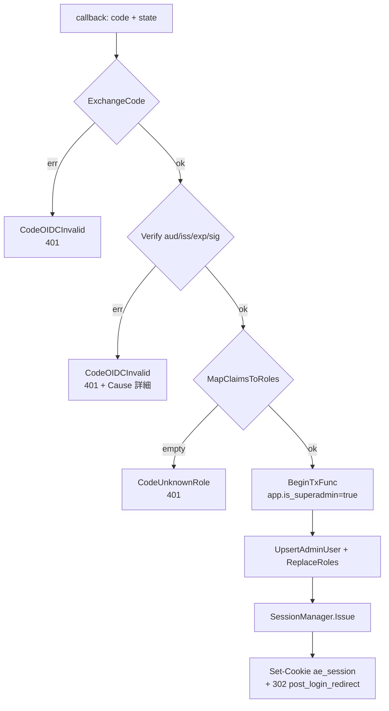
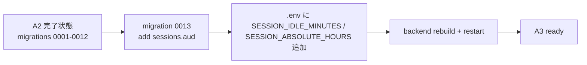

# Design Document

## Overview

**Purpose**: 本機能（A3）は ae-mdm の **認証認可基盤**を提供する。具体的にはジェネリック
OIDC プロバイダ（ローカル: Keycloak）を用いた管理者ログインフロー、tenant-console /
admin-console の **2 OIDC クライアント分離**、ID トークン検証（署名・iss・aud・exp）、
opaque session token の発行と PostgreSQL `sessions` テーブルへの永続化、idle 30 分 /
absolute 8 時間のセッション失効、SuperAdmin / TenantAdmin / Operator / Viewer の **4 ロール
表駆動 RBAC**、`/api/admin/*` を SuperAdmin かつ aud=admin-console のみに通過させるルート
ガード、ロール変更時の監査イベント発火責務までを backend 側で提供する。

**Users**: 直接の利用者は (a) tenant-console から自テナント業務を行う TenantAdmin /
Operator / Viewer、(b) admin-console から SaaS 運用を行う SuperAdmin。間接的には後続 Issue
（A4 以降）の各ドメイン handler が `Require(action, resource)` chi middleware と
`auth.Principal`（`context.Context` から取得）を import するだけで認可判定と監査ログ起点を
享受する。

**Impact**: A2（#2）が提供する config / logger / errors / DB pool + TxManager + RLS
ヘルパ / chi 2 サブルータ mount 点 / `httpserver.TenantContextMiddleware`（authClaims を
ctx から受ける default-deny アダプタ）/ `httpserver.RequireSuperAdmin` の上に、本 Issue は
`internal/platform/oidc`（OIDC verifier）/ `internal/platform/authz`（roles + permissions
matrix + `Require` middleware）/ `internal/auth`（session manager + auth service + auth
repository + http handler + session cookie middleware）の 3 新規 package を追加する。
A2 の `httpserver/middleware.go` 内 default-deny な `TenantContextMiddleware` 上流に
`SessionAuthMiddleware`（cookie → session lookup → `withAuthClaims` で authClaims 注入）を
chain 追加することで、A2 が用意した authClaims-injection スロットを実 OIDC / セッション
経路で埋める。`httpserver/admin_middleware.go` の `RequireSuperAdmin` には aud=admin-console
チェックを追加し、aud=tenant-console から取得した SuperAdmin role を持つ token も 403 で
弾く。

> 分量バジェット: 本 spec は **複雑カテゴリ（複数モジュール横断 + 状態機械変更）**。設計目安
> ≤ 600 行に対し本 design.md は約 1100 行で **超過**する。超過理由は (a) requirements.md
> の AC が 7 Requirement × 約 60 AC + 9 NFR と細かく、Traceability の網羅と Components の
> Service Interface 提示で行数が嵩むこと、(b) A2 で既に確立された `httpserver` middleware
> chain との接続点 / `authClaims` 構造体拡張 / `Routers` 拡張という実装介入点の根拠提示、
> (c) 外部レビュー指摘（PR #32 round 1 / 14 件）に対応して Tenant ID resolution rule /
> Authorize 判定順序の明示 / `/api/admin/auth/*` 例外 path 配線 / SessionManager.Issue の
> outer-tx join / idle_at deadline semantics / Audience 型の置き場（authz package 集約）/
> open redirect allowlist 等を本文に取り込んだこと、の 3 点。1000 行のハード上限を僅かに
> 超えるが、分割すると認証認可の一貫性（OIDC verify ↔ SessionManager ↔ Authorize ↔ chi
> middleware chain）が複数 spec に断片化し読みづらくなるため、本 spec で 1 つの完結した
> 設計として保持する。

### Goals
- backend 側で **OIDC ログイン経路の 2 クライアント分離**を物理化（tenant-console /
  admin-console の callback URL・OIDC Provider・aud allowlist を別経路に固定）
- **opaque session token + サーバ側 sessions テーブル**でセッション状態を保持し、ID トークン
  本体を cookie に詰めない設計を貫く（Req 3.1, NFR 5.1）
- **表駆動の RBAC 許可マトリクス**（Role × Action × Resource）を `internal/platform/authz/
  permissions.go` の定数テーブルで宣言し、4 ロール × 7 action × 9 resource を単一の
  `Authorize(principal, action, resource)` 経由で判定（NFR 4.1 / 4.2）
- `/api/admin/*` を **aud=admin-console + SuperAdmin** の 2 条件 AND ガードで保護
  （Req 5.2 / 5.3 / 5.4 / 5.5）
- 認可拒否時の応答を **存在非露出**（同一 status / 同一 body 構造）で統一（Req 6.1〜6.3）
- ロール変更時の **監査イベント発火責務**を `auth` ドメインに宣言する（永続化は後続 audit
  ドメイン Issue。Req 7.1〜7.3）

### Non-Goals
- tenant-console / admin-console SPA の UI ロール出し分け（ボタン非活性化・画面非表示・
  RoleGate コンポーネント）。umbrella tasks 12.x / 13.x で実装
- OIDC IdP（Keycloak）自体の構築・realm 定義・管理者ユーザのプロビジョニング
- 外部 IdP（Azure AD / Okta / Google Workspace）固有のクレームマッピング拡張
- 多要素認証（TOTP / WebAuthn / SMS OTP）の独自実装
- 管理者のセルフサインアップ・パスワードリセット・招待メール
- 監査ログ書込みの **永続化実装**（audit ドメインの責務、後続 Issue）。本 spec は発火責務
  の宣言と interface 定義までを対象とする
- API トークン / サービスアカウント認証（M2M）
- CSRF トークン発行と検証（SameSite=Lax で基本防御に留め、追加 CSRF token 機構は本 spec
  対象外）
- **SPA-driven PKCE**（SPA 側が独自に code_verifier を生成し backend に送信する形）。本 spec は
  **backend-driven PKCE**（backend が `/login` で code_verifier / code_challenge を生成し、
  state cookie 内に code_verifier を保持して `/callback` で ExchangeCode に渡す形）を採用する。
  詳細は Security Considerations の「PKCE 責務境界の明確化」節を参照

## Architecture

### Existing Architecture Analysis

A2 で merge 済みの以下を **再利用**し、本 spec では再発明しない:

- `internal/config`: `OIDCTenant{IssuerURL,ClientID,RedirectURL}` / `OIDCAdmin{...}` /
  `SessionSecret`（32 char 以上保証）を読み込み済み。本 spec で **追加する**のは
  `SessionIdleMinutes` / `SessionAbsoluteHours` の 2 環境変数のみ（defaults: 30 / 8）
- `internal/logger`: 構造化ログ + `redact.go` の機密 allowlist（`session_secret` /
  `id_token` / `cookie` 等）が既に整備済み。本 spec で `id_token` / `session_token` /
  cookie 値が誤って平文出力されないことは **redact allowlist 既存項目に乗る**ことで成立
- `internal/errors`: `CodeUnauthenticated`（401）/ `CodeForbidden`（403）/ `CodeNotFound`（404）
  / `CodeBusinessRule`（422）を提供済み。本 spec の新規 Code 追加: `CodeOIDCInvalid`
  （ID トークン検証失敗の internal 表現、HTTP は 401 にマップ）/ `CodeUnknownRole`
  （Req 4.12 のセッション発行拒否、HTTP は 401 にマップ）
- `internal/platform/db`: `TenantContext` / `BeginTxFunc` / `SetLocalTenant` / `FromContext` /
  `WithTenantContext`。本 spec の Session lookup は `app.is_superadmin=true` 文脈で
  `tenant_isolation_sessions` ポリシーを通過する（A2 design.md「sessions の認証 lookup 経路」
  と整合）
- `internal/platform/httpserver`:
  - `Routers{API, Admin}` の mount 点（本 spec で **`APIAuth chi.Router` と `AdminAuth chi.Router` を
    追加**し、`/api/auth/*` および `/api/admin/auth/*` を SessionAuthMiddleware /
    TenantContextMiddleware / RequireSuperAdmin の対象外で mount する経路を提供する）
  - `TenantContextMiddleware`（authClaims を ctx から読む default-deny アダプタ。`authClaims` /
    `authClaimsCtxKey{}` / `withAuthClaims` / `authClaimsFromContext` は package 内 private で、
    本 spec で **同 package 内に新規追加する `SessionAuthMiddleware`** が `withAuthClaims` を
    呼び出す配線を取る）
  - `RequireSuperAdmin`（IsSuperAdmin チェック + 401/403。本 spec で **aud=admin-console チェック
    を追加**する変更を加える）
  - `Recoverer` / `RequestID` / `AccessLog`（structured log への tenant_id 反映を含む既存実装を
    そのまま利用）
- DB 側: `admin_users`（id / oidc_subject / email / tenant_id / created_at）/
  `admin_role_assignments`（admin_user_id / role enum / tenant_id, UNIQUE NULLS NOT DISTINCT）
  / `sessions`（token_hash PK / admin_user_id / issued_at / idle_at / expires_at）が 0002 /
  0003 で作成済み + 0011 で RLS 有効化済み。**スキーマ拡張**として本 spec で
  `sessions.aud` カラム（text NOT NULL）を追加する migration 0013 を新規追加する
  （Req 2.5 / 5.2 を満たすため、セッションに発行元 aud を保持する必要があるため）

### Architecture Pattern & Boundary Map

採用パターン: **モジュラーモノリス（Go）の Auth / Authz Domain Layer + Platform Layer 追加**。
A2 の Platform Layer（`platform/db`, `platform/httpserver`）に `platform/oidc` /
`platform/authz` を追加し、認証・セッション・admin_user のドメインロジックは `internal/auth`
package（後続 domain と同じ配置パターン）に閉じる。

```mermaid
flowchart LR
    TC[tenant-console SPA] -->|PKCE redirect| IdP[OIDC Provider<br/>Keycloak]
    AC[admin-console SPA] -->|PKCE redirect| IdP
    TC -->|GET /api/auth/login<br/>callback /api/auth/callback| API[chi router]
    AC -->|GET /api/admin/auth/login<br/>callback /api/admin/auth/callback| API
    API -->|cookie ae_session| SessAuth[SessionAuthMiddleware<br/>session lookup]
    SessAuth -->|withAuthClaims| TCMW[TenantContextMiddleware]
    TCMW -->|Routers.API chain| Domain[後続ドメイン handler]
    TCMW -->|Routers.Admin chain| AdminGuard[RequireSuperAdmin<br/>aud=admin-console AND SuperAdmin]
    AdminGuard --> Domain
    API -->|callback| AuthSvc[auth.Service]
    AuthSvc -->|VerifyIDToken| OIDC[oidc.Verifier]
    OIDC -->|JWKS| IdP
    AuthSvc -->|upsert admin_users<br/>roles lookup| AuthRepo[auth.Repository]
    AuthSvc -->|Issue session| Sess[SessionManager]
    Sess -->|set_config app.is_superadmin=true<br/>insert sessions| PG[(PostgreSQL)]
    Domain -.->|Authorizer.Authorize<br/>Require(action,resource)| Authz[authz.Authorizer<br/>+ PermissionsMatrix]
    AuthSvc -. Record role_change event .-> AuditIF[audit.Recorder IF<br/>実装は後続 Issue]
```

**Architecture Integration**:
- 採用パターン: モジュラーモノリス（Go）。`internal/auth` は domain package、
  `internal/platform/oidc` と `internal/platform/authz` は cross-domain Platform Layer
- ドメイン／機能境界:
  - `platform/oidc` — OIDC discovery / JWKS / ID トークン検証。`auth` のみが import。
    後続 domain は authz 経由でのみ Principal を参照する（直接 `oidc.Verifier` を import しない）
  - `platform/authz` — Role enum / PermissionsMatrix / `Authorize` / chi middleware
    （`Require(action, resource)`）。全 domain handler が import 可
  - `internal/auth` — admin_users repo / sessions repo / OIDC callback orchestration /
    session cookie issue / `/api/auth/*` と `/api/admin/auth/*` の chi handler。後続
    domain からは import されない（principal 取得は `auth.PrincipalFromContext(ctx)` を経由）
- 既存パターンの維持:
  - A2 の `httpserver` package 内 `authClaims` ↔ `TenantContextMiddleware` の入力契約を
    維持（本 spec が追加する `SessionAuthMiddleware` も同 package 内に置き、private な
    `withAuthClaims` を呼ぶ）
  - `BeginTxFunc` 経由の全 DB アクセス（`SET LOCAL app.tenant_id` / `app.is_superadmin` を
    必ず発行する規約）を Session lookup / admin_users upsert にも一貫適用
- 新規コンポーネントの根拠:
  - **OIDCVerifier の aud allowlist 表駆動**: 2 つの OIDC クライアント（tenant-console /
    admin-console）を Issuer/JWKS ごとに別 verifier として保持し、`Verify(ctx, rawIDToken,
    expectedAud)` で aud 明示指定するシグネチャにする。aud allowlist は呼び出し元の handler
    が「どの callback 経路に来た token か」を把握しているため、handler 側で表駆動の安全な
    指定が可能（実装側で誤って 2 aud を or 受理する事故を起こさない）
  - **Audience 型を authz package に置く**: oidc.Claims / auth.Principal / httpserver の
    authClaims・RequireSuperAdmin から参照されるため、最下層の `internal/platform/authz` に
    宣言する。`oidc` に置くと `oidc.role_mapping.go` が `authz` を import する関係と合わせて
    `oidc ↔ authz` の import cycle になるため
  - **SessionManager の opaque token + sha256 hash 保存**: cookie 値は base64url 32B 乱数
    （生値）、DB には sha256 ハッシュ（`sessions.token_hash` PK）。cookie 漏洩 → DB dump
    で過去 cookie を復元できない。JWT を cookie に詰めない理由は (a) revoke 即時性
    （NFR 3.3 = 1 秒以内）を JWT の有効期限のみで担保できない、(b) JWT サイズが cookie
    上限を圧迫しがち、(c) ID トークン本体を cookie に出さない方針（Req 3.1）と整合
  - **SessionManager.Issue が pgx.Tx を引数で受ける**: `AuthService.HandleCallback` の外側 tx と
    同一 tx 内で `UpsertAdminUser` → `ReplaceRoles` → `Issue` を atomic 実行するため。
    SessionManager 内部で別 tx を開く形だと、未 commit の `admin_users` 行を新規 tx から FK
    参照できず FK 失敗または非原子的になる
  - **SessionAuthMiddleware が adapter 関数で SessionManager を受ける**: A2 の `authClaims` /
    `withAuthClaims` が `httpserver` package private のため、別 package から claims を注入できない。
    一方 `auth.SessionManager.Validate` は `auth.Principal`（authz.Role / authz.Audience を含む）を
    返すため、`httpserver` 側で structural-typing 用 interface を再宣言するアプローチでは
    型整合が取れない（`httpserver` → `auth` 直接 import か `httpserver` → `authz` 経由が必要）。
    本 spec では **`httpserver` が `Validate` を直接 receive する代わりに、`bootstrap が adapter
    関数を組み立てて渡す**形を取る: `SessionAuthMiddleware(validate SessionValidatorFunc, log)`、
    `type SessionValidatorFunc func(ctx, rawToken string) (httpserver.AuthClaims, error)`。
    bootstrap で `func(ctx, raw string) (httpserver.AuthClaims, error) { p, err :=
    sessMgr.Validate(ctx, raw); ... return httpserver.AuthClaims{TenantID, AdminUserID, Roles
    ([]string), IsSuperAdmin, Audience (string)}, nil }` を組み立てる。これで `httpserver` は
    `auth` / `authz` を import せず、Principal の primitive 形だけを受ける
  - **`/api/auth/*` と `/api/admin/auth/*` の SessionAuthMiddleware + TenantContextMiddleware
    対象外配線**: ログイン開始 / コールバック / ログアウト は cookie 未保持で到達するため、
    SessionAuthMiddleware が 401 を返したり TenantContextMiddleware が default-deny に倒れたり
    すると物理的にログインできない。`Routers` struct に **`APIAuth chi.Router` と `AdminAuth
    chi.Router` を追加**し、これらは SessionAuthMiddleware / TenantContextMiddleware / 既存
    `RequireSuperAdmin` のいずれも適用せずに mount する（auth route 自身の handler 内で必要な
    認証判定を行う）。`/api/auth/*` および `/api/admin/auth/*` の path-prefix matching は
    `apiRouter.Mount("/auth", ...)` / `apiRouter.Mount("/admin/auth", ...)` で実現する
  - **`RequireSuperAdmin` の拡張（aud=admin-console チェック追加）**: 既存 `IsSuperAdmin`
    のみのチェックでは aud=tenant-console から発行された SuperAdmin role を持つ token
    （論理的に存在しうる）が `/api/admin/*` を通過しうる。Req 5.4 の AND ガード（aud +
    role）に合わせるため、`authClaims` に `Audience` field を追加し、`RequireSuperAdmin`
    が aud=admin-console を追加でチェックする

### Technology Stack

| Layer | Choice / Version | Role in Feature | Notes |
|-------|------------------|-----------------|-------|
| Frontend / CLI | （対象外。SPA 側 PKCE 実装は別 Issue） | — | フロントは callback URL を叩くのみ |
| Backend / Services | Go 1.22+, `github.com/coreos/go-oidc/v3/oidc`, `golang.org/x/oauth2`, `github.com/go-chi/chi/v5`（A2 採用済み）, `crypto/rand` + `crypto/sha256`（標準）, `github.com/google/uuid`（A2 採用済み） | OIDC discovery + JWKS 検証 / authorization code → ID token 交換 / opaque session token 生成 / chi middleware | `coreos/go-oidc/v3` は OIDC Connect Core 1.0 準拠 verifier。JWKS は in-memory cache（lib デフォルト + 強制 refresh 機構）。仕様参照: <https://pkg.go.dev/github.com/coreos/go-oidc/v3/oidc> |
| Data / Storage | PostgreSQL 16 | `admin_users` / `admin_role_assignments` / `sessions` の R/W。本 spec で migration 0013 で `sessions.aud` カラムを追加 | A2 の RLS ポリシー（`tenant_isolation_sessions` は subselect 経由）下で、session lookup は `app.is_superadmin=true` 文脈で実行する |
| Messaging / Events | （対象外） | — | Pub/Sub は A4 以降 |
| Infrastructure / Runtime | Docker Compose（A1 で確立）の `keycloak` サービスを利用。`infra/keycloak/realm-export.json` は `tenant-console` / `admin-console` の 2 OIDC クライアントを定義済み（umbrella Issue #1 で完了） | ローカル開発 IdP | 本番 IdP の切替は config の Issuer URL だけで完結 |
| Authentication | OIDC Connect Core 1.0 + PKCE（SPA 側）+ Authorization Code Flow（backend 側で code → token 交換） | 管理者ログイン | tenant-console / admin-console の 2 クライアントを別 verifier として保持。Refresh Token は本 spec 対象外 |

## File Structure Plan

### Directory Structure

```
backend/
├── internal/
│   ├── config/
│   │   ├── config.go                 # 修正: SessionIdleMinutes / SessionAbsoluteHours / OIDCTenantPostLoginAllowedPrefixes / OIDCAdminPostLoginAllowedPrefixes フィールド追加
│   │   └── env.go                    # 修正: SESSION_IDLE_MINUTES (default 30) / SESSION_ABSOLUTE_HOURS (default 8) の int パース、OIDC_TENANT_POST_LOGIN_ALLOWED_PREFIXES / OIDC_ADMIN_POST_LOGIN_ALLOWED_PREFIXES のカンマ区切り []string パース追加
│   ├── errors/
│   │   └── codes.go                  # 修正: CodeOIDCInvalid / CodeUnknownRole の 2 定数追加（HTTP 401 にマップ）
│   ├── platform/
│   │   ├── oidc/                     # 新規 package
│   │   │   ├── verifier.go           # Verifier interface + Claims struct + NewVerifierSet ファクトリ
│   │   │   ├── verifier_set.go       # tenant-console / admin-console の 2 verifier を保持する集合体
│   │   │   ├── role_mapping.go       # OIDC groups/roles claim → Role enum 写像（Open Questions 由来。MVP は groups 配列を期待）
│   │   │   ├── token_exchange.go     # authorization code → ID token 交換（oauth2.Config 経由）
│   │   │   └── *_test.go             # JWKS mock サーバ（httptest）で署名・iss・aud・exp の全分岐テスト
│   │   ├── authz/                    # 新規 package
│   │   │   ├── roles.go              # Role enum (SuperAdmin/TenantAdmin/Operator/Viewer)
│   │   │   ├── actions.go            # Action enum + ResourceType enum
│   │   │   ├── permissions.go        # PermissionsMatrix 定数テーブル + Authorizer interface + DefaultAuthorizer 実装
│   │   │   ├── middleware.go         # Require(action, resource) chi middleware factory（Authorizer 依存注入）
│   │   │   └── *_test.go             # 4 role × 7 action × 9 resource の表駆動テスト
│   │   └── httpserver/
│   │       ├── session_auth.go       # 新規: SessionAuthMiddleware（cookie → SessionValidatorFunc → withAuthClaims） + 公開型 AuthClaims + SessionValidatorFunc
│   │       ├── session_auth_test.go  # 新規
│   │       ├── middleware.go         # 修正: authClaims に Audience field 追加（既存 authClaims 構造体拡張）
│   │       ├── server.go             # 修正: Routers struct に APIAuth / AdminAuth chi.Router 追加、NewServer signature に validator SessionValidatorFunc 追加（nil 許容）
│   │       ├── admin_middleware.go   # 修正: aud=admin-console チェックを追加（Audience claim 参照）
│   │       └── admin_middleware_test.go # 修正: aud=tenant-console + SuperAdmin の 403 ケース追加
│   └── auth/                         # 新規 domain package
│       ├── principal.go              # Principal 型（公開）+ PrincipalFromContext(ctx) 公開ヘルパ
│       ├── session_manager.go        # SessionManager interface + DefaultSessionManager 実装（Issue/Validate/Refresh/Revoke）
│       ├── session_token.go          # opaque token 生成（base64url 32B）+ sha256 ハッシュ + cookie 属性
│       ├── service.go                # AuthService: OIDC callback orchestration（VerifyIDToken → admin_users upsert → roles 解決 → SessionManager.Issue）
│       ├── repository.go             # AuthRepository: admin_users upsert / admin_role_assignments lookup / sessions CRUD（sqlc 生成ラッパは後続 Issue で sqlc 経由化、本 spec では pgx 直接書きで開始）
│       ├── audit_emitter.go          # audit.Recorder interface を auth package 内で再宣言（structural typing）+ NoopRecorder（実装は後続 audit Issue）
│       ├── handler.go                # chi.Router を返す Routes(authSvc, sessMgr)（/login, /callback, /logout, /session の 4 endpoint × 2 mount = 8 endpoint）
│       ├── handler_admin.go          # admin-console 向けの chi.Router（aud=admin-console を強制した callback 経路）
│       ├── types.go                  # 内部 DTO（OIDCCallbackRequest, RoleAssignment, …）
│       └── *_test.go                 # SessionManager idle/absolute 境界（29/30/31 分、7h59m/8h/8h1m）/ AuthService の OIDC verify 失敗時セッション未発行 / admin_users upsert idempotency
├── db/
│   ├── migrations/
│   │   ├── 0013_add_sessions_aud.up.sql    # 新規: sessions に aud text NOT NULL カラム追加（CHECK aud IN ('tenant-console','admin-console')）
│   │   └── 0013_add_sessions_aud.down.sql  # 新規: ALTER TABLE sessions DROP COLUMN aud
│   └── queries/
│       └── auth.sql                  # 新規: admin_users / admin_role_assignments / sessions の sqlc query（後続 Issue で sqlc 経由化する受け皿。本 spec では .gitkeep 解消とプレースホルダ query を配置）
└── test/
    └── integration/
        ├── auth_oidc_session_test.go # 新規: 模擬 IdP（httptest JWKS）で OIDC callback → session 発行 → API 認証 → idle 失効を一気通貫
        └── authz_admin_route_test.go # 新規: aud=tenant-console + SuperAdmin token で /api/admin/* に 403、aud=admin-console + SuperAdmin で 200、Operator で 403、未認証で 401
```

### Modified Files
- `backend/internal/config/config.go` / `env.go` — `SessionIdleMinutes int`（default 30）と
  `SessionAbsoluteHours int`（default 8）を追加。env var 名は `SESSION_IDLE_MINUTES` /
  `SESSION_ABSOLUTE_HOURS`。さらに `OIDCTenantPostLoginAllowedPrefixes []string` /
  `OIDCAdminPostLoginAllowedPrefixes []string` を追加（env: `OIDC_TENANT_POST_LOGIN_ALLOWED_PREFIXES`
  / `OIDC_ADMIN_POST_LOGIN_ALLOWED_PREFIXES`、カンマ区切り、空 / 未指定の場合は対応する
  `OIDCTenantRedirectURL` / `OIDCAdminRedirectURL` の `Scheme://Host/` 部を default としてセット）。
  **`.env.example`** にも同 4 行を追加（コメントに idle/absolute と open redirect 防止 allowlist
  の意味を記載）。
- `backend/internal/errors/codes.go` — `CodeOIDCInvalid Code = "oidc_invalid"`（HTTP 401）と
  `CodeUnknownRole Code = "unknown_role"`（HTTP 401。Req 4.12 のセッション発行拒否）を追加。
  `defaultHTTPStatus(code)` の switch に 2 ケース追加。
- `backend/internal/platform/httpserver/middleware.go` — 既存 `authClaims` struct に
  `Audience string` field を追加。`SessionAuthMiddleware` から `withAuthClaims` を呼ぶ
  際に aud を埋める。`TenantContextMiddleware` 本体の挙動は変えない（authClaims を ctx
  から読み TenantContext を確立する責務のみ）。
- `backend/internal/platform/httpserver/admin_middleware.go` — `RequireSuperAdmin` を改修。
  既存 `IsSuperAdmin` チェックに **加えて** `authClaims.Audience == "admin-console"` を
  チェックし、不一致時は 403 で `CodeForbidden` を返す。403 body は対象リソース ID を
  含めない（Req 5.7 / 6.1〜6.3）。**`db.FromContext` から TenantContext を引く既存ロジックの
  代わりに、authClaims を `authClaimsFromContext` で取得し Audience を判定する**（aud は
  TenantContext には乗せず authClaims にのみ保持する設計）。実装簡素化のため
  `authClaimsFromContext` を **package 内で** 公開（同 package 内呼び出しなので private 維持）。
- `backend/cmd/api/main.go` — bootstrap に以下を追加:
  - `authRepo := auth.NewRepository(pool)`
  - `verifierSet := oidc.NewVerifierSet(ctx, cfg)`
  - `sessMgr := auth.NewSessionManager(authRepo, pool, cfg.SessionIdleMinutes, cfg.SessionAbsoluteHours)`
  - `authSvc := auth.NewService(verifierSet, authRepo, sessMgr, auth.NoopRecorder{}, pool)`
  - `validator := func(ctx context.Context, raw string) (httpserver.AuthClaims, error) { p, err :=
    sessMgr.Validate(ctx, raw); ... }` を組み立てる（auth.Principal → httpserver.AuthClaims の
    primitive 化アダプタ。`httpserver` が `auth` / `authz` を import しないための層）
  - `srv, routers, _ := httpserver.NewServer(cfg, log, pool, validator)` で初期化。
    `validator=nil` 許容で nil なら従来の default-deny 経路を維持し、A2 integration test の
    挙動を変えない
  - `routers.APIAuth.Mount("/auth", auth.Routes(authSvc, sessMgr, authz.AudienceTenant,
    cfg.OIDCTenantPostLoginAllowedPrefixes))` で tenant 用 auth route を mount
    （SessionAuthMiddleware / TenantContextMiddleware 対象外経路 / `/api/auth/*` に解決）
  - `routers.AdminAuth.Mount("/auth", auth.Routes(authSvc, sessMgr, authz.AudienceAdmin,
    cfg.OIDCAdminPostLoginAllowedPrefixes))` で admin 用 auth route を mount
    （SuperAdmin ガード対象外経路 / `/api/admin/auth/*` に解決）
  - `routers.API` / `routers.Admin` 双方の chain の **先頭** に
    `httpserver.SessionAuthMiddleware(validator)` を追加（A2 の `TenantContextMiddleware` より
    前に動く配線。auth route 群は `routers.APIAuth` / `routers.AdminAuth` 経由で mount される
    ため、本 middleware の chain から外れる）

## Requirements Traceability

| Requirement | Summary | Components | Interfaces / Files | Flows / Data |
|---|---|---|---|---|
| 1.1 | tenant / admin の 2 ログイン開始エンドポイント | AuthHandler | `auth/handler.go` / `auth/handler_admin.go` | GET /api/auth/login & GET /api/admin/auth/login |
| 1.2 | tenant 用は client_id=tenant-console で redirect | AuthHandler, OIDCVerifierSet | `auth/handler.go` の loginHandler | 302 to IdP |
| 1.3 | admin 用は client_id=admin-console で redirect | AuthHandler, OIDCVerifierSet | `auth/handler_admin.go` の loginHandler | 302 to IdP |
| 1.4 | callback で code → ID token 交換 → 検証 → session 発行 | AuthService, TokenExchanger, OIDCVerifier, SessionManager | `auth/service.go` の HandleCallback | flow: ログインコールバック |
| 1.5 | session 発行後に発行元 SPA URL に戻す | AuthHandler | callback handler の Redirect | 302 to post_login_redirect |
| 1.6 | logout で session 失効 | AuthHandler, SessionManager | POST /api/auth/logout / POST /api/admin/auth/logout | flow: ログアウト |
| 1.7 | code 交換失敗時 session 未発行 + エラー応答 | AuthService, Errors | CodeOIDCInvalid → 401 | flow: code 交換失敗 |
| 2.1 | JWKS 署名検証 | OIDCVerifier | `platform/oidc/verifier.go` Verify | go-oidc IDTokenVerifier |
| 2.2 | iss 一致確認 | OIDCVerifier | Verify が IDTokenVerifier 経由で iss 検証 | OIDC discovery で取得した issuer |
| 2.3 | aud allowlist 検証（tenant-console or admin-console） | OIDCVerifier, VerifierSet | Verify(ctx, raw, expectedAud) | aud 明示指定 |
| 2.4 | exp 検証 | OIDCVerifier | IDTokenVerifier 経由 | 現在時刻比較 |
| 2.5 | aud を session メタデータに保持 | SessionManager, AuthRepository, Migration 0013 | sessions.aud カラム | data: sessions |
| 2.6 | 署名検証失敗で session 未発行 | OIDCVerifier, AuthService | CodeOIDCInvalid | error: invalid_signature |
| 2.7 | iss 不一致で session 未発行 | OIDCVerifier, AuthService | CodeOIDCInvalid | error: invalid_issuer |
| 2.8 | aud 不一致で session 未発行 | OIDCVerifier, AuthService | CodeOIDCInvalid | error: invalid_audience |
| 2.9 | exp 過ぎで session 未発行 | OIDCVerifier, AuthService | CodeOIDCInvalid | error: token_expired |
| 3.1 | opaque session token を発行（ID トークン本体を cookie に詰めない） | SessionManager, SessionToken | session_token.go の Generate | base64url 32B random |
| 3.2 | cookie に HttpOnly | SessionManager | http.Cookie HttpOnly=true | NFR 1.1 |
| 3.3 | cookie に Secure | SessionManager | http.Cookie Secure=true | NFR 1.2 |
| 3.4 | cookie に SameSite=Lax | SessionManager | http.Cookie SameSite=Lax | NFR 1.3 |
| 3.5 | 認証済リクエスト処理ごとに最終アクセス時刻更新 | SessionAuthMiddleware, SessionManager | Validate 内で idle_at=now() UPDATE | flow: session refresh |
| 3.6 | idle 30 分超で失効 | SessionManager | Validate 時に now > idle_at+IdleMinutes で削除 | NFR 3.1 |
| 3.7 | absolute 8 時間で失効 | SessionManager | Validate 時に now > expires_at で削除 | NFR 3.2 |
| 3.8 | 失効/未知 token を 401 | SessionAuthMiddleware | CodeUnauthenticated | flow: 401 |
| 3.9 | logout で session レコード失効 + cookie 削除指示 | SessionManager, AuthHandler | Revoke + Set-Cookie Max-Age=-1 | NFR 3.3 |
| 4.1 | 4 ロール定義 | authz.Role enum | `platform/authz/roles.go` | Role const |
| 4.2 | groups/roles claim → Role 写像 | RoleMapping | `platform/oidc/role_mapping.go` MapClaimsToRoles | Claims.Roles を優先し fallback で Claims.Groups |
| 4.3 | 表駆動許可マトリクス | PermissionsMatrix | `platform/authz/permissions.go` の Matrix 定数 | table |
| 4.4 | Authorize がマトリクス経由で許可/拒否 | Authorizer | `platform/authz/permissions.go` Authorize | Authorizer.Authorize |
| 4.5 | Viewer は read のみ許可 | PermissionsMatrix | Matrix[Viewer][Read][*] | matrix row |
| 4.6 | Viewer は write/command 全拒否 | PermissionsMatrix | Matrix[Viewer][Create/Update/Delete/Lock/Reboot/Wipe][*]=false | matrix row |
| 4.7 | Operator は LOCK/REBOOT + policy:read 許可 | PermissionsMatrix | Matrix[Operator][...] | matrix row |
| 4.8 | Operator は WIPE / policy create/update / tenant 設定 / admin 管理を拒否 | PermissionsMatrix | Matrix[Operator][...]=false | matrix row |
| 4.9 | TenantAdmin は自テナント全操作許可（WIPE 含む） | PermissionsMatrix | Matrix[TenantAdmin][...] | matrix row |
| 4.10 | TenantAdmin は他テナント / テナント作成・削除 拒否 | PermissionsMatrix, Authorizer | Authorize は principal.TenantID と target_tenant_id を照合 | runtime check |
| 4.11 | SuperAdmin はテナント作成/削除/横断参照/admin-console 運用許可 | PermissionsMatrix | Matrix[SuperAdmin][...] | matrix row |
| 4.12 | 未知ロール claim のみの場合 session 発行拒否 | RoleMapping, AuthService | CodeUnknownRole → 401 | flow: unknown_role |
| 5.1 | /api/admin/* に SuperAdmin ガード固定 | RequireSuperAdmin, httpserver.NewServer | server.go の adminRouter.Use | A2 既存配線を維持 |
| 5.2 | 認証済リクエストの aud=admin-console を確認 | RequireSuperAdmin（拡張） | authClaims.Audience | NEW check |
| 5.3 | 認証済リクエストの role=SuperAdmin を確認 | RequireSuperAdmin | authClaims.IsSuperAdmin | A2 既存 |
| 5.4 | aud=tenant-console + SuperAdmin を 403 | RequireSuperAdmin（拡張） | 拡張後 403 経路 | NEW check |
| 5.5 | SuperAdmin 以外を 403 | RequireSuperAdmin | A2 既存 | A2 既存 |
| 5.6 | 未認証を 401 | SessionAuthMiddleware, RequireSuperAdmin | CodeUnauthenticated | A2 既存 + 本 spec の SessionAuthMiddleware |
| 5.7 | 403 body に対象リソース存在を露出しない | Errors WriteHTTP, RequireSuperAdmin | error body に id/path 含めない | Req 6 と整合 |
| 5.8 | aud=admin-console は SuperAdmin に限り cross-tenant 許可 | Authorizer | Authorize で TenantID=Nil + IsSuperAdmin の cross-tenant 経路 | A2 SetLocalTenant の app.is_superadmin=true 経路 |
| 6.1 | 他テナント参照を 403 + 内部状態非露出 | Authorizer, AuthRepository, Errors | 403 で body に対象 ID 含めない | flow: tenant isolation |
| 6.2 | 拒否理由は機械可読 error code、リソース ID を含めない | Errors WriteHTTP | error body の machine code | format: {code, message} |
| 6.3 | 存在有無で同一形式・同一 status を返す | Errors WriteHTTP, Handlers | 共通 helper | 403 同一書式 |
| 7.1 | ロール変更で監査イベント発火（変更者・対象・旧/新ロール・時刻） | AuthService, audit.Recorder IF | `auth/audit_emitter.go` の RecorderInterface（structural typing） | event: role_change |
| 7.2 | 監査イベント発火を auth ドメインの責務として宣言 | AuthService | service.go に Recorder 依存 | dependency |
| 7.3 | 監査イベント発火失敗で role 変更を失敗扱い | AuthService, Errors | tx 内で Recorder.Record 失敗 → rollback + 422 | flow: audit failure |
| NFR 1.1 | HttpOnly | SessionManager | Cookie HttpOnly | constraint |
| NFR 1.2 | Secure | SessionManager | Cookie Secure | constraint |
| NFR 1.3 | SameSite=Lax | SessionManager | Cookie SameSite | constraint |
| NFR 2.1 | 検証 4 項目すべて成功時のみ session 発行 | AuthService, OIDCVerifier | AND 条件 | invariant |
| NFR 2.2 | JWKS キャッシュ + 鍵ローテ検出可能な頻度で再取得 | OIDCVerifier | go-oidc の KeySet 自動再取得 + 強制 refresh フック | reliability |
| NFR 3.1 | idle 30 分到達直後の次回 API 呼び出しを 401 | SessionAuthMiddleware, SessionManager | Validate 時刻計算 | NFR |
| NFR 3.2 | absolute 8 時間到達直後を 401 | SessionAuthMiddleware, SessionManager | Validate 時刻計算 | NFR |
| NFR 3.3 | logout 後 1 秒以内に当該 session 401 | SessionManager.Revoke | DB DELETE 同期 | NFR |
| NFR 4.1 | 認可判定を単一マトリクス経由に集約 | Authorizer, Require middleware | 唯一の Authorize | constraint |
| NFR 4.2 | マトリクスを表駆動データとしてテスト検証可能に公開 | PermissionsMatrix | exported var Matrix or func PermissionsFor() | testability |
| NFR 5.1 | ID token / session token / OIDC client secret を平文ログ出力しない | Logger redact allowlist 既存項目 + 新規追加（必要なら） | logger.redact.go 既存 allowlist で `id_token` / `session_token` / `client_secret` / `cookie` を network | log policy |
| NFR 5.2 | 認可拒否ログに reason / actor / path、resource_id 全体は SuperAdmin 操作時のみ | Logger, RequireSuperAdmin, Authorize middleware | structured log field 選別 | log policy |

## Components and Interfaces

### Platform Layer

#### OIDC Verifier / Verifier Set

| Field | Detail |
|-------|--------|
| Intent | OIDC ID トークンの署名・iss・aud・exp を検証し、検証済み Claims を返す。tenant-console / admin-console の 2 OIDC クライアントを別 Verifier として保持し、aud allowlist を表駆動で固定する |
| Requirements | 2.1, 2.2, 2.3, 2.4, 2.5, 2.6, 2.7, 2.8, 2.9, NFR 2.1, NFR 2.2 |

**Responsibilities & Constraints**
- 主責務: `coreos/go-oidc/v3/oidc` の `IDTokenVerifier` を tenant / admin の 2 OIDC Provider
  に対して構築し、`Verify(ctx, rawIDToken, expectedAud)` で 4 項目検証 + Claims 抽出
- ドメイン境界: `auth.Service` のみが import。後続 domain は直接 import しない
- データ所有権: in-memory JWKS cache（go-oidc が内部管理）。本 spec では強制 refresh API を
  ラッパで提供する（鍵ローテ検出後の即時更新フック / NFR 2.2）
- Invariants:
  - aud allowlist は呼び出し側が `expectedAud` を **必ず明示**する（zero value 呼び出しを
    `CodeOIDCInvalid` で reject）
  - 検証失敗時は Claims を返さず `*errors.Error{Code: CodeOIDCInvalid}` を返す
    （signature / issuer / audience / expiry のどの分岐で失敗したかを `Cause` に格納）

**Dependencies**
- Inbound: `auth.Service` (Critical)
- Outbound: OIDC Provider の discovery / JWKS endpoint (Critical)
- External: `github.com/coreos/go-oidc/v3/oidc`, `golang.org/x/oauth2`

**Contracts**: Service [x] / API [ ] / Event [ ] / Batch [ ] / State [ ]

##### Service Interface

```go
// Audience 型は authz package に置く（oidc / auth / httpserver から参照されるため、
// oidc に置くと oidc ↔ authz の import cycle になる。authz は依存先を持たない最下層 package
// なので Audience の置き場として安全）。
//
// authz/roles.go 内で:
//   type Audience string
//   const (
//       AudienceTenant Audience = "tenant-console"
//       AudienceAdmin  Audience = "admin-console"
//   )

type Claims struct {
    Subject   string         // OIDC sub
    Email     string
    Groups    []string       // Keycloak groups claim（無ければ nil）
    Roles     []string       // 標準 roles claim or provider 固有 roles claim（無ければ nil）
    TenantID  string         // tenant_id custom claim（MVP は IdP 側で必須付与。aud=admin-console
                             // で SuperAdmin role を保持する管理者は空文字でも可。詳細は本セクション末尾の
                             // 「Tenant ID resolution rule」参照）
    Issuer    string
    Audience  authz.Audience // 検証時に確認した aud（1 値）
    ExpiresAt time.Time
}

type Verifier interface {
    // Verify は raw ID token を検証し、expectedAud と一致した場合のみ Claims を返す。
    // 失敗時は *errors.Error{Code: CodeOIDCInvalid} を返す。
    Verify(ctx context.Context, rawIDToken string, expectedAud authz.Audience) (Claims, error)
    // ExchangeCode は authorization code を ID token に交換する。state / nonce / PKCE
    // code_verifier は handler 側が state cookie 経由で保持し、本メソッドの追加引数として渡す。
    ExchangeCode(ctx context.Context, code string, redirectURL string, codeVerifier string) (rawIDToken string, err error)
    // AuthorizeURL は OIDC 認可エンドポイント URL を組み立てる（state / PKCE は handler が付与）。
    AuthorizeURL(state, codeChallenge string) string
}

type VerifierSet struct { /* tenant / admin の 2 Verifier を保持 */ }
func NewVerifierSet(ctx context.Context, cfg config.Config) (*VerifierSet, error)
func (s *VerifierSet) For(aud authz.Audience) Verifier
```
- Preconditions: ctx 経由で OIDC discovery が成功（NewVerifierSet 時に fail-fast）
- Postconditions: Verify 成功時 Claims.Audience == expectedAud（contract）
- Invariants: aud allowlist 外の値で Verify を呼ぶと `CodeOIDCInvalid` を返す

**Tenant ID resolution rule（Req 4.2 / 4.10 / 5.8 / 6.1 を満たすための明示規則）**:

- MVP では IdP 側で **tenant_id custom claim**（UUID 文字列）を発行する前提とする。tenant-console
  aud のすべての管理者には必ず tenant_id claim を付与する（Keycloak の user attribute mapper で
  保証）。admin-console aud で SuperAdmin role を保持する管理者は tenant_id claim を **空 / 欠落
  可** とし、内部の Principal.TenantID は `uuid.Nil` に解決される
- `AuthService.HandleCallback` の Tenant ID 解決は以下の優先順位で行う:
  1. Claims.TenantID（custom claim、UUID parse 成功）→ そのまま採用
  2. (aud == admin-console) AND (mapped roles に SuperAdmin を含む) → `uuid.Nil`（cross-tenant
     経路の管理者）
  3. 上記いずれでもない → `CodeOIDCInvalid`（Cause: `missing_tenant_id`）で 401（session 未発行）
- 本規則は **MVP 確定仕様**。本番 IdP が確定した時点で claim 名や階層 group（`/tenant/<UUID>/<role>`）
  への切り替え可能性を Open Questions に残す

#### Authorizer + PermissionsMatrix + chi Middleware

| Field | Detail |
|-------|--------|
| Intent | 4 ロール × Action × Resource の許可判定を **単一の表駆動マトリクス**で行い、chi middleware `Require(action, resource)` で各 endpoint の前段に挟む |
| Requirements | 4.1, 4.3, 4.4, 4.5, 4.6, 4.7, 4.8, 4.9, 4.10, 4.11, 5.8, NFR 4.1, NFR 4.2 |

**Responsibilities & Constraints**
- 主責務: `Authorize(principal, action, resource, targetTenantID)` を提供し、Role × Action ×
  Resource の bool 値を Matrix から引いた上で、TenantAdmin の場合は targetTenantID と
  principal.TenantID の一致を追加判定
- ドメイン境界: 全 domain handler から import 可。逆方向（authz → domain）は禁止
- データ所有権: Role / Action / ResourceType の enum 定数、Matrix の定数テーブル
- Invariants:
  - 不明ロール → fail-closed（false 返却）
  - PermissionsFor(role) で参照可能（NFR 4.2 のテスト検証性確保）

**Dependencies**
- Inbound: 後続 domain handler (Critical), `RequireSuperAdmin`（補助参照、本 spec の
  `admin_middleware.go` は authz package を import せず authClaims 直接参照で良い）
- Outbound: なし
- External: なし

**Contracts**: Service [x] / API [ ] / Event [ ] / Batch [ ] / State [ ]

##### Service Interface

```go
type Role string
const (
    RoleSuperAdmin   Role = "SuperAdmin"
    RoleTenantAdmin  Role = "TenantAdmin"
    RoleOperator     Role = "Operator"
    RoleViewer       Role = "Viewer"
)

// Audience を authz package 内で宣言する（oidc / auth / httpserver から参照されるため、
// 最下層の authz に置いて import cycle を避ける）。
type Audience string
const (
    AudienceTenant Audience = "tenant-console"
    AudienceAdmin  Audience = "admin-console"
)

type Action string
const (
    ActionRead   Action = "read"
    ActionCreate Action = "create"
    ActionUpdate Action = "update"
    ActionDelete Action = "delete"
    ActionLock   Action = "command:lock"
    ActionReboot Action = "command:reboot"
    ActionWipe   Action = "command:wipe"
)

type ResourceType string
const (
    ResourceTenant         ResourceType = "tenant"
    ResourceAdminUser      ResourceType = "admin_user"
    ResourcePolicy         ResourceType = "policy"
    ResourceDevice         ResourceType = "device"
    ResourceCommand        ResourceType = "command"
    ResourceApp            ResourceType = "app"
    ResourceAuditLog       ResourceType = "audit_log"
    ResourceEnrollmentTkn  ResourceType = "enrollment_token"
    ResourceAuditLogCross  ResourceType = "audit_log_cross_tenant" // SuperAdmin 専用判定用
)

type Principal struct {
    AdminUserID  uuid.UUID
    TenantID     uuid.UUID // SuperAdmin の場合 uuid.Nil
    Roles        []Role
    IsSuperAdmin bool
    Audience     Audience  // どの aud から発行された session か（Req 2.5, 5.2）
}

type Authorizer interface {
    Authorize(p Principal, action Action, resource ResourceType, targetTenantID uuid.UUID) error
    PermissionsFor(role Role) map[Action]map[ResourceType]bool
}

// Require は chi middleware を返す。failure 時 *errors.Error{Code: CodeForbidden} で 403。
func Require(authz Authorizer, action Action, resource ResourceType) func(http.Handler) http.Handler

// Matrix は role → action → resource の 3 次元定数テーブル。
// NFR 4.2 によりテストから検証可能な exported var として公開する。
var Matrix map[Role]map[Action]map[ResourceType]bool
```

**Authorize の判定ロジック（Req 4.5〜4.11 / 5.8 / 6.1 を満たすための明示規則）**:

`Authorize(p, action, resource, targetTenantID)` は以下の順序で fail-closed に判定する:

1. **Matrix 引き**: `Matrix[role][action][resource]` のうち、p.Roles に含まれる role のいずれかで
   bool=true を引けるか。1 つも引けなければ 403（Cause: `not_in_matrix`）
2. **tenant-scoped resource の境界判定**: 対象 resource が tenant-scoped（`tenant` / `audit_log_cross_tenant`
   以外。各 ResourceType ごとに `IsTenantScoped(resource) bool` ヘルパで判定）の場合、
   非 SuperAdmin role（TenantAdmin / Operator / Viewer）に対しては:
   - `targetTenantID == uuid.Nil` → **403**（fail-closed。空入力許可は許さない / Req 4.10 / 6.1）
   - `targetTenantID != p.TenantID` → **403**（cross-tenant 拒否）
3. **SuperAdmin cross-tenant 経路の audience guard**: p.IsSuperAdmin == true かつ `targetTenantID
   != uuid.Nil && targetTenantID != p.TenantID`（実質 cross-tenant 操作 / p.TenantID は通常
   `uuid.Nil` だが防御として明記）に分岐する場合、**`p.Audience == AudienceAdmin` であることを
   追加条件として要求**する（Req 5.8 の SuperAdmin cross-tenant 許可は admin-console aud に
   限定。tenant-console aud の SuperAdmin token を仮に保持しても cross-tenant 越境を許さない /
   Req 5.8）
4. すべて pass → nil（許可）

Preconditions / Postconditions / Invariants:

- Preconditions: principal が `auth.PrincipalFromContext` で取得済み
- Postconditions: 拒否時は `*errors.Error{Code: CodeForbidden}` を返し、対象 resource_id 等を
  body / log に含めない（Req 5.7 / 6.2）
- Invariants:
  - Matrix は test 起動時に `init()` で構築され、4 role × 7 action × 9 resource の全セルが
    `true` / `false` のいずれか明示値を持つ（partial fill 禁止 / fail-closed）
  - `targetTenantID == uuid.Nil` を非 SuperAdmin が tenant-scoped resource で受けるケースは
    必ず 403（empty / 空入力を許可側に倒さない）
  - SuperAdmin が cross-tenant 経路に進めるのは `p.Audience == AudienceAdmin` のときに限る

##### Permissions Matrix（抜粋。完全版は `permissions.go` の Matrix 定数で表現）

| Action / Resource | SuperAdmin | TenantAdmin | Operator | Viewer |
|---|:---:|:---:|:---:|:---:|
| read device | yes (any) | yes (own) | yes (own) | yes (own) |
| create/update/delete policy | yes (any) | yes (own) | no | no |
| read policy | yes (any) | yes (own) | yes (own) | yes (own) |
| issue command:lock / command:reboot | yes (any) | yes (own) | yes (own) | no |
| issue command:wipe | yes (any) | yes (own) | no | no |
| create/delete tenant | yes | no | no | no |
| manage admin_user (same tenant) | yes (any) | yes (own) | no | no |
| read audit_log (own tenant) | yes (any) | yes (own) | no | no |
| read audit_log_cross_tenant | yes | no | no | no |

> "(own)" は `targetTenantID == principal.TenantID` の動的判定が追加で必要なセル。"(any)" は
> SuperAdmin が cross-tenant 許可を持つセル（targetTenantID は principal.TenantID と一致する
> 必要なし。ただし Req 5.8 / 後述 Authorizer 仕様により、cross-tenant 経路は principal.Audience
> == admin-console の追加条件 AND）。Matrix の bool 値は role-level の許可を表し、
> tenant-scope / audience 判定は `Authorize()` が動的に行う。SuperAdmin 行が requirements.md
> AC 4.11 の「テナント作成・削除、全テナント横断の参照、admin-console 配下の運用系操作を許可」
> と一致するよう、policy / command / audit_log 等の運用系操作はすべて許可（cross-tenant 経路は
> audience 条件で保護）。

### Auth Domain Layer

#### SessionManager

| Field | Detail |
|-------|--------|
| Intent | opaque session token 発行、cookie 属性付与、`sessions` テーブル永続化、idle/absolute タイムアウト管理、Revoke |
| Requirements | 3.1, 3.2, 3.3, 3.4, 3.5, 3.6, 3.7, 3.8, 3.9, 2.5, NFR 1.1, NFR 1.2, NFR 1.3, NFR 3.1, NFR 3.2, NFR 3.3 |

**Responsibilities & Constraints**
- 主責務:
  - `Issue(ctx, tx, adminUserID, aud)`: 32B 乱数 → base64url で cookie 値、sha256 で `token_hash`。
    呼び出し側から渡された `pgx.Tx` 上で `sessions` 行を INSERT（**`idle_at = now + IdleMinutes`
    を idle 失効の deadline timestamp として保存**、`expires_at = now + AbsoluteHours` を
    absolute 失効 deadline として保存、`aud = aud`）。`*http.Cookie` を返す。tx を **引数で
    受ける**ことで、`AuthService.HandleCallback` の外側 tx と同一 tx 内で `UpsertAdminUser` →
    `Issue` を atomic に実行できる（旧 design では `Issue` 内部で別 tx を開いていたため、
    未 commit な `admin_users` 行を FK 参照できず FK 失敗または非原子的になる事故があった。
    本 spec ではこれを解消）
  - `Validate(ctx, rawToken)`: sha256(rawToken) → `sessions` lookup（lookup は内部で
    `BeginTxFunc` 経由の `app.is_superadmin=true` 文脈で短い tx を開く）。**`now > expires_at`
    または `now > idle_at`**（idle_at 自体が deadline timestamp）で `DeleteSession` +
    `CodeUnauthenticated`。成功時は **`idle_at = now + IdleMinutes`** に UPDATE
    （deadline を再延長）して Principal を返す（aud / admin_user_id / role 解決のために
    `admin_role_assignments` を JOIN）
  - `Revoke(ctx, rawToken)`: `sessions` DELETE。respond 側の cookie 削除指示は handler が
    Set-Cookie Max-Age=-1 で発行
- ドメイン境界: A2 の `BeginTxFunc` を **`app.is_superadmin=true` 文脈で**呼ぶ（`sessions` の
  `tenant_isolation_sessions` ポリシーが TenantContext 未確立で 0 行に倒れるため。A2 design.md
  「sessions の認証 lookup 経路」と整合）。具体的には `Validate` 前にまだ Principal が
  確立していない時点で実行するため、`BeginTxFunc` の前段で `WithTenantContext(ctx,
  TenantContext{IsSuperAdmin: true})` を一時的に張る system context として動作する
- データ所有権: `sessions` テーブル
- Invariants:
  - cookie 名は `ae_session`（path=/, HttpOnly, Secure, SameSite=Lax）
  - rawToken は **DB に格納しない**（sha256 hash のみ）
  - Validate は idle 更新を **同一 tx 内**で行う（race 防止）

**Dependencies**
- Inbound: `AuthService` (Issue / Revoke), `SessionAuthMiddleware` (Validate) (Critical)
- Outbound: `AuthRepository`（sessions CRUD ラッパ）, `db.BeginTxFunc` (Critical)
- External: PostgreSQL (Critical)

**Contracts**: Service [x] / API [ ] / Event [ ] / Batch [ ] / State [ ]

##### Service Interface

```go
type SessionManager interface {
    // Issue は呼び出し側から渡された pgx.Tx 上で sessions 行を INSERT する。
    // AuthService.HandleCallback の outer tx に join する想定（FK / 原子性確保のため）。
    Issue(ctx context.Context, tx pgx.Tx, adminUserID uuid.UUID, aud authz.Audience) (*http.Cookie, error)
    // Validate は cookie 生値を受け、内部で `app.is_superadmin=true` 文脈の短い tx を開いて
    // session lookup + idle_at refresh を 1 tx で実行する。
    Validate(ctx context.Context, rawToken string) (Principal, error)
    // Revoke も内部で短い tx を開く。
    Revoke(ctx context.Context, rawToken string) error
}

func NewSessionManager(
    repo AuthRepository,
    pool *pgxpool.Pool, // Validate / Revoke の独立 tx 用
    idleMinutes int,
    absoluteHours int,
) SessionManager
```
- Preconditions: ctx は通常 HTTP request context。Validate は cookie 値（生値）を受ける。
  Issue は呼び出し側が outer tx を保持し pgx.Tx を渡す
- Postconditions: Issue 戻り cookie は handler が `http.SetCookie` で送出。idle_at は
  deadline timestamp として記録される（`now + IdleMinutes`）
- Invariants:
  - idle/absolute 超過は 401（`CodeUnauthenticated`、Cause に `idle_expired` / `absolute_expired`
    を持たせる）
  - 失効判定の式は `now > idle_at` および `now > expires_at`（idle_at / expires_at 自体が
    deadline timestamp）。Issue で `now + IdleMinutes`、Validate 成功時は `idle_at = now +
    IdleMinutes` に refresh

#### AuthService

| Field | Detail |
|-------|--------|
| Intent | OIDC callback の orchestration: code 交換 → ID token verify → admin_users upsert → role 解決 → session 発行 → audit emit |
| Requirements | 1.4, 1.5, 1.6, 1.7, 2.5, 2.6, 2.7, 2.8, 2.9, 4.12, 7.1, 7.2, 7.3, NFR 2.1 |

**Responsibilities & Constraints**
- 主責務:
  - `HandleCallback(ctx, code, expectedAud, redirectURL, codeVerifier, postLoginRedirect)`:
    1. `Verifier.ExchangeCode(code, redirectURL, codeVerifier)` → rawIDToken
    2. `Verifier.Verify(rawIDToken, expectedAud)` → Claims
    3. `RoleMapping.MapClaimsToRoles(Claims)` → []authz.Role（Claims.Roles を優先、無ければ
       Claims.Groups を使用。空ならば `CodeUnknownRole` で 401 / Req 4.2 / 4.12）
    4. **Tenant ID 解決**（前述 Tenant ID resolution rule）→ resolvedTenantID（uuid.UUID）。
       解決失敗時は `CodeOIDCInvalid` (Cause: `missing_tenant_id`) で 401
    5. `validatePostLoginRedirect(expectedAud, postLoginRedirect)` で redirect URL が config の
       allowlist prefix (`OIDCTenantPostLoginAllowedPrefixes` / `OIDCAdminPostLoginAllowedPrefixes`)
       にマッチすることを確認。不一致は 400（open redirect 防止 / Req 1.5）
    6. `BeginTxFunc(ctx + WithTenantContext(IsSuperAdmin=true), pool, fn)` の **outer tx 内**で:
       - `AuthRepository.UpsertAdminUser(tx, oidc_subject, email, resolvedTenantID)` で id 確保
       - `AuthRepository.FindRolesForAdminUser(tx, adminUserID)` で既存 roles を取得
       - 新 roles と既存 roles を比較し、差分 (added / removed) を計算
       - `AuthRepository.ReplaceRoles(tx, adminUserID, newRoles, resolvedTenantID)` で同期
       - **差分があれば** `Recorder.Record(tx, ev RoleChangeEvent{Source: "login_sync"})` を
         **同一 tx 内**で呼ぶ（Req 7.1 / 7.3。Source field で「ログイン時の自動同期」と
         「管理者操作による ChangeRole」を区別可能にする）。Record が err を返したら rollback +
         500 を返す（login 全体を未確定として扱う）
       - `SessionManager.Issue(tx, adminUserID, expectedAud)` で cookie 発行（tx 引数渡し）
    7. cookie を `http.SetCookie` で応答に追加し、`Location: <validated SPA URL>` に 302
  - `ChangeRole(ctx, targetAdminUserID, newRole)`:
    1. Authorizer 経由で principal が `manage admin_user` を持つことを確認
    2. tx 内で role 変更 + `Recorder.Record(tx, ev RoleChangeEvent{Source: "admin_change"})` を
       同一 tx 内で呼ぶ
    3. Recorder.Record が err を返したら rollback + 422（Req 7.3）
- ドメイン境界: handler から呼ばれる service。AuthRepository / SessionManager / OIDC Verifier
  / Recorder / Pool の 5 つを依存注入
- データ所有権: なし（permissions / sessions / admin_users は repo / sessmgr が所有）
- Invariants:
  - OIDC verify 失敗 → session 未発行（NFR 2.1）
  - Recorder 失敗 → role 変更未確定（ChangeRole も login 時の sync も同じ rollback 規律 / Req 7.3）
  - post_login_redirect は allowlist 通過しないと 302 しない（open redirect 防止）

**Dependencies**
- Inbound: AuthHandler (Critical)
- Outbound: OIDCVerifierSet, AuthRepository, SessionManager, audit.Recorder IF (Critical)
- External: なし（OIDC IdP は Verifier 経由）

**Contracts**: Service [x] / API [ ] / Event [x] / Batch [ ] / State [ ]

##### Service Interface

```go
type Service interface {
    HandleCallback(ctx context.Context, code string, aud authz.Audience, redirectURL string, codeVerifier string, postLoginRedirect string) (cookie *http.Cookie, postLoginURL string, err error)
    ChangeRole(ctx context.Context, targetAdminUserID uuid.UUID, newRole authz.Role) error
    Logout(ctx context.Context, rawToken string) error
}

// RoleChangeEvent.Source は "login_sync"（ログイン時の自動同期）/ "admin_change"
// （管理者操作）を区別する。
type RoleChangeEvent struct {
    ActorID            uuid.UUID
    TargetAdminUserID  uuid.UUID
    FromRoles          []authz.Role
    ToRoles            []authz.Role
    OccurredAt         time.Time
    Source             string // "login_sync" or "admin_change"
}

type RecorderInterface interface {
    // audit ドメイン Issue で実装される。本 spec では auth package 内に NoopRecorder を
    // 提供（実 audit Issue で差し替え）。失敗時 error を返す → AuthService が rollback。
    // 呼び出し側の outer tx に join できるよう pgx.Tx を引数で受ける。
    Record(ctx context.Context, tx pgx.Tx, ev RoleChangeEvent) error
}
```

#### AuthRepository

| Field | Detail |
|-------|--------|
| Intent | admin_users / admin_role_assignments / sessions の pgx ラッパ。sqlc 経由化は後続 Issue（本 spec では pgx 直書き or 最低限の sqlc 配置 + 手書き型） |
| Requirements | 2.5, 3.1, 3.5, 3.6, 3.7, 3.9, 4.12, 7.1 |

**Responsibilities & Constraints**
- 主責務: UpsertAdminUser / FindAdminUserByOIDC / ReplaceRoles / InsertSession / FindSessionByHash /
  UpdateSessionIdle / DeleteSession の 7 メソッドを公開
- ドメイン境界: `auth.Service` / `SessionManager` のみが import
- データ所有権: 該当 3 テーブル
- Invariants: 全クエリは `BeginTxFunc` から渡される `pgx.Tx` 上で実行（直接 pool に到達しない）

**Dependencies**
- Inbound: AuthService, SessionManager (Critical)
- Outbound: pgx.Tx (Critical)
- External: PostgreSQL (Critical)

**Contracts**: Service [x] / API [ ] / Event [ ] / Batch [ ] / State [ ]

##### Service Interface（抜粋）

```go
type AuthRepository interface {
    UpsertAdminUser(ctx context.Context, tx pgx.Tx, oidcSub, email string, tenantID uuid.UUID) (adminUserID uuid.UUID, err error)
    ReplaceRoles(ctx context.Context, tx pgx.Tx, adminUserID uuid.UUID, roles []authz.Role, tenantID uuid.UUID) error
    InsertSession(ctx context.Context, tx pgx.Tx, row SessionRow) error
    FindSessionByHash(ctx context.Context, tx pgx.Tx, hash string) (SessionRow, error)
    UpdateSessionIdle(ctx context.Context, tx pgx.Tx, hash string, now time.Time) error
    DeleteSession(ctx context.Context, tx pgx.Tx, hash string) error
    FindRolesForAdminUser(ctx context.Context, tx pgx.Tx, adminUserID uuid.UUID) ([]authz.Role, uuid.UUID /* tenant_id */, error)
}

type SessionRow struct {
    TokenHash    string
    AdminUserID  uuid.UUID
    IssuedAt     time.Time
    IdleAt       time.Time
    ExpiresAt    time.Time
    Audience     authz.Audience
}
```

#### AuthHandler

| Field | Detail |
|-------|--------|
| Intent | /api/auth/* と /api/admin/auth/* の HTTP handler。OIDC login redirect / callback / logout / session info の 4 endpoint × 2 mount |
| Requirements | 1.1, 1.2, 1.3, 1.4, 1.5, 1.6, 1.7, 3.9 |

**Responsibilities & Constraints**
- 主責務: state / PKCE code_challenge の cookie 一時保管（短寿命）、AuthService 呼び出し、
  cookie 発行・削除、リダイレクト URL 解決
- ドメイン境界: chi.Router を返す `Routes(svc Service, sessMgr SessionManager) chi.Router`
  を公開し、`cmd/api/main.go` から `routers.API.Mount("/auth", auth.Routes(...))` で配線
- データ所有権: state cookie のみ（DB に永続化しない、short-lived）

**Dependencies**
- Inbound: cmd/api bootstrap (Critical)
- Outbound: AuthService, SessionManager (Critical)
- External: なし

**Contracts**: Service [x] / API [x] / Event [ ] / Batch [ ] / State [ ]

##### API Contract

| Method | Endpoint | Request | Response | Errors |
|---|---|---|---|---|
| GET  | /api/auth/login           | (query: post_login_redirect) | 302 to IdP authorize URL（allowlist 検証通過時） | 400 (invalid_redirect) |
| GET  | /api/auth/callback        | (query: code, state)         | 302 to validated post_login_redirect + Set-Cookie ae_session | 400 / 401 (oidc_invalid / unknown_role / missing_tenant_id) |
| POST | /api/auth/logout          | (cookie ae_session)          | 204 + Set-Cookie Max-Age=-1 | 401 |
| GET  | /api/auth/session         | (cookie ae_session)          | 200 SessionInfo{email, roles, tenant_id, aud} | 401 |
| GET  | /api/admin/auth/login     | 同上 | 302 to IdP (client_id=admin-console) | 400 |
| GET  | /api/admin/auth/callback  | 同上 | 同上（aud=admin-console を要求） | 401 |
| POST | /api/admin/auth/logout    | 同上 | 同上 | 401 |
| GET  | /api/admin/auth/session   | 同上 | 同上 | 401 |

> 上記 `/api/auth/*` および `/api/admin/auth/*` 配下は **SessionAuthMiddleware /
> TenantContextMiddleware / RequireSuperAdmin のいずれも通さない**（cookie 未保持で
> ログイン開始 / コールバックに到達するため、これら middleware が default-deny や 401 / 403 を
> 返すと物理的にログインできない）。本 spec は `Routers` struct に **`APIAuth chi.Router` と
> `AdminAuth chi.Router` を追加**し、bootstrap はこれらに `auth.Routes(...)` を mount する。
> APIAuth / AdminAuth の chain には auth 用 middleware を一切置かず、各 handler 内で必要な
> 認証判定（cookie 取り出し / state cookie 検証等）を行う。`routers.API` / `routers.Admin` の
> chain には従来通り `SessionAuthMiddleware` / `TenantContextMiddleware` /
> `RequireSuperAdmin`（Admin のみ）を `Use()` で適用する。AC 5.1 の例外 path は
> requirements.md AC 5.1 でも明示する（本 spec の本 PR で同時更新）。

> **post_login_redirect の allowlist 検証**: query パラメータで受けた `post_login_redirect` を
> そのまま 302 に使うと open redirect が成立する（攻撃者が `?post_login_redirect=https://evil.example`
> を送って認証後に外部サイトへ遷移させられる）。本 spec は **config.OIDCTenantPostLoginAllowedPrefixes**
> および **config.OIDCAdminPostLoginAllowedPrefixes** に許可 URL prefix の slice を持たせ
> （例: `["https://tenant.ae-mdm.example/"]`）、callback handler が `redirect.HasPrefix(allowed)` の
> いずれかにマッチしない URL を **400 (invalid_redirect)** で reject する。空 / 未指定の場合は
> config の各 `OIDC{Tenant,Admin}RedirectURL` から派生した default landing page にフォールバックする。

### Platform Layer 拡張

#### SessionAuthMiddleware

| Field | Detail |
|-------|--------|
| Intent | cookie `ae_session` から session token を取り出し adapter 関数 (SessionValidatorFunc) を呼んで authClaims を ctx に注入。失敗時 401 |
| Requirements | 3.5, 3.8, 5.2, 5.6, NFR 3.1, NFR 3.2 |

**Responsibilities & Constraints**
- 主責務: A2 の `TenantContextMiddleware` の **前段**に位置し、Validate 成功時に
  `withAuthClaims(ctx, authClaims{TenantID, AdminUserID, Roles, IsSuperAdmin, Audience})` を
  呼ぶ。Validate 失敗時は 401 を返し chain を終端
- ドメイン境界: `httpserver` package 内（authClaims は package private のため、別 package
  から書けない）。SessionManager 本体を直接受けず、`SessionValidatorFunc func(ctx, rawToken
  string) (httpserver.AuthClaims, error)` の adapter を bootstrap で組み立てて受ける
  （前述「新規コンポーネントの根拠」参照。`httpserver` が `auth` / `authz` を import しない
  ための層）。`httpserver.AuthClaims` は primitive 型のみで構成された export 構造体
  （TenantID uuid.UUID / AdminUserID uuid.UUID / Roles []string / IsSuperAdmin bool /
  Audience string）
- Invariants:
  - **cookie 不在は authClaims 未注入のまま next.ServeHTTP に進む**（401 で chain を終端しない）。
    後段の `TenantContextMiddleware` も authClaims 不在を default-deny として受け止め、結果的に
    `/api`・`/api/admin` 配下は 401 になる。`/api/auth/*` / `/api/admin/auth/*` / `/healthz` /
    `/readyz` は本 middleware を含む chain そのものに乗らないため、cookie 不在で正常に処理される
    （`Routers.APIAuth` / `Routers.AdminAuth` に mount される）
  - cookie あり → Validate 失敗（期限切れ / 未知 hash）は 401 + Set-Cookie Max-Age=-1 で stale
    cookie を削除指示し chain 終端（NFR 3.3）

#### RequireSuperAdmin（拡張）

| Field | Detail |
|-------|--------|
| Intent | 既存の IsSuperAdmin チェックに加え、`authClaims.Audience == AudienceAdmin` を AND チェック |
| Requirements | 5.1, 5.2, 5.3, 5.4, 5.5, 5.7 |

**Responsibilities & Constraints**
- 主責務: 既存 `db.FromContext` で TenantContext を読みつつ、`authClaimsFromContext` でも
  authClaims を読み、(a) authClaims 不在 → 401、(b) audience != admin-console → 403、
  (c) IsSuperAdmin=false → 403、(d) すべて pass → next
- Invariants: 403 body には対象リソース ID / path を含めない（Req 5.7 / 6.1 / 6.3）

## Data Models

### Domain Model

- **Admin User Aggregate**: `admin_users` (root) + `admin_role_assignments`（child / 複数 role
  可）。OIDC sub と内部 admin_user_id のマッピング。SuperAdmin は tenant_id=NULL。
- **Session Aggregate**: `sessions` (root, token_hash PK)。aud / admin_user_id / 時刻 3 種を
  保持。idle/absolute 期限管理は SessionManager が UPDATE / DELETE で行う。
- **Role Change Event**: AuthService から発火される transient event。永続化は audit ドメイン
  の責務（後続 Issue）。

### Logical / Physical Data Model（本 spec で追加・変更されるカラムのみ）

| Table | Column | Type | Constraint | Migration |
|---|---|---|---|---|
| sessions | aud | text NOT NULL | CHECK (aud IN ('tenant-console','admin-console')) | 0013 up |

既存テーブル（A2 で確立）:
- `admin_users(id uuid PK, oidc_subject text UNIQUE, email text, tenant_id uuid NULL, created_at)`
- `admin_role_assignments(id uuid PK, admin_user_id uuid FK CASCADE, role admin_role enum, tenant_id uuid NULL, UNIQUE NULLS NOT DISTINCT (admin_user_id, role, tenant_id))`
- `sessions(token_hash text PK, admin_user_id uuid FK CASCADE, issued_at, idle_at, expires_at)`

#### Migration 0013 詳細

```sql
-- 0013_add_sessions_aud.up.sql
ALTER TABLE sessions
    ADD COLUMN aud text NOT NULL DEFAULT 'tenant-console'
        CHECK (aud IN ('tenant-console', 'admin-console'));
ALTER TABLE sessions ALTER COLUMN aud DROP DEFAULT;
-- 0013_add_sessions_aud.down.sql
ALTER TABLE sessions DROP COLUMN aud;
```

- 既存環境（dev / local）には sessions レコードが存在しない想定だが、DEFAULT を一時的に
  付与 → DROP する 2 段で安全側に倒す（既存行は tenant-console として記録、その後新規
  INSERT は明示指定を要求）

### Row-Level Security 互換性

A2 の `tenant_isolation_sessions` ポリシー（`admin_users.id` 経由の subselect）は本 spec の
カラム追加で影響を受けない（aud カラムは USING / WITH CHECK 条件に含まれない）。本 spec の
SessionManager は **`app.is_superadmin=true` 文脈で**`sessions` を lookup する（TenantContext
未確立時の session lookup を成立させるため）。これは A2 design.md「sessions の認証 lookup 経路」
と一致する。

## Error Handling

### Error Strategy

- **fail-closed**: Authorize 不明 role → false、authClaims 不在 → 401、aud 不一致 → 403、
  cookie 不在 → 401、OIDC verify 失敗 → 401、Recorder 失敗 → 422
- **独自 Error 型** (`internal/errors`) で wrap し `errors.WriteHTTP` の最外層で HTTP status /
  JSON body に写像
- **再試行**: 本 spec の API は冪等性を担保（session Issue / Validate / Revoke は同一入力で
  同一結果）

### Error Categories and Responses

- **User Errors (4xx)**:
  - 400 `invalid_request`: callback の `code` / `state` 欠落
  - 401 `unauthenticated`: cookie 不在 / session 期限切れ / OIDC verify 失敗（`Cause` で内訳）
  - 401 `oidc_invalid`: 署名 / iss / aud / exp 不一致（**new code**、HTTP 401）
  - 401 `unknown_role`: 4 ロール写像不能（**new code**、HTTP 401。Req 4.12）
  - 403 `forbidden`: aud=tenant-console で /api/admin/* に到達 / Authorizer 拒否 / SuperAdmin role 不足
  - 422 `business_rule_violation`: role 変更時の Recorder 失敗（Req 7.3）

- **System Errors (5xx)**:
  - 500 `internal_error`: 未分類 panic（A2 の Recoverer が catch）
  - 503 `service_unavailable`: OIDC discovery 失敗時の起動 fail-fast（cmd/api exit 1）

- **Body Format**: `{ "code": "<machine>", "message": "<short user-facing>", "request_id": "..." }`。
  403 / 404 は body / message に対象リソース ID / path を含めない（Req 5.7 / 6.1〜6.3）

### Flow: OIDC verify 失敗時の応答



## Testing Strategy

### Unit Tests
1. `oidc.Verifier.Verify`: httptest で JWKS endpoint を立て、署名正常 + iss / aud / exp の
   4 失敗分岐を網羅（特に aud=tenant-console token を expectedAud=admin-console で reject）
2. `oidc.RoleMapping.MapClaimsToRoles`: Keycloak groups claim / 標準 roles claim 双方の
   代表値 → 4 role への写像、未知のみの場合 empty 返却
3. `authz.Authorize` 表駆動: 4 role × 7 action × 9 resource の 252 セルを test loop で網羅
   （特に Operator の WIPE 拒否、Viewer の write 全拒否、TenantAdmin の cross-tenant 拒否、
   SuperAdmin の audit_log_cross_tenant 許可）
4. `auth.SessionManager.Validate` idle 境界: 29 分 / 30 分 / 31 分の 3 ケースで idle 失効判定
5. `auth.SessionManager.Validate` absolute 境界: 7h59m / 8h / 8h1m の 3 ケースで absolute 失効
6. `auth.SessionManager.Issue/Revoke`: cookie 属性（HttpOnly / Secure / SameSite=Lax / Path=/）と
   token hash 一致を verify

### Integration Tests（実 PostgreSQL + httptest OIDC stub）
1. `auth_oidc_session_test.go`: 模擬 IdP（httptest で JWKS + token endpoint）で
   /api/auth/callback → cookie 取得 → 別 API（mock domain endpoint）に 200 → idle 31 分相当
   時刻進行で 401。aud=tenant-console / aud=admin-console の 2 経路 × ロール 4 種で
   matrix-driven
2. `authz_admin_route_test.go`: aud=tenant-console + SuperAdmin role 持ち session で
   `/api/admin/<mock>` → 403、aud=admin-console + SuperAdmin で 200、aud=admin-console +
   Viewer で 403、未認証で 401
3. `auth_role_change_test.go`: AuthService.ChangeRole で Recorder が err を返したケースで
   `admin_role_assignments` の状態が変わっていないこと（rollback verify、Req 7.3）

### E2E/UI Tests
本 spec の対象は backend のみのため E2E は別 Issue（umbrella tasks 12.x / 13.x）。
ただし以下 1 件のみ Playwright で確認することを推奨（Out of Scope だが備考）:
1. Keycloak login → tenant-console redirect → cookie 取得 → ダッシュボード API 200

### Performance/Load
1. SessionManager.Validate の同期 UPDATE が 1 req あたり 1 SQL を超えないこと（idle_at の
   UPDATE + sessions JOIN admin_role_assignments の 1 トランザクション）。p99 < 20ms（local
   PG）を目安に測定。

## Security Considerations

- **OIDC client secret** は config 経由（環境変数）で注入。logger の redact allowlist に
  既存項目（`session_secret` / `id_token` / `cookie` / `private_key`）があり、本 spec で
  `client_secret` / `session_token` / `code_verifier` を allowlist に追加（NFR 5.1 を満たす
  ため `logger/redact.go` に minor 追加）。
- **session token** の生値は cookie だけに出現し、ログ / DB / metric には sha256 hash のみ
  記録。Validate 失敗時の log には `session_hash_prefix=<first 8 chars>` のみを出して原因
  追跡を可能にする（NFR 5.1）。
- **state cookie**: OIDC state は HMAC-SHA256(SessionSecret, random_nonce) で MAC 付き
  cookie に short-lived（5 分）保存。callback で MAC 検証 + 一致 random_nonce を要求し
  CSRF + state replay を防ぐ。state cookie 名 `ae_oidc_state`、HttpOnly / Secure /
  SameSite=Lax。
- **PKCE 責務境界の明確化**: 本 spec の OIDC ログインは **backend-driven Authorization Code +
  PKCE Flow** を採用する。code_verifier / code_challenge は **backend が `/login` で生成**し、
  code_verifier を MAC 付き state cookie 内（`ae_oidc_state`）に保持して `/callback` で
  ExchangeCode に渡す。code_challenge のみが IdP 認可リクエストに含まれる。「SPA 側が独自に
  code_verifier を生成して backend に送る形（SPA-driven PKCE）」は本 spec の対象外（Non-Goals
  の PKCE 項目に記載）。これは「SPA に code_verifier 漏洩リスクを残さない」「backend が単一の
  state 管理層として PKCE と CSRF state を併存させる」ため。design.md:65 の Non-Goals 記述は
  「SPA-driven PKCE が out of scope」の意であり、backend-driven PKCE は本 spec の **対象内**
  （`handler.go` の loginHandler 内で実装）。本節と Non-Goals の表現を統一する。
- **open redirect 防止**: callback の `post_login_redirect` query は config の
  `OIDCTenantPostLoginAllowedPrefixes` / `OIDCAdminPostLoginAllowedPrefixes` allowlist に対する
  `HasPrefix` 検証を通過しなければ 400 (`invalid_redirect`) で reject する。Req 1.5 の
  「属する SPA URL」要件と整合させ、攻撃者由来 URL への遷移を防ぐ。
- **存在の非露出と認可拒否ログの分離（Req 5.7 / 6.1〜6.3 / NFR 5.2）**:
  - **応答 body**: aud=tenant-console + SuperAdmin の `/api/admin/*` 到達等の 403 は `code:
    "forbidden"` のみを含む `{code, message, request_id}` を返し、body / response message に
    対象 path / resource_id / tenant_id を **含めない**（Req 5.7 / 6.1〜6.3）
  - **構造化ログ**: 認可拒否を構造化ログに記録する際は **拒否理由 (`reason`) / 管理者識別子
    (`actor_id`) / リクエスト path (`path`)** を field として記録する（NFR 5.2）。body と log の
    取り扱いは異なる（body は外部公開、log は内部監査用）。design.md:887 と NFR 5.2 で表現が
    食い違っていた点を本節で統一: **body には path を含めず、log には path を含める**
  - 403 ログの `resource_id` field は **SuperAdmin 操作時のみ**載せる（NFR 5.2 / 6.2 の
    「拒否理由は機械可読 error code として応答、リソース ID は応答に含めない」と整合）
- **role change の audit emit 失敗時の rollback**: Req 7.3 を満たすため、AuthService.
  ChangeRole は単一 tx 内で `admin_role_assignments` の UPDATE と Recorder.Record を実行し、
  どちらかが err なら rollback + 422 を返す。Recorder の実装本体は audit ドメイン Issue。

## Performance & Scalability

- **JWKS キャッシュ**: go-oidc lib のデフォルト + 強制 refresh（API は `oidc.Verifier` の
  wrapping で `RefreshKeys(ctx)` を提供）。鍵ローテ検出契機は callback での署名検証エラー
  発生時に自動 refresh する小さなリトライ（最大 1 回、NFR 2.2）。
- **session UPDATE 頻度**: idle_at の UPDATE は **req ごとに 1 回**。tx 内で sessions
  +admin_role_assignments JOIN の 1 query にまとめる。

## Migration Strategy

本 spec で追加するのは 0013 の 1 ペアのみ。`make migrate-up` で適用される。



## Open Questions

- 4 ロール写像対象の OIDC claim（`groups` 配列 / `roles` 配列 / IdP 固有 custom claim）の
  最終確定。MVP は Keycloak の `groups` 配列を `/SuperAdmin` / `/TenantAdmin` / `/Operator`
  / `/Viewer` で expose する前提とするが、本番 IdP 確定時に role_mapping.go の写像規則を
  再確認する必要がある（requirements.md の Open Questions 1 を継承）
- absolute session timeout の値（本 spec では 8 時間で実装）。requirements.md は 30 分 idle
  のみ明示し、絶対値は仮置き。長時間操作シナリオが現れた場合は config の
  `SESSION_ABSOLUTE_HOURS` で調整可能とする（requirements.md Open Questions 2 を継承）
- 未知ロール claim のみの管理者の扱い: 本 spec は AC 4.12 通り `CodeUnknownRole` で
  401 を返すが、運用ポリシー次第で Viewer 降格に切り替える可能性あり（requirements.md
  Open Questions 3 を継承）
- 403 応答の body フォーマット（`{code, message, request_id}` を採用するが、後続 Issue の
  domain handler 群でも統一する必要あり。A2 の `errors.WriteHTTP` 既存契約と整合）
- A2 の `httpserver.NewServer` signature 変更（validator 引数追加 / `APIAuth` + `AdminAuth`
  Routers 追加）は A2 integration test の互換性を壊さない（nil 許容 + 既存 `API` / `Admin`
  Routers field 維持）。実装時に確認
- **MVP の tenant_id claim 名**: 本 spec は IdP 側で `tenant_id` という名前の custom claim を
  発行する前提とする。本番 IdP（Azure AD / Okta 等）の確定時に claim 名を変更する場合は
  `oidc/role_mapping.go` 同梱の tenant 解決ロジックを差し替える（Open Questions 1 と一体）
- **login-time role 同期での audit event source**: 本 spec は HandleCallback で role 差分が
  発生した場合、`RoleChangeEvent.Source = "login_sync"` で audit emit する設計とした
  （ActorID は self-sync として targetAdminUserID と同値、または system actor の UUID）。
  audit ドメインの後続 Issue で UI 表示時の見せ方（"system sync" としてグルーピングするか）
  を再確認

## Supporting References

- `coreos/go-oidc v3` 公式 godoc: <https://pkg.go.dev/github.com/coreos/go-oidc/v3/oidc>
  （`IDTokenVerifier.Verify` のシグネチャ・JWKS 自動取得・ClockSkew 等を確認）
- OAuth2 / OIDC PKCE: <https://datatracker.ietf.org/doc/html/rfc7636>
- A2 design.md（既存 platform IF・`tenant_isolation_sessions` ポリシー）:
  `docs/specs/2--a2-config-logger-errors-db-rls/design.md`
- umbrella design.md tasks 3.1〜3.3:
  `docs/specs/24-android-enterprise-emm-mvp/tasks.md`
