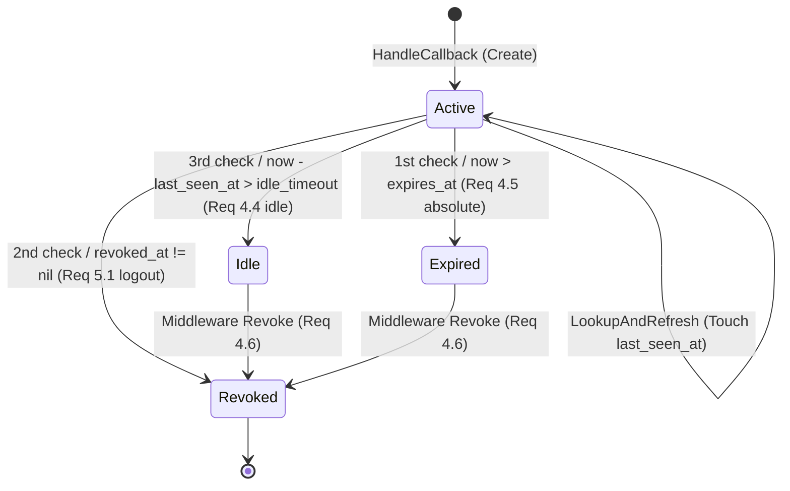
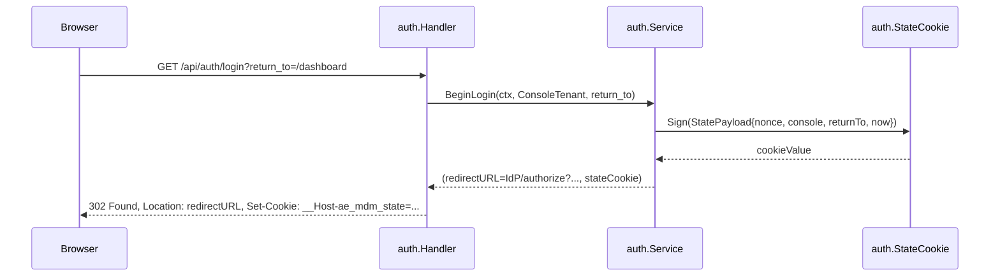

# Design Document

## Overview

**Purpose**: 本機能は ae-mdm（Android Enterprise EMM SaaS）MVP の **認証基盤（A3a）** を確立する。
OIDC IdP（Keycloak 想定 / 本番ジェネリック OIDC）が発行した ID トークンを検証し、
tenant-console / admin-console の 2 つの OIDC クライアントから発行されたトークンを **物理的に
識別**して安全なセッション cookie を発行する。state cookie / session cookie 双方に標準的な
ブラウザ保護属性（HttpOnly / Secure / SameSite=Lax）を付与し、idle 30 分・absolute 8 時間の
タイムアウトを永続ストア（PostgreSQL `sessions` テーブル）で管理する。

**Users**: 直接の利用者は後続 Issue（RBAC 許可マトリクス / `/api/admin` ガード / 画面側ロール
出し分け）を実装する開発者。間接的にはテナント管理者（tenant-console から OIDC ログインして
ダッシュボードを使う TenantAdmin / Operator / Viewer）と SaaS 運用者（admin-console から
SuperAdmin として運用画面を使う）。

**Impact**: A2（Issue #2）で確立した共通基盤（`internal/config` `internal/logger`
`internal/errors` `internal/platform/db` `internal/platform/httpserver`）の上に、
`internal/platform/oidc/verifier.go`（JWKS キャッシュ + ID トークン検証）と
`internal/auth/{handler,service,session,repository,types,state}.go` の 6 モジュール、および
`/api/auth/login` / `/api/auth/callback` / `/api/auth/logout` の HTTP エンドポイントを追加する。
A2 が default deny にしている `TenantContextMiddleware` の入力契約（`authClaims` を ctx に注入
する経路）を、本 Issue で実 OIDC + session lookup に置換する。RBAC 自体は本 Issue のスコープ外
で、`authClaims.Roles` のクレーム伝播までを担う。

### Goals
- OIDC ID トークンの **iss / aud / exp / 署名** を一元検証し、aud で tenant-console /
  admin-console を識別して呼び出し側へ返却する（Req 1.1–1.10 / 6.1–6.4）
- 認可コードフローにおける **state CSRF / replay** を MAC 付き short-lived cookie で防止する
  （Req 2.1–2.9）
- セッション識別子を **opaque な乱数**として cookie に格納し、永続ストアには **SHA-256
  ハッシュ**のみ保存する。生値は永続ストア・ログのいずれにも残さない（Req 3.1–3.9 / NFR 1.1 /
  NFR 1.2）
- **idle 30 分 / absolute 8 時間**の timeout を環境変数で運用変更可能にする（Req 4.1–4.8 /
  NFR 2.1 / NFR 2.2）
- 任意ログアウト・改竄検知時に **fail-closed** で認証を拒否する（Req 5.1–5.4 / NFR 3.1）
- 検証失敗種別を構造化ログで識別可能にする（NFR 4.1 / NFR 4.2）

### Non-Goals
- RBAC（ロール × 操作の許可マトリクス）の実装、`/api/admin` 配下の SuperAdmin 必須ガードの
  判定ロジック本体（umbrella tasks 3.2 / 後続 Issue。本 Issue は `authClaims.Roles` の伝播のみ）
- 画面側のロール出し分け（tenant-console / admin-console UI 側の非活性化・非表示制御）
- 管理者ユーザーの管理画面（admin_users / admin_role_assignments の CRUD UI）
- OIDC RP-initiated logout（IdP 側 single logout）対応
- 多要素認証（MFA）の追加
- 監査ログテーブル（`audit_logs`）への監査イベント記録（umbrella Req 2.9 / 後続 Issue）
- セッション固定攻撃に対する追加的な ID 再発行ロジックの強化（cookie 属性と乱数 ID で最低限
  保護）
- フロントエンド SPA の実装（umbrella tasks 12.1 / 13.1）

## Architecture

### Existing Architecture Analysis

A2（Issue #2）で以下が完成済み（本 Issue の前提）:

- `internal/config/config.go` — `OIDCTenantIssuerURL` / `OIDCTenantClientID` /
  `OIDCTenantRedirectURL` / `OIDCAdminIssuerURL` / `OIDCAdminClientID` /
  `OIDCAdminRedirectURL` / `SessionSecret` を保持（本 Issue で `OIDCTenantClientSecret` /
  `OIDCAdminClientSecret` を追加する。後述「File Structure Plan / Modified Files」参照）
- `internal/errors/{errors,codes,http_mapping,worker_mapping}.go` — `Error{Code, Message,
  HTTPStatus, IsTransient, Cause}` 型と `WriteHTTP(w, r, err, log)` ヘルパ。
  `CodeUnauthenticated` / `CodeForbidden` / `CodeInvalidRequest` 等が定義済み
- `internal/logger/logger.go` — zap ベースの構造化ログ + redaction（`session_secret` /
  `id_token` / `cookie` 等は値が `***` に置換される）
- `internal/platform/db/{pool,context,rls,txmanager}.go` — `BeginTxFunc(ctx, pool, fn)` で
  tx 境界を関数で囲い、`SET LOCAL app.tenant_id` / `app.is_superadmin` を必ず発行する。
  `TenantContext` 不在で panic ガード
- `internal/platform/httpserver/{server,middleware,admin_middleware}.go` — `/api`（テナント系）
  と `/api/admin`（運用系）の 2 サブルータを mount し、`TenantContextMiddleware` は
  `authClaims` を ctx から読んで `TenantContext` を確立するアダプタとして default deny で待機
- `sessions` テーブル（migration `0003_create_sessions.up.sql`）— `token_hash text PRIMARY
  KEY`, `admin_user_id uuid`, `issued_at`, `idle_at`, `expires_at`。RLS は `tenant_isolation_sessions`
  ポリシー（`admin_users.tenant_id` 経由 subselect）で SuperAdmin 文脈以外では 0 行に倒れる

**尊重する制約**:
- A2 の Auth スタブが「`authClaimsCtxKey` 経由で `*authClaims` を ctx に注入する経路」を
  入力契約として確定済み（`backend/internal/platform/httpserver/middleware.go` L51–L87）。
  本 Issue ではこの契約を **そのまま満たす** auth middleware を新規追加し、A2 側の private
  helper `withAuthClaims` / `authClaims` を **public 化**するか、auth package 側で対応する
  公開型を導入してアダプタを書く
- `sessions` テーブルの認証 lookup（TenantContext 確立 **前**に動く経路）は A2 design.md
  「sessions の認証 lookup 経路」散文の通り **SuperAdmin / system context（`app.is_superadmin=true`）
  経由で lookup する**前提
- `internal/errors` は他 internal package を import しない（cycle 回避）。新規追加する
  Error code 定数は本 package 内に置く
- umbrella design.md の `## Data Models` に列挙された `sessions` テーブルのカラム構成
  （`token_hash`, `admin_user_id`, `issued_at`, `idle_at`, `expires_at`）を維持する
  （本 Issue では `last_seen_at`（`idle_at` を rename）/ `revoked_at` / `console` の 3 カラム変更が必要なため migration 追加）

**解消する technical debt**:
- A2 が default deny で待機している `TenantContextMiddleware` の入力経路に、本 Issue で実
  OIDC + session lookup を配線する
- A2 の `internal/platform/httpserver` 内 private な `authClaims` 型を、`internal/auth` パッケージ
  から再利用できる形に整理（後述「auth claims の package 境界」節）

### Architecture Pattern & Boundary Map

採用パターン: **モジュラーモノリス + Platform Layer 拡張 + Auth Domain 追加**。
`internal/platform/oidc`（横断的 platform 機能）を新設し、ドメインとしての認証 / セッション
ロジックは `internal/auth` パッケージにまとめる。A2 の境界規約（domain → platform への
依存倒置、cross-domain な direct struct 参照禁止）を継承する。

```mermaid
flowchart LR
    Browser[Browser<br/>tenant-console or admin-console] -->|GET /api/auth/login<br/>or /api/admin/auth/login<br/>path-based に console を固定| Handler
    Handler[auth.Handler] -->|state cookie 発行<br/>+ IdP redirect URL 構築| Service
    Service[auth.Service] -->|client_id / redirect_uri lookup| Cfg[(config.Config<br/>OIDC × 2)]
    Browser -->|GET /api/auth/callback?code=...&state=...| Handler
    Handler -->|state cookie 検証| StateCookie[auth.StateCookie<br/>HMAC verify]
    Handler -->|code → token exchange<br/>+ ID token 検証| Service
    Service -->|VerifyIDToken| Verifier[oidc.Verifier<br/>JWKS cache]
    Verifier -->|JWKS fetch| IdP[(OIDC IdP)]
    Service -->|admin_user resolve (read-modify-write, no INSERT)<br/>+ session create| Repo[auth.Repository]
    Repo -->|BeginTxFunc<br/>SuperAdmin ctx| DB[(PostgreSQL<br/>sessions, admin_users)]
    Service -->|opaque session id<br/>+ HttpOnly/Secure cookie| Handler
    Handler -->|Set-Cookie + 302| Browser

    Browser -->|GET /api/admin/...| AuthMW[auth.Middleware]
    AuthMW -->|cookie → hash → lookup| Repo
    Repo -->|SuperAdmin ctx で session 取得| DB
    AuthMW -->|authClaims 注入| TenantCtxMW[A2 TenantContextMiddleware]
    TenantCtxMW -->|TenantContext 確立| NextHandler[domain handler<br/>後続 Issue]
```

**Architecture Integration**:
- 採用パターン: **Platform Layer に OIDC Verifier を追加** + **新規 Auth Domain**
  （`internal/auth/*`）。Auth Domain は OIDC Verifier / Session Repository / Config を
  利用するが、他 domain（tenant / device 等）からは独立
- ドメイン／機能境界:
  - `internal/platform/oidc/verifier.go` — JWKS キャッシュ + ID トークン検証（純粋関数 + IdP
    との HTTP I/O）。`coreos/go-oidc/v3` をラップし、tenant / admin の 2 つの aud を独立に保持
  - `internal/auth/types.go` — `Identity` / `Session` / `Console` / `Claims` の型定義（domain 型）
  - `internal/auth/state.go` — state cookie の MAC 生成・検証ヘルパ（HMAC-SHA256 + nonce +
    expiry）
  - `internal/auth/session.go` — opaque session ID 生成 / SHA-256 hash 化 / cookie 属性
    付与ヘルパ
  - `internal/auth/repository.go` — `sessions` テーブル CRUD と `admin_users` upsert
  - `internal/auth/service.go` — login / callback / lookup-and-refresh / logout の
    ユースケース
  - `internal/auth/handler.go` — HTTP ハンドラ。`/api/auth/login` / `/api/auth/callback` /
    `/api/auth/logout` をテナント系・運用系の 2 経路で提供
  - `internal/auth/middleware.go` — session cookie → `authClaims` への変換ミドルウェア。
    A2 の `TenantContextMiddleware` の入力契約を満たす
- 既存パターンの維持: A2 design.md 「ドメイン／機能境界」節（platform → domain の単方向依存、
  `BeginTxFunc` 経由の tx 境界、`errors.WriteHTTP` 経由のエラー返却）
- 新規コンポーネントの根拠:
  - `oidc.Verifier` を `platform/` に置く理由: tenant-console / admin-console の 2 OIDC
    クライアントを横断的に扱う共通基盤であり、auth domain だけが使うものではない（将来 worker
    が AMAPI service-account 認証以外で OIDC を扱う場合の再利用も視野）
  - `auth.Middleware` を auth package に置く理由: A2 の `TenantContextMiddleware` は authClaims
    の **アダプタ**であり、本 Issue で追加する middleware が「session cookie の lookup と
    authClaims 注入」を担う実体。両者は責務分離する

### auth claims の package 境界

A2 では `internal/platform/httpserver` が `authClaims` 型を package-private で保持し、
`withAuthClaims` 経由でのみ ctx に注入される（test fixture と後続 Issue の auth middleware が
配線時に使う前提）。本 Issue で auth middleware を `internal/auth` に追加するため、以下のいずれかで
package 境界を整理する必要がある:

**採用案**: `internal/platform/httpserver` 側の `authClaims` 型と `authClaimsCtxKey` /
`withAuthClaims` を **public 化**（型を `AuthClaims` に rename し、関数を `WithAuthClaims` /
`AuthClaimsFromContext` に rename）。`internal/auth/middleware.go` がこの公開 API を呼んで
ctx に注入する。

**代替案 A**（不採用）: `internal/auth` 側に独立した claims 型を定義し、httpserver 側を import
しない。→ httpserver の `TenantContextMiddleware` は ctx から `authClaims`（httpserver-private）を
読むため、auth が別型を注入してもアダプタが拾えず、middleware chain が再設計になる。

**代替案 B**（不採用）: `internal/platform/auth` のような中間 package を新設して claims 型を
そこに置く。→ 1 spec で 2 package を新設する複雑さに対し、得られる責務分離の利得が小さい。

**採用案を選ぶ理由**:
- A2 設計時点で「後続 Issue の auth middleware が `internal/platform/httpserver` の入力契約に
  合わせる」前提が明文化されている（`middleware.go` L52–L60 / A2 task 4.1）
- public 化は API 表面の追加のみで A2 の既存挙動（default deny）を変えない

### Web フロント境界（参考 / 本 Issue 範囲外）

本 Issue はバックエンドのみを扱う。フロントエンド（tenant-console / admin-console）の OIDC PKCE
クライアント実装は umbrella tasks 12.1 / 13.1（後続 Issue）。本 Issue ではフロントが期待する
3 つのエンドポイント仕様（`/api/auth/login` / `/api/auth/callback` / `/api/auth/logout`）と
セッション cookie 名・属性を確定させる。

### Technology Stack

| Layer | Choice / Version | Role in Feature | Notes |
|---|---|---|---|
| Frontend / CLI | （該当なし — backend のみ） | — | フロント SPA は後続 Issue |
| Backend / Services | Go 1.22+, `github.com/coreos/go-oidc/v3` v3.10.0（既に indirect 依存）, `github.com/go-chi/chi/v5`, `golang.org/x/oauth2`, `crypto/hmac` + `crypto/sha256` + `crypto/rand`（標準ライブラリ）, `github.com/jackc/pgx/v5` | OIDC ID トークン検証 / 認可コード交換 / state MAC / session 永続化 / HTTP ハンドラ | `coreos/go-oidc` を indirect → direct に昇格する `go.mod` 更新が伴う |
| Data / Storage | PostgreSQL 16 + 既存 `sessions` テーブル + 本 Issue で追加カラム | session 永続化 | RLS（`tenant_isolation_sessions`）は A2 で配置済み |
| Messaging / Events | （該当なし） | — | — |
| Infrastructure / Runtime | Docker Compose（A2 で確立）、Keycloak（dev IdP） | OIDC discovery / JWKS | `infra/keycloak/realm-export.json` への 2 client 定義は umbrella task 1.2 で完了済み前提 |
| Authentication | OIDC IdP（Keycloak / 本番ジェネリック OIDC）、**BFF confidential authorization code flow**（backend = confidential client。`/api/auth/login`・`/api/auth/callback` を backend が直接ハンドル。code → token 交換は `client_secret_basic` で行い、**`oauth2.Endpoint.AuthStyle = oauth2.AuthStyleInHeader` を明示設定**（`golang.org/x/oauth2` v0.x は `AuthStyle` 未指定時 `AuthStyleAutoDetect` でランタイム auto-detect する仕様だが、auto-detect は初回リクエストで IdP の reject を受けて `client_secret_post` へフォールバックする等の非決定的挙動を取るため、本 Issue では Basic 固定を契約として `AuthStyleInHeader` を明示する / 確認事項 6 参照）。`OIDC_TENANT_CLIENT_SECRET` / `OIDC_ADMIN_CLIENT_SECRET` を env から注入する。なお OIDC `nonce` パラメータを login flow に組み込み、ID トークンの `nonce` クレームと state cookie 内 `OIDCNonce` の一致を Service が検証することで authorization code injection（state 流用攻撃）を防ぐ（Req 2.9 / 後述「OIDC nonce binding」節）。PKCE は本 Issue では使用しない / SPA は backend にリダイレクトするだけ） | — | `aud` 検証で tenant-console / admin-console を判別 |

## File Structure Plan

### Directory Structure

```
backend/
├── internal/
│   ├── platform/
│   │   └── oidc/                       # 本 Issue 新規追加（Req 1, 6 / NFR 3.2）
│   │       ├── verifier.go             # JWKS キャッシュ + iss/aud/exp/sig 検証
│   │       ├── verifier_test.go        # mock IdP server で kid rotation / sig fail / iss/aud/exp 異常を検証
│   │       └── doc.go                  # package godoc（依存方向ルール明記）
│   ├── platform/
│   │   └── httpserver/                 # 本 Issue で「rename + 公開化」修正
│   │       └── middleware.go           # authClaims → AuthClaims, withAuthClaims → WithAuthClaims, authClaimsFromContext → AuthClaimsFromContext へ rename + 公開化（A2 既存挙動は維持）
│   └── auth/                           # 本 Issue 新規追加（Req 2, 3, 4, 5, 6 / NFR 1, 2, 3, 4）
│       ├── types.go                    # Identity, Session, Console, Claims 型
│       ├── state.go                    # state cookie MAC 生成 / 検証（HMAC-SHA256 + nonce）
│       ├── state_test.go               # MAC tamper / expiry / nonce 一意性
│       ├── session.go                  # opaque ID 生成 / SHA-256 hash / cookie 属性
│       ├── session_test.go             # cookie 属性 / hash 化 / 乱数性検証
│       ├── repository.go               # sessions CRUD + state_nonces INSERT + admin_users resolve（read-modify-write, no INSERT / 事前 provisioning 必須）
│       ├── repository_test.go          # 実 PostgreSQL（integration tag）
│       ├── service.go                  # login / callback / lookup / logout ユースケース
│       ├── service_test.go             # fake Verifier / fake Repository / fake clock で動作検証
│       ├── handler.go                  # HTTP ハンドラ（/api/auth/login, /callback, /logout）
│       ├── handler_test.go             # httptest で 6 OIDC エンドポイントを通す
│       ├── middleware.go               # session cookie → AuthClaims 注入ミドルウェア
│       ├── middleware_test.go          # cookie 不在 / 失効 / idle 超過 / absolute 超過 / 改竄 を網羅
│       ├── clock.go                    # time.Now の DI ラッパ（テスト用）
│       └── doc.go                      # package godoc
├── db/
│   └── migrations/                     # 本 Issue 新規追加
│       ├── 0013_extend_sessions.up.sql                # sessions の idle_at → last_seen_at 改名 + revoked_at / console 列追加
│       ├── 0013_extend_sessions.down.sql              # 上記の rollback
│       ├── 0014_admin_users_add_oidc_issuer.up.sql    # admin_users の oidc_issuer 列追加 + UNIQUE 制約を (oidc_issuer, oidc_subject) 複合キーに差し替え
│       ├── 0014_admin_users_add_oidc_issuer.down.sql  # 上記の rollback
│       ├── 0015_create_state_nonces.up.sql            # state_nonces テーブル新規追加（Req 2.9 / 一度限り消費）
│       └── 0015_create_state_nonces.down.sql          # 上記の rollback
├── internal/
│   ├── config/                         # 本 Issue 修正
│   │   ├── config.go                   # SessionIdleTimeout / SessionAbsoluteTimeout / StateCookieTTL / StateMACSecret / OIDCTenantClientSecret / OIDCAdminClientSecret フィールド追加
│   │   └── env.go                      # 対応する duration パーサ呼び出し + client secret の env 読込追加
│   ├── logger/                         # 本 Issue 修正
│   │   └── redact.go                   # redaction allowlist に state_mac_secret / client_secret / state_cookie / session_cookie の 4 件追加
│   └── platform/
│       └── httpserver/                 # 本 Issue 修正
│           └── server.go               # /api/auth/* と /api/admin/auth/* を root router に登録（TenantContextMiddleware より外側）+ auth.Middleware を /api と /api/admin のサブルータに先頭挿入
├── cmd/
│   └── api/                            # 本 Issue 修正
│       └── main.go                     # OIDC Verifier / Auth Service / Auth Handler の DI 配線追加
└── test/
    └── integration/
        ├── auth_repository_test.go         # 本 Issue 新規（sessions / admin_users CRUD の実 PostgreSQL 検証）
        ├── auth_login_callback_test.go     # 本 Issue 新規（state cookie + ID token 検証 + session 発行の e2e）
        ├── auth_session_lookup_test.go     # 本 Issue 新規（cookie lookup → idle 更新 → absolute 拒否）
        └── auth_logout_revoke_test.go      # 本 Issue 新規（logout 後の再提示拒否）

.env.example                             # 本 Issue 修正: SESSION_IDLE_TIMEOUT / SESSION_ABSOLUTE_TIMEOUT / STATE_COOKIE_TTL / STATE_MAC_SECRET を追加
docs/runbook/local-dev.md                # 本 Issue 修正: OIDC 認証フロー検証手順節を追加
docs/specs/33--a3a-oidc-verifier-session/impl-notes.md  # 本 Issue 新規追加
```

### Modified Files

- `backend/test/integration/helpers_test.go` — A2 既存の `admin_users` INSERT 部分（既存実装は
  `oidc_subject` のみ指定して INSERT する形）を、本 Issue migration `0014_admin_users_add_oidc_issuer.up.sql`
  で追加される **`oidc_issuer` NOT NULL** 列に合わせて更新する（INSERT 文に `oidc_issuer`
  カラムを明示的に追加する）。本更新を怠ると migration 完了後に既存 integration test が
  「null value in column "oidc_issuer" violates not-null constraint」で全壊する（task 1.2 で
  併せて実施 / 実際の置換対象ファイルは `grep -rn "admin_users" backend/test/integration/` で
  全件列挙して順次更新する）
- `backend/internal/platform/httpserver/middleware.go` — `authClaims` 型を `AuthClaims` に
  rename（フィールド構成は不変: `TenantID` / `AdminUserID` / `Roles` / `IsSuperAdmin`）、
  `withAuthClaims` / `authClaimsFromContext` を `WithAuthClaims` / `AuthClaimsFromContext` へ
  rename。本 rename によって A2 既存テストの呼び出し箇所（同 package 内 test）も合わせて修正
- `backend/internal/platform/httpserver/server.go` — `NewServer` に **`authMWTenant` /
  `authMWAdmin` の 2 引数**（いずれも型 `func(http.Handler) http.Handler`）と `authMount`
  引数（auth.Handler の mount 関数）を追加する。`/api` サブルータには `authMWTenant`
  （`expectedConsole=ConsoleTenant` で構築）を、`/api/admin` サブルータには `authMWAdmin`
  （`expectedConsole=ConsoleAdmin` で構築）を、それぞれ `TenantContextMiddleware` より前段に
  挿入する（**単一 `authMW` を両サブルータに使い回すと Req 6.2 / 6.3 の console 分離が
  middleware 内で強制できないため、必ず別インスタンスを別々に注入する**）。auth エンドポイント群
  `/api/auth/{login,callback,logout}` と `/api/admin/auth/{login,callback,logout}` は
  **TenantContextMiddleware の外側**（認証が未確立の段階で到達するため）に新規 router group
  として `authMount` で 2 回（tenant prefix / admin prefix）登録する
- `backend/internal/config/config.go` + `env.go` — 以下を追加（すべて env 経由読込）。`duration` パーサは `env.go` の既存パターンに揃える。各 duration は **`1s <= ttl <= 24h`** の境界 validation を行い（Go の `http.Cookie.MaxAge = int(ttl/time.Second)` が `MaxAge == 0` で Max-Age 属性を Set-Cookie ヘッダから drop する境界を回避するため。`StateCookieTTL` は上限 10m に絞る）、不一致は起動時 `*errors.Error{Code: config_invalid}` で reject:
  - `SessionIdleTimeout time.Duration`（env: `SESSION_IDLE_TIMEOUT`, default `30m`, validation `1s..24h`）
  - `SessionAbsoluteTimeout time.Duration`（env: `SESSION_ABSOLUTE_TIMEOUT`, default `8h`, validation `1s..24h`）
  - `StateCookieTTL time.Duration`（env: `STATE_COOKIE_TTL`, default `10m`, validation `1s..10m`）
  - `StateMACSecret string`（env: `STATE_MAC_SECRET`, required, len >= 32 bytes）
  - `OIDCTenantClientSecret string`（env: `OIDC_TENANT_CLIENT_SECRET`, required, confidential client / `client_secret_basic` 認証用）
  - `OIDCAdminClientSecret string`（env: `OIDC_ADMIN_CLIENT_SECRET`, required, 同上）
  - **fail-fast cross-field validation**: `Load()` 最終段で (a) `SessionIdleTimeout <= SessionAbsoluteTimeout`、(b) `OIDCTenantClientID != OIDCAdminClientID`、(c) `OIDCTenantClientSecret != OIDCAdminClientSecret`、(d) `OIDCTenantRedirectURL != OIDCAdminRedirectURL` を検査。違反は `*errors.Error{Code: config_invalid}` で reject（Req 6.1 / 6.4 の aud 排他一致 / Req 6.2 の path-based 分離 / Req 4.4 / 4.5 の階層的失効判定の前提を起動時に強制）
- `backend/internal/logger/redact.go` — 既存 redaction allowlist に 4 件追加
  （`state_mac_secret` / `client_secret` / `state_cookie` / `session_cookie`）。A2 既存の
  allowlist（`session_secret` / `id_token` / `access_token` / `refresh_token` / `cookie` /
  `google_application_credentials` / `sa_json` / `private_key` / `password`）は保持
- `backend/cmd/api/main.go` — bootstrap で OIDC Verifier 構築（起動時に discovery + JWKS prefetch、
  失敗で exit 1 / NFR 3.2）→ Auth Repository / Auth Service / Auth Handler / Auth Middleware を
  組み立て → `httpserver.NewServer` に注入
- `.env.example` — `SESSION_IDLE_TIMEOUT=30m` / `SESSION_ABSOLUTE_TIMEOUT=8h` /
  `STATE_COOKIE_TTL=10m` / `STATE_MAC_SECRET=<REPLACE_ME_GENERATE_32_BYTES_OF_RANDOM_HEX>` /
  `OIDC_TENANT_CLIENT_SECRET=<REPLACE_ME_FROM_KEYCLOAK_CLIENT>` /
  `OIDC_ADMIN_CLIENT_SECRET=<REPLACE_ME_FROM_KEYCLOAK_CLIENT>` を追加。
  **加えて A2 時点で SPA 側を指している `OIDC_TENANT_REDIRECT_URL` / `OIDC_ADMIN_REDIRECT_URL`
  を backend callback へ置換**する（A2 値はそれぞれ `http://localhost:5173/auth/callback` /
  `http://localhost:5174/auth/callback` → 本 Issue で `http://localhost:8080/api/auth/callback` /
  `http://localhost:8080/api/admin/auth/callback` に書き換え）。本 Issue の BFF confidential
  flow（Technology Stack「Authentication」行）は backend が直接 callback を処理する設計のため、
  IdP からの redirect 先を backend に向けないと Req 1.x / 2.x のフローが成立しない。
  Keycloak realm 側 client 登録 redirect URI もこの 2 URL と一致させる必要があり、運用手順は
  `docs/runbook/local-dev.md` に追記する（task 7.1）
- `docs/runbook/local-dev.md` — 「OIDC 認証フロー検証手順」節を追加（Keycloak realm 設定の
  前提、`STATE_MAC_SECRET` の生成手順）

## Requirements Traceability

| Requirement | Summary | Components | Interfaces / Files | Flows |
|---|---|---|---|---|
| 1.1 | JWKS 公開鍵で署名検証 | OIDC Verifier | `platform/oidc/verifier.go` の `VerifyIDToken` | callback flow |
| 1.2 | iss を信頼発行者と完全一致 | OIDC Verifier | `verifier.go` の `expectedIssuer` 比較 | callback flow |
| 1.3 | aud が tenant-console / admin-console を識別 | OIDC Verifier | `Claims.MatchedConsole` | callback flow |
| 1.4 | aud 不一致は拒否 | OIDC Verifier | `verifier.go` の aud 検証ロジック | error: invalid_aud |
| 1.5 | aud 配列で両方含む場合は曖昧として拒否 | OIDC Verifier | `verifier.go` の aud uniqueness check | error: aud_ambiguous |
| 1.6 | exp ≤ now で拒否 | OIDC Verifier | `coreos/go-oidc` の exp 自動検証 + 明示再確認 | error: token_expired |
| 1.7 | 署名検証失敗で拒否 | OIDC Verifier | `coreos/go-oidc` の sig 検証 | error: invalid_sig |
| 1.8 | iss 不一致で拒否 | OIDC Verifier | `verifier.go` の iss 比較 | error: invalid_iss |
| 1.9 | kid rotation で JWKS 再取得 | OIDC Verifier | JWKS Cache + remote keyset refresh | callback flow |
| 1.10 | kid 不在で拒否 | OIDC Verifier | `coreos/go-oidc` の no matching key error | error: invalid_kid |
| 1.11 | raw JWT をログ / 永続ストアに残さない | OIDC Verifier, Logger | redaction allowlist + verifier の return 値設計 | NFR 4.2 と連動 |
| 2.1 | 推測困難な state を生成し redirect URL に付与 | Auth Service, State Cookie | `auth/service.go` の `BeginLogin` + `auth/state.go` の `NewState` | login flow |
| 2.2 | state を MAC 保護 cookie として発行 | State Cookie | `auth/state.go` の `Sign` | login flow |
| 2.3 | state cookie 属性 HttpOnly/Secure/SameSite=Lax | State Cookie | `auth/state.go` の `CookieAttributes` | NFR 1.1 と連動 |
| 2.4 | state cookie 10 分以内の有効期限 | State Cookie | `cfg.StateCookieTTL`（default 10m） | NFR 2.1 と連動 |
| 2.5 | callback で state / cookie の MAC 一致確認 | Auth Service, State Cookie | `auth/state.go` の `Verify` | callback flow |
| 2.6 | state cookie 不在 / 期限切れ / MAC 失敗で失敗 | Auth Service | `Verify` 戻り値 → `errors.CodeUnauthenticated` | error: state_invalid |
| 2.7 | クエリ state と cookie state 不一致で失敗 | Auth Service | `Verify` 内 `subtle.ConstantTimeCompare` | error: state_mismatch |
| 2.8 | state cookie を callback で即時無効化 | Auth Service, Handler | `Set-Cookie: max-age=0` で削除 | callback flow |
| 2.9 | 別ブラウザ / 別 redirect への state 流用拒否 | Auth Service, State Cookie, Auth Repository, OIDC Verifier | **AC 2.9「別ブラウザセッション」カバー戦略の分解**: (a) MAC 付き cookie の **物理保護**（HttpOnly + Secure + SameSite=Lax + `__Host-` prefix で sub-domain 跨ぎ禁止 / cookie 自体が「発行されたブラウザ・オリジン以外には到達しない」ことをブラウザ機構で強制 / TTL 10 分）— **これが「別ブラウザセッションでの初回提示」を阻害する一次防御**（cookie が物理的に別ブラウザに渡らないため、攻撃者が valid cookie を別ブラウザに持ち込めない / SameSite=Lax + `__Host-` で sub-domain や iframe 経由の自動転送も不可能）、(b) cookie 値と query state の constant-time 一致（cookie だけ・query だけの片側偽造を拒否）、(c) **`StatePayload.Console == handler の expected console` を Service 層で明示照合**（tenant login で発行した state を admin callback に提示する cross-console state 混同を `state_console_mismatch` で拒否）、(d) **OIDC nonce binding**（`StatePayload.OIDCNonce` を `oauth2.SetAuthURLParam("nonce", ...)` で IdP に送信し、ID トークン `nonce` クレームを `Claims.Nonce` として取り出して `subtle.ConstantTimeCompare` で照合 / 不一致は `nonce_mismatch` 401 / 横取りした code を別ブラウザ・別セッションで提示する authorization code injection を OIDC Core 1.0 §3.1.2.7 準拠で物理的に拒否）、(e) **server-side `state_nonces` テーブルでの一度限り消費**（`Repository.ConsumeStateNonce(ctx, nonce, console, expiresAt)` が PostgreSQL の PRIMARY KEY UNIQUE 制約違反を `failure_kind: state_replay` にマッピング / **「同一ブラウザ内で cookie 値 + query state を組ごとコピーして再提示する 2 回目以降」を物理的に拒否する追加防御**。初回提示 1 回は (a)〜(d) で阻害される一方、攻撃者が事前に cookie + state の組を盗み取って当該ブラウザに戻したケースの 2 回目以降を弾く）/ 詳細は後述「state_nonces テーブル」節および「Data Models」節を参照 | error: state_replay / state_console_mismatch / nonce_mismatch |
| 3.1 | OIDC 成功でセッション識別子を発行・cookie 返却 | Session Manager, Auth Handler | `auth/session.go` の `New` + `Set-Cookie` | callback flow |
| 3.2 | session cookie HttpOnly | Session Cookie | `session.go` の `CookieAttributes` | NFR 1.1 と連動 |
| 3.3 | session cookie Secure | Session Cookie | 同上 | NFR 1.1 と連動 |
| 3.4 | session cookie SameSite=Lax | Session Cookie | 同上 | NFR 1.1 と連動 |
| 3.5 | session 値は暗号学的乱数 | Session Manager | `crypto/rand.Read` で 32 バイト → base64url | callback flow |
| 3.6 | session 生値をログ / ストアに残さない | Session Manager, Logger | redaction + repository は hash のみ INSERT | NFR 1.2 と連動 |
| 3.7 | 永続ストアには SHA-256 ハッシュを格納 | Session Repository | `session.go` の `HashToken` + `sessions.token_hash` カラム | NFR 1.2 と連動 |
| 3.8 | ログには hash または短縮識別子のみ出力 | Session Manager, Logger | logger field ヘルパ `session.HashPrefix(hash)`（先頭 8 文字を返す helper / interface 定義および tasks.md と同一名称） | observability |
| 3.9 | aud で識別したコンソール種別を session に紐付 | Session Manager, Session Repository | `sessions.console` 列追加 | data model: sessions |
| 4.1 | セッション発行時に最終操作時刻を記録 | Session Manager | `sessions.last_seen_at` カラム | data: sessions |
| 4.2 | セッション発行時に absolute 有効期限を記録 | Session Manager | `sessions.expires_at` を `issued_at + cfg.SessionAbsoluteTimeout` | data: sessions |
| 4.3 | 認証済みリクエストで last_seen_at を更新 | Auth Middleware, Session Repository | `repository.go` の `Touch(token_hash, now)` | request flow |
| 4.4 | idle 30 分超で失効扱い | Auth Middleware | `now - last_seen_at > cfg.SessionIdleTimeout` 判定 | request flow |
| 4.5 | absolute 8 時間超で失効扱い | Auth Middleware | `now > expires_at` 判定 | request flow |
| 4.6 | 失効 cookie 提示で永続ストアも失効状態化 | Auth Middleware, Session Repository | `Revoke(token_hash)` を idle / absolute 超過時に発行 | request flow |
| 4.7 | 失効時に cookie 削除レスポンス | Auth Middleware | `Set-Cookie: max-age=0` を 401 と共に返す | request flow |
| 4.8 | last_seen_at 更新は absolute を延長しない | Session Repository | `Touch` は `expires_at` を変更しない | data: sessions |
| 5.1 | logout で永続ストアを失効状態に | Auth Service, Session Repository | `service.go` の `Logout` → `Revoke` | logout flow |
| 5.2 | logout で cookie 削除レスポンス | Auth Handler | `Set-Cookie: max-age=0` | logout flow |
| 5.3 | logout 後の同 cookie 提示は拒否 | Auth Middleware | `revoked_at IS NOT NULL` を失効判定 | request flow |
| 5.4 | 改竄（hash 不一致）cookie は拒否 | Auth Middleware, Session Repository | `Get(token_hash)` が 0 行で 401 | request flow |
| 6.1 | tenant / admin の 2 client を独立保持 | OIDC Verifier, Config | `oidc.Verifier` を 2 インスタンス（tenant 用 / admin 用）+ `Config.Load()` 最終段で `OIDCTenantClientID != OIDCAdminClientID` / `OIDCTenantClientSecret != OIDCAdminClientSecret` の fail-fast 検査 | configuration |
| 6.2 | callback の URL パス / 設定値からクライアント確定 | Auth Service, Auth Handler | `/api/auth/callback` と `/api/admin/auth/callback` を **path-based に別ハンドラ登録**し、各ハンドラの closure で console を **固定**する（user-controlled な `console` query は読み取らない / 攻撃面を残さないため path のみを信頼 / `Handler.Mount(r, prefix, console)` 経由で各 console 種別を closure 内に注入する設計と整合） | callback flow |
| 6.3 | session に console 種別を紐付 | Session Repository | `sessions.console` カラム | data model |
| 6.4 | tenant / admin の信頼 aud を異なる値で設定可 | Config | `OIDCTenantClientID` / `OIDCAdminClientID` 既に独立 + `Config.Load()` 最終段で `OIDCTenantRedirectURL != OIDCAdminRedirectURL` も含めた 3 不一致検査（同値だと Req 6.2 の path-based 分離が無効化されるため） | configuration |
| NFR 1.1 | ID token / cookie / MAC 鍵 / client secret を平文ログに残さない | Logger, OIDC Verifier, Auth Service | redaction allowlist に追加（`state_mac_secret` / `client_secret` を allowlist 化） | NFR 4.2 と連動 |
| NFR 1.2 | session ID を SHA-256 ハッシュとして格納し提示値と比較 | Session Manager, Session Repository | `HashToken` + `Get(token_hash)` | data: sessions |
| NFR 2.1 | idle / absolute / state TTL を env から変更可 | Config | `SessionIdleTimeout` / `SessionAbsoluteTimeout` / `StateCookieTTL` | configuration |
| NFR 2.2 | runtime 上書き不可 | Config | `Config` 値型で immutable | A2 既存性質 |
| NFR 3.1 | 例外時は認証拒否 | Auth Middleware, Auth Service | `recover()` で `errors.WriteHTTP` + 401 / 500 | error handling |
| NFR 3.2 | 起動時 OIDC discovery 失敗で起動失敗 | Auth Service Bootstrap | `cmd/api/main.go` の `oidc.NewVerifier` 失敗時 exit 1 | bootstrap |
| NFR 4.1 | 失敗種別を構造化ログで識別可能に | Logger, OIDC Verifier, Auth Middleware | 各失敗種別を `failure_kind` field（`invalid_sig` / `invalid_iss` / `invalid_aud` / `token_expired` / `state_mismatch` / `state_expired` / `session_expired` / `session_tamper` 等）として WARN ログ | observability |
| NFR 4.2 | session 生値 / ID token / state MAC 鍵をログに含めない | Logger | redaction allowlist + verifier / service の構造化ログ field 設計 | observability |

## Components and Interfaces

### Platform Layer

#### OIDC Verifier

| Field | Detail |
|---|---|
| Intent | OIDC IdP の JWKS をキャッシュし、ID トークンの iss / aud / exp / 署名を一元検証する。aud で tenant-console / admin-console を判別して呼び出し側に返す |
| Requirements | 1.1, 1.2, 1.3, 1.4, 1.5, 1.6, 1.7, 1.8, 1.9, 1.10, 1.11, 6.1, 6.4, NFR 3.2, NFR 4.1 |

**Responsibilities & Constraints**
- 主責務: `coreos/go-oidc/v3` の `oidc.Provider` + `oidc.RemoteKeySet` を 2 つ（tenant / admin）
  保持し、`VerifyIDToken(ctx, rawIDToken)` で署名・iss・exp を検証。aud は本パッケージ側で
  独自に検証する。`coreos/go-oidc/v3` の go-oidc 内蔵 aud 検証は `oidc.Config{ClientID: "",
  SkipClientIDCheck: true}` を `provider.Verifier(cfg)` に渡して **明示的に無効化**する
  （go-oidc v3 では `ClientID == "" && !SkipClientIDCheck` の組み合わせを `invalid configuration`
  として reject するため、`ClientID` 空のままにする場合は **`SkipClientIDCheck = true` を必ず
  併設**する必要がある）。go-oidc 内蔵検証を切ったうえで、本実装側が「ID トークンの `aud`
  クレーム値の集合と、本 Issue で許容する 2 値 `{tenant-console, admin-console}` のうち
  **正確に 1 つ**が一致する」ことを強制する（Req 1.4 / 1.5）。一致した console 種別を
  `Claims.MatchedConsole` に返す
- ドメイン境界: `platform/oidc` 内に閉じる。auth domain からのみ呼ばれる
- データ所有権: JWKS のメモリキャッシュ（`coreos/go-oidc` の `RemoteKeySet` が TTL 内で
  自動更新 / kid mismatch 時に refresh）
- Invariants:
  - 起動時に `oidc.NewProvider(ctx, issuerURL)` で discovery を実行し、失敗時は
    `*errors.Error{Code: CodeUnavailable}` を返して `cmd/api` を exit 1 にする（NFR 3.2）
  - ID トークン本体（rawIDToken）は戻り値・log フィールドのいずれにも含めない（Req 1.11 /
    NFR 4.2）

**Dependencies**
- Inbound: `internal/auth/service.go` の `Service.HandleCallback`（Critical）
- Outbound: なし
- External: OIDC IdP（Keycloak / 本番 IdP）の `.well-known/openid-configuration` と
  JWKS endpoint（Critical）

**Contracts**: Service [x] / API [ ] / Event [ ] / Batch [ ] / State [ ]

##### Service Interface

```go
// Console は OIDC ID トークンの aud から判別したコンソール種別。
type Console string

const (
    ConsoleTenant Console = "tenant-console"
    ConsoleAdmin  Console = "admin-console"
)

// Claims は ID トークンから抽出する検証済みクレーム。raw JWT は含めない（Req 1.11）。
type Claims struct {
    Subject        string   // sub
    Email          string   // email（OPTIONAL）
    Groups         []string // groups クレーム（OIDC IdP の役割マッピング元）
    Issuer         string   // iss
    MatchedConsole Console  // aud から判別した console 種別（必ず 1 つ）
    Nonce          string   // OIDC `nonce` クレーム（authorization code injection 防止用 /
                            // Service 側で StatePayload.OIDCNonce と constant-time 比較する）
}

// Verifier は OIDC ID トークン検証の単一エントリポイント。
type Verifier interface {
    // VerifyIDToken は raw ID トークンを検証し、Claims を返す。
    // 検証失敗時は *errors.Error を返す（Code は CodeUnauthenticated、failure kind は
    // Cause チェーンに含める）。raw JWT は戻り値・error にも含めない。
    VerifyIDToken(ctx context.Context, rawIDToken string) (Claims, error)
    // TenantEndpoint / AdminEndpoint は cmd/api bootstrap が oauth2.Config を組み立てる
    // ために利用する。`Provider.Endpoint()` を取得した後、戻り値の `AuthStyle` フィールドを
    // **`oauth2.AuthStyleInHeader` に明示上書き** してから返す（`golang.org/x/oauth2` の
    // default は `AuthStyleAutoDetect` で初回 token endpoint reject を見て
    // `client_secret_post` へフォールバックする非決定的挙動を取るため、Basic 固定を契約として
    // 強制する。設計の Technology Stack 表および確認事項 6 と整合）。
    TenantEndpoint() oauth2.Endpoint
    AdminEndpoint() oauth2.Endpoint
}

// NewVerifier は config から 2 client（tenant / admin）の Verifier を構築する。
// 起動時に両 issuer の OIDC discovery を実行し、失敗時は *errors.Error{Code: CodeUnavailable}。
func NewVerifier(ctx context.Context, cfg config.Config) (Verifier, error)
```

- Preconditions: `cfg.OIDCTenantIssuerURL` / `cfg.OIDCAdminIssuerURL` が有効な URL
- Postconditions: 戻り値 `Verifier` は goroutine-safe
- Invariants:
  - aud 配列に tenant / admin の両方が含まれる場合は **`failure_kind=aud_ambiguous`** で拒否
    （Req 1.5）
  - aud 配列にいずれも含まれない場合は **`failure_kind=invalid_aud`** で拒否（Req 1.4）

### Domain Layer (Auth)

#### Auth Types

| Field | Detail |
|---|---|
| Intent | Identity / Session / Console / Claims のドメイン型を集約 |
| Requirements | 3.9, 6.3 |

```go
// Identity は OIDC subject から解決された内部管理者識別子と紐付け情報。
type Identity struct {
    AdminUserID  uuid.UUID
    OIDCSubject  string
    Email        string
    TenantID     uuid.UUID // SuperAdmin は uuid.Nil
    Roles        []string  // groups クレームをそのまま転記（RBAC 解釈は後続 Issue）
    IsSuperAdmin bool      // groups から計算（SuperAdmin role の有無）
}

// Session は永続ストアに記録されるセッションの値オブジェクト。
type Session struct {
    TokenHash      string         // SHA-256(opaque ID) の hex 表記（cookie 値そのものは持たない）
    AdminUserID    uuid.UUID
    Console        oidc.Console
    IssuedAt       time.Time
    LastSeenAt     time.Time      // Req 4.1
    ExpiresAt      time.Time      // issued_at + absolute timeout（Req 4.2）
    RevokedAt      *time.Time     // logout / 失効検出時にセット（Req 5.1）
}
```

**Boundary**: AuthTypes（types.go）

#### State Cookie

| Field | Detail |
|---|---|
| Intent | OIDC 認可コードフローで使う state 値の生成・MAC 署名・cookie 化・検証 |
| Requirements | 2.1, 2.2, 2.3, 2.4, 2.5, 2.6, 2.7, 2.8, 2.9, NFR 1.1 |

**Responsibilities & Constraints**
- 主責務: 128 bit nonce + console 種別 + return_to URL（callback 後の遷移先 / 同一オリジン内
  の相対パスのみ許容）+ 発行時刻を payload とし、`HMAC-SHA256(cfg.StateMACSecret, payload)` を
  付与した文字列を cookie 値として発行。callback 時に再計算した MAC と一致 + 発行時刻からの
  経過が `cfg.StateCookieTTL` 以内 + クエリ state と cookie state が constant-time 一致する
  ことを検証し、検証成功時は payload を復号して `ReturnTo` を Service / Handler に返す
  （Handler はこれを `Location` ヘッダの遷移先として使用）
- ドメイン境界: `auth` package 内 helper。外部から見える IF は `Sign(payload) string` /
  `Verify(rawCookie string, queryState string, now time.Time) (StatePayload, error)`
- データ所有権: なし（stateless）
- Invariants:
  - MAC 鍵（`cfg.StateMACSecret`）はログに出さない（logger redaction allowlist に追加）
  - cookie 名 `__Host-ae_mdm_state`（`__Host-` プレフィックスで Path=/ 必須 / Secure 必須 /
    Domain 不可を強制）

```go
type StatePayload struct {
    Nonce    string  // OAuth `state` クエリ用 16 byte base64url（CSRF 防止 / cookie 内値と
                    // query state の constant-time 比較に使用）
    OIDCNonce string // OIDC `nonce` 用 16 byte base64url（authorization code injection 防止 /
                    // 認可リクエストの `nonce` パラメータと ID トークン `nonce` クレームの
                    // constant-time 一致確認に使用 / RFC 6749 OAuth `state` と OIDC Core 1.0
                    // §3.1.2.1 `nonce` は別パラメータでなくてはならない）
    Console  oidc.Console
    ReturnTo string  // SPA が指定した戻り先 URL の生値（同一オリジン内の相対パスのみ許容 /
                    // BeginLogin で validate 済み。MAC 保護下なので tamper されない前提）
    IssuedAt time.Time
}

// Sign は payload を MAC 付き cookie 値文字列に変換する。
func Sign(payload StatePayload, secret []byte) (cookieValue string, err error)

// Verify は cookie 値と query state の一致を検証する。
// MAC 不一致 / TTL 超過 / nonce 不一致のいずれかで *errors.Error{Code: CodeUnauthenticated}。
func Verify(cookieValue, queryState string, secret []byte, ttl time.Duration, now time.Time) (StatePayload, error)

// CookieAttributes は state cookie の Set-Cookie 属性を返す（HttpOnly / Secure /
// SameSite=Lax / Path=/ / Max-Age=ttl 秒）。
func CookieAttributes(ttl time.Duration) http.Cookie

// ExpireCookieAttributes は state cookie の **削除用** Set-Cookie 属性を返す
// （Name=`__Host-ae_mdm_state` / Value="" / **`MaxAge = -1`** / Path=/ / HttpOnly / Secure /
// SameSite=Lax）。Go の `http.Cookie` では `MaxAge < 0` のみが削除 cookie として
// `Set-Cookie` ヘッダに `Max-Age=0` 属性 + 過去日付の `Expires` 属性を出力する規約
// （`MaxAge = 0` は Max-Age 属性自体を出力せず session cookie 化するため、削除には必ず負値を
// 設定する）。callback 成功時 / state 検証失敗時 / state replay 検出時に Handler が
// `Set-Cookie` ヘッダで返却して state cookie を即時無効化する（Req 2.8 の再利用防止 /
// session.ExpireCookieAttributes() は session cookie 用で名前が異なるため、state cookie 削除には
// 必ず本 helper を使用する）。
func ExpireCookieAttributes() http.Cookie
```

**Boundary**: StateCookie（state.go）

#### Session Manager（cookie + hash + 属性）

| Field | Detail |
|---|---|
| Intent | opaque な session ID を生成し、cookie 属性付与と SHA-256 ハッシュ化を提供。永続化は Repository |
| Requirements | 3.1, 3.2, 3.3, 3.4, 3.5, 3.6, 3.7, 3.8, NFR 1.2 |

**Responsibilities & Constraints**
- 主責務: 32 バイトの暗号学的乱数を base64url で表記した opaque ID を生成。`HashToken(id)` で
  SHA-256 hex を返す。cookie 属性は `__Host-ae_mdm_session`（HttpOnly / Secure / SameSite=Lax /
  Path=/）
- ドメイン境界: `auth` package 内。Repository へ渡すのは hash のみ
- データ所有権: なし（stateless）
- Invariants:
  - cookie 名は `__Host-ae_mdm_session` 固定。`__Host-` プレフィックスで Domain 属性指定不可
    （sub-domain 跨ぎを物理的に禁止 / 確認事項 4 への対応）
  - 生値はログに出さず、構造化ログには hash の先頭 8 文字（`SessionHashPrefix(token)`）を
    出力（Req 3.8）

```go
// New は opaque session ID（cookie に格納する生値）を 32 byte の crypto/rand から生成する。
func New() (rawToken string, err error)

// HashToken は raw token の SHA-256 hex を返す（永続ストア / 比較用）。
func HashToken(rawToken string) string

// CookieAttributes は session cookie の Set-Cookie 属性を返す（HttpOnly / Secure /
// SameSite=Lax / Path=/ / Name=`__Host-ae_mdm_session` / Max-Age=ttl 秒）。Value は呼び出し側で
// 設定する。引数 `ttl` には `cfg.SessionAbsoluteTimeout` を渡し、cookie の MaxAge を
// 永続ストア側 absolute timeout と一致させる（実際の失効判定は DB 側で行うが、ブラウザ側 cookie の
// 物理的寿命も合わせる）。
func CookieAttributes(ttl time.Duration) http.Cookie

// ExpireCookieAttributes は session cookie の **削除用** Set-Cookie 属性を返す
// （Name=`__Host-ae_mdm_session` / Value="" / **`MaxAge = -1`** / Path=/ / HttpOnly / Secure /
// SameSite=Lax）。Go の `http.Cookie` の削除規約に従い `MaxAge < 0` を設定し、wire 上の
// `Set-Cookie` ヘッダには `Max-Age=0` 属性 + 過去日付の `Expires` 属性が出力される
// （`MaxAge = 0` だと Max-Age 属性が省略され session cookie 化して削除が成立しない）。
// Logout / 失効検出時に Handler / Middleware が発行する。state cookie 用の
// `state.ExpireCookieAttributes()` とは Name が異なるため、両者を取り違えない。
func ExpireCookieAttributes() http.Cookie

// HashPrefix は logger field に載せる短縮識別子（hash 先頭 8 文字）を返す（Req 3.8）。
func HashPrefix(hash string) string
```

**Boundary**: SessionCookie（session.go）

#### Auth Repository

| Field | Detail |
|---|---|
| Intent | `sessions` テーブルと `admin_users` テーブルへのアクセスを集約。token_hash 経由の lookup は SuperAdmin context で実行する（RLS subselect 経由でテナント文脈では 0 行に倒れる経路を回避）。**併せて `state_nonces` テーブルへの一度限り消費書き込み（Req 2.9）を担当する** |
| Requirements | 2.9, 3.7, 3.9, 4.3, 4.6, 5.1, 5.3, 5.4, 6.3 |

**Responsibilities & Constraints**
- 主責務: `Create(ctx, session) error` / `Get(ctx, tokenHash) (Session, Identity, error)` /
  `Touch(ctx, tokenHash, now) error` / `Revoke(ctx, tokenHash, now) error` /
  **`ConsumeStateNonce(ctx, nonce, console, expiresAt) error`**（state nonce の一度限り消費 /
  PRIMARY KEY UNIQUE 制約違反を `*errors.Error{Code: CodeUnauthenticated, failure_kind:
  state_replay}` にマッピング / Req 2.9 の replay 拒否を物理的に強制）/
  **`ResolveAdminUser(ctx, issuer, sub, email, console) (Identity, error)`**（事前 provisioning
  必須。**`(issuer, sub)` の組で一意解決**する — OIDC `sub` は issuer スコープでのみ一意のため、
  tenant / admin issuer を分けられる本設計では `sub` 単独で解決すると別 issuer のユーザーへ
  誤解決する。名前は read-modify-write の意図を反映して `Resolve` とした。本 Issue では新規
  admin_users の自動 INSERT は **行わない**）
- ドメイン境界: `auth` package 内のみ呼び出し可。外部 domain からは Service 経由
- データ所有権: `sessions`, `state_nonces`（本 Issue 新規 / write-only INSERT）, `admin_users`,
  `admin_role_assignments`（後 2 者は本 Issue で **read-only**。書込みは admin-seed CLI / 後続 Issue）
- Invariants:
  - **すべての CRUD（`Create` / `Get` / `Touch` / `Revoke` / `ConsumeStateNonce` /
    `ResolveAdminUser` を含む）は `BeginTxFunc` 経由**で `SuperAdmin context`
    （`TenantContext{IsSuperAdmin: true}`）下で実行する。callback ハンドラは A2 の
    `TenantContextMiddleware` の **外側**で動作するため、Repository は自身で SuperAdmin
    context を確立する責務を持つ（A2 design.md「sessions の認証 lookup 経路」散文と整合 /
    `Create` も SuperAdmin context が必須で、TenantContext 未確立のまま BeginTxFunc を
    呼ぶと panic する）
  - `Touch` は `last_seen_at = now` のみ更新し、`expires_at` を変更しない（Req 4.8）
  - `Revoke` は `revoked_at = now` をセットし、既に revoked の行への 2 度目の Revoke は no-op
    （冪等性）
  - 生 token はカラムに記録せず、`token_hash` のみ保存（Req 3.6 / 3.7 / NFR 1.2）
  - **`ResolveAdminUser`** は `admin_users` を **`(oidc_issuer, oidc_subject)` 複合キー**で
    SELECT し、`email` のみ `UPDATE` する read-modify-write を行う。0 行（未 provisioning）の
    場合は `*errors.Error{Code: CodeForbidden, failure_kind: admin_user_not_provisioned}` を
    返す（Service が 403 にマッピング）。`admin_role_assignments` を join して `Identity.Roles`
    と `IsSuperAdmin` を構築する。**新規 INSERT は行わない**（admin_users.id / tenant_id /
    `oidc_issuer` / `oidc_subject` / role assignment の根拠は admin-seed CLI が事前配置する
    責務 / 後続 Issue で UI 化）。`admin_users` テーブルに `oidc_issuer text NOT NULL` 列が
    存在しない場合は A2 既存スキーマを拡張する migration が本 Issue で必要（task 1.2 に統合
    するか別 migration として切り出すかは impl-notes.md で記録）

```go
type Repository interface {
    // ConsumeStateNonce は state_nonces テーブルに 1 行 INSERT する。同一 nonce が既に消費済み
    // の場合、PostgreSQL の PRIMARY KEY UNIQUE 制約違反が発生し、本メソッドは
    // *errors.Error{Code: CodeUnauthenticated, failure_kind: state_replay} を返す（Req 2.9）。
    // expiresAt は元 state cookie の絶対期限（payload.IssuedAt + cfg.StateCookieTTL）で、
    // 後続 sweeper task（本 Issue 範囲外）がこの値を基準に GC する。
    ConsumeStateNonce(ctx context.Context, nonce string, console oidc.Console, expiresAt time.Time) error
    // ResolveAdminUser は (issuer, sub) 複合キーで admin_users を解決する。
    // sub 単独では別 issuer のユーザーへ誤解決するリスクがあるため、issuer も必須引数とする。
    ResolveAdminUser(ctx context.Context, issuer, sub, email string, console oidc.Console) (Identity, error)
    Create(ctx context.Context, s Session) error
    Get(ctx context.Context, tokenHash string) (Session, Identity, error) // 0 行は errors.CodeUnauthenticated
    Touch(ctx context.Context, tokenHash string, now time.Time) error
    Revoke(ctx context.Context, tokenHash string, now time.Time) error
}

func NewRepository(pool *pgxpool.Pool) Repository
```

**Boundary**: AuthRepository（repository.go）

#### Auth Service（login / callback / lookup / logout）

| Field | Detail |
|---|---|
| Intent | 4 つのユースケース（BeginLogin / HandleCallback / LookupAndRefresh / Logout）を集約。HTTP / cookie I/O は Handler、tx / DB I/O は Repository に委譲 |
| Requirements | 2.1, 2.5, 2.6, 2.7, 2.8, 2.9, 3.1, 3.5, 3.9, 4.3, 4.4, 4.5, 4.6, 5.1, 5.3, 5.4, 6.2, NFR 3.1, NFR 3.2, NFR 4.1 |

**Responsibilities & Constraints**
- 主責務:
  - `BeginLogin(ctx, console, returnTo) (redirectURL, stateCookie, error)` — state 生成 + IdP
    認可エンドポイント URL 組み立て
  - `HandleCallback(ctx, console, code, queryState, rawStateCookie) (sessionToken, sessionCookie, returnTo, error)` —
    state 検証（成功時に `StatePayload.ReturnTo` を取り出す）→ **`StatePayload.Console == console`
    照合**（不一致は `state_console_mismatch` で 401 / Req 2.9 / 6.2）→
    **`repo.ConsumeStateNonce(ctx, payload.Nonce, console, payload.IssuedAt.Add(cfg.StateCookieTTL))`**
    （PRIMARY KEY UNIQUE 制約違反なら `failure_kind: state_replay` で 401 / Req 2.9 の
    replay 拒否 / 後段の token 交換 / session 作成より **前**に実行することで、replay 攻撃が
    IdP token endpoint を叩く前に弾く）→ code → token 交換 →
    **token endpoint レスポンスから `id_token` を安全に取り出す**（`token.Extra("id_token").(string)`
    の直接 type assertion は panic するため、`rawIDToken, ok := ...(string)` で取り出し、
    `!ok || rawIDToken == ""` なら `*errors.Error{Code: CodeUpstream, failure_kind:
    upstream_oidc_token}` で 502 / NFR 3.1 の fail-closed）→ ID トークン検証 →
    `ResolveAdminUser(ctx, claims.Issuer, claims.Subject, claims.Email, console)`（未 provisioning
    は 403）→ **`rawSessionToken, err := session.New()` の err を必ずチェック**し、err != nil なら
    `*errors.Error{Code: CodeInternal, failure_kind: csprng_failure, Cause: err}` で 500 を返す
    （Req 3.5 / NFR 3.1 の fail-closed / `_, _ := session.New()` で error を捨てると CSPRNG
    失敗時にも hash / cookie 発行に進んでしまう / 直接 type assertion / 暗黙の error 破棄は禁止）
    → session create（`IssuedAt = now` / `LastSeenAt = now` / `ExpiresAt = now +
    cfg.SessionAbsoluteTimeout`）。`returnTo` は Handler が `Location` ヘッダで使用
  - `LookupAndRefresh(ctx, rawSessionToken, expectedConsole, now) (Identity, Session, error)` —
    cookie 提示時の検証 + `Session.Console` と `expectedConsole` の一致確認 + absolute /
    revoked / idle 判定（この順）+ last_seen_at 更新
  - `Logout(ctx, rawSessionToken) error` — Revoke 発行
- ドメイン境界: `auth` package 内。`oidc.Verifier` / `Repository` / `clock` を DI
- データ所有権: なし
- Invariants:
  - 検証失敗種別を `failure_kind` 構造化ログフィールドで識別（NFR 4.1）。失敗時は
    `*errors.Error{Code: CodeUnauthenticated, Cause: kind}` を返す
  - HandleCallback で state 検証が成功した時点で state cookie の **削除 cookie**（max-age=0）を
    Handler 側で発行する（Req 2.8）

```go
type Service interface {
    BeginLogin(ctx context.Context, console oidc.Console, returnTo string) (redirectURL string, stateCookie http.Cookie, err error)
    HandleCallback(ctx context.Context, console oidc.Console, code, queryState, rawStateCookie string) (sessionToken string, sessionCookie http.Cookie, returnTo string, err error)
    LookupAndRefresh(ctx context.Context, rawSessionToken string, expectedConsole oidc.Console, now time.Time) (Identity, Session, error)
    Logout(ctx context.Context, rawSessionToken string) error
}

// TokenGenerator は opaque session token の生成を抽象化する DI 境界。default は
// `session.New`（`crypto/rand.Read` 32 byte → base64url）。Service テストで CSPRNG 失敗
// シナリオ（Req 3.5 / NFR 3.1 の fail-closed）を観測するために fake 実装を差し込むことを
// 想定する。本型は Service 構築時に必須引数として渡し、`cmd/api/main.go` bootstrap は
// `session.New` を直接渡す。
type TokenGenerator func() (rawToken string, err error)

func NewService(
    cfg config.Config,
    verifier oidc.Verifier,
    repo Repository,
    // tenant / admin で別 client_id / client_secret / redirect_uri / endpoints。
    // `client_secret_basic` 認証で token endpoint を叩く前提（cfg.OIDCTenantClientSecret /
    // cfg.OIDCAdminClientSecret を ClientSecret に設定）。
    // **Scopes には `oidc.ScopeOpenID`（= "openid"）を必ず含める**（`openid` scope が無いと
    // IdP は authorization code フローで id_token を発行せず、token.Extra("id_token") が
    // 空文字に化けて Req 1.x が成立しない / cmd/api bootstrap で
    // `Scopes: []string{oidc.ScopeOpenID, "email", "profile"}` を設定する責務）。
    oauth2Configs map[oidc.Console]*oauth2.Config,
    clock Clock,
    // tokenGen は session.New 相当の opaque token 生成器。テストで CSPRNG 失敗 fake を
    // 注入できるように DI 引数として明示する（NFR 3.1 fail-closed の単体検証経路）。
    tokenGen TokenGenerator,
    log logger.Logger,
) Service
```

**Boundary**: AuthService（service.go）

#### Auth Handler（HTTP エンドポイント）

| Field | Detail |
|---|---|
| Intent | `/api/auth/login`, `/api/auth/callback`, `/api/auth/logout` を tenant 系 / admin 系の 2 経路で提供（合計 6 エンドポイント。tenant 系 3 + admin 系 3） |
| Requirements | 2.1, 2.2, 2.5, 2.8, 3.1, 5.2, 6.2 |

**Responsibilities & Constraints**
- 主責務: HTTP リクエストをパース → Service 呼び出し → Set-Cookie + 302 redirect / 204 No
  Content / 401 を返す
- ドメイン境界: `auth` package 内。`/api/auth/*` と `/api/admin/auth/*` は **TenantContextMiddleware
  の外側**に登録される（認証未確立の状態で到達する必要があるため / 後述「処理フロー」参照）
- データ所有権: なし
- Invariants:
  - エラー時は `errors.WriteHTTP` 経由で構造化 JSON 応答 + Set-Cookie（state / session 削除）
  - 失効時 / Logout 時の Set-Cookie は `Max-Age=0; Path=/` で削除を確実化（Req 4.7 / 5.2）

##### API Contract

| Method | Endpoint | Request | Response | Errors |
|---|---|---|---|---|
| GET | `/api/auth/login` | query: `return_to`（optional, 戻り先 URL。**省略 / 空文字の場合は default `/` を採用**して callback 成功時に空 `Location` ヘッダにならないようにする） | 302 Found, `Location: <IdP>/authorize?...`, `Set-Cookie: __Host-ae_mdm_state=...` | 400（return_to が不正 URL / host 指定あり）/ 503（IdP discovery 未完了） |
| GET | `/api/admin/auth/login` | 同上 | 同上（admin client_id 経由） | 同上 |
| GET | `/api/auth/callback` | query: `code`, `state` / cookie: `__Host-ae_mdm_state` | 302 Found, `Location: <return_to>`, `Set-Cookie: __Host-ae_mdm_session=...; Max-Age=...`, `Set-Cookie: __Host-ae_mdm_state=; Max-Age=0` | 401（state mismatch / state_console_mismatch / state_replay / sig / iss / aud / exp / kid）/ **403（admin_user_not_provisioned / 後述 `failure_kind` 一覧および「Auth Repository」節の `ResolveAdminUser` 仕様参照）** / 500（csprng_failure）/ 502（upstream_oidc_token / IdP token endpoint 失敗） |
| GET | `/api/admin/auth/callback` | 同上 | 同上（admin client） | 同上 |
| POST | `/api/auth/logout` | cookie: `__Host-ae_mdm_session` | 204 No Content, `Set-Cookie: __Host-ae_mdm_session=; Max-Age=0` | 401（cookie 不在）/ 500 |
| POST | `/api/admin/auth/logout` | 同上 | 同上 | 同上 |

**Boundary**: AuthHandler（handler.go）

#### Auth Middleware（session lookup + console 照合 + idle refresh + authClaims 注入）

| Field | Detail |
|---|---|
| Intent | 認証済みリクエストで session cookie を lookup し、`Session.Console` と当該 middleware が紐付くルートグループ（tenant 系 / admin 系）の一致を検証し、idle / absolute を判定。OK なら `AuthClaims` を ctx に注入して A2 の `TenantContextMiddleware` に橋渡し |
| Requirements | 3.7, 3.9, 4.3, 4.4, 4.5, 4.6, 4.7, 5.3, 5.4, 6.2, 6.3, NFR 3.1, NFR 4.1 |

**Responsibilities & Constraints**
- 主責務: cookie → hash → `Repository.Get` → **`Session.Console` と middleware の expected
  console（tenant or admin）の一致確認**（不一致なら `failure_kind=console_mismatch` で 401 /
  Req 6 の「対応ルート群でのみ受理」の強制）→ idle / absolute / revoked 判定 → 失効なら 401 +
  cookie 削除、有効なら `Touch` + `AuthClaims` 注入
- ドメイン境界: `auth` package 内。`httpserver.NewServer` から DI で受け取られる。tenant 系 /
  admin 系で **別インスタンス**を構築し、`/api` サブルータには tenant middleware を、`/api/admin`
  サブルータには admin middleware を挿入する（cookie 名は `__Host-ae_mdm_session` 共通で、
  console 照合は middleware が担う）
- データ所有権: なし
- Invariants:
  - 例外時（DB エラー等）は fail-closed で 401（NFR 3.1）。Cause は ERROR ログに記録
  - 失効判定は **必ず最初に absolute → revoked → idle の順**でチェック（Req 4.5 の absolute
    超過が最強拘束。revoked を idle より先に判定するのは「明示的なログアウトを idle 失効より
    優先記録する」ため。tasks.md 5.1 の HandleCallback / LookupAndRefresh と同一順序）
  - **console 照合は失効判定より前段**に置く（漏洩した tenant session が `/api/admin` に提示
    された場合、idle/absolute を経由せず即 401 + cookie 削除する経路を成立させる）

```go
// Middleware は session cookie を lookup し、Session.Console が expectedConsole と一致する
// ことを検証してから AuthClaims を ctx に注入する chi middleware。tenant 系 / admin 系で
// 別インスタンスを構築する。戻り値は httpserver.NewServer に渡す。
func NewMiddleware(svc Service, expectedConsole oidc.Console, log logger.Logger, clock Clock) func(http.Handler) http.Handler
```

**Boundary**: AuthMiddleware（middleware.go）

#### Logger Redaction Allowlist（修正）

| Field | Detail |
|---|---|
| Intent | A2 で確立した logger redaction allowlist に、本 Issue で扱う機密 4 種（`state_mac_secret` / `client_secret` / `state_cookie` / `session_cookie`）を追加し、構造化ログに誤って生値が混入した場合の多層防御を成立させる |
| Requirements | 1.11, 3.6, NFR 1.1, NFR 4.2 |

**Responsibilities & Constraints**
- 主責務: `internal/logger/redact.go` の allowlist 配列に 4 件追加する。A2 既存実装の動作
  （field 名サブストリング一致で値を `***` に置換）は不変
- ドメイン境界: `internal/logger` 内に閉じる。一次防御は呼び出し側（auth.Service /
  oidc.Verifier / auth.Middleware）が hash / prefix のみを field 化する責務（本 redaction は
  二次防御）
- データ所有権: なし
- Invariants: A2 既存 allowlist 9 件 + 本 Issue で追加する 4 件の合計 13 件が all-match で
  redaction される

**Dependencies**
- Inbound: 全 internal package（logger を import するもの）（Critical）
- Outbound: なし
- External: なし

**Boundary**: Logger（redact.go）

## Data Models

### Domain Model

- **Identity Aggregate**: `admin_users` + `admin_role_assignments`（A2 で作成済み）— **OIDC
  `(issuer, subject)` → 内部 admin_user_id** のマッピング、ロール割当。本 Issue では
  `ResolveAdminUser` の read-modify-write のみ（事前 provisioning 必須 / 0 行は 403
  `admin_user_not_provisioned`）。`admin_users.id` / `tenant_id` / `oidc_issuer` /
  `oidc_subject` / `admin_role_assignments` の生成は admin-seed CLI / 後続 Issue が担当
  （本 Issue では read-only）。A2 既存 schema には `oidc_subject UNIQUE` 単独制約しか無いため、
  本 Issue で `oidc_issuer` 列を追加 + UNIQUE 制約を `(oidc_issuer, oidc_subject)` 複合キーに
  差し替える migration を `0014_admin_users_add_oidc_issuer.up.sql` で実施（tasks.md task 1.2）
- **Session Aggregate**: `sessions`（A2 で作成済み、本 Issue で列追加 / rename）— `token_hash`
  を root とし、`last_seen_at` / `expires_at` / `revoked_at` / `console` の状態を持つ。状態
  遷移は Auth Service と Auth Middleware のみが行う
- **State Nonce Aggregate**: `state_nonces`（本 Issue 新規）— `nonce` を root とし、`console` /
  `consumed_at` / `expires_at` を持つ。state 一度限り消費の atomicity を PRIMARY KEY UNIQUE
  制約で強制（Req 2.9）。Repository は INSERT のみを行い、UPDATE / SELECT を伴わない
  （consumed_at は INSERT 時の `DEFAULT now()` で確定。期限切れ行は後続 sweeper task が GC）

### Logical Data Model

A2 で確立した `sessions` テーブルを本 Issue で以下のカラム追加 + rename + 制約調整。
**本表は migration 完了後の最終状態を示す**（`idle_at` は drop されて存在しない）:

| Column | Type | Purpose | Notes |
|---|---|---|---|
| `token_hash` | text PRIMARY KEY | SHA-256(opaque ID) hex | A2 既存 |
| `admin_user_id` | uuid NOT NULL | admin_users への FK | A2 既存 |
| `issued_at` | timestamptz NOT NULL DEFAULT now() | 発行時刻 | A2 既存 |
| `last_seen_at` | timestamptz NOT NULL | 最終操作時刻（idle 判定の基準） | **本 Issue で `idle_at` から rename** |
| `expires_at` | timestamptz NOT NULL | absolute 有効期限 | A2 既存 |
| `revoked_at` | timestamptz NULL | logout / 失効検出時にセット | **本 Issue 追加** |
| `console` | text NOT NULL CHECK(console IN ('tenant-console','admin-console')) | session が紐付くコンソール種別 | **本 Issue 追加 / Req 3.9 / 6.3** |

**Migration 戦略**: `0013_extend_sessions.up.sql` で `ALTER TABLE sessions ADD COLUMN
last_seen_at timestamptz NOT NULL DEFAULT now()` → `UPDATE sessions SET last_seen_at = idle_at`
→ `ALTER TABLE sessions DROP COLUMN idle_at` → `ALTER TABLE sessions ADD COLUMN revoked_at
timestamptz NULL` → `ALTER TABLE sessions ADD COLUMN console text NOT NULL DEFAULT
'tenant-console' CHECK(...)` → DEFAULT を削除（既存行は A2 時点で空のため DEFAULT は seed 用）。
down は対称の DROP / ADD で `idle_at` を復元。

**Index**:
- `idx_sessions_expires_at`（A2 既存）— absolute timeout の sweep 用（後続の sweeper task で
  利用 / 本 Issue では未使用）
- `idx_sessions_admin_user_id`（A2 既存）— 管理者ごとのセッション列挙用

**RLS**: A2 の `tenant_isolation_sessions` ポリシー（`admin_users.tenant_id` 経由の subselect）
を本 Issue で変更しない。認証 lookup は `SuperAdmin` context で実行する前提（A2 design.md
「sessions の認証 lookup 経路」散文）。

### state_nonces テーブル（本 Issue 新規追加）

state nonce の一度限り消費を強制する補助テーブル（Req 2.9）。callback 時に Repository が
1 行 INSERT し、PRIMARY KEY UNIQUE 制約違反を `state_replay` 失敗にマッピングする:

| Column | Type | Purpose | Notes |
|---|---|---|---|
| `nonce` | text PRIMARY KEY | state cookie payload 内 Nonce 値（16 byte base64url） | INSERT 時の UNIQUE 違反が replay 検出 |
| `console` | text NOT NULL CHECK(console IN ('tenant-console','admin-console')) | 発行時 console 種別 | observability / audit 用途。検証では参照しない |
| `consumed_at` | timestamptz NOT NULL DEFAULT now() | 消費時刻 | INSERT 時に確定。UPDATE しない |
| `expires_at` | timestamptz NOT NULL | 元 state cookie の絶対期限（`payload.IssuedAt + cfg.StateCookieTTL`） | 後続 sweeper task がこの値経過の行を DELETE して GC |

**Migration**: `0015_create_state_nonces.up.sql` で `CREATE TABLE` + `CREATE INDEX
idx_state_nonces_expires_at ON state_nonces(expires_at)`。down は対称の `DROP INDEX` +
`DROP TABLE`。

**RLS**: `state_nonces` は tenant_id を持たない（callback は TenantContext 未確立で動作するため）が、
A2 の既存方針（**tenant_id を持たない infra テーブルも SuperAdmin-only RLS に寄せる**）に従って
**SuperAdmin context（`app.is_superadmin=true`）必須の RLS ポリシーを設定する** — 万一 app DB
role に SQL injection 等で当該テーブルに到達されても DML がすべて 0 行 / reject に倒れる
（replay 防止の二次防御）。Repository は callback 経路で必ず SuperAdmin context を確立してから
INSERT する。本テーブルは「短寿命の nonce 消費記録」専用で、tenant 跨ぎの参照は発生しないため
ポリシーは「`app.is_superadmin = 'true'` のときに USING / WITH CHECK を通す」単一ルールで十分
（具体 SQL は task 1.2 の migration `0015_create_state_nonces.up.sql` に記載）。

**GC**: 本 Issue 範囲外。後続 sweeper task が `WHERE expires_at < now()` で定期 DELETE する想定
（cookie TTL = 10 分のため、`expires_at` 経過行はもはや検証に使われない）。本 Issue では
INSERT が累積するため、テスト環境では `t.Cleanup()` で削除する設計（integration test）。

### State Diagram（Session ライフサイクル）

**失効判定順序の宣言**: `LookupAndRefresh` および `Auth Middleware` は、Session を取得した
時点で **必ず `absolute → revoked → idle` の順**でチェックする（同一順序を Service /
Middleware / tasks.md / 状態遷移図のすべてで宣言）。理由は (a) `absolute` 超過が最強拘束で
Req 4.5 が最優先、(b) 明示的な `Logout` 由来の `revoked` を `idle` 由来より優先的に
ログ記録するため。



## Processing Flows

### Flow 1: Login Begin



### Flow 2: Callback（state 検証 + ID トークン検証 + session 発行）

```mermaid
sequenceDiagram
    participant B as Browser
    participant H as auth.Handler
    participant S as auth.Service
    participant V as oidc.Verifier
    participant R as auth.Repository
    B->>H: GET /api/auth/callback?code=...&state=... (with __Host-ae_mdm_state cookie)
    H->>S: HandleCallback(ctx, ConsoleTenant, code, queryState, cookie)
    S->>S: state.Verify(cookie, queryState, secret, ttl, now)
    Note over S: MAC / TTL / state == cookieState を constant-time 比較
    S->>S: payload.Console == ConsoleTenant 照合 (不一致 → state_console_mismatch)
    S->>R: ConsumeStateNonce(ctx, payload.Nonce, ConsoleTenant, payload.IssuedAt + ttl)
    Note over R: PRIMARY KEY UNIQUE 違反 → state_replay (Req 2.9 一度限り消費)
    S->>S: oauth2.Exchange(ctx, code) → token
    S->>V: VerifyIDToken(ctx, token.IDToken)
    V-->>S: Claims{Subject, MatchedConsole, Nonce, ...}
    S->>S: subtle.ConstantTimeCompare(Claims.Nonce, payload.OIDCNonce) → 不一致なら nonce_mismatch (Req 2.9 authorization code injection 防止)
    S->>R: ResolveAdminUser(ctx, issuer, sub, email, ConsoleTenant)
    R-->>S: Identity (未 provisioning なら 403 admin_user_not_provisioned)
    S->>S: rawToken, err := session.New() (err != nil → csprng_failure 500)
    S->>S: session.HashToken(rawToken)
    S->>R: Create(ctx, Session{tokenHash, adminUserID, issuedAt=now, lastSeenAt=now, expiresAt=now+cfg.SessionAbsoluteTimeout, console, revokedAt=nil})
    S-->>H: (rawSessionToken, sessionCookie, returnTo=StatePayload.ReturnTo)
    H-->>B: 302 Found, Location: returnTo,<br/>Set-Cookie: __Host-ae_mdm_session=raw,<br/>Set-Cookie: __Host-ae_mdm_state=; Max-Age=0
```

### Flow 3: 認証済みリクエスト（Middleware）

```mermaid
sequenceDiagram
    participant B as Browser
    participant MW as auth.Middleware
    participant S as auth.Service
    participant R as auth.Repository
    participant TCMW as httpserver.TenantContextMiddleware
    participant H as domain handler (後続 Issue)
    B->>MW: GET /api/devices (with __Host-ae_mdm_session cookie)
    MW->>S: LookupAndRefresh(ctx, rawToken, expectedConsole, now)
    S->>S: session.HashToken(raw)
    S->>R: Get(ctx, hash) [SuperAdmin context]
    R-->>S: Session, Identity
    S->>S: Session.Console != expectedConsole? → ConsoleMismatch<br/>now > expires_at? → Expired<br/>revoked_at != nil? → Revoked<br/>now - last_seen_at > idle? → Idle
    alt 失効
        S->>R: Revoke(ctx, hash, now)
        S-->>MW: *errors.Error{Code: CodeUnauthenticated, failure_kind: ...}
        MW-->>B: 401, Set-Cookie: __Host-ae_mdm_session=; Max-Age=0
    else 有効
        S->>R: Touch(ctx, hash, now)
        S-->>MW: (Identity, Session)
        MW->>MW: ctx = httpserver.WithAuthClaims(ctx, AuthClaims{...from Identity...})
        MW->>TCMW: next.ServeHTTP
        TCMW->>H: TenantContext 確立済み
    end
```

### Flow 4: Logout

```mermaid
sequenceDiagram
    participant B as Browser
    participant H as auth.Handler
    participant S as auth.Service
    participant R as auth.Repository
    B->>H: POST /api/auth/logout (with __Host-ae_mdm_session cookie)
    H->>S: Logout(ctx, rawToken)
    S->>R: Revoke(ctx, hash, now)
    S-->>H: nil
    H-->>B: 204 No Content, Set-Cookie: __Host-ae_mdm_session=; Max-Age=0
```

## Security Considerations

### Cookie 属性
- 名前: `__Host-ae_mdm_session` / `__Host-ae_mdm_state`（`__Host-` プレフィックスで Path=/
  必須・Secure 必須・Domain 属性不可を強制）
- 属性: `HttpOnly; Secure; SameSite=Lax; Path=/`
- TTL:
  - session cookie: `Max-Age = cfg.SessionAbsoluteTimeout`（既定 8h）。実際の失効判定は
    永続ストア側
  - state cookie: `Max-Age = cfg.StateCookieTTL`（既定 10m）

> **確認事項 4 への対応**: 確認事項 4「session cookie の Domain / Path 属性」について、
> 本設計では **同一オリジン前提**（tenant-console / admin-console を別オリジンで配信する場合
> でも cookie 共有しない / 各 SPA に別ドメインで別 cookie が発行される運用）を採用し、
> `__Host-` プレフィックスで物理的に Domain 属性指定を不可にする。

### State MAC
- アルゴリズム: HMAC-SHA256
- 鍵: `cfg.StateMACSecret`（env `STATE_MAC_SECRET`、required, len >= 32 bytes）
- 鍵ローテーション: 本 Issue では **即時切替** を採用（旧鍵での並行検証なし）。進行中ログインは
  state 検証失敗で再ログイン誘導される（確認事項 2 の MVP 方針）
- ペイロード: `StatePayload{Nonce(16B base64url) + Console + ReturnTo(string, BeginLogin で
  validate 済みの同一オリジン内相対パス) + IssuedAt(unix sec)}`
- フォーマット: `base64url(json(payload)) + "." + base64url(HMAC-SHA256(secret, base64url(json(payload))))`
- callback 時の検証: cookie 値を `.` で 2 分割 → payload 部の base64url を decode → `HMAC-SHA256`
  を再計算して MAC 部と `subtle.ConstantTimeCompare` → query state と payload 内 Nonce を
  constant-time 比較 → `IssuedAt` からの経過が `cfg.StateCookieTTL` 以内であることを確認 →
  payload を JSON decode して `ReturnTo` を Service の戻り値として返す

### JWKS キャッシュ
- `coreos/go-oidc/v3` の `oidc.RemoteKeySet` を利用。同パッケージは kid mismatch を検出すると
  自動で JWKS endpoint を refresh する（Req 1.9）
- TTL は同パッケージのデフォルト挙動に委ねる（refresh は遅延 + 強制両方）。本 Issue では
  独自 TTL 制御は導入しない（必要になった時点で wrapper を追加）

### Session ID 化
- 生成: `crypto/rand.Read` で 32 byte → base64url（URL safe, padding なし）
- ハッシュ: `crypto/sha256` → hex（64 文字）
- 比較は **永続ストア lookup で行う**（PK = `token_hash` での 1 行検索が O(1)）。
  アプリ側で `subtle.ConstantTimeCompare` は不要（hash は ID 領域に対する 1:1 写像で、
  オラクル攻撃の余地なし）

### Logger redaction allowlist 追加
A2 の `internal/logger/redact.go` に以下のキーを追加する:
- `state_mac_secret`（NFR 1.1 / NFR 4.2）
- `client_secret`（OIDC client secret / NFR 1.1）
- `state_cookie`（state cookie の生値 / Req 2.8）
- `session_cookie`（session cookie の生値 / Req 3.6 / NFR 4.2）

A2 既存の allowlist（`session_secret` / `id_token` / `access_token` / `refresh_token` / `cookie` /
`google_application_credentials` / `sa_json` / `private_key` / `password`）は本 Issue でも有効。

### Fail-closed
- OIDC discovery 失敗 → `cmd/api` exit 1（NFR 3.2）
- ID トークン検証 / state 検証 / session lookup のいずれかが想定外例外で失敗 → 401 + WARN ログ
  （NFR 3.1）
- middleware の panic → A2 既存の `Recoverer` が 500 化（NFR 3.1）

## Error Handling

### Error Strategy
- 検証失敗は **`*errors.Error{Code: CodeUnauthenticated}`** で統一し、`failure_kind` を
  `Cause` チェーンで保持。WARN ログに `failure_kind` field を構造化記録（NFR 4.1）
- 起動失敗は **`*errors.Error{Code: CodeUnavailable}`** で `cmd/api` を exit 1
- OIDC token endpoint upstream エラーは **`*errors.Error{Code: CodeUpstream}`** で 502
- すべての 4xx / 5xx は `errors.WriteHTTP` 経由で構造化 JSON 応答
- **`failure_kind` ログ field 出力の実装責務**: NFR 4.1（失敗種別を構造化ログで識別可能に）
  は単に `failure_kind` を `Cause` チェーンに乗せるだけでは満たされない。`auth.Service` /
  `oidc.Verifier` / `auth.Middleware` / `auth.Handler` の **各失敗パスが** `logger.Warn` ／
  `logger.Error` の構造化 field として **明示的に** `failure_kind` を出力する必要がある
  （実装手順は tasks.md task 2.1 / 5.1 / 5.2 / 6.1 の詳細項目で個別に求める）。logger
  redaction allowlist の二次防御（task 1.4 で追加する `state_mac_secret` /
  `session_cookie` / `state_cookie` / `client_secret`）が、誤って生値を field 化した場合の
  保険として働く
- **機密値を Cause メッセージ本文に埋め込まない実装契約**（NFR 1.1 / NFR 4.2）: A2 の
  `internal/logger` の redaction は **field 名**（zap field key 名のサブストリング一致）で
  値を `***` に置換する設計のため、`fmt.Errorf("oauth exchange failed: client_secret=%s ...",
  cfg.OIDCTenantClientSecret)` のような `Cause` 文字列・`*errors.Error.Message` 内に **生の
  機密値を文字列補間する経路は redaction を bypass する**。`auth.Service` / `oidc.Verifier` /
  `auth.Handler` / `auth.Middleware` は以下を実装契約として守ること:
  1. **`Cause` / `*errors.Error.Message` には機密値（`cfg.StateMACSecret` /
     `cfg.OIDCTenantClientSecret` / `cfg.OIDCAdminClientSecret` / state cookie 生値 /
     session cookie 生値 / id_token raw JWT）を文字列補間しない**。具体的なエラー内容は
     呼び出し元ライブラリ（go-oidc / pgx / oauth2）の error をそのまま wrap するに留め、
     独自に追加するコンテキストは hash / prefix / failure_kind / console 種別 等の
     非機密 field のみとする
  2. **構造化ログの field 値に機密値を渡さない**（redaction は二次防御。一次防御は
     呼び出し側で `session.HashPrefix(hash)` / `failure_kind` / console 種別等の
     非機密代替値のみを field 化する責務）
  3. **panic recover 経路でも同様**（`recover()` で復旧した値を `fmt.Sprintf("%v", r)`
     等でログ出力する際、機密 struct 全体を `%+v` で出さない / `runtime.Stack` を含める
     場合も機密フィールドが文字列化されないよう注意）
  本契約は実装段階で各失敗パスの error wrap 文言を code review で確認することにより担保する
  （A2 既存 `internal/errors/errors.go` の `Error.Error()` も Cause を chain して文字列化する
  ため、wrapped error の文言制御は呼び出し側の責務になる）

### Error Categories and Responses

- **User Errors (4xx)**:
  - 400 `invalid_request`(`return_to` が open redirect 候補 / `code` 欠落 / `state` 欠落)
  - 401 `unauthenticated`（state mismatch / state console mismatch / sig / iss / aud / exp /
    kid / session expired / session revoked / session tamper / console mismatch）
  - 403 `forbidden`（**本 Issue では `admin_user_not_provisioned` のみ発生** / 後述
    `failure_kind` 一覧および「Auth Repository」節の `ResolveAdminUser` 仕様参照。RBAC 由来の
    403 は後続 Issue で追加される）
- **System Errors (5xx)**:
  - 500 `internal_error`（panic 復旧、独自 Error 型でない error）
  - 502 `amapi_upstream_error`（OIDC token endpoint の 5xx）— code は流用（本 Issue では
    `CodeUpstream` を OIDC IdP にも適用）
  - 503 `service_unavailable`（OIDC discovery 失敗 / DB pool 不通）

### failure_kind ログフィールド一覧（NFR 4.1）

| failure_kind | 発生箇所 | HTTP |
|---|---|---|
| `invalid_sig` | OIDC Verifier 署名検証失敗（Req 1.7） | 401 |
| `invalid_iss` | OIDC Verifier iss 不一致（Req 1.8） | 401 |
| `invalid_aud` | OIDC Verifier aud 不一致（Req 1.4） | 401 |
| `aud_ambiguous` | OIDC Verifier aud が tenant / admin の両方を含む（Req 1.5） | 401 |
| `token_expired` | OIDC Verifier exp 超過（Req 1.6） | 401 |
| `invalid_kid` | OIDC Verifier 対応公開鍵なし（Req 1.10） | 401 |
| `state_invalid` | State Cookie MAC 失敗 / cookie 不在（Req 2.6） | 401 |
| `state_expired` | State Cookie TTL 超過（Req 2.6） | 401 |
| `state_mismatch` | query state と cookie state 不一致（Req 2.7） | 401 |
| `state_replay` | `state_nonces` テーブルへの INSERT が PRIMARY KEY UNIQUE 制約違反（= nonce が既に消費済み）。同一 cookie + query state の組を再提示した場合および別ブラウザ / 別 redirect への流用を含む全 replay ケースを物理的に拒否（Req 2.9） | 401 |
| `state_console_mismatch` | `StatePayload.Console` が callback の console（URL パス由来）と不一致（Req 2.9 / 6.2 の cross-console state 混同 reject） | 401 |
| `nonce_mismatch` | ID トークンの `nonce` クレームが `StatePayload.OIDCNonce` と不一致（authorization code injection 防止 / RFC OIDC Core 1.0 §3.1.2.7） | 401 |
| `session_expired` | absolute 超過（Req 4.5） | 401 |
| `session_idle` | idle 超過（Req 4.4） | 401 |
| `session_revoked` | revoked_at != nil（Req 5.3） | 401 |
| `session_tamper` | hash 不一致で 0 行（Req 5.4） | 401 |
| `console_mismatch` | `Session.Console` が middleware の expectedConsole と不一致（Req 6.2 / 6.3） | 401 |
| `admin_user_not_provisioned` | OIDC 認証成功後 admin_users 行が事前 provisioning されていない | 403 |
| `invalid_request` | callback Handler 入口で `code` / `state` クエリのいずれかが空文字（Handler が Service 呼び出し前に 400 で reject / API Contract `/api/auth/callback` Errors 列および「Error Categories and Responses」400 行と整合） | 400 |
| `csprng_failure` | `crypto/rand.Read` 失敗（session.New() の error）— OS の CSPRNG が利用不能な場合のみ発生 / fail-closed で 500（Req 3.5 / NFR 3.1） | 500 |
| `upstream_oidc_token` | OIDC token endpoint 5xx | 502 |
| `oidc_discovery` | 起動時 discovery 失敗（NFR 3.2） | exit 1 |

## Testing Strategy

### Unit Tests
1. `oidc.Verifier.VerifyIDToken`: mock IdP（`httptest.NewServer` + 静的 JWKS）で正常系・
   署名不正（鍵を差し替え）・iss 不一致・aud 不一致・aud 配列に tenant+admin 同居（曖昧拒否
   / Req 1.5）・exp 切れ・kid 不在・kid rotation（JWKS refresh で成功復帰）の 8 ケース
2. `auth.state.Sign/Verify`: 正常往復・MAC tamper（payload 改竄）・TTL 超過・nonce 改竄・
   queryState と cookie state の不一致・constant-time 比較経路（テストでは戻り値の error 型のみ
   確認）
3. `auth.session`: 32 byte 乱数生成の長さ / base64url 文字種・`HashToken` の冪等性・
   `HashPrefix` が 8 文字
4. `auth.Service.HandleCallback`: fake Verifier / fake Repository / fake Clock で
   (a) 正常系で Session が作成され session cookie が返る、(b) state mismatch で
   `*errors.Error{failure_kind: state_mismatch}`、(c) Verifier が `invalid_aud` を返したら
   そのまま伝播、(d) `MatchedConsole` と handler が期待する console が不一致なら拒否
5. `auth.Service.LookupAndRefresh`: 境界値（idle 29:59 / 30:00 / 30:01、absolute 7:59:59 /
   8:00:00 / 8:00:01）で idle / absolute 判定が正しい、revoked_at != nil で `session_revoked`
6. `auth.Middleware`: cookie 不在 → 401（cookie 削除 Set-Cookie 付き）、有効 → next handler に
   AuthClaims 注入済みで到達、失効 → 401 + cookie 削除
7. `errors.WriteHTTP` 経由の `failure_kind` 構造化ログ field が WARN レベルで記録される
   （NFR 4.1 / NFR 4.2）

### Integration Tests（実 PostgreSQL）
1. `auth_login_callback_test.go` — Keycloak mock または静的 ID トークン生成器（test private key
   で署名）を使い、`/api/auth/login` → `/api/auth/callback` の e2e で (a) sessions に 1 行
   INSERT、(b) cookie に hash でない生値が乗る、(c) 永続ストアには hash のみ、(d) state cookie が
   削除される（Req 2.8 / 3.1–3.9 / NFR 1.2）
2. `auth_session_lookup_test.go` — Create Session 後に `/api/devices` を擬似的に叩き
   `AuthClaims` 注入を確認、idle 31 分後の再アクセスで 401 + `revoked_at` 更新、absolute 8h+1s
   後の再アクセスで 401（Req 4.3 / 4.4 / 4.5 / 4.6 / 4.7）
3. `auth_logout_revoke_test.go` — `/api/auth/logout` 後の同 cookie 提示が 401、改竄 cookie
   （hash が一致しない値）でも 401（Req 5.1 / 5.3 / 5.4）
4. RLS 経路: テナント A 文脈で B の sessions 行に到達不可（A2 で確認済みのため本 Issue では
   再検証不要だが、`ResolveAdminUser` が SuperAdmin context で動作することは確認）

### E2E/UI Tests
- 本 Issue 範囲外（SPA は後続 Issue）。umbrella tasks 12.1 / 13.1 で実 Keycloak と統合した
  ログイン flow を Playwright で確認する

### Performance/Load
- 本 Issue では性能目標を持たない（umbrella NFR 3.1 は通知遅延、本 Issue は対象外）

## リスク・トレードオフ

| 観点 | 採用案 | 代替案 | 理由 |
|---|---|---|---|
| aud 検証 | 本実装側で「tenant / admin のいずれか 1 つに排他一致」を検証 | `coreos/go-oidc` の `Config.ClientID` に一方を設定して自動検証に委ねる | 後者では aud 配列の曖昧ケース（Req 1.5）を検出できず、2 client 検証のため `Verifier` を 2 インスタンス持つ必要が出る。本実装側で判定すれば 1 インスタンスで両 aud を扱える |
| state MAC | HMAC-SHA256 + cookie に payload + MAC を載せる stateless 方式 | サーバ側に state テーブルを持つ stateful 方式 | stateless は DB write を削減でき、cookie expiry で自動 GC される。MAC 鍵管理コストはあるが MVP では許容。stateful は scale-out 時の整合性が課題 |
| **state replay 防止**（Req 2.9） | **多層防御**: (a) cookie 物理保護（`__Host-` prefix + HttpOnly + Secure + SameSite=Lax + TTL 10 分）が「**別ブラウザセッション**へ cookie が渡ること自体」を機構的に阻害 → 別ブラウザで cookie+state を**初回提示**するシナリオを物理的に発生させない、(b) MAC + nonce の constant-time 比較で片側偽造を拒否、(c) OIDC nonce binding（`StatePayload.OIDCNonce` + id_token `nonce` クレーム照合）で横取り code の別ブラウザ提示を拒否、(d) **server-side `state_nonces` テーブルで 1 度限り消費**（PRIMARY KEY UNIQUE 制約違反 → `state_replay`）で**同一ブラウザ内 2 回目以降**の再提示を拒否 | (i) cookie 物理保護 + MAC のみで stateless 化 / (ii) ブラウザセッション ID と payload の bind | (i) は「同一ブラウザ内で cookie 値 + query state を組ごとコピー / 再提示」を検出不能で AC 2.9 を満たさない。(ii) は SPA 側追加実装が必要で MVP では負担が大きい。stateful nonce 消費は PostgreSQL の標準的な UNIQUE 制約で実装でき、DB write は callback あたり 1 行追加に留まる（cleanup は後続 sweeper task）。**(a)〜(d) の組合せで AC 2.9 の「別ブラウザセッション」「別 IdP リダイレクト」両ケースを物理的に拒否しつつ運用シンプル性も維持できる**（state_nonces 単体では「2 回目以降」しか弾けないが、cookie 物理保護と nonce binding が「初回提示」を別経路で阻害する組合せ） |
| 鍵ローテーション | 即時切替（旧鍵並行検証なし） | 旧鍵を一定期間並行検証 | MVP では運用シンプル性を優先。進行中ログインは再ログインで救済できる（確認事項 2 で PM 確認） |
| session 比較 | hash を PK にして DB lookup で実質 constant time | アプリ側で `subtle.ConstantTimeCompare` | DB PK lookup は B-tree index で O(log n) かつ ID 領域に対する 1:1 写像のため side-channel リスクが低い |
| session lookup の RLS context | SuperAdmin context（`app.is_superadmin=true`）で lookup | sessions に `tenant_id` を denormalize | 後者は umbrella の Logical Data Model 変更を伴う。A2 の subselect ポリシーを前提に SuperAdmin context で lookup する方が変更面が小さい |
| `__Host-` cookie prefix | 採用（Path=/ 必須 / Secure 必須 / Domain 不可） | 通常 cookie 名 + 明示属性 | sub-domain 跨ぎを物理的に禁止することで confused deputy 攻撃を防ぐ。`__Host-` 対応は modern browser で広範サポート |
| auth エンドポイントの mount 位置 | `TenantContextMiddleware` の **外側**（root router 直下） | `/api` サブルータ配下 | login / callback は認証 **未** 確立で到達する必要があるため、`TenantContextMiddleware` 内側に置くと A2 default deny の 401 で先に弾かれる |

## 確認事項

本 Issue の確定前に PM / 人間レビュアーへ確認したい点（推測で決め打ちしない）:

1. **State MAC 鍵の env 名**: 本設計では `STATE_MAC_SECRET` を採用。既存 `SESSION_SECRET` との
   名前空間衝突を避けるため別 env としているが、PM 想定と一致するか確認したい。MVP 運用では
   `openssl rand -hex 32` で生成した値を `.env.example` placeholder に記載する想定
2. **タイムアウト値の env 単位**: 本設計では `time.Duration` パース（`30m` / `8h` / `10m`）を
   採用。整数秒（`SESSION_IDLE_TIMEOUT_SECONDS=1800`）方式の方が運用環境（k8s / SSM 等）と
   親和性が高い場合があるが、Go の `time.ParseDuration` の方が可読性が高いため duration を採用
3. **`return_to` の検証規則**: open redirect 防止のため、`return_to` は (a) 同一オリジン内の
   相対 URL のみ、(b) ホワイトリスト URL のみ、(c) signed return cookie 経由のみ、の選択肢が
   ある。本設計では (a)（相対 URL のみ許容、host 指定はすべて 400）を採用するが、tenant-console
   / admin-console が別オリジンで配信される場合（確認事項 4）に矛盾しないか確認したい
4. **session cookie の Domain / Path / オリジン前提**: PM 要件の Open Questions 4 を踏まえ、
   本設計では `__Host-` prefix を採用（Domain 属性不可・各オリジン独立）。tenant-console と
   admin-console が別オリジンで配信される場合、各 SPA に対応する別ドメイン上で別 cookie が
   発行される構成となるが、運用想定と一致するか確認したい
5. **logout エンドポイントの method**: 本設計では `POST /api/auth/logout`（CSRF 観点で GET より
   POST を推奨）。SPA 実装側で fetch POST + credentials: 'include' を呼ぶ前提だが、`GET
   /api/auth/logout`（fragment 越しのリンクで logout 可能にする）が必要かどうか確認したい
6. **OIDC token endpoint の認証方式**: 本設計では **confidential client + `client_secret_basic`**
   を採用し、`oauth2.Endpoint{AuthStyle: oauth2.AuthStyleInHeader}` を明示設定する
   （`golang.org/x/oauth2` v0.x の default は `AuthStyleAutoDetect` で、初回 token endpoint
   呼び出しの reject を見て `client_secret_post` へフォールバックする非決定的挙動を取るため、
   挙動を契約として明示する）。`OIDC_TENANT_CLIENT_SECRET` / `OIDC_ADMIN_CLIENT_SECRET` を
   env 経由で注入する。本番 IdP が `client_secret_post` のみ対応の場合は本 Issue で固定した
   `AuthStyleInHeader` を別 Issue で `AuthStyleInParams` に切り替える（wrapper 追加ではなく
   設定切替のみで完結する）。Keycloak（dev IdP）/ 想定本番 IdP は両方式に対応するため MVP では
   `client_secret_basic` 固定で十分。public client（PKCE のみ）への切替が必要になった場合は
   別 Issue で対応する
7. **state replay 防止の方式（resolved through rounds 3 / 5）**: round 2 までは state cookie + MAC +
   `__Host-` prefix + nonce constant-time 比較 + TTL 10 分の **stateless 設計**で Req 2.9 を
   カバーする方針だったが、reviewer 指摘により「同一ブラウザ内で cookie 値 + query state を
   組ごとコピー / 再提示」ケースで AC 2.9 を満たさないことが判明した。round 3 で **server-side
   `state_nonces` テーブルでの一度限り消費**（PRIMARY KEY UNIQUE 制約違反を `state_replay` に
   マッピング）を採用することで「2 回目以降の再提示」を物理的に拒否する経路を追加。さらに
   round 5 で「**初回提示の別ブラウザセッション / 別 IdP リダイレクト**」シナリオは (a) cookie 物理保護
   （`__Host-` prefix + HttpOnly + Secure + SameSite=Lax）が cookie 自体を別ブラウザに到達させない
   こと、(b) OIDC nonce binding（`StatePayload.OIDCNonce` を `oauth2.SetAuthURLParam("nonce", ...)`
   経由で IdP に送り、id_token `nonce` クレームを `Claims.Nonce` として取り出して
   `subtle.ConstantTimeCompare` で照合 / OIDC Core 1.0 §3.1.2.7）で別ブラウザでの code 提示を
   拒否することの双方で阻害される、と明示。state_nonces 単体は「2 回目以降」しか弾けないが、
   cookie 物理保護 + nonce binding が「初回提示」を別経路で阻害する組合せで AC 2.9 の両ケースを
   満たす。cleanup は後続 sweeper task（本 Issue 範囲外）が `expires_at` 経過行を削除する。
   本決定で当該確認事項は **resolved**
8. **admin_users / admin_role_assignments の事前 provisioning**: 本設計では Repository の
   `ResolveAdminUser` が **read-modify-write のみ**を行い、新規 OIDC subject の自動 INSERT
   は行わない方針を採用（`admin_user_not_provisioned` 403）。admin_users.id / tenant_id /
   role assignment の生成は本 Issue 範囲外で、admin-seed CLI が事前配置する責務とした。
   MVP リリース時の運用フロー（誰がいつ admin-seed CLI を実行するか）を PM に確認したい

## Supporting References

- `coreos/go-oidc/v3` の `RemoteKeySet` 仕様（kid mismatch 時の自動 refresh、ID トークン検証の
  iss/aud/exp 自動チェックの ON/OFF）: <https://pkg.go.dev/github.com/coreos/go-oidc/v3/oidc>
- `__Host-` cookie prefix の仕様: <https://developer.mozilla.org/en-US/docs/Web/HTTP/Cookies#cookie_prefixes>
- HMAC-SHA256 を state 保護に使う既存パターン: OAuth 2.0 BCP（RFC 9700）の state 保護方針
- umbrella design.md L510–L554（OIDC Verifier / Session Manager 節）と本設計の整合性は
  Requirements Traceability 表で確認
