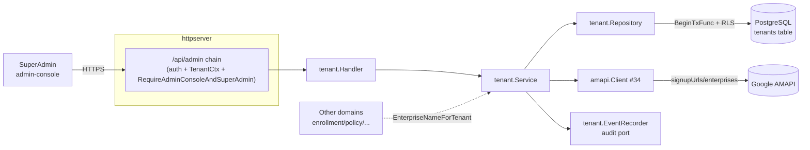
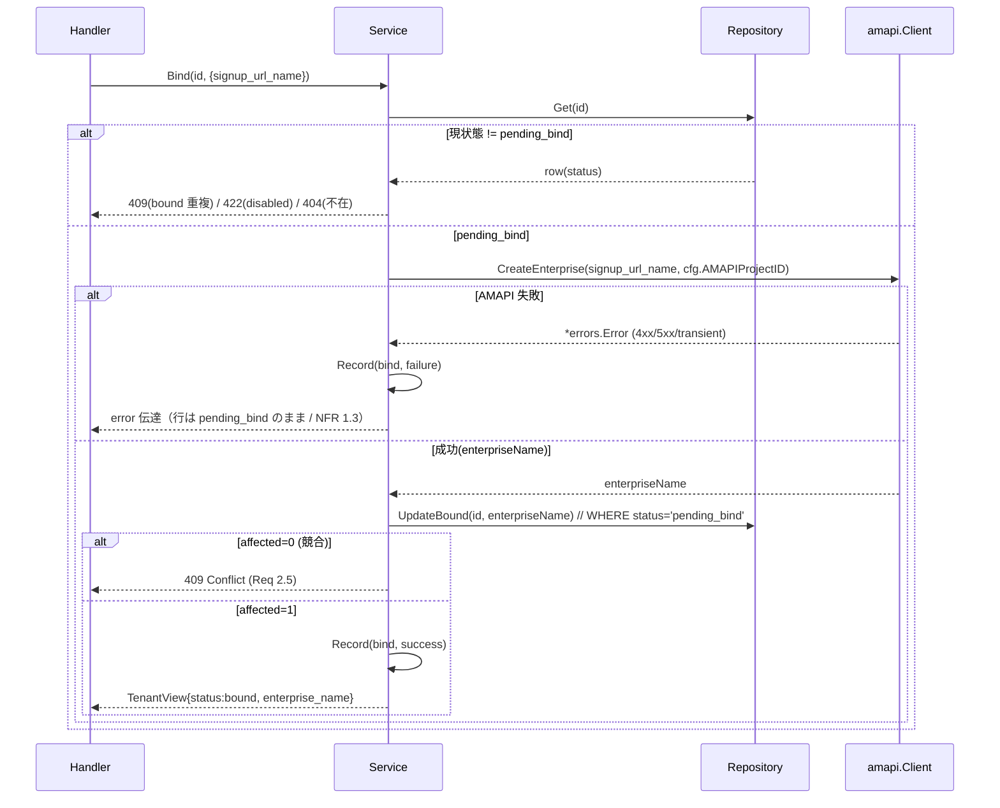
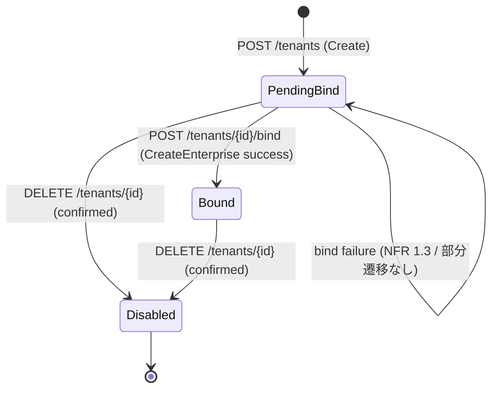

# Design Document

## Overview

**Purpose**: 本機能は **SaaS 運用者（SuperAdmin）が admin-console から顧客企業ごとのテナントを
作成・Enterprise バインド・無効化・参照できる Tenant ドメイン Service** を、ae-mdm backend
（Go）に追加する。Tenant 文脈はマルチテナント全機能（エンロール・ポリシー・端末・コマンド・
アプリ・監査）のテナント分離の起点であり、本サービスがその基盤を提供する。

**Users**: SuperAdmin が admin-console（`/api/admin/tenants` 配下）の workflow
「テナント作成 → サインアップ URL を Google に渡して管理者がサインアップ → Enterprise バインド →
（解約時）二段階確認のうえ無効化」で利用する。他ドメイン（端末・ポリシー等）は、業務操作の
前提として「当該テナントが bound か / enterprise 識別子は何か」を Tenant Service 経由で参照する。

**Impact**: 現在 backend は認証基盤（#33）/ 認可基盤（#37）/ AMAPI Client（#34）/ DB+RLS 基盤
（umbrella tasks 2.x、`tenants` テーブル・RLS は migration 0001 / 0011 で**既に存在**）まで
実装済みで、ドメイン Service はまだ `internal/auth` のみ。本機能は `internal/tenant` パッケージを
新設し、既存の `Routers.Admin`（`/api/admin` サブルータ + 2 条件 AND ガード）に Tenant Handler を
mount することで、Tenant ライフサイクル管理 API を初めて稼働可能にする。

> **分量について**: 本 design は「複雑（複数モジュール横断 + 状態機械 + 既存 IF 整合）」に該当
> するが、既存資産（`tenants` テーブル・RLS・AMAPI Client・admin ガード）を再利用するため
> 600 行目安内に収める。既存コードは `file:line` 参照で指し、逐語転載しない。

### Goals
- `pending_bind → bound → disabled` の状態機械を持つ Tenant ライフサイクル管理 Service を提供する（Req 1〜4 / NFR 1）。
- 既存 AMAPI Client（#34）の `CreateSignupURL` / `CreateEnterprise` を**実在シグネチャ通り**に
  オーケストレーションし、Enterprise バインドの部分遷移を防ぐ（Req 1.2 / 2.1〜2.4 / NFR 1.3）。
- 全エンドポイントを既存 `/api/admin` ガード（#37 `RequireAdminConsoleAndSuperAdmin`）配下に置き、
  非 SuperAdmin / tenant-console aud / 未認証を 403 / 403 / 401 で拒否し、存在を露出しない（Req 6）。
- 業務操作の前提ガードとして「未バインド / 無効化判定」「enterprise 識別子の参照経路」を公開する（Req 5）。
- 各操作の監査イベントを Audit 記録ポート経由で渡し、機密値をログに出さない（NFR 2 / 3）。

### Non-Goals
- AMAPI 低レベル呼び出し（`CreateSignupURL` / `CreateEnterprise` 実装）— #34 済み。
- `/api/admin` ガード自体・RBAC マトリクス — #37 済み。`tenants` テーブル DDL / RLS の新規作成 — umbrella 0001 / 0011 で済み。
- audit_logs への永続化ロジック自体 — Audit Service Issue。本サービスは記録ポートに渡すのみ。
- admin-console UI / セルフサインアップ / テナント配下リソースのカスケード処理。
- 再有効化フロー（disabled→bound）/ バインドへの二段階確認 / 一覧ページング（→ 末尾「確認事項」）。

## Architecture

### Existing Architecture Analysis

- **ドメイン分割パターン**（`internal/auth` 準拠）: 1 ドメイン = `handler.go`（HTTP I/O）/
  `service.go`（ユースケース）/ `repository.go`（DB I/O）/ `types.go`（ドメイン型）。Service /
  Repository は interface 公開 + 本番実装 struct。テストは同パッケージ `*_test.go`。
- **DB アクセス**: `internal/auth/repository.go` は **sqlc を使わず raw SQL**（`tx.Exec` /
  `tx.QueryRow`）+ `db.BeginTxFunc` でトランザクション境界を囲う。`sqlc.yaml` は scaffold のみで
  `db/queries/` は空（`.gitkeep`）。→ 本サービスも **raw SQL を踏襲**（sqlc 生成は導入しない）。
- **TenantContext / RLS**: `db.BeginTxFunc`（`internal/platform/db/txmanager.go:36`）が tx 内で
  `SetLocalTenant`（`db/rls.go:36`）を発行し、`app.tenant_id` / `app.is_superadmin` GUC を立てる。
  SuperAdmin 文脈は `db.WithTenantContext(ctx, db.TenantContext{IsSuperAdmin:true})`
  （`internal/auth/repository.go:81` の `superAdminContext` と同型）で確立する。
- **`/api/admin` ガード**: `httpserver.RequireAdminConsoleAndSuperAdmin`
  （`admin_middleware.go:107`）が admin chain（`server.go:129`）で固定適用済み。Tenant Handler は
  `Routers.Admin`（`server.go:148`）に mount するだけで Req 6.1〜6.4 を継承する。
- **エラー**: `internal/errors`（`Error{Code,Message,Cause,IsTransient}` + `WriteHTTP`）。Code →
  HTTP は `codes.go:44` で確定済み（400/401/403/404/409/422/502/503 等）。
- **解消する technical debt**: 無し（既存パターンに完全準拠）。新規 import cycle を作らない。

### Architecture Pattern & Boundary Map

**Architecture Integration**:
- 採用パターン: **Layered domain module**（既存 `internal/auth` と同型）。HTTP ⇄ Service ⇄
  Repository ⇄ DB、外部副作用（AMAPI / Audit）は interface ポートで注入。
- ドメイン／機能境界: 状態遷移の invariant 判定は **Service** に閉じる。HTTP 形式変換は Handler、
  SQL は Repository。AMAPI / Audit は port 経由で Service が呼ぶ。
- 既存パターンの維持: 認可は route-group ガードに委譲（Req 6 は domain で再実装しない）/
  raw SQL + `BeginTxFunc` / `WriteHTTP` での error 写像 / 機密値非ログ。
- 新規コンポーネントの根拠: Tenant ライフサイクルを所有する Service / Repository が存在しないため。



### Technology Stack

| Layer | Choice / Version | Role in Feature | Notes |
|-------|------------------|-----------------|-------|
| CLI / Frontend | （対象外） | — | admin-console UI は別 Issue |
| Backend / Services | Go 1.22 + chi v5 | `internal/tenant` ドメイン | 既存 `internal/auth` と同パターン |
| Data / Storage | PostgreSQL（pgx v5） | `tenants` テーブル（既存）+ RLS | 既存 migration 0001 / 0011 を利用 |
| External | AMAPI Client（`internal/platform/amapi` #34） | Enterprise 作成代行 | `CreateSignupURL` / `CreateEnterprise` |
| Cross-cutting | `internal/errors` / `internal/logger` / `internal/config` | error 写像 / 監査ログ / `AMAPIProjectID` | 既存規約踏襲 |

## File Structure Plan

新規パッケージ `backend/internal/tenant/`（`internal/auth` と同パターン）。`backend/` は Go module
root、migration は `backend/db/migrations/`、結合テストは既存 harness `backend/test/integration/`。

### Directory Structure

```
backend/
├── internal/
│   └── tenant/                    # 新規: Tenant ドメイン（Requirement 1〜5 / NFR 1〜3）
│       ├── types.go               # Tenant / Status enum / Create/Bind/Disable 入出力 DTO / EventRecorder port / ErrXxx sentinel
│       ├── repository.go          # tenants テーブル raw SQL（SuperAdmin ctx + BeginTxFunc）/ 楽観競合制御
│       ├── service.go             # 状態機械・AMAPI オーケストレーション・監査イベント発火（Req 1〜5 / NFR 1〜3）
│       ├── handler.go             # /api/admin/tenants 配下 5 endpoint + Mount(r chi.Router)
│       ├── audit_log.go           # EventRecorder の logger 実装（interim binding / 機密値 redact）
│       ├── service_test.go        # Service 単体テスト（StubClient + fake Repository/Recorder）= in-package / DB 非依存
│       └── handler_test.go        # Handler 単体テスト（httptest + fake Service / 入力検証 / 存在露出なし）= in-package
├── test/integration/             # 既存の結合テスト harness（実 PostgreSQL、DB env 未設定なら t.Skip）
│       └── tenant_repository_test.go  # 新規: RLS テナント分離 / 二重 bind・二重 disable 競合 / 状態遷移（既存 helpers_test.go 流用）
└── db/
    └── migrations/
        ├── 0016_tenants_bind_disable_metadata.up.sql    # 新規: enterprise_name 部分一意 index + disabled 監査列
        └── 0016_tenants_bind_disable_metadata.down.sql  # 上記の逆操作
```

> **テスト配置の根拠**: 実 PostgreSQL を要する結合テストは既存 harness `backend/test/integration/`
> （`helpers_test.go` の `requireDBURLs` / `applyMigrationsUp` / `truncateAll` / `seedTenant` を
> 流用、DB env 未設定なら自身で `t.Skip`）に置く（`db_tenant_isolation_test.go` /
> `auth_repository_test.go` と同パターン）。Service / Handler の純ロジック単体テストは fake /
> StubClient を使い in-package（DB 非依存）に置く。これにより `go test ./...` は DB 不在環境でも
> 結合テストが skip されて成功する。

### Modified Files
- **無し（DI bootstrap は本 Issue 範囲外）**: 本 Issue 時点で `cmd/api/main.go` は未存在のため
  bootstrap 配線は行わない。Handler は `Mount(r chi.Router)` を公開し、将来の main が
  `routers.Admin`（`server.go:26-36` の公開ポイント）に mount する（`internal/auth.Handler.Mount`
  と同方式）。`server.go` 自体の変更は不要（mount は呼び出し側責務）。

> **既存 `tenants` 関連ファイルとの関係**: migration `0001_create_tenants.up.sql` /
> `0011_enable_rls.up.sql`（`tenant_isolation_tenants` ポリシー）は既存。0016 は ALTER のみで
> 再作成しない。

## Requirements Traceability

| Requirement | Summary | Components | Interfaces | Flows |
|-------------|---------|------------|------------|-------|
| 1.1 | テナント生成 + pending_bind 保存 | Service, Repository | `Create` | テナント作成 |
| 1.2 | サインアップ URL 生成・返却 | Service, amapi.Client | `Create`→`CreateSignupURL` | テナント作成 |
| 1.3 | 名称空/欠落で不正入力エラー | Handler, Service | `Create` 入力検証 | 作成エラー |
| 1.4 | URL 生成失敗時 pending_bind 維持 | Service | `Create` 失敗経路 | 作成エラー |
| 1.5 | 作成イベント監査記録 | Service, EventRecorder | `Record` | 作成 |
| 2.1 | Enterprise 作成 + 識別子保存 | Service, amapi.Client, Repository | `Bind`→`CreateEnterprise` | バインド |
| 2.2 | bound へ遷移 | Service, Repository | `Bind` | バインド |
| 2.3 | enterprise 識別子を参照可能に保持 | Service, Repository | `Get`/`EnterpriseNameForTenant` | 参照 |
| 2.4 | 失敗時 pending_bind 維持・識別子未保存 | Service | `Bind` 失敗経路 | バインドエラー |
| 2.5 | bound への重複 bind を競合拒否 | Service | `Bind` 前提判定 | バインドエラー |
| 2.6 | disabled への bind を拒否 | Service | `Bind` 前提判定 | バインドエラー |
| 2.7 | バインドイベント監査記録 | Service, EventRecorder | `Record` | バインド |
| 3.1 | 二段階確認完了で disabled 遷移 | Service, Repository | `Disable` | 無効化 |
| 3.2 | 確認未完了で確認エラー | Handler, Service | `Disable` 確認検証 | 無効化エラー |
| 3.3 | disabled は作成/bind/更新拒否 | Service | 前提判定 | 全更新系 |
| 3.4 | 二重無効化を競合拒否 | Service | `Disable` 前提判定 | 無効化エラー |
| 3.5 | 無効化イベント監査記録 | Service, EventRecorder | `Record` | 無効化 |
| 4.1 | 一覧（id/name/status） | Service, Repository | `List` | 一覧 |
| 4.2 | 詳細（+enterprise 識別子） | Service, Repository | `Get` | 詳細 |
| 4.3 | 不在は未検出 | Service, Repository | `Get` | 詳細エラー |
| 4.4 | 0 件は空リスト | Repository | `List` | 一覧 |
| 5.1 | 未バインド判定可能 | Service | `EnterpriseNameForTenant` | 前提ガード |
| 5.2 | pending_bind で識別子要求はエラー | Service | `EnterpriseNameForTenant` | 前提ガード |
| 5.3 | disabled で識別子要求は不許可伝達 | Service | `EnterpriseNameForTenant` | 前提ガード |
| 6.1 | `/api/admin` 配下で提供 | Handler.Mount | `Routers.Admin` | 全 endpoint |
| 6.2 | tenant-console aud を 403 | RequireAdminConsoleAndSuperAdmin（#37 既存） | route guard | 認可 |
| 6.3 | 非 SuperAdmin を 403 | 同上 | route guard | 認可 |
| 6.4 | 未認証を 401 | 同上 | route guard | 認可 |
| 6.5 | 存在露出なし | Handler, Service | error body 規約 | 全 endpoint |
| NFR 1.1 | 状態 3 値のいずれか 1 つ | types.Status enum, DB enum 制約 | — | — |
| NFR 1.2 | 未定義遷移を不正遷移エラー | Service | 状態機械判定 | 全遷移 |
| NFR 1.3 | bind 途中失敗で部分遷移なし | Service | `Bind` 失敗経路 | バインドエラー |
| NFR 2.1 | 操作の監査記録項目を渡す | Service, EventRecorder | `Record` | 全操作 |
| NFR 2.2 | 拒否操作の構造化ログ | Service, audit_log.go | logger | 拒否経路 |
| NFR 2.3 | 秘密値をログに出さない | audit_log.go, Service | redact 規約 | 全ログ |
| NFR 3.1 | 状態を永続ストアに保持 | Repository | `tenants` テーブル | 全操作 |

## Components and Interfaces

### Domain Layer (Tenant)

#### tenant.Service

| Field | Detail |
|-------|--------|
| Intent | Tenant ライフサイクル（作成/バインド/無効化/参照/前提ガード）と状態機械の単一所有者 |
| Requirements | 1.1,1.2,1.4,1.5,2.1〜2.7,3.1〜3.5,4.1〜4.3,5.1〜5.3,6.5,NFR 1.2,1.3,2.1 |

**Responsibilities & Constraints**
- 主責務: 前提状態判定（状態機械） → AMAPI オーケストレーション → Repository 永続化 → 監査記録、を
  ユースケース単位で行う。`Bind` は「現状態 pending_bind 検証 → `CreateEnterprise` → 成功時のみ
  bound + enterprise_name 保存」の順で、失敗時は永続化前に return し pending_bind を保つ（NFR 1.3）。
- ドメイン境界・トランザクションスコープ: 状態前提判定と更新は **条件付き UPDATE（WHERE status=...）の
  影響行数**で楽観的に競合制御し、二重 bind / 二重無効化を防ぐ（Req 2.5 / 3.4）。AMAPI 呼び出しは
  tx の **外**（長時間 I/O を tx に含めない）に置く: `Bind` は ①Repository.Get で現状態 pending_bind
  を確認 → ②AMAPI `CreateEnterprise` → ③`UpdateBound`（WHERE status='pending_bind'）で bound 確定。
  ③の affected=0 は他要求との競合とみなし 409 を返す（後述「処理フロー」参照）。
- データ所有権・invariants: `tenants` 行の status / enterprise_name。status は常に 3 値のいずれか
  （NFR 1.1）。enterprise_name は bound 時のみ非 NULL（Req 2.1 / 2.4 / NFR 1.3）。

**Dependencies**
- Inbound: `tenant.Handler` — HTTP 入力 (Critical)
- Outbound: `tenant.Repository` — 永続化 (Critical), `amapi.Client` — Enterprise 作成 (Critical),
  `tenant.EventRecorder` — 監査記録 (Important), `config.Config.AMAPIProjectID` — `CreateEnterprise`
  の projectID 引数 (Critical / #34 impl-notes「確認事項」で Tenant 側責務と確定)
- External: AMAPI（amapi.Client 経由） (Critical)

**Contracts**: Service [x] / API [ ] / Event [x] / Batch [ ] / State [x]

##### Service Interface

```go
// 疑似シグネチャ（実装本文は Developer に委ねる）
type Service interface {
    Create(ctx context.Context, in CreateInput) (TenantView, SignupURL, error)        // Req 1.x
    Bind(ctx context.Context, id uuid.UUID, in BindInput) (TenantView, error)         // Req 2.x / NFR 1.3
    Disable(ctx context.Context, id uuid.UUID, in DisableInput) (TenantView, error)   // Req 3.x
    Get(ctx context.Context, id uuid.UUID) (TenantView, error)                        // Req 4.2 / 4.3
    List(ctx context.Context) ([]TenantView, error)                                   // Req 4.1 / 4.4
    EnterpriseNameForTenant(ctx context.Context, id uuid.UUID) (string, error)        // Req 5.1〜5.3
}
```
- Preconditions: ctx に SuperAdmin TenantContext / AuthClaims が確立済み（admin chain 通過後）。
  `CreateInput.Name` は空白 trim 後非空（空は Handler/Service で CodeInvalidRequest / Req 1.3）。
- Postconditions: 状態遷移は定義済み遷移のみ成功（NFR 1.2）。各成功/失敗で監査イベント発火（NFR 2.1）。
  `EnterpriseNameForTenant` は bound のみ非空文字 + nil、pending_bind は `CodeBusinessRule`、disabled は
  `CodeBusinessRule`（理由区別可能な Message/sentinel）、不在は `CodeNotFound`。
- Invariants: enterprise_name 保存と bound 遷移は不可分（同一条件付き UPDATE）。disabled は終端
  （本 Issue では再有効化遷移を持たない / 確認事項参照）。

##### 処理フロー（Bind の部分遷移防止 / NFR 1.3）



#### tenant.Repository

| Field | Detail |
|-------|--------|
| Intent | `tenants` テーブルへの raw SQL アクセス（SuperAdmin ctx + BeginTxFunc）と競合制御 |
| Requirements | 1.1,2.1,2.3,3.1,4.1〜4.4,NFR 1.1,3.1 |

**Responsibilities & Constraints**
- 主責務: `Insert`（pending_bind 行作成）/ `Get` / `List`（全件）/ `UpdateBound`（enterprise_name +
  status=bound、WHERE status='pending_bind'）/ `UpdateDisabled`（status=disabled、WHERE
  status!='disabled'、disabled_at/disabled_by も更新）。
- 全メソッドは `superAdminContext(ctx)` + `db.BeginTxFunc` で実行（`internal/auth/repository.go:81`
  と同型 / SuperAdmin のみ全 tenants 行可視 = RLS `tenant_isolation_tenants` 0011 と整合）。
- 競合検出: 条件付き UPDATE の影響行数 0 → 競合 / 状態不整合（Service が 409 / 422 に写像）。不在
  SELECT は `pgx.ErrNoRows` → `CodeNotFound`（Req 4.3）。enterprise_name 二重バインドは部分一意
  index 違反（pgerrcode 23505）→ `CodeConflict`。

**Contracts**: Service [x] / API [ ] / Event [ ] / Batch [ ] / State [ ]

```go
type Repository interface {
    Insert(ctx context.Context, t TenantRow) error
    Get(ctx context.Context, id uuid.UUID) (TenantRow, error)        // 0 行 → CodeNotFound
    List(ctx context.Context) ([]TenantRow, error)                   // 0 件 → 空 slice
    UpdateBound(ctx context.Context, id uuid.UUID, enterpriseName string) (int64, error)  // affected rows
    UpdateDisabled(ctx context.Context, id uuid.UUID, actor uuid.UUID) (int64, error)     // affected rows
}
```

#### tenant.EventRecorder（audit port）

| Field | Detail |
|-------|--------|
| Intent | 監査イベントを Audit Service へ渡すための port。Audit Service 未実装のため interim は logger 実装 |
| Requirements | 1.5,2.7,3.5,NFR 2.1,2.2,2.3 |

**Responsibilities & Constraints**
- `Record(ctx, Event)` のみ。Event は `{Actor, TenantID, Operation(create/bind/disable),
  Result(success/failure), ConfirmationCompleted(bool), DenyReason(string)}`。
- 機密値（サインアップ URL の秘密パラメータ・SA 資格情報・OAuth トークン）を Event に含めない
  （NFR 2.3）。`audit_log.go` の logger 実装は `internal/logger` で構造化出力する。
- **投機的抽象化を避ける**: port は最小（Record 1 本）。Audit Service 実装後に当該 Service の
  Recorder へ差し替える（DI 配線は将来 main の責務）。

**Contracts**: Service [ ] / API [ ] / Event [x] / Batch [ ] / State [ ]

### Presentation Layer

#### tenant.Handler

| Field | Detail |
|-------|--------|
| Intent | `/api/admin/tenants` 配下 5 endpoint の HTTP I/O。Service へ委譲し error を `WriteHTTP` で写像 |
| Requirements | 1.3,3.2,4.1〜4.3,6.1,6.5 |

**Responsibilities & Constraints**
- `Mount(r chi.Router)` で admin サブルータ（`Routers.Admin`）配下に sub-route 登録
  （`internal/auth/handler.go:52` の `Mount` と同方式）。
- リクエスト JSON decode / 入力検証（name 空 → 400 / Req 1.3、confirmation 欠落 → Service で 422 /
  Req 3.2）。レスポンスは `TenantView` を JSON で返す。actor_id は
  `httpserver.AuthClaimsFromContext`（`middleware.go:104`）で取得し Service の監査イベントに渡す。
- **存在露出なし（Req 6.5）**: 認可拒否は route guard が `WriteHTTP` で対象 ID を含めない body を
  返す（既存 `admin_middleware.go` 実装が担保）。Handler 側も error body に隣接テナントの存在差を
  漏らさない（`Get` の 404 は固定 message / `WriteHTTP` 経由）。

**Contracts**: Service [ ] / API [x] / Event [ ] / Batch [ ] / State [ ]

##### API Contract

すべて `/api/admin` 配下（#37 `RequireAdminConsoleAndSuperAdmin` 継承 → 共通エラー 401 未認証 /
403 非 admin-console aud / 403 非 SuperAdmin）。

| Method | Endpoint | Request | Response | Errors（ガード共通の 401/403 に加えて） |
|--------|----------|---------|----------|-----------------------------------------|
| POST | /api/admin/tenants | `{name}` | `{id,name,status:"pending_bind",signup_url}` | 400(name 空/JSON 不正), 502(AMAPI 上流), 503 |
| POST | /api/admin/tenants/{id}/bind | `{signup_url_name}` | `{id,name,status:"bound",enterprise_name}` | 400, 404, 409(bound 重複), 422(disabled へ bind), 502 |
| DELETE | /api/admin/tenants/{id} | `{confirmation}` (二段階確認入力) | 204 | 400, 404, 409(二重無効化), 422(確認未完了) |
| GET | /api/admin/tenants | — | `[]TenantView` | 503 |
| GET | /api/admin/tenants/{id} | — | `TenantView` | 404 |

> Error Code 対応は `internal/errors/codes.go:44` の既定写像に従う（CodeInvalidRequest=400 /
> CodeNotFound=404 / CodeConflict=409 / CodeBusinessRule=422 / CodeUpstream=502 /
> CodeUnavailable=503）。`Bind` の disabled 拒否は意味的に「前提状態違反」= 422（CodeBusinessRule）、
> bound 重複は「競合」= 409（CodeConflict）。
>
> **二段階確認の入力契約（設計確定 / Open Question 対応）**: DELETE の二段階確認は
> **確認テキスト方式**を採用する。リクエスト body の `confirmation` フィールドに**対象テナントの
> name を再入力**させ、Service が `tenants.name` と完全一致するかを検証する（一致しなければ 422
> 確認未完了 / Req 3.2）。確認トークン発行 API は新設しない（MVP で別 endpoint を増やさない判断）。

##### State（状態機械）



不正遷移（NFR 1.2）の扱い:
- `bound` への再 bind → 409 Conflict（Req 2.5、新規 Enterprise を作らない）
- `disabled` への bind → 422 BusinessRule（Req 2.6）
- `disabled` への再 disable → 409 Conflict（Req 3.4）
- 上記以外の未定義遷移要求は前提状態判定で拒否し、CodeBusinessRule を返す（NFR 1.2）

## Data Models

### Domain Model
- **Tenant Aggregate**: `tenants`（root）。値オブジェクト `Status`（pending_bind/bound/disabled）。
  ドメインイベント: TenantCreated / TenantBound / TenantDisabled（EventRecorder に渡す論理イベント）。
- トランザクション境界: 1 HTTP リクエスト = 1 ユースケース。`Bind` のみ AMAPI I/O を tx 外に挟む
  （Get → AMAPI → 条件付き UpdateBound）。

### Logical / Physical Data Model

`tenants` テーブルは **既存**（migration 0001）。本 Issue では 0016 で以下のみ追加:

| 変更 | 内容 | 根拠 |
|------|------|------|
| 部分一意 index | `CREATE UNIQUE INDEX ... ON tenants (enterprise_name) WHERE enterprise_name IS NOT NULL` | 同一 Enterprise の二重バインド防止（Req 2.x の invariant 補強） |
| 監査列 | `disabled_at timestamptz NULL` / `disabled_by uuid NULL` | 無効化の実行者・時刻を行内に残す（NFR 2.1 の補助。audit_logs 本体は別 Issue） |

既存カラム: `id uuid PK / name text NOT NULL / status tenant_status NOT NULL DEFAULT 'pending_bind' /
enterprise_name text NULL / created_at / updated_at`（0001）。RLS: `tenant_isolation_tenants`
（SuperAdmin のみ全行可視 / 0011）。本サービスは Repository が SuperAdmin ctx で全 tenants を操作。

> **enterprise 識別子の保持先・参照経路（設計確定 / Open Question 対応）**: enterprise 識別子は
> `tenants.enterprise_name` カラムに保持し、他ドメインは **Tenant Service の公開 IF
> `EnterpriseNameForTenant(ctx, id)` 経由**でのみ参照する（共有ストアの直接読みは許容しない）。
> これにより pending_bind / disabled の前提ガード（Req 5.2 / 5.3）を Service に集約できる。
>
> **テナント分離方針**: tenants テーブル自体は SuperAdmin 専用（0011 ポリシーで非 SuperAdmin は
> 0 行）。他ドメインのテナント分離（devices/policies 等）は各テーブルの `tenant_id` + RLS で別途
> 担保される（umbrella 2.3）。本サービスのスコープは tenants 行の管理に限定。

## Error Handling

### Error Strategy
- Service / Repository は `*errors.Error`（Code 付き）を返し、Handler 最外層で
  `errors.WriteHTTP(w, r, err, log)` が Code → HTTP status + JSON body に写像（`http_mapping.go`）。
- AMAPI 由来 error は #34 が既に Code 正規化済み（4xx=非 transient / 429・5xx=CodeUpstream+transient）。
  Service はこれを **そのまま伝播**（再分類しない / Req 1.4 の「再試行不可エラーを伝達」と整合）。
- fail-closed: 状態前提判定で曖昧な場合は拒否側へ倒す。条件付き UPDATE 0 行は競合として扱う。

### Error Categories and Responses
- **User Errors (4xx)**: name 空（400 / Req 1.3）、JSON 不正（400）、不在 ID（404 / Req 4.3 / 6.5 は
  固定 message で存在差を露出しない）。
- **System Errors (5xx)**: AMAPI 上流（502 / Req 1.4 で pending_bind 維持しつつ伝達）、DB 不通（503）。
- **Business Logic Errors (422 / 409)**: 確認未完了（422 / Req 3.2）、disabled への bind（422 / Req 2.6）、
  bound 重複 bind（409 / Req 2.5）、二重無効化（409 / Req 3.4）、未定義遷移（422 / NFR 1.2）。
  body には状態遷移ガイダンス（現状態・許可された遷移）を **テナント存在を露出しない範囲で**含める。

## Testing Strategy

- **Unit Tests（Service `service_test.go` / Handler `handler_test.go`、StubClient + fake）**:
  1. Create: name 空 → CodeInvalidRequest（Req 1.3）/ 正常 → pending_bind + signup_url 返却（Req 1.1/1.2）。
  2. Create: `CreateSignupURL` 非 transient error → エラー伝達 + tenant が bound に進まない（Req 1.4）。
  3. Bind: `CreateEnterprise` 失敗 → bound へ遷移せず `UpdateBound` 未呼出（Req 2.4 / NFR 1.3、fake Repository の呼出記録で検証）。
  4. Bind: bound 再 bind → 409 + `CreateEnterprise` 未呼出（Req 2.5、StubClient.CallCount==0）/ disabled → 422（Req 2.6）。
  5. Disable: 確認テキスト不一致 → 422（Req 3.2）/ 二重無効化（UpdateDisabled affected=0）→ 409（Req 3.4）/ NFR 1.2 未定義遷移拒否。
  6. EnterpriseNameForTenant: bound→値, pending_bind→422, disabled→422, 不在→404（Req 5.1〜5.3）。
  7. Handler: name 空 JSON → 400 / 不在 ID GET → 404 で body にテナント存在差を露出しない（Req 1.3 / 6.5）。
- **Integration Tests（`backend/test/integration/tenant_repository_test.go`、実 PostgreSQL + RLS）**:
  1. SuperAdmin ctx で Insert/Get/List/UpdateBound/UpdateDisabled が RLS 下で動作（NFR 3.1）。
  2. **テナント分離**: 非 SuperAdmin ctx（`tenant_isolation_tenants`）で tenants が 0 行（Req 6 / 1.4 系）。
  3. **二重 bind 競合**: 同一 id に UpdateBound を 2 回 → 1 回目 affected=1、2 回目 affected=0（Req 2.5）。
     enterprise_name 部分一意 index 違反（別 tenant に同一 enterprise_name）を 23505 で検出。
  4. 二重 disable: 2 回目 UpdateDisabled affected=0（Req 3.4）。
- **E2E/Guard Tests（`backend/test/integration/`、admin chain 経由の既存 `http_subrouter_mount_test.go` 流用）**:
  1. tenant-console aud token → 403、未認証 → 401、admin-console+SuperAdmin → 200（Req 6.2〜6.4、既存ガード継承の回帰）。
  2. Mount 後 `/api/admin/tenants` が admin chain を通過し domain handler に到達することを確認。

## Security Considerations
- 全 endpoint は `/api/admin` 配下に固定（Req 6.1）。認可は #37 route guard に一元化し、domain で
  audience/role を再判定しない（二重実装回避 + 単一責務）。SuperAdmin のみ tenants 行へ到達可能
  （RLS 0011 + guard の二重防御）。
- 機密値（signup_url の秘密 query・SA credentials・OAuth token）はログ / error message / 監査 Event に
  含めない（NFR 2.3）。`signup_url` は HTTP レスポンス body にのみ載せ、構造化ログには出さない。

## Supporting References
- AMAPI Client 実 IF: `backend/internal/platform/amapi/client.go:29-51`（interface）/ `enterprises.go`。
  `CreateSignupURL(ctx) (signupURL, signupURLName, error)` / `CreateEnterprise(ctx, signupURLName,
  projectID) (enterpriseName, error)`。projectID は `config.Config.AMAPIProjectID` を Service が渡す
  （#34 impl-notes「確認事項」で確定）。テストは `amapi.StubClient`（`stub.go`）の `OnCreateSignupURL`
  / `OnCreateEnterprise` フック + `CallCount` を利用。
- `/api/admin` ガード: `backend/internal/platform/httpserver/admin_middleware.go:107` /
  mount ポイント `server.go:26-36`（`Routers.Admin`）。
- 既存ドメイン分割 / raw SQL + BeginTxFunc + superAdminContext:
  `backend/internal/auth/{handler,service,repository,types}.go`。
- 結合テスト harness: `backend/test/integration/helpers_test.go`（`requireDBURLs` / `applyMigrationsUp`
  / `truncateAll` / `seedTenant`）。

## 確認事項（人間判断 / 要件変更を伴うため設計で確定しない）
以下は requirements.md「Open Questions」のうち**要件変更を伴う**論点。設計では既定挙動（不可逆・
バインド確認なし・全件返却）を採用したが、要否は設計 PR レビューで人間判断を仰ぐ:
- **再有効化フロー**: 本設計は disabled を終端とし disabled→bound 遷移を持たない（NFR 1.2 準拠）。
  再有効化要件を将来追加するか。
- **バインドへの二段階確認**: バインドは原則可逆ではないため二段階確認を課さない解釈を採用。
  umbrella NFR 4.1 との関係で確認要否。
- **一覧ページング**: `List` は全件返却（Req 4.1）。MVP テナント数で十分の想定だが、件数増加時の
  ページング API 追加要否。

> なお、design 領分の Open Question（enterprise 識別子の保持先・参照経路 / 二段階確認の入力契約 /
> 無効化の不可逆性の実装上の扱い）は本 design 内で確定済み（Data Models / API Contract /
> State 節を参照）。
