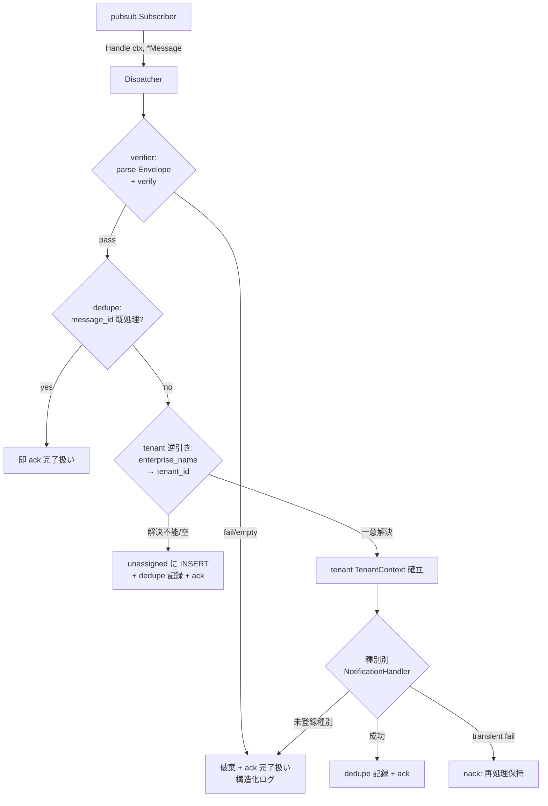

# Design Document

## Overview

**Purpose**: 本機能は、AMAPI が Pub/Sub 経由で at-least-once 配信する通知（ENROLLMENT /
STATUS_REPORT / COMMAND）を **冪等に処理し、種別ごとのドメインハンドラへ振り分け、テナントを
特定できない通知を退避する基盤**を SaaS 運営者に提供する。これにより端末インベントリ・コマンド
状態の二重更新を防ぎつつ、誤配信・設定漏れによる越境更新も防ぎ、取りこぼしも起こさない。

**Users**: SaaS 運営者（worker プロセスを介した自動処理の受益者）と SuperAdmin（退避された
未割当通知を admin-console から閲覧して誤配信を検知する運用者）が利用する。各ドメインハンドラ
（ENROLLMENT / STATUS_REPORT / COMMAND の実体）は後続 Issue の所有であり、本 Dispatcher は
`NotificationHandler` interface 経由で振り分けるのみ。

**Impact**: 現在 worker プロセスは #35 で配線された subscriber 基盤の上に **暫定 handler**
（`pendingDispatchHandler`、全メッセージを nack して保持）のみを持つ。本機能は新規パッケージ
`internal/notification/` を追加し、`pubsub.MessageHandler` を満たす実 Dispatcher を **構築・注入
可能な形で提供**する。加えて退避キュー閲覧 API（`GET /api/admin/notifications/unassigned`）を
admin route group へ配線する。worker entry（`cmd/worker`）への実 Dispatcher の wire-in は #35 の
責務であり本 Issue scope 外（暫定 handler のまま据え置く）。

本 design は umbrella spec `docs/specs/24-android-enterprise-emm-mvp/design.md` の
「Notification Dispatcher (Worker)」節（L847〜）・通知処理エラー分岐図（L998〜）・Logical Data
Model（L935-936）・API 表（L894）で **設計確定済みのスライス**を具体化したものであり、再設計は
行わない。

> **分量について**: 本 design は新規パッケージ 1 つ（5 ファイル）+ tenant パッケージへの逆引き
> メソッド追加 + cmd/api 配線 + 結合テストを横断する複雑機能であり、Components 数が多い。
> 簡潔化のため既存コードは `file:line` 参照で指し、コード逐語転載は避け、Traceability は 1 AC
> 1 行に圧縮している。

### Goals

- at-least-once 通知の MessageID 単位の冪等処理（`notification_dedupe` PK + `ON CONFLICT DO NOTHING`）
- 通知種別（ENROLLMENT / STATUS_REPORT / COMMAND）ごとの `NotificationHandler` への振り分け
- `enterprise_name → tenant_id` を解決できない通知の `unassigned_notifications` 退避 + ack 完了扱い
- 退避キュー閲覧 API（`GET /api/admin/notifications/unassigned`、SuperAdmin 専用、from/to/type 絞り込み）
- 既存 `pubsub.MessageHandler` / `errors.ShouldAck` / admin middleware の再利用による配線整合
- 上記主要動線の結合テスト（冪等性 1 回処理 / 未割当退避 / 種別振り分け / 退避閲覧）

### Non-Goals

- 各ドメインハンドラ（ENROLLMENT / STATUS_REPORT / COMMAND）の実体（後続 Issue #7.2 / #9.2 / #10.2）
- worker entry（`cmd/worker`）への実 Dispatcher の wire-in（#35 の責務 / 暫定 handler のまま）
- Pub/Sub クライアント・subscriber 基盤（#35 で実装済み。本 Dispatcher は `MessageHandler` を実装するのみ）
- `notification_dedupe` / `unassigned_notifications` テーブルの新規マイグレーション（既存 `0010` / `0011` を消費）
- 退避済み通知の再処理・再投入（リドライブ）UI / API、dead-letter キューの構成・運用方針
- dead-letter topic への実送出（subscriber の `PublishToDeadLetter` が既存。本 Issue では検証失敗・空 payload は破棄 ack に倒す）

## Architecture

### Existing Architecture Analysis

- **DB アクセス方式**: 手書き repository + pgxpool（`sqlc` は未運用 / `db/queries/` は空）。
  既存は `audit.NewRepository(pool)` / `tenant.NewRepository(pool)` のパターン。本 Dispatcher も
  踏襲する。
- **トランザクション / RLS**: `db.BeginTxFunc(ctx, pool, func(tx) error)` で tx を開く。
  `notification_dedupe` / `unassigned_notifications` / `tenants`（逆引き）はいずれも RLS で
  **SuperAdmin only**（`0011`）。`tenant/repository.go:78` の `superAdminContext(ctx)` ヘルパと
  同型で、tx 開始前に SuperAdmin TenantContext を確立して越境アクセスする。
- **Pub/Sub 統合点**: `pubsub.MessageHandler`（`Handle(ctx, *Message) error`）が既存
  （`subscriber.go:36`）。Dispatcher はこれを実装する。ack/nack は `errors.ShouldAck` が
  `IsTransient` フラグで決定（`worker_mapping.go:16`）。
- **admin API 認可**: `RequireAdminConsoleAndSuperAdmin`（admin-console aud + SuperAdmin、
  401/403 出し分け）が既存。`routers.Admin.Mount(...)` 配下にマウントすると認可は middleware
  が担い、ハンドラは 200 / 400（フィルタ検証）に集中する（`audit/admin_handler.go` と同型）。
- **解消する technical debt**: 暫定 `pendingDispatchHandler` を実 Dispatcher に置換可能にする
  （置換自体の wire-in は #35 / scope 外。本 Issue は注入可能な実 Dispatcher を提供するまで）。

### Architecture Pattern & Boundary Map

採用パターン: **per-domain package（`internal/notification`）+ Pipeline 段階処理**。Dispatcher が
1 メッセージごとに「検証 → 重複排除 → tenant 解決 → 種別 dispatch → dedupe 記録」の段階を直列に
通す（umbrella design L998 のフロー図と 1:1）。



**Architecture Integration**:
- 採用パターン: per-domain package + Pipeline。各段（verifier / dedupe / unassigned / dispatch）を
  独立した責務に分け、Dispatcher が orchestrate する。
- ドメイン／機能境界: `notification` パッケージが `notification_dedupe` / `unassigned_notifications`
  を所有。`tenants` の逆引きは **tenant パッケージの IF 経由**（後述 Risks の案 a）。
- 既存パターンの維持: repository + pgxpool / `BeginTxFunc` / `superAdminContext` / `ShouldAck` /
  admin middleware / chi `Mount`。
- 新規コンポーネントの根拠: umbrella design で確定済みの Dispatcher / dedupe / unassigned /
  admin_handler を具体化。

### Technology Stack

| Layer | Choice / Version | Role in Feature | Notes |
|-------|------------------|-----------------|-------|
| Worker / Handler | Go 1.x + `pubsub.MessageHandler` | Dispatcher が IF 実装 | #35 既存 IF を実装 |
| Backend / Services | Go（手書き service / repository） | dedupe / 退避 / 振り分け / 逆引き | audit/tenant パターン踏襲 |
| Data / Storage | PostgreSQL + pgxpool | `notification_dedupe` / `unassigned_notifications` / `tenants` | 既存スキーマ `0010` / `0011` を消費 |
| Messaging / Events | Cloud Pub/Sub（at-least-once） | subscriber → Dispatcher.Handle | ack/nack は `ShouldAck` |
| HTTP / Admin | chi + `RequireAdminConsoleAndSuperAdmin` | 退避キュー閲覧 API | `routers.Admin` 配下 Mount |
| Infrastructure / Runtime | `cmd/api`（admin API） | admin_handler 配線 | `cmd/worker` は scope 外 |

## File Structure Plan

### Directory Structure

```
backend/internal/notification/          # 新規パッケージ（notification ドメイン）
├── doc.go                              # パッケージ概要（audit/doc.go に倣う）
├── types.go                            # Envelope / NotificationType / UnassignedNotification / Filter / NotificationHandler IF
├── dispatcher.go                       # Dispatcher: pubsub.MessageHandler 実装。段階 orchestrate + ack/nack 用 error 種別
├── verifier.go                         # *Message → Envelope パース・検証（空 payload / 種別判定不能 / 検証失敗）
├── dedupe.go                           # notification_dedupe: ON CONFLICT DO NOTHING で冪等記録、既処理判定
├── unassigned.go                       # unassigned_notifications: 退避 INSERT + 閲覧 List（Filter 適用）
├── admin_handler.go                    # GET /api/admin/notifications/unassigned（chi handler、SuperAdmin 専用）
├── dispatcher_test.go                  # Dispatcher 段階分岐・ack/nack 種別（mock handler / mock repo）
├── verifier_test.go                    # Envelope パース正常系・空 payload・種別判定不能・検証失敗
├── dedupe_test.go                      # 既処理判定・ON CONFLICT 冪等（fake/mock）
├── unassigned_test.go                  # 退避 INSERT・Filter 適用ロジック
└── admin_handler_test.go              # filter parse（from/to/type）正常・不正（400）、200/空 []

backend/internal/tenant/
├── service.go                          # [Modified] TenantIDByEnterpriseName を Service IF + 実装に追加
├── repository.go                       # [Modified] TenantIDByEnterpriseName 用 SELECT（SuperAdmin context）
└── service_test.go / repository_test.go # [Modified] 逆引きの正常・不在・複数防御テスト

backend/cmd/api/
└── main.go                             # [Modified] notification admin_handler を routers.Admin に Mount

backend/test/integration/
└── notification_dispatch_test.go       # 新規: 冪等 1 回処理 / 未割当退避 / 種別振り分け / 退避閲覧 API
```

繰り返し構造（`*_test.go` は対象コード近傍に配置）は audit パッケージと同パターン。

### Modified Files
- `backend/internal/tenant/service.go` — `TenantIDByEnterpriseName(ctx, name) (uuid.UUID, bool, error)`
  を Service IF と実装に追加（案 a。enterprise_name → tenant_id 逆引き、bound テナントのみ、
  found=false で「未割当」を表現）。既存 `EnterpriseNameForTenant` の対称メソッド。
- `backend/internal/tenant/repository.go` — 上記を支える `SELECT id FROM tenants WHERE
  enterprise_name=$1 AND status='bound'` を `superAdminContext` + `BeginTxFunc` で実装。
  部分一意 index `uq_tenants_enterprise_name` により最大 1 件。
- `backend/cmd/api/main.go` — `notification.NewAdminHandler(...)` を構築し
  `routers.Admin.Mount("/notifications/unassigned", h)`（実 path `/api/admin/notifications/unassigned`）。
  audit/tenant の (7)(8) 配線ブロックと同パターン。

## Requirements Traceability

| Requirement | Summary | Components | Flows |
|-------------|---------|------------|-------|
| 1.1 | 未処理通知は dedupe 記録後に dispatch | Dispatcher, Dedupe | Dedup→Resolve→Handler→Persist |
| 1.2 | 既処理 MessageID は dispatch せず即 ack | Dispatcher, Dedupe | Dedup(yes)→Ack1 |
| 1.3 | 並行同一 MessageID は 1 件のみ dispatch（直列化） | Dedupe | PK + ON CONFLICT DO NOTHING |
| 1.4 | dedupe 永続化失敗は完了扱いにせず保持 | Dispatcher, Dedupe | Persist 失敗→Nack（transient） |
| 2.1 | ENROLLMENT を ENROLLMENT handler へ | Dispatcher | Handler 振り分け |
| 2.2 | STATUS_REPORT を STATUS_REPORT handler へ | Dispatcher | Handler 振り分け |
| 2.3 | COMMAND を COMMAND handler へ | Dispatcher | Handler 振り分け |
| 2.4 | 未対応/未登録種別はログ + 完了扱い | Dispatcher | Handler(未登録)→DropAck |
| 2.5 | 検証失敗は破棄 + ログ | Verifier, Dispatcher | Verify(fail)→DropAck |
| 2.6 | 空/種別判定不能 payload は dispatch せず破棄 + ログ | Verifier, Dispatcher | Verify(empty)→DropAck |
| 3.1 | tenant 一意解決時は tenant context 確立し dispatch | Dispatcher, TenantIDByEnterpriseName | Resolve(ok)→SetCtx→Handler |
| 3.2 | 解決不能/不能は unassigned 退避 + dispatch せず | UnassignedQueue, Dispatcher | Resolve(fail)→Unassigned |
| 3.3 | 退避時は ack 完了扱い・再配信ループに戻さない | Dispatcher, UnassignedQueue | Unassigned→ack |
| 3.4 | enterprise_name 空/欠落は退避 + 越境更新なし | Verifier, UnassignedQueue | Resolve(空)→Unassigned |
| 3.5 | 退避において他テナントを更新しない | UnassignedQueue, Dispatcher | NFR 2.2 と整合 |
| 4.1 | 退避キュー一覧を返す | NotificationAdminHandler, UnassignedQueue | GET /unassigned |
| 4.2 | from/to/type 絞り込みで抽出 | NotificationAdminHandler, UnassignedQueue | Filter 適用 |
| 4.3 | 未認証は 401 | (admin middleware) | RequireAdminConsoleAndSuperAdmin |
| 4.4 | 非 SuperAdmin は 403 | (admin middleware) | RequireAdminConsoleAndSuperAdmin |
| 4.5 | 不正 filter は拒否 + 不正項目提示 | NotificationAdminHandler | parse 400 |
| 5.1 | transient dispatch 失敗は完了扱いにせず保持 | Dispatcher | Handler(transient)→Nack |
| 5.2 | 成功完了時は ack・再配信ループに戻さない | Dispatcher | Persist→ack |
| 5.3 | 保持中の通知は喪失させず再処理可能に保つ | Dispatcher | nack（IsTransient=true） |
| 6.1 | 同一 MessageID 2 回で dispatch 1 回を結合テスト | (integration test) | notification_dispatch_test |
| 6.2 | 解決不能通知の退避を結合テスト | (integration test) | notification_dispatch_test |
| 6.3 | 各種別の振り分けを結合テスト | (integration test) | notification_dispatch_test |
| 6.4 | 退避済み通知の閲覧 API 取得を結合テスト | (integration test) | notification_dispatch_test |
| NFR 1.1 | 受信から 60 秒以内に dispatch 完了 | Dispatcher | 同期 tx 処理（追加 sleep なし） |
| NFR 2.1 | テナント A 処理で B を更新しない | Dispatcher, UnassignedQueue | RLS + tenant context |
| NFR 2.2 | tenant 未特定時はいずれも更新しない | Dispatcher, UnassignedQueue | Resolve(fail)→Unassigned のみ |
| NFR 3.1 | 破棄/退避/dedupe/dispatch 失敗を MessageID 単位の構造化ログ | 全 Components | 各段で zap field message_id |

## Components and Interfaces

### Notification Domain

#### Dispatcher

| Field | Detail |
|-------|--------|
| Intent | `pubsub.MessageHandler` を実装し、1 メッセージを段階処理で orchestrate する |
| Requirements | 1.1, 1.2, 1.4, 2.1-2.6, 3.1-3.5, 5.1-5.3, NFR 1.1, 2.1, 2.2, 3.1 |

**Responsibilities & Constraints**
- 主責務: Verify → Dedup → Resolve → SetCtx → Handler → Persist の段階 orchestrate と、各段の
  失敗を `errors.ShouldAck` が解釈する error 種別（`IsTransient`）に写像する。
- ドメイン境界: 通知処理は 1 メッセージ = 1 トランザクション境界。dedupe 記録と handler の副作用は
  同一 tx に閉じることが理想だが、handler は本 Issue 外（IF 経由）のため、dedupe 記録は handler
  成功後に行う（umbrella フロー図 Persist=「INSERT notification_dedupe + ack」と整合）。
- ack/nack 写像（`ShouldAck` の `IsTransient` 規約に整合）:
  - 完了扱い（ack）にしたいケース → `IsTransient=false` の error または nil を返す
  - 再処理保持（nack）にしたいケース → `IsTransient=true` の error を返す

**Dependencies**
- Inbound: `pubsub.Subscriber` — `Handle` 呼び出し (Critical / 配線は scope 外)
- Outbound: `Verifier`（Critical）, `Dedupe`（Critical）, `UnassignedQueue`（Critical）,
  `tenant.Service.TenantIDByEnterpriseName`（Critical）, 種別別 `NotificationHandler` map（Critical）
- External: PostgreSQL（Critical via repos）

**Contracts**: Service [x] / API [ ] / Event [x] / Batch [ ] / State [ ]

##### Service Interface

```go
// Dispatcher は pubsub.MessageHandler を満たす（Handle(ctx, *pubsub.Message) error）。
// handlers は NotificationType → NotificationHandler の登録 map。未登録種別は 2.4 で破棄 ack。
func NewDispatcher(
    verifier Verifier,
    dedupe Dedupe,
    unassigned UnassignedQueue,
    tenantResolver TenantResolver,             // tenant.Service の最小 IF（逆引きのみ）
    handlers map[NotificationType]NotificationHandler,
    log logger.Logger,
) *Dispatcher

func (d *Dispatcher) Handle(ctx context.Context, msg *pubsub.Message) error

// TenantResolver は Dispatcher が必要とする tenant 逆引きの最小 IF（依存逆転 / テスト容易性）。
type TenantResolver interface {
    TenantIDByEnterpriseName(ctx context.Context, enterpriseName string) (uuid.UUID, bool, error)
}
```
- Preconditions: `msg` は subscriber から ack pending で受領。`msg.ID` が dedupe 鍵。
- Postconditions: 各段の結果に応じ ack 相当（nil / permanent err）/ nack 相当（transient err）を返す。
- Invariants: 同一 MessageID は dedupe により 2 度目以降 dispatch しない。tenant 未解決時はいずれの
  テナントリソースも更新しない（NFR 2.2）。

#### Verifier

| Field | Detail |
|-------|--------|
| Intent | `*pubsub.Message` を `Envelope` にパース・検証する |
| Requirements | 2.5, 2.6, 3.4, NFR 3.1 |

**Responsibilities & Constraints**
- 主責務: `msg.Data`（payload）/ `msg.Attributes` から `NotificationType` / `enterprise_name` /
  payload を抽出し `Envelope` を構築。空 payload・種別判定不能（2.6）・検証失敗（2.5）は分類された
  error を返す。enterprise_name 空/欠落（3.4）は Envelope 内で空のまま通し、Dispatcher が退避判定。
- 制約: 機密値（payload 生値・token 等）を error 文言・ログに補間しない（NFR 3.1。audit の
  `warnFailure` 方針と整合）。

**Contracts**: Service [x]

```go
type Verifier interface {
    Parse(msg *pubsub.Message) (Envelope, error) // 空/種別不能/検証失敗は *errors.Error で分類
}
```
- Postconditions: 成功時 `Envelope{MessageID, NotificationType, EnterpriseName, Payload, PublishTime}`。
  破棄相当の失敗は `IsTransient=false`（Dispatcher が ack に倒す / DropAck）。

#### Dedupe

| Field | Detail |
|-------|--------|
| Intent | `notification_dedupe` で MessageID 単位の冪等性を担保する |
| Requirements | 1.1, 1.2, 1.3, 1.4, NFR 3.1 |

**Responsibilities & Constraints**
- 主責務: (a) 既処理判定（SELECT existence）と (b) 記録（`INSERT ... ON CONFLICT (message_id)
  DO NOTHING`）。並行同一 MessageID の直列化は PK 制約 + ON CONFLICT が担保（1.3）。
- データ所有権: `notification_dedupe`。SuperAdmin context で越境アクセス（RLS `0011`）。
- 制約: 記録の永続化失敗は `IsTransient=true`（CodeUnavailable）で返し、Dispatcher が保持に倒す（1.4）。

**Contracts**: Service [x] / State [x]

```go
type Dedupe interface {
    IsProcessed(ctx context.Context, messageID string) (bool, error)
    MarkProcessed(ctx context.Context, messageID string, notificationType NotificationType) error
}
```
- Invariants: 同一 message_id への MarkProcessed は ON CONFLICT DO NOTHING で 2 回目以降 no-op。
  既処理判定と記録の組合せで「いずれか 1 件のみ dispatch」を成立させる（1.3）。

#### UnassignedQueue

| Field | Detail |
|-------|--------|
| Intent | テナント未割当通知の退避 INSERT と閲覧 List を提供する |
| Requirements | 3.2, 3.3, 3.4, 3.5, 4.1, 4.2, NFR 2.2, 3.1 |

**Responsibilities & Constraints**
- 主責務: (a) `unassigned_notifications` への退避 INSERT（id=uuid 採番 / message_id /
  notification_type / enterprise_name / payload jsonb / received_at=now）と、(b) Filter（from/to/
  type）付き List。
- データ所有権: `unassigned_notifications`。SuperAdmin context で越境アクセス（RLS `0011`）。
- 制約: 退避はいずれのテナントリソースも更新しない（NFR 2.2 / 3.5。tenant scoped テーブルへ触れない）。

**Contracts**: Service [x]

```go
type UnassignedQueue interface {
    Enqueue(ctx context.Context, env Envelope) error
    List(ctx context.Context, f Filter) ([]UnassignedNotification, error)
}

type Filter struct {
    From *time.Time // received_at >= From
    To   *time.Time // received_at <= To
    Type string     // notification_type 一致（空は無条件）
}
```
- Postconditions: List は 0 件で非 nil 空 slice を返す（admin handler が 200 + `[]`）。

#### NotificationAdminHandler

| Field | Detail |
|-------|--------|
| Intent | `GET /api/admin/notifications/unassigned`（SuperAdmin 専用閲覧） |
| Requirements | 4.1, 4.2, 4.3, 4.4, 4.5, NFR 3.1 |

**Responsibilities & Constraints**
- 主責務: query（from/to/type）を parse して Filter を構築し、SuperAdmin TenantContext を確立して
  `UnassignedQueue.List` を呼び、JSON 応答する。401/403 は `RequireAdminConsoleAndSuperAdmin`
  middleware が担う（ハンドラは再実装しない）。
- 制約: 不正 filter は 400 + 不正項目提示（4.5）。機密値を error/ログに補間しない（NFR 3.1）。
  chi.Router を内包し `routers.Admin.Mount` 互換（`audit.AdminHandler` と同型）。

**Contracts**: Service [ ] / API [x]

##### API Contract

| Method | Endpoint | Request | Response | Errors |
|--------|----------|---------|----------|--------|
| GET | /api/admin/notifications/unassigned | query: from, to, type | []UnassignedNotification | 400, 401, 403, 503 |

- 401/403 は middleware（route group ガード）由来。400 は filter parse 失敗（4.5）。503 は List の
  DB 失敗（`CodeUnavailable`）。from/to は RFC3339 parse（audit `parseRFC3339Query` 方針に倣う）、
  type は許可値（ENROLLMENT / STATUS_REPORT / COMMAND）検証。

### Tenant Domain（Modified）

#### TenantIDByEnterpriseName（tenant.Service / tenant.Repository への追加）

| Field | Detail |
|-------|--------|
| Intent | enterprise_name から tenant_id を逆引きする（`EnterpriseNameForTenant` の対称） |
| Requirements | 3.1, 3.2 |

**Responsibilities & Constraints**
- 主責務: `SELECT id FROM tenants WHERE enterprise_name=$1 AND status='bound'` を SuperAdmin
  context で実行。部分一意 index `uq_tenants_enterprise_name`（非 NULL 行）により最大 1 件で信頼可能。
- 戻り値: `(uuid.UUID, found bool, error)`。0 件は `found=false`（= 未割当、エラーではない）。
  DB 失敗は `*errors.Error{CodeUnavailable, IsTransient:true}`。空 enterprise_name は `found=false`
  を即返し（3.4 の退避経路へ）DB を叩かない。
- ドメイン境界: `tenants` は Tenant Aggregate root（umbrella Domain Model）。notification から
  直接 SELECT せず tenant パッケージの IF 経由とすることで所有権境界を維持（Risks 参照）。

**Contracts**: Service [x]

```go
// tenant.Service / tenant.Repository へ追加（既存 IF を破壊しない追加メソッド）
TenantIDByEnterpriseName(ctx context.Context, enterpriseName string) (uuid.UUID, bool, error)
```

## Data Models

### Domain Model
- **Notification Aggregate**: `notification_dedupe` + `unassigned_notifications`（umbrella Domain
  Model L917）。冪等処理状態と未割当退避を保持。tenant_id を持たない cross-tenant infra。
- トランザクション境界: 1 メッセージ = 1 処理単位。dedupe 記録は handler 成功後（umbrella フロー Persist）。

### Logical / Physical Data Model（既存スキーマを消費 / 新規 migration なし）

`0010_create_notification_dedupe_and_unassigned.up.sql` / `0011_enable_rls.up.sql` を参照（消費する）:

| Table | Key Columns | Purpose | RLS |
|-------|-------------|---------|-----|
| `notification_dedupe` | message_id (text PK), notification_type (text), processed_at (timestamptz default now) | MessageID 重複排除 | SuperAdmin only（`superadmin_only_notification_dedupe`） |
| `unassigned_notifications` | id (uuid PK), message_id (text), notification_type (text), enterprise_name (text), payload (jsonb default '{}'), received_at (timestamptz default now) + INDEX(received_at) | 未割当退避 | SuperAdmin only（`superadmin_only_unassigned_notifications`） |

- 冪等記録は `INSERT INTO notification_dedupe (message_id, notification_type) VALUES ($1,$2) ON
  CONFLICT (message_id) DO NOTHING`。PK = message_id が並行直列化を担保。
- 退避は `INSERT INTO unassigned_notifications (id, message_id, notification_type, enterprise_name,
  payload) VALUES (...)`（id は uuid 採番）。

## Error Handling

### Error Strategy
- 既存 `internal/errors`（`Error{Code, Message, IsTransient, Cause}`）を再利用。worker 最外層は
  subscriber が `ShouldAck` で ack/nack 判定（`IsTransient=true`→nack / `false`→ack）。
- **完了扱い（ack）= `IsTransient=false` または nil**: 既処理（1.2）/ 未割当退避成功（3.3）/
  未登録種別（2.4）/ 検証失敗・空 payload 破棄（2.5 / 2.6）。
- **再処理保持（nack）= `IsTransient=true`**: dedupe/退避の永続化失敗（1.4）/ transient な handler
  失敗（5.1 / 5.3）。これにより通知が喪失しない。

### Error Categories and Responses
- **User Errors (4xx, admin API)**: 400 不正 filter（4.5、不正項目を提示）/ 401 未認証（middleware /
  4.3）/ 403 非 SuperAdmin（middleware / 4.4）。
- **System Errors (5xx / worker)**: 503 相当 = `CodeUnavailable` + `IsTransient=true`（DB 不通）→
  worker では nack 保持、admin API では 503。
- **Business / 分類処理（worker 固有）**: 検証失敗・未登録種別は 422/permanent 相当だが、worker では
  「取りこぼさずログ + ack 完了扱い」へ写像（2.4 / 2.5 / 2.6）。dead-letter 実送出は scope 外（破棄 ack）。
- **可観測性（NFR 3.1）**: 破棄/退避/重複排除/dispatch 失敗の各イベントで `message_id`(+
  `notification_type` 等の非機密 field) を構造化ログに出す。機密値（payload 生値・token）は補間しない。

## Testing Strategy

- **Unit Tests**:
  1. `Verifier.Parse`: 正常系（各種別）/ 空 payload（2.6）/ 種別判定不能（2.6）/ 検証失敗（2.5）/
     enterprise_name 空（3.4 経路）の分類。
  2. `Dispatcher.Handle`: 段階分岐 × ack/nack 種別（既処理→ack / 未割当→ack / 未登録種別→ack /
     transient handler→nack / dedupe 永続化失敗→nack）を mock handler / mock repo で表駆動。
  3. `Dedupe`: IsProcessed の検出/通過、MarkProcessed の ON CONFLICT 冪等（fake repo）。
  4. `UnassignedQueue.List`: Filter（from/to/type）適用と 0 件空 slice。
  5. `admin_handler`: filter parse 正常 / 不正 from・to・type（400 + 不正項目）/ 200 + 空 `[]`。
- **Integration Tests**（実 PostgreSQL、`backend/test/integration/notification_dispatch_test.go`、
  subscriber を介さず `Dispatcher.Handle` を直接駆動 = Pub/Sub emulator 依存を避ける）:
  1. 同一 MessageID を 2 回 Handle → 種別 handler 呼び出しが 1 回のみ（6.1 / 1.2 / 1.3）。
  2. 未登録 enterprise_name の通知 → `unassigned_notifications` に 1 行 INSERT され ack（6.2 / 3.2 / 3.3）。
  3. ENROLLMENT / STATUS_REPORT / COMMAND が各 mock handler へ振り分け（6.3 / 2.1-2.3）。
  4. 退避後に admin_handler 経由（or `UnassignedQueue.List`）で取得可能、from/to/type 絞り込み（6.4 / 4.1 / 4.2）。
  5. tenant 逆引き（`TenantIDByEnterpriseName`）: bound テナント解決 / 未 bound・不在は found=false（3.1 / 3.2）。
- **Performance/Load**: NFR 1.1（60 秒以内）は同期 tx 処理で追加 sleep を持たないことで満たす
  （umbrella Performance 1 の latency 計測は umbrella scope。本 Issue は処理経路に遅延要素を入れない設計で担保）。

## Risks and Decisions

### Decision: enterprise_name → tenant_id 逆引きの配置（採用案 a）

未割当判定の核は `enterprise_name → tenant_id` 解決だが、tenant パッケージには順方向
（`EnterpriseNameForTenant`、`service.go:378`）しか存在しない。2 案を比較した:

- **案 a（採用）**: tenant パッケージに `TenantIDByEnterpriseName` を追加し、notification が
  `TenantResolver` IF 経由で依存する。
- **案 b（不採用）**: notification の repository が `tenants` を SuperAdmin context で直接 SELECT。

**採用根拠**:
- `tenants` は umbrella Domain Model で **Tenant Aggregate root** と明記され、tenant ドメインの所有。
  notification が `tenants` を直接 SELECT すると所有権境界を侵し、本リポジトリの既存設計思想
  （各ドメインが自テーブルを所有・他ドメインは IF 経由）に反する（audit / tenant の repository は
  いずれも自テーブルのみアクセス）。
- 逆引きは既存 `EnterpriseNameForTenant` の対称メソッドで自然に収まり、`superAdminContext` + RLS の
  既存パターンを再利用できる。テナント分離ガードと監視ログ（NFR 2.2 / 3.1）も tenant 側に集約される。
- notification 側は `TenantResolver` 最小 IF（逆引き 1 メソッド）に依存逆転し、Dispatcher の単体
  テストを mock で容易にする。

**トレードオフ**: tenant パッケージへの変更（modified files 3 件）が生じるが、IF 追加は既存
メソッドを壊さず後方互換。案 b の方が notification 内で完結するがドメイン境界を崩すため不採用。

### Risk: dedupe 記録タイミングと handler 副作用の非原子性

handler の実体は本 Issue 外（IF 経由）のため、dedupe 記録と handler 副作用を完全な単一 tx に
閉じられない。umbrella フロー図（Persist=「INSERT notification_dedupe + ack」）に従い **handler
成功後に dedupe 記録**する設計とし、handler 失敗時は dedupe を記録せず nack 保持する（5.1 / 5.3）。
これにより「成功した処理のみ dedupe される」ため二重処理を防ぐ。記録自体の永続化失敗は nack 保持
（1.4）。handler 副作用の冪等性は各 handler 側 Issue の責務。

### Risk: worker entry への wire-in が scope 外

`cmd/worker/main.go` は `pendingDispatchHandler`（nack 保持）のまま据え置く（#35 の責務）。本 Issue
の Dispatcher は `pubsub.MessageHandler` を満たす形で **構築・注入可能**に提供するに留め、結合
テストは subscriber を介さず `Dispatcher.Handle` を直接駆動して検証する。これにより Pub/Sub
emulator 依存を避けつつ dispatch 経路を回帰検証できる（6.x）。
