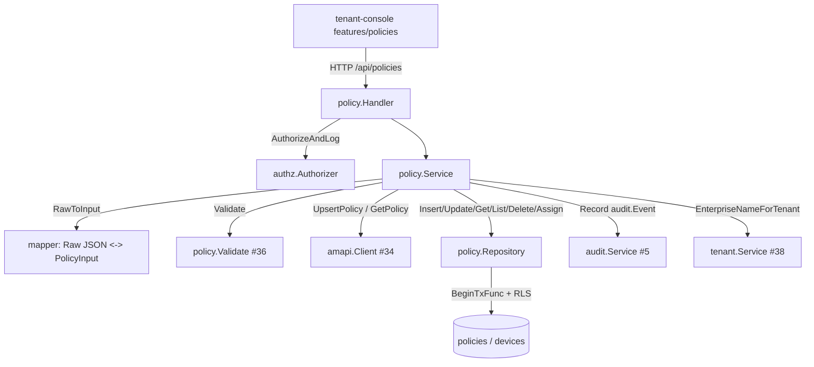

# Design Document

## Overview

**Purpose**: 本機能は、TenantAdmin が作成・更新した Android Management ポリシーを「検証 → AMAPI 反映 → DB snapshot 保持 → 監査記録」の一連のユースケースとして実行する **Policy ドメイン Service** を ae-mdm backend に追加する。これにより、不正なポリシーが端末へ配信される事故を防ぎつつ、テナント境界に閉じたポリシー管理（作成 / 更新 / 一覧 / 参照 / 削除 / 端末割当）を提供する。

**Users**: 顧客企業の TenantAdmin が tenant-console（`features/policies` UI / 別 Issue）経由で `/api/policies` を呼び出してポリシーを管理する。Operator / Viewer は read のみ可能。監査担当者は記録された監査ログを `/api/admin/audit-logs`（#5 で実装済み）で事後追跡する。

**Impact**: 現在 `internal/policy/` には #36 の Policy Validator（純粋関数層）のみが存在し、ポリシーの永続化・AMAPI 反映・割当・監査の application 層は未実装である。本 Issue は同 package に application 層（Service / Repository / Handler / Raw JSON↔PolicyInput 変換）を追加し、既存の Validator (#36) / AMAPI Client (#34) / Audit Service (#5) を **呼び出すのみ**で配線する。新規 DB マイグレーションは原則不要（`policies` テーブル / `devices.applied_policy_id` は既存）。

> **分量について**: 本 design は「単一 module + 複数 call site 配線（Handler / Service / Repository / 変換層 + 既存 4 依存の接続）」で標準〜やや複雑に該当し、目安 300 行に対しやや超過する。超過理由は (a) 4 件の確認事項（割当の AMAPI 反映経路 / sqlc vs raw SQL / 削除競合 / 変換契約）の設計判断を本文で根拠付きで提示する必要があること、(b) Traceability が 5 Requirement × 複数 AC に渡ることである。コード逐語転載は避け、既存実装は `file:line` 参照で代替している。

### Goals
- ポリシー upsert（作成 / 更新）を「Validator 検証ゲート → AMAPI patch → DB snapshot 永続化 → 監査記録」の順で実行し、検証失敗・AMAPI 失敗時に snapshot を確定保存しない（Req 1 / 2 / 5）。
- ポリシーの端末割当を `devices.applied_policy_id` の DB 更新として確定する（Req 3）。AMAPI への device patch 経路の要否は確認事項で人間判断を仰ぐ。
- RLS（tenant-scoped context）+ authz（RBAC）でテナント分離を担保し、他テナントのポリシー・端末への操作を存在差非露出で拒否する（Req 4）。
- 成功基準: 全 AC（1.1〜5.4 / NFR 1〜3）が Components / Flow / Traceability で裏打ちされ、既存 Validator / AMAPI Client / Audit Service を変更せずに配線できること。

### Non-Goals
- Policy Validator の検証規則の追加・変更（#36 で実装済み・変更しない）。
- ポリシー編集 UI / 5 領域タブ（tenant-console `features/policies` Issue）。
- AMAPI Client 共有ラッパの実装（#34 で実装済み・呼び出すのみ）。
- 監査ログテーブルへの永続化ロジック自体（#5 で実装済み・`Record` を呼ぶのみ）。
- ポリシー削除に伴う割当済み端末のカスケード処理（割当解除・代替再割当）の詳細仕様（Out of Scope）。
- sqlc 導入（後述の推奨案で既存 raw pgx 慣習を踏襲し、sqlc 化は別 Issue 化を提案）。

## Architecture

### Existing Architecture Analysis

ae-mdm backend は **ドメインごとに `internal/<domain>/` を切り、`handler.go`（presentation）/ `service.go`（usecase + 状態機械）/ `repository.go`（raw pgx 永続化）/ `types.go`（DTO / sentinel error）の 4 層**で構成する確立パターンを持つ（`internal/tenant/`・`internal/audit/` が代表）。Policy も同パターンに揃える。

尊重すべき制約 / 統合点:
- **Validator (#36)** は `internal/policy/` 内に同居する純粋関数層であり、`policy.Validate(PolicyInput) ValidationResult` を提供する（`validator.go:114`）。`types.go` は Validator が占有しているため、application 層の型は **別ファイル**（`service.go` 内 or 新規ファイル）に置き命名衝突を回避する（doc.go の依存方向ルールも維持）。
- **AMAPI Client (#34)** は `amapi.Client` interface の `UpsertPolicy(ctx, enterpriseName, policyName, PolicyBody) error` / `GetPolicy(...)` を提供（`client.go:37`）。**device → policy を patch する IF は存在しない**（`GetDevice` / `ListDevices` / `IssueCommand` のみ）。AMAPI 認証・再試行・エラーマッピングは当該ラッパに委譲する（NFR 2.2）。
- **永続化パターン**: 既存 service は sqlc 未使用で `db.BeginTxFunc(ctx, pool, func(tx) ...)` + raw pgx SQL（`tenant/repository.go:97`）。`policies` テーブル / RLS（`migration 0011` の `tenant_isolation_policies`）/ `devices.applied_policy_id` 複合 FK は既存（`0005` / `0006`）。
- **テナント分離**: RLS は tenant-scoped `TenantContext`（`db/context.go`）で自テナント行のみ可視。SuperAdmin context のみ全行可視。Policy Service は **tenant-scoped context のまま** Repository を呼ぶことで RLS による物理分離に依拠する（tenant Service の SuperAdmin 昇格とは対照的）。
- **認可**: `/api/*`（tenant-console）は `TenantContextMiddleware` のみ適用され、RBAC 判定は **domain handler 配下で `authz.Authorizer.AuthorizeAndLog` を呼ぶ**設計（`admin_middleware.go` のコメント / `audit/handler.go` が手本）。`permissionMatrix` には `TenantAdmin × {create,update,delete,read} × ResourcePolicy` が既定義（`authz/permissions.go:97`）。
- **エラー型 / 監査**: `internal/errors`（Code → HTTP status）/ `policy.ErrorKind.Code()`（validation → 400/422 / `types.go:37`）/ `audit.Service.Record(ctx, audit.Event) error`（`audit/service.go:48`）。

### Architecture Pattern & Boundary Map

採用パターン: 既存ドメイン Service と同型の **Layered（Handler → Service → Repository）+ 純粋関数 Validator 呼び出し**。新規コンポーネントは「Raw JSON ↔ PolicyInput 変換層」のみで、これは #36 doc.go が明示する Policy Service の責務（Raw map → ドメイン型変換）を担う。



**Architecture Integration**:
- 採用パターン: 既存 4 層ドメインパターン。根拠は一貫性（tenant / audit と同じ読み口で Developer / Reviewer が把握できる）。
- ドメイン／機能境界: Validator（純粋・#36）/ AMAPI（platform・#34）/ Audit（domain・#5）/ tenant（enterprise_name 解決・#38）はすべて **呼び出すのみ**で改変しない。本 Issue が所有するのは `policies` テーブルと `devices.applied_policy_id`（割当時の UPDATE のみ）。
- 既存パターンの維持: `db.BeginTxFunc` + raw pgx / `authz.AuthorizeAndLog` / `errors.WriteHTTP` / sentinel error / chi `Mount` を踏襲。
- 新規コンポーネントの根拠: Raw JSON ↔ PolicyInput 変換層は #36 doc.go が Policy Service の責務と明示した未実装部分であり、投機的抽象ではない。

### Technology Stack

| Layer | Choice / Version | Role in Feature | Notes |
|-------|------------------|-----------------|-------|
| Frontend / CLI | tenant-console（別 Issue） | `/api/policies` の呼び出し元 | 本 Issue 対象外 |
| Backend / Services | Go 1.x + chi v5 | Handler / Service / Repository | 既存ドメインと同構成 |
| Data / Storage | PostgreSQL + pgx v5（raw SQL + RLS） | `policies` snapshot / `devices.applied_policy_id` | 既存マイグレーション流用 |
| Messaging / Events | audit.Service (#5) | ポリシー変更の監査記録 | `Record(ctx, audit.Event)` 呼び出しのみ |
| Infrastructure / Runtime | AMAPI Client (#34) | `UpsertPolicy` / `GetPolicy` | 認証・再試行は #34 に委譲 |

## File Structure Plan

### Directory Structure

```
backend/internal/policy/
├── doc.go              # 既存(#36)。application 層の構成・依存方向を追記（Validator 純粋性契約は維持）
├── types.go            # 既存(#36)。Validator が占有。本 Issue では変更しない（命名衝突回避）
├── validator.go        # 既存(#36)。呼び出すのみ・変更しない
├── validator_test.go   # 既存(#36)。変更しない
├── service_types.go    # 新規: application 層 DTO（PolicyRow / PolicyView / PolicySummary /
│                       #         PolicyRequest / AssignInput / Operation / Result / sentinel error）
├── mapper.go           # 新規: Raw JSON(map[string]any) <-> PolicyInput 変換 + AMAPI PolicyBody 組立
├── mapper_test.go      # 新規: 変換の正常系 / 変換不能→invalid field 扱いの単体テスト
├── repository.go       # 新規: policies CRUD + devices.applied_policy_id UPDATE（raw pgx + BeginTxFunc）
├── repository_test.go  # 新規: Repository の fake pool 単体テスト（tenant/repository_test 方式）
├── service.go          # 新規: upsert / assign / get / list / delete のユースケース + audit 記録
├── service_test.go     # 新規: Service の fake repo / fake amapi / fake audit 単体テスト
├── handler.go          # 新規: /api/policies 5 endpoint + AuthorizeAndLog + WriteHTTP
└── handler_test.go     # 新規: Handler の HTTP I/O 単体テスト
```

- `service.go` / `repository.go` / `handler.go` は `tenant/` 同名ファイルの責務分割を踏襲（"same pattern as tenant"）。
- application 層の型を `types.go` ではなく **`service_types.go`** に置くのは、既存 `types.go` を Validator が占有しており再利用すると命名衝突 / 責務混在が起きるため（Issue 制約に明記された前提）。

### Modified Files
- `backend/internal/policy/doc.go` — application 層（Service / Repository / Handler / mapper）の構成と依存方向（amapi / audit / tenant / authz を import 可、上位 cmd は不可）を追記。Validator の純粋性契約節は変更しない。
- `backend/cmd/api/main.go` — Policy domain の DI 配線（Repository / Service / Handler 構築 + `routers.API.Mount("/policies", policyHandler)`）を追加。audit.Service / amapi.Client / authorizer / tenant.Service は既存構築済みインスタンスを再利用する。
- 新規マイグレーション: **不要**（推奨案）。`policies` / `devices.applied_policy_id` は既存。sqlc query / sqlcgen も追加しない（後述 sqlc 確認事項の推奨案）。

## Requirements Traceability

| Requirement | Summary | Components | Interfaces / Flows |
|-------------|---------|------------|--------------------|
| 1.1 | 新規作成→AMAPI upsert | Service, mapper, amapi.Client | Upsert flow (a) |
| 1.2 | 更新→AMAPI 反映（配信前提） | Service, amapi.Client | Upsert flow (a) |
| 1.3 | 反映成功→policyName+snapshot を tenant に紐付け永続化 | Service, Repository | Upsert flow (a) step 4 |
| 1.4 | 再試行不可エラー→snapshot 確定せずエラー伝達 | Service, amapi.Client | Upsert flow (a) step 3 失敗分岐 |
| 1.5 | 連続更新→snapshot は最新反映済みと一致・中間状態を残さない | Service, Repository | Upsert flow (a)（AMAPI 後に永続化する順序） |
| 2.1 | 反映/保存前に Validator 検証 | Service, Validate(#36) | Upsert flow (a) step 2 |
| 2.2 | アプリ 3000 件超→拒否+上限超過提示 | Service, Validate(#36) | KindBusinessRule→422 |
| 2.3 | 必須項目不正→拒否+不正項目提示 | Service, Validate(#36), mapper | KindInvalidField→400 |
| 2.4 | 複数不正→全件提示 | Service, Validate(#36) | ValidationResult.Errors 全件 |
| 2.5 | 1 件以上不正→AMAPI/保存を一切行わない | Service | Upsert flow (a) step 2 早期 return |
| 3.1 | 端末へポリシー割当→適用対象を確定 | Service, Repository | Assign flow (b) |
| 3.2 | 割当ポリシーが自テナント不在→未検出拒否 | Service, Repository | Assign flow (b)（RLS で 0 行→NotFound） |
| 3.3 | 割当先端末が自テナント不在→未検出拒否 | Service, Repository | Assign flow (b)（複合 FK / 0 行→NotFound） |
| 3.4 | 割当済み→更新内容が配信対象になる前提 | Service, Repository | Assign flow (b)（applied_policy_id 確定 + Upsert 配信前提） |
| 4.1 | 他テナントポリシー更新拒否 | Handler(authz), Repository(RLS) | テナント分離 flow (c) |
| 4.2 | 他テナントポリシーを割当対象指定→拒否 | Service, Repository(RLS) | flow (c)（RLS 0 行→NotFound） |
| 4.3 | 他テナント端末を割当先指定→拒否 | Service, Repository(RLS+FK) | flow (c) |
| 4.4 | 一覧/参照は自テナントのみ | Repository(RLS) | flow (c)（tenant-scoped SELECT） |
| 4.5 | 拒否時に存在有無を区別露出しない | Handler, Service | 汎用 NotFound message（tenant 同方式） |
| 5.1 | 作成イベントを監査対象に渡す | Service, audit.Service(#5) | Upsert flow (a) step 5 |
| 5.2 | 更新イベントを監査対象に渡す | Service, audit.Service(#5) | Upsert flow (a) step 5 |
| 5.3 | 削除イベントを監査対象に渡す | Service, audit.Service(#5) | Delete flow |
| 5.4 | 監査詳細に機密値を含めない | Service | audit.Event.Detail に安全 field のみ |
| NFR 1.1 | Android 10+ サポート前提 | Service, amapi.Client | upsert 経路の前提（minimumApiLevel は raw body 由来） |
| NFR 2.1 | 列ごと型付き永続化（型不整合を実行時に遅延させない） | Repository | scan を列型に明示束縛 |
| NFR 2.2 | AMAPI 反映は共有ラッパ経由のみ | Service, amapi.Client | 認証/再試行を再実装しない |
| NFR 3.1 | 拒否操作の原因属性を構造化ログに記録 | Service, Handler(authz) | logDeny + AuthorizeAndLog |
| NFR 3.2 | ログに本体 JSON 機密値/資格情報/トークン生値を含めない | Service, Repository | ログ field に raw body を載せない |

## Components and Interfaces

### Policy Domain

#### policy.Service

| Field | Detail |
|-------|--------|
| Intent | ポリシー upsert / 割当 / 参照 / 削除のユースケースと検証ゲート・AMAPI オーケストレーション・監査記録の単一所有者 |
| Requirements | 1.x, 2.x, 3.x, 4.x, 5.x, NFR 1.1, 2.2, 3.x |

**Responsibilities & Constraints**
- 主責務: ユースケースごとに「入力 decode（mapper）→ Validator 検証 → AMAPI 反映 → Repository 永続化 → 監査記録」を順序付けて実行（tenant.Service と同型）。
- ドメイン境界: `policies` テーブルと `devices.applied_policy_id`（割当時 UPDATE のみ）を所有。tenant-scoped context のまま Repository を呼び RLS に分離を委ねる。
- 順序不変条件: snapshot 永続化は **AMAPI 反映成功後**に行う（Req 1.3 / 1.5）。検証失敗・AMAPI 失敗時は永続化しない（Req 1.4 / 2.5）。
- actor（admin_users.id）/ tenant スコープは Handler が context / claims から取得して引数で渡す（`httpserver` を import しない依存方向 / tenant と同方針）。

**Dependencies**
- Inbound: `policy.Handler` — HTTP I/O (Critical)
- Outbound: `policy.Repository` — 永続化 (Critical), `amapi.Client.UpsertPolicy/GetPolicy` — AMAPI 反映 (Critical), `policy.Validate`(#36) — 検証 (Critical), `audit.Service.Record`(#5) — 監査 (Critical), `tenant.Service.EnterpriseNameForTenant`(#38) — enterprise_name 解決 (Important)
- External: AMAPI（#34 経由 / Critical）

**Contracts**: Service [x] / API [ ] / Event [ ] / Batch [ ] / State [ ]

##### Service Interface

```go
type Service interface {
    // Create はポリシーを新規作成し AMAPI upsert + snapshot 永続化する（Req 1.1/1.3/2.x/5.1）。
    Create(ctx context.Context, actor uuid.UUID, tenantID uuid.UUID, in PolicyRequest) (PolicyView, error)
    // Update は既存ポリシーを更新し AMAPI 反映 + snapshot 更新する（Req 1.2/1.5/2.x/5.2/4.1）。
    Update(ctx context.Context, actor, tenantID, policyID uuid.UUID, in PolicyRequest) (PolicyView, error)
    // List は自テナントのポリシー一覧を返す（Req 4.4）。
    List(ctx context.Context, tenantID uuid.UUID) ([]PolicySummary, error)
    // Get は自テナントのポリシー詳細を返す。不在は NotFound（Req 4.4/4.5）。
    Get(ctx context.Context, tenantID, policyID uuid.UUID) (PolicyView, error)
    // Delete はポリシーを削除し削除イベントを監査する（Req 5.3）。競合制御は確認事項参照。
    Delete(ctx context.Context, actor, tenantID, policyID uuid.UUID) error
    // Assign は端末の適用対象ポリシーを確定する（Req 3.x/4.2/4.3）。
    Assign(ctx context.Context, actor, tenantID, deviceID, policyID uuid.UUID) error
}
```
- Preconditions: ctx に tenant-scoped `TenantContext` が確立済み（Handler が継承）。`tenantID` は claims 由来。
- Postconditions: Create/Update は AMAPI 反映後に snapshot を最新化。検証/反映失敗時は snapshot 不変。全変更操作で `audit.Service.Record` を成否ともに呼ぶ。
- Invariants: snapshot は最新の AMAPI 反映済み内容と一致（Req 1.5）。

#### policy.Repository

| Field | Detail |
|-------|--------|
| Intent | `policies` の CRUD と `devices.applied_policy_id` UPDATE を raw pgx + RLS で集約 |
| Requirements | 1.3, 1.5, 3.x, 4.2, 4.3, 4.4, NFR 2.1 |

**Responsibilities & Constraints**
- 各メソッドは `db.BeginTxFunc(ctx, pool, ...)` で tx を開き、tenant-scoped context のまま RLS による自テナント限定を効かせる（SuperAdmin 昇格はしない）。
- `Get` / 割当対象の lookup が 0 行のときは `*errors.Error{Code: CodeNotFound}`（汎用 message / Req 4.5）に写像。RLS により他テナント行は SELECT で 0 行に倒れる（Req 4.2 / 4.4）。
- 割当 UPDATE は `WHERE id=$deviceID AND tenant_id=$tenantID` で行い、`applied_policy_id` を `(policy_id, tenant_id)` 複合 FK 制約下で更新する。FK 違反（他テナント policy）/ affected=0（他テナント device）を Service が NotFound に写像（Req 4.3 / 3.3）。
- NFR 2.1: scan は列ごとに型付き変数へ束縛（`pgx.Row.Scan(&id, &name, &amapiName, &bodyJSON, &version, ...)`）。

**Contracts**: Service [x] / State [ ]

```go
type Repository interface {
    Insert(ctx context.Context, row PolicyRow) error
    Update(ctx context.Context, row PolicyRow) (int64, error)   // affected=0 → Service が NotFound
    Get(ctx context.Context, tenantID, policyID uuid.UUID) (PolicyRow, error)
    List(ctx context.Context, tenantID uuid.UUID) ([]PolicyRow, error)
    Delete(ctx context.Context, tenantID, policyID uuid.UUID) (int64, error)
    AssignPolicyToDevice(ctx context.Context, tenantID, deviceID, policyID uuid.UUID) (int64, error)
}
```

#### policy.Handler

| Field | Detail |
|-------|--------|
| Intent | `/api/policies` 配下の HTTP I/O + RBAC 判定 + エラー写像 |
| Requirements | 4.1, 4.5, NFR 3.1 |

**Responsibilities & Constraints**
- `Mount(r chi.Router)` で `routers.API`（tenant-console chain）に sub-route 登録（`audit.Handler` が手本）。各 endpoint で `authz.Authorizer.AuthorizeAndLog`（`ResourcePolicy` × `ActionCreate/Update/Delete/Read`）を呼び、deny 時は構造化 WARN + 403/401 を返す（Req 4.1 / NFR 3.1）。
- JSON decode / path param parse は tenant.Handler の `decodeJSON` / `parseID` と同方式。Service / Repository の `*errors.Error` は `errors.WriteHTTP` で写像し、存在差を露出しない（Req 4.5）。

**Contracts**: API [x]

##### API Contract

| Method | Endpoint | Request | Response | Errors |
|--------|----------|---------|----------|--------|
| GET | /api/policies | — | []PolicySummary | 401, 403 |
| POST | /api/policies | PolicyRequest{name, body} | PolicyView | 400, 401, 403, 422, 502 |
| GET | /api/policies/{id} | — | PolicyView | 401, 403, 404 |
| PUT | /api/policies/{id} | PolicyRequest | PolicyView | 400, 401, 403, 404, 422, 502 |
| DELETE | /api/policies/{id} | — | 204 | 401, 403, 404, 409(確認事項) |
| PUT | /api/policies/{id}/assign | AssignInput{device_id} | 204 | 400, 401, 403, 404 |

> 割当エンドポイントは `PUT /api/policies/{id}/assign` を **推奨案**として置く（確認事項で Device Service 側 `PUT /api/devices/{id}/policy` への委譲も提示）。umbrella API Contract（GET/POST/PUT/DELETE /api/policies）は維持し、検証エラーは 400（invalid field）/ 422（business rule = 3000 件超）に分けて写像する。

#### policy mapper（Raw JSON ↔ PolicyInput 変換層）

| Field | Detail |
|-------|--------|
| Intent | リクエストの policy 本体 JSON（`map[string]any`）を Validator の `PolicyInput` へ変換し、検証通過後に AMAPI `PolicyBody.Raw` を組み立てる |
| Requirements | 2.1, 2.3, NFR 1.1 |

**Responsibilities & Constraints**
- `RawToPolicyInput(raw map[string]any) (policy.PolicyInput, []ValidationError)`: 5 領域（applications 件数 / passwordMinimumLength / encryptionPolicy・passwordQuality / systemUpdate / kioskCustomLauncher 等）を `PolicyInput` の各 struct に写像する。**型不整合（例: 数値であるべき項目が文字列）は変換不能として invalid field 相当の `ValidationError` に写像**し、Service が Validate と同じ経路で 400 に倒す（確認事項「変換契約」の推奨案）。
- 検証通過後は raw JSON を `amapi.PolicyBody{Name, Raw}` として **pass-through** で渡す（AMAPI Client が `policies.patch` の全フィールド更新で送信 / `amapi/policies.go:77` の ForceSendFields 機構に依拠）。NFR 1.1 の `minimumApiLevel` 等の追加フィールドは raw body 経由で透過する。
- 投機的に全 AMAPI フィールドを strongly-typed 化しない（Validator が検証する 5 領域のみ抽出し、残りは pass-through）。

**Contracts**: Service [x]

## Data Models

### Domain Model
- アグリゲート: `policies`（1 ポリシー = 1 行 / トランザクション境界）。`devices.applied_policy_id` は端末側アグリゲートへの参照（割当時に device 行を UPDATE）。
- 値オブジェクト: `PolicyRow`（DB 行）/ `PolicyView`・`PolicySummary`（API 応答）/ `PolicyRequest`（入力 DTO）/ `AssignInput`。
- ドメインイベント: 監査用 `audit.Event`（EventType=`policy_create`/`policy_update`/`policy_delete`/`policy_assign`、ResourceID=policy_id、Detail=安全 field のみ）。

### Logical / Physical Data Model
- `policies`（既存 `0005`）: `id, tenant_id, name, amapi_policy_name, body jsonb, version, updated_by, created_at, updated_at`、`UNIQUE(id, tenant_id)`、`FK→tenants`、RLS `tenant_isolation_policies`。
- `devices.applied_policy_id`（既存 `0006`）: 複合 FK `(applied_policy_id, tenant_id) → policies(id, tenant_id)` が「同一テナントの policy しか割当できない」ことを DB レベルで強制（Req 4.3）。
- `amapi_policy_name`: AMAPI policyName（`enterprises/{eid}/policies/{policyId}`）。MVP では policy 行 id を policyId の seed に使う（決定論的命名）。`version` は AMAPI 反映後の snapshot バージョン。**新規マイグレーション不要**。

## Error Handling

### Error Strategy
- 検証エラー: `policy.Validate` の `ValidationResult.Errors` を `ValidationError.Kind.Code()` で 400（invalid field）/ 422（business rule = 3000 件超）に写像し、全件を response body の `details` に載せる（Req 2.2 / 2.3 / 2.4）。AMAPI 反映・snapshot 保存の前に早期 return（Req 2.5）。
- AMAPI エラー: #34 が Code 正規化済み（`amapi/client.go:286`）。再試行不可（4xx → 非 transient）はそのまま伝達し snapshot 永続化しない（Req 1.4）。`IsTransient` の再試行は #34 内で完結。
- 永続化エラー: `db.BeginTxFunc` 内の失敗は `CodeUnavailable` / `CodeInternal` に wrap（tenant.Repository 同方式）。

### Error Categories and Responses
- **User Errors (4xx)**: invalid field（400）/ NotFound（404、存在差非露出の汎用 message / Req 4.5）/ authz deny（403）/ 未認証（401）。
- **System Errors (5xx)**: AMAPI 上流エラー（502 = CodeUpstream）/ DB 不通（503 = CodeUnavailable）。AMAPI の transient は #34 が backoff 再試行。
- **Business Logic Errors (422)**: アプリ 3000 件超過（KindBusinessRule）/ 削除競合（409、確認事項で割当済み端末ありの扱いを確定）。

## Testing Strategy

- **Unit Tests**: (1) mapper: Raw JSON→PolicyInput 正常変換 / 型不整合→invalid field 写像、(2) Service.Create: 検証失敗時に AMAPI/Repository を呼ばない、(3) Service.Create/Update: AMAPI 失敗時に snapshot を永続化しない（Req 1.4）、(4) Service: AMAPI 成功後に snapshot 永続化 + audit.Record 呼び出し（Req 1.3/5.x）、(5) Service.Assign: 自テナント不在 policy/device→NotFound（Req 3.2/3.3）。
- **Integration Tests**: (1) tenant-scoped context で List/Get が自テナント行のみ返す（RLS / Req 4.4）、(2) 他テナント policy を割当指定→FK 違反/0 行で NotFound（Req 4.2/4.3）、(3) 連続更新で snapshot が最新反映済みと一致（Req 1.5）。
- **E2E/HTTP Tests**: (1) POST→GET→PUT→DELETE のゴールデンパス、(2) TenantAdmin 以外（Viewer）の POST が 403（authz / Req 4.1）、(3) 3000 件超の POST が 422 + 全不正項目（Req 2.2/2.4）。

## Security Considerations
- テナント分離は **RLS（物理）+ authz（RBAC）+ 複合 FK（割当の DB 強制）**の三重防御。Handler は tenant-scoped context を SuperAdmin に昇格させない（tenant Service と異なる方針 / 自テナント限定を RLS に委ねる）。
- 監査 Detail / 構造化ログに policy 本体 JSON の機密パラメータ・SA 資格情報・OAuth トークン生値を載せない（Req 5.4 / NFR 3.2）。`audit.Event.Detail` には policy_id / name / result / deny_reason 等の安全 field のみ。

## リスク / 確認事項（人間レビューで確定）

requirements.md の確認事項 4 件について、設計上の **推奨案を提示**する。最終確定は設計 PR の人間レビューに委ねる（推測で要件を発明しない）。

1. **端末割当の AMAPI 反映経路（Req 3.x）** — 推奨案: 本 Issue の「割当」を **`devices.applied_policy_id` の DB 更新まで**に限定する。AMAPI への実 device 紐付け（device patch）は AMAPI Client に IF が無く、enrollment token の `PolicyName`（#34 `EnrollmentTokenRequest`）/ Device Service（別 Issue）の責務であるため本 Issue では行わない。エンドポイントは Policy Service 側 `PUT /api/policies/{id}/assign` に置く案を採るが、**umbrella では `PUT /api/devices/{id}/policy`（Device Service 所管）**として描かれており、割当 endpoint の所有を Policy / Device どちらに置くかは人間判断を仰ぐ（Device Service 未実装のため本 Issue で暫定的に Policy 側へ置き、Device Service 実装時に移設する案も可）。
2. **永続化方式（sqlc vs raw SQL / NFR 2.1）** — 推奨案: 既存ドメイン Service が全て `db.BeginTxFunc` + 手書き raw pgx である一貫性を優先し、**Policy Service も raw pgx を踏襲**する。Issue #40 の技術制約「sqlc で型安全な生 SQL」との差分があるため、sqlc 導入は **別 Issue 化**を提案する（`sqlc.yaml` は存在するが `db/queries` 空）。NFR 2.1（型安全な永続化）は raw pgx の列型明示 scan で満たす。人間が sqlc を選ぶ場合は `db/queries/policies.sql` + `sqlcgen` 生成 + Repository をその生成コードに差し替える差分となる。
3. **ポリシー削除の競合制御（Req 5.3 / 409）** — 推奨案: MVP では **割当済み端末が存在するポリシーの削除を 409 で拒否**する（カスケード割当解除はしない / Out of Scope）。`devices.applied_policy_id` の複合 FK は `ON DELETE` 未指定（= 既定 NO ACTION）のため、割当済み policy の DELETE は FK 違反で失敗する。これを `CodeConflict`（409）に写像する案。割当解除を伴う削除許可を選ぶ場合は別途仕様化が必要（人間判断）。
4. **Raw JSON → PolicyInput 変換契約（Req 2.3）** — 推奨案: 変換層は Validator が検証する 5 領域のみを抽出し、**型不整合・必須キー欠落で変換不能な場合を invalid field（400）として扱う**（Validate と同じ提示経路に合流）。追加の必須性チェックは課さず、検証規則自体は #36 に従う（網羅範囲は Validator の実装に委ねる）。残りの AMAPI フィールドは raw body で pass-through し、strongly-typed 化しない（投機的抽象の排除）。
