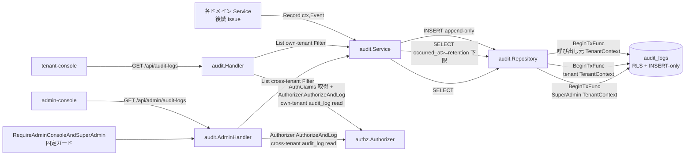

# Design Document

## Overview

**Purpose**: 本機能は ae-mdm（Android Enterprise EMM SaaS）MVP の **監査ログ Service（A5）** を確立する。
各ドメイン Service が重要操作を改竄不能に蓄積するための **append-only な記録 IF（`Record`）** と、
tenant-console 経由の **自テナント監査ログ閲覧**（TenantAdmin 以上）/ admin-console 経由の
**全テナント横断閲覧**（SuperAdmin）の **2 つの閲覧経路** を提供する。監査ログストア・append-only
強制・INSERT-only 権限・保持期間 config は A2 / #33 / #37 で完成済みであり、本 Issue はこれらを
**利用・連携**する新規 `internal/audit/` パッケージと HTTP 配線を追加する。

**Users**: 直接の利用者は (a) 自身の重要操作を `Record` で残す各ドメイン Service（テナント / 認可 /
ポリシー / コマンド / エンロール等の後続 Issue 実装者 — 実発火は本 Issue スコープ外）、(b) 自社
テナント内の操作追跡を行う TenantAdmin（tenant-console）、(c) 全テナントのガバナンス状況を横断的に
追跡する SaaS 運用者 = SuperAdmin（admin-console）。

**Impact**: A2 の `audit_logs` テーブル + RLS（`audit_logs_select` / `audit_logs_insert`）+
INSERT-only ロール、#37 の `authz` Authorizer（`audit_log read` 許可マトリクス内包）、#33 の auth
middleware（`AuthClaims` 注入 / `RequireAdminConsoleAndSuperAdmin` ガード）の上に、
`backend/internal/audit/{types,service,repository,handler,admin_handler}.go` を新規追加し、
`GET /api/audit-logs` / `GET /api/admin/audit-logs` の 2 エンドポイントを `cmd/api` 起動時に
`Routers.API` / `Routers.Admin` へ Mount する。閲覧の自テナント分離 / cross-tenant 可視は RLS が
自動適用し、保持期間下限は Repository の SELECT で `occurred_at >= max(now - retention, from)` として
強制する。スキーマ・ロール・migration の新規作成は **行わない**。

### Goals
- 型付き `Event` を append-only で 1 レコード追記する単一記録 IF を提供する（Req 1.1–1.7）
- 自テナント閲覧（時系列降順 + event_type / actor_id / resource_id / from / to 絞り込み）を提供する（Req 2.1–2.9）
- 全テナント横断閲覧（tenant_id 任意絞り込み + 同上の絞り込み）を提供する（Req 3.1–3.5）
- 閲覧認可を #37 許可マトリクス（own-tenant = SuperAdmin・TenantAdmin / cross-tenant = SuperAdmin）に
  従わせ、RLS と二重防御でテナント分離を恒常化する（Req 4.1–4.6 / NFR 2.1–2.2）
- 保持期間（既定 180 日 / 設定可能）に基づく読取下限を強制する（Req 5.1–5.4 / NFR 1.1）
- 記録後の不変性（DB 層既存強制）を結合テストで連携検証する（Req 6.1–6.4）
- 機密値の非格納 + 失敗種別の構造化ログを担保する（Req 1.7 / NFR 3.1–3.2）

### Non-Goals
- 監査ログ閲覧 UI（tenant-console / admin-console の画面。#18 / #21）
- 各ドメインにおける監査イベントの **実発火**（Record 呼び出しは各ドメイン Issue 側）
- `audit_logs` スキーマ / RLS / INSERT-only ロール / 保持期間 config の **新規作成**（A2 / #33 / #37 で完了済み）
- 保持期間を超えた監査ログの物理削除・アーカイブ・パージ batch（読取範囲制限のみを扱う）
- エクスポート（CSV/JSON）・外部 SIEM 連携・暗号学的ハッシュチェーン
- ページネーション方式の本実装（MVP は既定 limit + occurred_at desc を採用。cursor/offset の本格
  対応は将来拡張。後述「Open Questions / Risks」参照）

## Architecture

### Existing Architecture Analysis

本 Issue の前提として以下が完成済み（再作成しない）:

- **`audit_logs` テーブル**: `backend/db/migrations/0009_create_audit_logs.up.sql`。列 `id uuid PK /
  tenant_id uuid NULL (FK tenants) / actor_id uuid (FK admin_users) / event_type text NOT NULL /
  resource_id text / detail jsonb NOT NULL DEFAULT '{}' / result audit_log_result(ENUM
  success|failure) NOT NULL / occurred_at timestamptz NOT NULL DEFAULT now()`。index:
  tenant_id / occurred_at / event_type。
- **append-only 強制 + RLS**: `0012_audit_log_immutability.up.sql`。ENABLE+FORCE RLS、
  `audit_logs_select`（USING: `tenant_id = app.tenant_id OR app.is_superadmin`）、`audit_logs_insert`
  （WITH CHECK 同条件）。UPDATE/DELETE はポリシー未定義 = 拒否 + `app_user` から REVOKE UPDATE,DELETE
  （`backend/db/roles/0001_create_app_and_migration_roles.sql` でも二重防御）。→ Req 6 / NFR 4.3 は DB 層で担保済み。
- **RLS context 注入**: `db.BeginTxFunc(ctx, pool, fn)` が内部で `SetLocalTenant` を呼び、
  `db.FromContext(ctx)` の `TenantContext{TenantID, IsSuperAdmin}` から GUC `app.tenant_id` /
  `app.is_superadmin` を tx-local set する（`backend/internal/platform/db/{context,txmanager}.go`）。
- **保持期間 config**: `config.Config.AuditLogRetentionDays`（既定 180、env `AUDIT_LOG_RETENTION_DAYS`）。
- **RBAC（#37）**: `authz.New() *Authorizer`。`Authorize(authz.Request) authz.Decision` /
  `AuthorizeAndLog(ctx, log, authz.LogContext, authz.Request) authz.Decision`。`audit_log read` は
  matrix に内包済み（SuperAdmin own-tenant + TenantAdmin own-tenant、cross-tenant は authz.go の
  cross-tenant 分岐で admin-console aud + SuperAdmin のみ許可）。
- **HTTP 配線（#33/#37）**: `httpserver.NewServer(...) (*http.Server, Routers, error)`。
  `Routers{API chi.Router, Admin chi.Router}` に domain handler を `Mount` する設計。`/api/admin/*` は
  `RequireAdminConsoleAndSuperAdmin(log)`（admin-console aud + SuperAdmin の AND ガード）が固定で挟まれ、
  `/api/*` は `TenantContextMiddleware` を通過後 domain handler 内で Authorizer を呼ぶ。auth middleware が
  `AuthClaims{TenantID, AdminUserID, Roles, IsSuperAdmin, Console, SessionHashPrefix}` を ctx へ注入済み
  （`httpserver.AuthClaimsFromContext(ctx)`）。
- **error 規約**: `internalerrors.New(Code, msg)` / `Wrap(Code, msg, cause)` / `WriteHTTP(w, r, err, log)`。
  `CodeUnauthenticated`(401) / `CodeForbidden`(403) / `CodeInvalidRequest`(400) / `CodeUnavailable`(503) /
  `CodeInternal`(500)。logger は `internal/logger`。

**尊重する制約**:
- 既存 domain repository は **raw pgx** を `db.BeginTxFunc` 経由で実行する（手本:
  `backend/internal/auth/repository.go`）。sqlc は scaffold のみで未使用のため本 Issue でも導入しない。
- 各 domain は `internal/<domain>/` に集約し、platform への単方向依存を保つ（cross-domain な direct
  struct 参照は禁止）。

### Architecture Pattern & Boundary Map

採用パターン: **モジュラーモノリス + Audit Domain 追加**。記録 IF と 2 閲覧経路を `internal/audit/` に
集約する。閲覧の認可は HTTP 層（admin はルータ固定ガード / tenant は handler 内 Authorizer）と DB 層
（RLS）の二重防御で構成する。



**Architecture Integration**:
- 採用パターン: 新規 **Audit Domain**（`internal/audit/*`）。Service が記録 / 閲覧ユースケースを束ね、
  Repository が raw pgx で append-only INSERT と保持期間下限付き SELECT を担う。閲覧は 2 handler に分離。
- ドメイン／機能境界:
  - `internal/audit/types.go` — `Event` / `EventType` / `ResultType` / `Filter` 型
  - `internal/audit/service.go` — `Record` / `List` ユースケース（保持期間下限の算出を含む）
  - `internal/audit/repository.go` — append-only INSERT + 保持期間下限付き SELECT（raw pgx）
  - `internal/audit/handler.go` — `GET /api/audit-logs`（tenant-console / own-tenant）
  - `internal/audit/admin_handler.go` — `GET /api/admin/audit-logs`（admin-console / cross-tenant）
- 既存パターンの維持: `auth.Repository` の `BeginTxFunc` 経由 raw pgx / `authz.AuthorizeAndLog` /
  `internalerrors.WriteHTTP` / `httpserver.Routers.Mount`。
- 新規コンポーネントの根拠: `audit.Service` を独立させる理由は (a) 記録 IF を各 domain から呼ばせる
  単一エントリポイントが必要（umbrella 依存）、(b) 保持期間下限の算出を 2 閲覧経路で共有するため。
  handler を 2 つに分ける根拠は、admin 経路が固定ガード配下 + cross-tenant Filter（tenant_id 任意）で
  あり、tenant 経路は own-tenant 固定 + Authorizer own-tenant 判定であるため、責務と認可入力が異なる。

#### tenant 経路の認可と RLS の役割分担（重要設計判断）

tenant-console handler では **handler 内で Authorizer を呼んで own-tenant `audit_log read` 判定**を行い
（Operator/Viewer を 403 / Req 4.1 / 4.5、未認証は TenantContextMiddleware が 401 / Req 4.2）、
実データ取得時は **呼び出し元の TenantContext（非 SuperAdmin = `app.tenant_id` set）で BeginTxFunc を
実行する**。これにより RLS `audit_logs_select`（`tenant_id = app.tenant_id`）が自テナント分離を物理
担保し、他テナント / NULL テナントの行は SELECT 結果に現れない（Req 2.9 / NFR 2.1 / Req 4.3）。SELECT
クエリ自体には冗長な `tenant_id = $tenant` 条件を書かず **RLS に委ねる**（重複条件を書かないことで
RLS が single source of truth であることを明確にし、handler 側の tenant_id 取り違えによる漏洩経路を
構造的に塞ぐ）。

#### admin 経路の cross-tenant 可視

admin-console handler は `RequireAdminConsoleAndSuperAdmin` 固定ガード配下に Mount され、加えて handler
内で Authorizer の cross-tenant `audit_log read` 判定を行う（Req 4.4 / 4.6）。実データ取得は
**SuperAdmin TenantContext（`TenantID = uuid.Nil` / `IsSuperAdmin = true`）で BeginTxFunc を実行**し、
RLS `audit_logs_select` の `app.is_superadmin` 句で全テナント + NULL テナント行が可視になる（Req 3.1 /
3.5）。tenant_id 絞り込みが指定された場合のみ SELECT に `tenant_id = $1` 条件を追加する（Req 3.2）。

### Technology Stack

| Layer | Choice / Version | Role in Feature | Notes |
|---|---|---|---|
| Frontend / CLI | （該当なし — backend のみ） | — | 閲覧 UI は #18 / #21 |
| Backend / Services | Go 1.22+, `github.com/go-chi/chi/v5`, `github.com/jackc/pgx/v5`(+pgxpool), `github.com/google/uuid`, `encoding/json`, `time` | 記録 IF / 閲覧 / HTTP ハンドラ / クエリ parse | 既存依存のみ。新規依存なし |
| Data / Storage | PostgreSQL 16 + 既存 `audit_logs` テーブル（RLS + INSERT-only） | 監査ログ永続化 | スキーマ / RLS / ロールは A2 で配置済み |
| Messaging / Events | （該当なし） | — | — |
| Infrastructure / Runtime | 既存 `cmd/api` プロセス + Docker Compose（A1/A2） | Service / Handler の DI + Mount | 新規プロセス・新規 infra なし |
| Authorization | `internal/platform/authz`（#37） + `audit_logs` RLS（A2） | 二重防御の閲覧認可 | matrix は `audit_log read` を内包済み |

## File Structure Plan

### Directory Structure

```
backend/
├── internal/
│   └── audit/                          # 本 Issue 新規追加（Req 1〜5 / NFR 1〜3）
│       ├── types.go                    # Event / EventType / ResultType / Filter 型
│       ├── service.go                  # Record / List ユースケース + 保持期間下限算出
│       ├── service_test.go             # fake Repository + fake Clock で Record/List/保持下限を検証
│       ├── repository.go               # append-only INSERT + 保持下限付き SELECT（raw pgx / BeginTxFunc）
│       ├── handler.go                  # GET /api/audit-logs（tenant-console / own-tenant）
│       ├── handler_test.go             # httptest で query parse / Authorizer 連携 / 403 / 400 / 空配列
│       ├── admin_handler.go            # GET /api/admin/audit-logs（admin-console / cross-tenant）
│       ├── admin_handler_test.go       # httptest で cross-tenant Filter / tenant_id parse / 空配列
│       ├── clock.go                    # Clock interface + SystemClock（保持下限算出の現在時刻 DI）
│       ├── failure_kinds.go            # failure_kind 定数（構造化ログ用 / NFR 3.2）
│       └── doc.go                      # package godoc（依存方向ルール明記）
└── test/
    └── integration/
        └── audit_test.go               # 本 Issue 新規（実 DB + RLS: 自テナント分離 / cross-tenant /
                                        #   append-only UPDATE/DELETE 拒否 / 保持下限 / 空結果）

backend/cmd/api/main.go                 # 本 Issue 修正: audit.Service/Handler/AdminHandler 構築 + Routers へ Mount
.env.example                            # 修正不要（AUDIT_LOG_RETENTION_DAYS は A1/A2 で既出）
docs/specs/5--a5-service/impl-notes.md  # 本 Issue 新規追加（Developer 補足）
```

handler / admin_handler / service / repository は `auth` ドメインと同パターン（`internal/<domain>/` に
type/service/repository/handler を分割し、`BeginTxFunc` 経由 raw pgx + `WriteHTTP` でエラー返却）。

### Modified Files
- `backend/cmd/api/main.go` — bootstrap で `audit.NewRepository(pool)` → `audit.NewService(cfg, repo,
  clock)` → `audit.NewHandler(svc, authz.New(), log)` / `audit.NewAdminHandler(svc, authz.New(), log)` を
  構築し、`httpserver.NewServer` の戻り値 `Routers` を受け取って（現状 `srv, _, err` で破棄しているのを
  `srv, routers, err` に変更）`routers.API.Mount("/audit-logs", tenantHandler)` /
  `routers.Admin.Mount("/audit-logs", adminHandler)` を呼ぶ。`cfg` / `pool` / `log` は既存 bootstrap で
  構築済みのものを再利用する。

## Requirements Traceability

| Requirement | Summary | Components | Interfaces / Files | Flows |
|---|---|---|---|---|
| 1.1 | 実行者/テナント/種別/対象/詳細/結果/時刻を 1 レコード追記 | Service, Repository | `service.Record` → `repository.Insert` | record |
| 1.2 | SuperAdmin 横断操作は tenant_id NULL で追記 | Service, Repository | `Event.TenantID == uuid.Nil` → NULL bind | record |
| 1.3 | 結果成功は result=success | Service, Repository | `ResultSuccess` enum | record |
| 1.4 | 結果失敗は result=failure | Service, Repository | `ResultFailure` enum | record |
| 1.5 | update/delete IF を一切公開しない | Service | `Service` interface に Record/List のみ | record |
| 1.6 | 永続化失敗時はエラー返却し成功扱いしない | Service, Repository | INSERT err を `CodeUnavailable` で wrap して返す | record err |
| 1.7 | detail に機密生値を格納しない | Service | `Record` は detail を素通しし、機密 sanitize は呼び出し側責務（doc/contract で明示） | record |
| 2.1 | own-tenant のみ occurred_at 降順 | Handler, Service, Repository | tenant TenantContext + RLS + `ORDER BY occurred_at DESC` | list-tenant |
| 2.2 | event_type 絞り込み | Service, Repository | `Filter.EventType` → `event_type = $n` | list-tenant |
| 2.3 | actor_id 絞り込み | Service, Repository | `Filter.ActorID` → `actor_id = $n` | list-tenant |
| 2.4 | resource_id 絞り込み | Service, Repository | `Filter.ResourceID` → `resource_id = $n` | list-tenant |
| 2.5 | from/to 期間絞り込み | Service, Repository | `Filter.From/To` → `occurred_at` 範囲 | list-tenant |
| 2.6 | from のみ指定で from 以降 | Repository | `occurred_at >= from`（to 未指定時 to 句を省く） | list-tenant |
| 2.7 | to のみ指定で to 以前 | Repository | `occurred_at <= to`（from 未指定時 from 句は保持下限のみ） | list-tenant |
| 2.8 | 0 件は空結果を 200 で返す | Handler, Service | 空 slice → `200` + `[]` | list-tenant |
| 2.9 | 他テナント / NULL テナント行を含めない | Repository(RLS) | tenant TenantContext で `audit_logs_select` が物理分離 | list-tenant |
| 3.1 | 全テナント + NULL を occurred_at 降順 | AdminHandler, Service, Repository | SuperAdmin TenantContext + RLS is_superadmin 句 | list-admin |
| 3.2 | tenant_id 絞り込み | AdminHandler, Repository | `Filter.TenantID` 指定時 `tenant_id = $n` | list-admin |
| 3.3 | event_type/actor/resource/期間 絞り込み | AdminHandler, Repository | `Filter` 各句 | list-admin |
| 3.4 | 0 件は空結果を 200 | AdminHandler | 空 slice → `200` + `[]` | list-admin |
| 3.5 | tenant 絞り込み無指定で全テナント+NULL 対象 | Repository(RLS) | SuperAdmin TenantContext で tenant 句なし | list-admin |
| 4.1 | Operator/Viewer は own-tenant 経路で 403 | Handler, Authorizer | `AuthorizeAndLog` own-tenant read → deny | list-tenant authz |
| 4.2 | 未認証は 401 で監査ログを返さない | TenantContextMiddleware（既存） | claims 不在 → 401 | list authz |
| 4.3 | TenantAdmin の他テナント閲覧拒否 + 存在非露出 | Handler(RLS), AdminHandler | tenant 経路は RLS で 0 行 / admin 経路は固定ガード | list authz |
| 4.4 | 横断経路で SuperAdmin 以外を 403 | RequireAdminConsoleAndSuperAdmin（既存）, AdminHandler, Authorizer | 固定ガード + cross-tenant read 判定 | list-admin authz |
| 4.5 | Viewer は両経路で閲覧拒否 | Handler, AdminHandler, Authorizer | matrix に Viewer audit_log read 不在 → deny | list authz |
| 4.6 | 認可は #37 許可マトリクスに基づく | Handler, AdminHandler, Authorizer | `authz.ResourceAuditLog` + `ActionRead` | list authz |
| 5.1 | 読取範囲を保持期間に基づき制限 | Service, Repository | `retentionFloor = now - retentionDays` | list 両経路 |
| 5.2 | 保持起点より前を結果に含めない | Repository | `occurred_at >= retentionFloor` を必ず付与 | list 両経路 |
| 5.3 | from/to が保持起点より前を含む場合は起点以降のみ | Service, Repository | `effectiveFrom = max(retentionFloor, from)` | list 両経路 |
| 5.4 | 保持期間変更後はその値で範囲決定 | Service, Config | `cfg.AuditLogRetentionDays` をリクエスト毎に参照 | list 両経路 |
| 6.1 | アプリ経路から update/delete 不可に保つ | Repository(既存DB), IntegrationTest | UPDATE/DELETE IF 非公開 + RLS/REVOKE 検証 | record / verify |
| 6.2 | 書込権限での UPDATE 試行を拒否 | DB(既存), IntegrationTest | `audit_logs` UPDATE policy 不在 + REVOKE を test 検証 | verify |
| 6.3 | 書込権限での DELETE 試行を拒否 | DB(既存), IntegrationTest | 同上 DELETE を test 検証 | verify |
| 6.4 | NULL テナント追記後の更新/削除拒否 | Repository, DB(既存), IntegrationTest | SuperAdmin INSERT 後 UPDATE/DELETE 拒否を test 検証 | verify |
| NFR 1.1 | 180 日以上保持 + 設定で変更可 | Service, Config | `cfg.AuditLogRetentionDays`（既定 180） | retention |
| NFR 1.2 | 保持期間内レコードを欠損なく保持 | DB(既存), IntegrationTest | 物理 purge を行わない（読取制限のみ） | retention |
| NFR 2.1 | A の管理者が B / NULL を自経路で見られない恒常性 | Repository(RLS), IntegrationTest | tenant TenantContext + `audit_logs_select` | list-tenant |
| NFR 2.2 | 通常文脈追記でテナント不一致行の混入拒否 | Repository(RLS WITH CHECK), IntegrationTest | `audit_logs_insert` WITH CHECK を test 検証 | record |
| NFR 3.1 | レコード/ログに機密平文を含めない | Service, Handler, Logger | detail sanitize 契約 + ログは非機密 field のみ | record / list |
| NFR 3.2 | 失敗時に失敗種別を識別可能な構造化ログ | Service, Handler, AdminHandler | `failure_kind`（authz_denied / parse_invalid / persist_error 等）を WARN | error |

## Components and Interfaces

### Audit Domain

#### Audit Types

| Field | Detail |
|---|---|
| Intent | `Event` / `EventType` / `ResultType` / `Filter` のドメイン型を集約 |
| Requirements | 1.1, 1.2, 1.3, 1.4, 2.2, 2.3, 2.4, 2.5, 3.2, 3.3 |

**Responsibilities & Constraints**
- `Event` は `audit_logs` の 1 行に対応する値オブジェクト。`TenantID == uuid.Nil` は NULL テナント
  （SuperAdmin 横断操作 / Req 1.2）を意味する。
- `EventType` / `ResultType` は string ベースの enum。`EventType` の正規セットは各ドメイン Issue 側で
  確定するため、本 Issue は **任意の string 値を受け付ける**（語彙の網羅確定はしない / requirements
  未解決事項と整合）。`ResultType` は `success` / `failure` の 2 値固定。
- `Filter` は閲覧クエリ条件。`TenantID *uuid.UUID`（admin 横断専用 / nil = 絞り込みなし）、`EventType`
  / `ActorID` / `ResourceID`（空 = 絞り込みなし）、`From` / `To *time.Time`（nil = 未指定）。

**Boundary**: AuditTypes（types.go）

```go
type EventType string

type ResultType string
const (
    ResultSuccess ResultType = "success"
    ResultFailure ResultType = "failure"
)

// Event は audit_logs の 1 レコード。詳細(detail)に機密生値を含めないのは呼び出し側責務（Req 1.7）。
type Event struct {
    ID         uuid.UUID
    TenantID   uuid.UUID       // uuid.Nil は NULL テナント（SuperAdmin 横断 / Req 1.2）
    ActorID    uuid.UUID
    EventType  EventType
    ResourceID string
    Detail     map[string]any  // jsonb に直列化
    Result     ResultType
    OccurredAt time.Time
}

// Filter は List のクエリ条件。ポインタ/空文字を「未指定」として解釈する。
type Filter struct {
    TenantID   *uuid.UUID // admin 横断のみ利用。nil = 絞り込みなし（Req 3.2 / 3.5）
    EventType  EventType
    ActorID    string     // 空 = 絞り込みなし（uuid 文字列。parse は handler で検証）
    ResourceID string
    From       *time.Time
    To         *time.Time
}
```

#### Audit Service

| Field | Detail |
|---|---|
| Intent | 記録（append-only）と閲覧（保持期間下限の算出を含む）のユースケースを束ねる。update/delete IF は公開しない |
| Requirements | 1.1, 1.2, 1.3, 1.4, 1.5, 1.6, 1.7, 2.1, 2.5, 3.1, 5.1, 5.2, 5.3, 5.4, NFR 1.1, NFR 3.1 |

**Responsibilities & Constraints**
- 主責務: `Record(ctx, Event)` は `Event.ID` 未設定なら `uuid.New()` を採番、`OccurredAt` 未設定なら
  `clock.Now()` を補完したうえで Repository の INSERT を呼ぶ（DB default に依らず app 側で確定値を持つ
  ことで test の決定性と監査の説明可能性を担保 / Req 1.1）。`List(ctx, Filter)` は保持期間下限
  `retentionFloor = clock.Now().AddDate(0, 0, -cfg.AuditLogRetentionDays)` を算出し、`Filter.From` と
  `max(retentionFloor, from)` を取って `effectiveFrom` として Repository へ渡す（Req 5.1–5.4）。
- ドメイン境界: `audit` package 内。閲覧時の TenantContext 確立（tenant / SuperAdmin）は handler 側責務で
  あり、Service は ctx をそのまま Repository へ伝播する（RLS が分離を担う）。
- データ所有権: `audit_logs` テーブル（INSERT-only ロール）。
- Invariants: `Service` interface は `Record` / `List` のみ（update/delete を露出しない / Req 1.5）。
  detail の機密 sanitize は **呼び出し側責務**（Service は detail を素通しするが、godoc で「ID トークン
  本体・cookie 生値・パスワードを detail に入れない」契約を明記 / Req 1.7 / NFR 3.1）。

**Dependencies**
- Inbound: 各 domain Service（`Record` / Critical / 後続 Issue）、`audit.Handler` / `audit.AdminHandler`（`List` / Critical）
- Outbound: `audit.Repository`（INSERT / SELECT / Critical）、`config.Config`（保持期間 / Important）、`audit.Clock`（現在時刻 / Important）
- External: なし

**Contracts**: Service [x] / API [ ] / Event [ ] / Batch [ ] / State [ ]

```go
type Service interface {
    // Record は Event を append-only で 1 レコード追記する（Req 1.1〜1.4 / 1.6）。
    // 永続化失敗時は *errors.Error{Code: CodeUnavailable} を返し成功扱いしない（Req 1.6）。
    Record(ctx context.Context, ev Event) error
    // List は Filter に一致する監査ログを occurred_at 降順で返す（Req 2.x / 3.x / 5.x）。
    // 保持期間下限を内部で必ず付与する。0 件時は空 slice + nil error（Req 2.8 / 3.4）。
    List(ctx context.Context, f Filter) ([]Event, error)
}

func NewService(cfg config.Config, repo Repository, clock Clock) Service
```
- Preconditions: 呼び出し元 ctx に TenantContext が確立済み（Record は呼び出し側 domain の文脈 /
  List は handler が確立した tenant or SuperAdmin 文脈）。
- Postconditions: `List` の戻り値は保持期間下限以降の行のみ。`Record` 成功時に 1 行が永続化される。
- Invariants: update/delete を公開しない。

#### Audit Repository

| Field | Detail |
|---|---|
| Intent | `audit_logs` への append-only INSERT と、保持期間下限付き SELECT を raw pgx で実行する。RLS にテナント分離を委ねる |
| Requirements | 1.1, 1.2, 1.3, 1.4, 1.6, 2.1, 2.2, 2.3, 2.4, 2.5, 2.6, 2.7, 2.9, 3.1, 3.2, 3.3, 3.5, 5.2, 5.3, NFR 2.1, NFR 2.2 |

**Responsibilities & Constraints**
- 主責務: `Insert(ctx, Event) error` は `db.BeginTxFunc(ctx, pool, fn)` 経由で `INSERT INTO audit_logs
  (id, tenant_id, actor_id, event_type, resource_id, detail, result, occurred_at) VALUES (...)` を
  実行する（`detail` は `map[string]any` を json.Marshal して jsonb bind / `TenantID == uuid.Nil` は
  NULL bind / Req 1.1 / 1.2）。`Select(ctx, Filter, effectiveFrom) ([]Event, error)` は条件を動的に
  組み立てて `ORDER BY occurred_at DESC` で取得する。
- ドメイン境界: `audit` package 内のみ呼び出し可。INSERT/SELECT のみ提供し UPDATE/DELETE メソッドは
  持たない（Req 1.5 / 6.1 を IF レベルで担保）。
- データ所有権: `audit_logs`。RLS が tenant 文脈で自テナント分離 / SuperAdmin 文脈で全テナント可視を
  自動適用するため、SELECT の WHERE 句に **自テナント条件は書かない**（Req 2.9 / 3.5 / NFR 2.1）。
- Invariants（SELECT の WHERE 句組み立て規約）:
  - `occurred_at >= effectiveFrom` を **常に**付与（Req 5.2 / 5.3 の保持下限）
  - `Filter.To != nil` のとき `occurred_at <= *To`（Req 2.7）
  - `Filter.EventType != ""` のとき `event_type = $n`（Req 2.2 / 3.3）
  - `Filter.ActorID != ""` のとき `actor_id = $n`（Req 2.3 / 3.3）
  - `Filter.ResourceID != ""` のとき `resource_id = $n`（Req 2.4 / 3.3）
  - `Filter.TenantID != nil` のとき `tenant_id = $n`（admin 横断の明示絞り込み / Req 3.2。tenant 経路は
    この句を使わず RLS に委ねる）
  - すべて pgx の `$n` プレースホルダで bind（SQL injection 回避）

**Dependencies**
- Inbound: `audit.Service`（Critical）
- Outbound: `db.BeginTxFunc` + `pgxpool.Pool`（Critical）
- External: PostgreSQL `audit_logs`（RLS / INSERT-only / Critical）

**Contracts**: Service [x] / API [ ] / Event [ ] / Batch [ ] / State [ ]

```go
type Repository interface {
    Insert(ctx context.Context, ev Event) error
    // Select は effectiveFrom（保持下限）と Filter から動的 SQL を組み立て occurred_at 降順で取得する。
    Select(ctx context.Context, f Filter, effectiveFrom time.Time) ([]Event, error)
}

func NewRepository(pool *pgxpool.Pool) Repository
```
- Preconditions: ctx に TenantContext 確立済み（未確立だと `BeginTxFunc` が panic / 既存 invariant）。
- Postconditions: `Insert` は 1 行追記 / `Select` は RLS 適用後の行のみ。
- Invariants: UPDATE/DELETE を発行するメソッドを持たない。

#### Audit Handler（tenant-console）

| Field | Detail |
|---|---|
| Intent | `GET /api/audit-logs`。TenantAdmin 以上の own-tenant 閲覧。query parse + Authorizer 連携 + JSON 応答 |
| Requirements | 2.1, 2.2, 2.3, 2.4, 2.5, 2.6, 2.7, 2.8, 2.9, 4.1, 4.2, 4.3, 4.5, 4.6, NFR 3.1, NFR 3.2 |

**Responsibilities & Constraints**
- 主責務: `AuthClaimsFromContext(ctx)` で claims を取得（不在は TenantContextMiddleware が先行 401 /
  Req 4.2）→ `authz.AuthorizeAndLog` を `Action=ActionRead, Resource=ResourceAuditLog,
  Audience=AudienceTenantConsole, Roles=claims.Roles, SessionTenantID=claims.TenantID,
  TargetTenantID=claims.TenantID.String()` で呼び own-tenant read を判定（deny は 403 / Req 4.1 / 4.5 /
  4.6）→ query parse（不正は 400）→ `service.List(ctx, Filter)` → JSON encode（空は `[]`）。
- ドメイン境界: own-tenant 固定。`Filter.TenantID` は **設定しない**（admin 専用句）。実データ取得は
  TenantContextMiddleware が確立した tenant TenantContext のまま Service → Repository へ伝播し、RLS が
  分離（Req 2.9 / 4.3）。
- Invariants: query parse 失敗（from/to の RFC3339 不正 / actor_id の uuid 不正）は `CodeInvalidRequest`
  で 400（Req 2.8 とは別 = 空結果ではなく不正入力）。

**Dependencies**
- Inbound: tenant-console（HTTP / Critical）
- Outbound: `audit.Service.List`（Critical）、`authz.Authorizer.AuthorizeAndLog`（Critical）、`httpserver.AuthClaimsFromContext`（Critical）
- External: なし

**Contracts**: Service [ ] / API [x] / Event [ ] / Batch [ ] / State [ ]

##### API Contract

| Method | Endpoint | Request (query) | Response | Errors |
|---|---|---|---|---|
| GET | /api/audit-logs | `event_type`, `actor_id`(uuid), `resource_id`, `from`(RFC3339), `to`(RFC3339) | `200` `[]AuditLogDTO`（occurred_at desc / 空は `[]`） | 400(parse), 401(未認証), 403(Operator/Viewer/権限不足), 503(DB) |

```go
func NewHandler(svc Service, authorizer *authz.Authorizer, log logger.Logger) *Handler
// Handler は chi.Router を満たす（ServeHTTP / chi.Mount 互換）。cmd/api が
// routers.API.Mount("/audit-logs", handler) で配線する。
```

#### Audit Admin Handler（admin-console）

| Field | Detail |
|---|---|
| Intent | `GET /api/admin/audit-logs`。SuperAdmin の全テナント横断閲覧。tenant_id 任意絞り込み |
| Requirements | 3.1, 3.2, 3.3, 3.4, 3.5, 4.4, 4.5, 4.6, NFR 3.1, NFR 3.2 |

**Responsibilities & Constraints**
- 主責務: `RequireAdminConsoleAndSuperAdmin` 固定ガード配下に Mount される前提（admin aud + SuperAdmin
  でない要求はここに到達しない / Req 4.4）。handler は `authz.AuthorizeAndLog` を
  `Audience=AudienceAdminConsole, TargetTenantID=<tenant_id query or claims.TenantID>` で呼んで
  cross-tenant read を判定（防御層の二重化 / Req 4.4 / 4.6）→ query parse（`tenant_id` uuid 任意 + 共通
  絞り込み / 不正は 400）→ **SuperAdmin TenantContext（`TenantID=uuid.Nil, IsSuperAdmin=true`）を
  `db.WithTenantContext` で確立**してから `service.List(ctx, Filter)` を呼ぶ（RLS の is_superadmin 句で
  全テナント + NULL 可視 / Req 3.1 / 3.5）→ JSON encode（空は `[]` / Req 3.4）。
- ドメイン境界: cross-tenant。`Filter.TenantID` は query の `tenant_id` 指定時のみ設定（Req 3.2）。
- Invariants: handler が自前で SuperAdmin TenantContext を確立する理由は、`/api/admin/*` の
  TenantContextMiddleware は claims.TenantID（SuperAdmin は uuid.Nil）を転記するが、cross-tenant 全行
  可視には `IsSuperAdmin=true` が必須であり、claims 由来の TenantContext が既にこれを満たす場合でも
  Service/Repository が一貫した SuperAdmin 文脈で動くことを handler 境界で明示する（design 上の確実性）。

**Dependencies**
- Inbound: admin-console（HTTP / `RequireAdminConsoleAndSuperAdmin` 配下 / Critical）
- Outbound: `audit.Service.List`（Critical）、`authz.Authorizer.AuthorizeAndLog`（Important）、`db.WithTenantContext`（Critical）
- External: なし

**Contracts**: Service [ ] / API [x] / Event [ ] / Batch [ ] / State [ ]

##### API Contract

| Method | Endpoint | Request (query) | Response | Errors |
|---|---|---|---|---|
| GET | /api/admin/audit-logs | `tenant_id`(uuid 任意), `event_type`, `actor_id`(uuid), `resource_id`, `from`(RFC3339), `to`(RFC3339) | `200` `[]AuditLogDTO`（occurred_at desc / 空は `[]`） | 400(parse), 401(未認証), 403(非 admin/非 SuperAdmin), 503(DB) |

```go
func NewAdminHandler(svc Service, authorizer *authz.Authorizer, log logger.Logger) *AdminHandler
// cmd/api が routers.Admin.Mount("/audit-logs", adminHandler) で配線する（実 path は /api/admin/audit-logs）。
```

##### AuditLogDTO（両 handler 共通の JSON 応答形）

`Event` をそのまま露出せず、JSON 応答用 DTO に写像する（`detail` は jsonb をそのまま透過 / `tenant_id`
は NULL の場合 `null`）。フィールド: `id` / `tenant_id`(nullable) / `actor_id` / `event_type` /
`resource_id` / `detail`(object) / `result` / `occurred_at`(RFC3339)。NFR 3.1 のため DTO 化時に追加の
機密値を載せない（detail の sanitize は記録側責務）。

#### Clock / failure_kinds（補助）

- `clock.go` — `Clock interface { Now() time.Time }` + `SystemClock`。Service の保持期間下限算出を
  テストで決定的にするための DI（手本: `auth.SystemClock`）。
- `failure_kinds.go` — 構造化ログ用の `failure_kind` 定数（`authz_denied` / `parse_invalid` /
  `persist_error` / `query_error`）。NFR 3.2 を実装で満たす（`log.Warn("audit failure",
  "failure_kind", ..., "request_id", ..., "actor_id", ...)` 形式で出力 / 機密値は載せない）。

## Data Models

### Domain Model
- アグリゲート: `Event`（`audit_logs` の 1 行に 1:1）。トランザクション境界は 1 INSERT または 1 SELECT
  で完結（`BeginTxFunc` 1 回 = 1 tx）。集約間の整合性制約なし（append-only / 関連は actor_id / tenant_id
  の FK のみ、これは既存スキーマ）。
- 値オブジェクト: `EventType` / `ResultType` / `Filter`。ドメインイベントは発行しない。

### Physical Data Model（既存・本 Issue で変更しない）
`audit_logs`（`0009` + `0012`）の列・index・RLS・ENUM はそのまま利用する。本 Issue は migration を
追加しない。Repository の SELECT/INSERT は当該スキーマに整合する SQL のみを発行する。

## Error Handling

### Error Strategy
全エラーは `*internalerrors.Error` で表現し、HTTP 層は `internalerrors.WriteHTTP(w, r, err, log)` で
Code → status 写像する（既存規約）。各失敗パスで `failure_kind` を構造化 WARN ログに出す（NFR 3.2）。
機密値（detail の生値・query 生値）はログ・エラーメッセージ本文に補間しない（NFR 3.1）。

### Error Categories and Responses
- **User Errors (4xx)**:
  - 未認証 → `401`（TenantContextMiddleware / 既存 / Req 4.2）
  - Operator/Viewer/権限不足 → `403`（Authorizer deny / admin 経路は固定ガード / Req 4.1 / 4.4 / 4.5）
  - query parse 失敗（from/to 非 RFC3339 / actor_id・tenant_id 非 uuid）→ `400`（`CodeInvalidRequest` /
    `failure_kind=parse_invalid`）。**空結果（Req 2.8 / 3.4）とは区別**し、不正入力は 400・0 件は 200。
- **System Errors (5xx)**:
  - INSERT / SELECT の DB 失敗 → `503`（`CodeUnavailable` / `failure_kind=persist_error|query_error`）。
    Record の永続化失敗は呼び出し側へ伝播し成功扱いしない（Req 1.6）。graceful degradation は行わず
    fail-closed（監査の取りこぼしを成功扱いしない）。
- **Business Logic Errors (422)**: 本 Issue では該当なし（状態遷移を持たない append-only / read）。

## Testing Strategy

- **Unit Tests**:
  1. `service.Record` が ID/OccurredAt 未設定時に補完し、`success`/`failure` を正しく Repository へ渡す（Req 1.1–1.4）
  2. `service.List` が `effectiveFrom = max(retentionFloor, from)` を算出（from が保持起点より前 → 起点に丸め / Req 5.3）
  3. `service.List` が retention 既定 180 と変更値（例 365）で下限を切り替える（fake Clock / Req 5.1 / 5.4 / NFR 1.1）
  4. `handler` が Operator/Viewer claims で 403、TenantAdmin で List 呼出（fake Authorizer / Req 4.1 / 4.5）
  5. `handler` / `admin_handler` が from/to 非 RFC3339・actor_id/tenant_id 非 uuid で 400（Req 2.8 と区別）
  6. `admin_handler` が `tenant_id` query を `Filter.TenantID` に写像、無指定で nil（Req 3.2 / 3.5）
- **Integration Tests**（`backend/test/integration/audit_test.go` / 実 DB + RLS / DATABASE_URL 未設定で `t.Skip`）:
  1. tenant 文脈で `Insert` → `Select`：自テナント行のみ返り、他テナント / NULL 行は不可視（Req 2.9 / NFR 2.1）
  2. SuperAdmin 文脈で `Select`：全テナント + NULL 行が occurred_at 降順で返る、tenant_id 絞り込みが効く（Req 3.1 / 3.2 / 3.5）
  3. append-only 検証：直接 UPDATE / DELETE が RLS policy 不在 + app_user REVOKE で拒否される（Req 6.1 / 6.2 / 6.3）
  4. NULL テナント追記（SuperAdmin 文脈）後の UPDATE/DELETE 拒否（Req 6.4）
  5. 保持期間下限：retention 日以前の行が `Select` 結果から除外される（Req 5.2 / 5.3）
  6. 通常テナント文脈で他テナント tenant_id の INSERT が `audit_logs_insert` WITH CHECK で拒否（NFR 2.2）
  7. 絞り込み一致 0 件で空 slice が返る（Req 2.8 / 3.4）
- **E2E/UI Tests**: 該当なし（UI は #18 / #21）。HTTP レベルの認可 / parse / 空配列は handler unit test
  （httptest）でカバーする。

## Security Considerations
- **テナント分離の二重防御**: HTTP 層（tenant 経路の Authorizer own-tenant 判定 / admin 経路の固定ガード）
  + DB 層（RLS `audit_logs_select`）。tenant 経路は RLS が single source of truth で、SELECT に冗長な
  tenant 条件を書かない（取り違え漏洩を構造的に防ぐ / Req 2.9 / 4.3 / NFR 2.1）。
- **機密値の非格納**: `detail` の sanitize は記録側責務（Service godoc + 各ドメイン Issue の責務 / Req 1.7）。
  本 Issue は detail を透過するが、ログ / エラーメッセージに query 生値・detail 生値を補間しない（NFR 3.1）。
- **存在の非露出**: TenantAdmin が他テナント監査ログにアクセスしても、tenant 経路は RLS で 0 行 = 空配列に
  倒れ、存在自体を露出しない（Req 4.3）。

## Open Questions / Risks
- **ページネーション未確定（requirements 未解決事項）**: 件数上限・ページング方式が要件未確定。本 design は
  MVP 方針として **既定 limit + `ORDER BY occurred_at DESC`** を採用し、cursor/offset の本格対応は将来拡張
  とする（要件の追加・変更はしない）。横断閲覧で結果が大量化し得るリスクは残るが、保持期間下限で範囲が
  限定されること・MVP スコープであることから許容する。既定 limit の具体値は requirements で未確定のため、
  Developer は impl-notes に採用値（例: 既定 500 / `limit` query で上書き可）を記録し、確定は PjM/PM 判断に
  委ねる。**本 design は limit を必須機能とはせず**、最低限 occurred_at desc + 保持下限を満たせばよい。
- **EventType 正規セット未確定（requirements 未解決事項）**: 語彙の網羅確定は各ドメイン Issue 側。本 Issue
  は任意 string を受け付ける記録 IF の提供までを責務とする（要件と整合 / 発明しない）。
- **保持期間値の妥当性**: 既定 180 日は umbrella 仮置き。契約・規制で見直しの余地があるが、本 Issue は設定可能
  （`AUDIT_LOG_RETENTION_DAYS`）を前提とし値の妥当性判断はしない。
