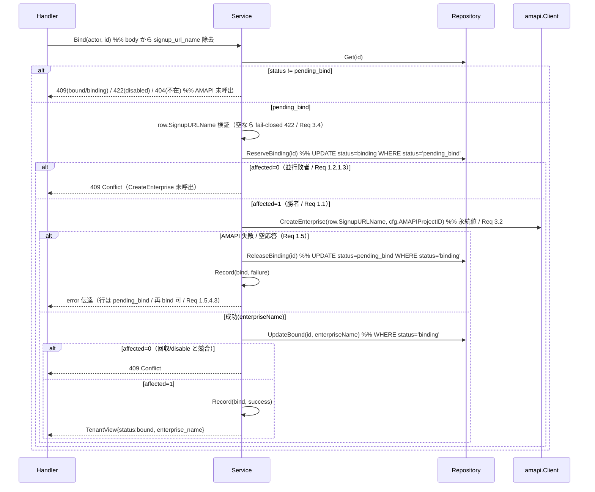
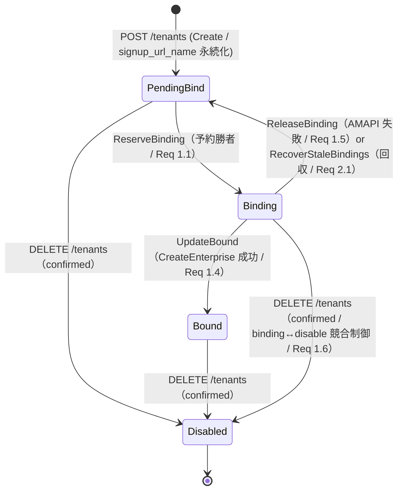

# Design Document

## Overview

**Purpose**: 本 follow-up は、親 #38（A4b Tenant ドメイン Service）が実装した Enterprise バインドの
楽観的競合制御を hardening する。PR #51 のレビューで指摘された 2 点を解消する: (1) 並行 bind /
bind 中の無効化で競合に敗れた要求が 409 を返した時点で、既に AMAPI に作成済みの Enterprise が
DB のどのテナント行にも紐付かない **orphan** として残る問題、(2) `signup_url_name` が永続化されず
bind リクエスト body から渡されるため、**発行元テナントへの束縛**が担保されない問題。

**Users**: SaaS 運用者（SuperAdmin）が admin-console（`/api/admin/tenants` 配下）の
「テナント作成 → サインアップ → Enterprise バインド」workflow で利用する。本 hardening は無認可越境
ではなく、同一 SuperAdmin の並行性・運用ミスによるリソース不整合（orphan Enterprise・テナント
取り違え bind）を構造的に防ぐ。

**Impact**: 現在の Bind フロー（`pending_bind → AMAPI CreateEnterprise(tx外) → 条件付き
UpdateBound WHERE status='pending_bind'`）を、**予約状態 `binding` を挟む 2 段確定**へ変更する。
tenant_status enum を 3 値（pending_bind / bound / disabled）から **4 値**（+ binding）へ拡張し
（#38 NFR 1.1 を上書き）、`tenants` に `signup_url_name` 列を追加して create 時に永続化、bind 時に
正本として照合する。AMAPI `CreateEnterprise` を tx 外に置く不変制約は維持する。

> **分量について**: 本 design は「複雑（状態機械 4 値化 + 既存 Bind フロー変更 + migration + 回収
> フロー）」だが、変更対象が既存 `internal/tenant` パッケージと #38 design.md の差分に閉じるため
> 600 行目安内に収める。既存コードは `file:line` 参照で指し、逐語転載しない。#38 design.md の
> 該当節（旧 Bind フロー / State / Traceability）への上書き内容は「#38 design.md からの差分」節に集約する。

### Goals
- Bind を「`pending_bind → binding` 原子的予約（勝者 1 要求のみ）→ 勝者のみ `CreateEnterprise`（tx外）
  → `binding → bound`」へ変更し、敗者は AMAPI 呼び出し前に 409 で拒否する（Req 1.1〜1.4 / Req 4 / NFR 2）。
- 中断（crash / AMAPI timeout で `binding` のまま残る行）を回収する手段を提供する（Req 2）。
- `signup_url_name` を create 時に永続化し、bind 時は永続値を正本として束縛検証する（Req 3）。
- tenant_status を 4 値で常に整合した遷移のみ許す状態機械にする（Req 4 / NFR 1）。
- 予約失敗・回収・確定の各イベントを監査 / 構造化ログの記録対象とする（Req 1.7 / Req 2.4 / NFR 3）。

### Non-Goals
- AMAPI Client 低レベル実装（`CreateSignupURL` / `CreateEnterprise` / `GetEnterprise`）— #34 済み。
- AMAPI 上に既に存在し DB に紐付かない**既存** orphan Enterprise の遡及削除・棚卸し（compensation）—
  本 follow-up は「新規 orphan を構造的に作らない」ことに限定（requirements Out of Scope / 確認事項）。
- admin-console UI（bind 入力契約変更に伴う UI 改修）/ RBAC ガード（#37）/ 監査ログ永続化本体（別 Issue）。
- 中断検出しきい値（binding 経過時間 N 分）の固定値化 — 運用設定 / 確認事項に委ねる（requirements Open Q）。
- テナント無効化の二段階確認入力契約・再有効化フロー — #38 のまま変更しない。

## Architecture

### Existing Architecture Analysis

- **ドメイン分割パターン**: `internal/tenant`（`handler.go` / `service.go` / `repository.go` /
  `types.go` / `audit_log.go`）は #38 で実装済み（`internal/auth` 準拠）。本 Issue は当該パッケージの
  **差分修正**であり、新規パッケージは作らない。
- **Bind の現状**（`service.go:203-286`）: `Get(id)` → 状態 switch（pending_bind のみ続行）→
  `CreateEnterprise`（tx外）→ `UpdateBound`（WHERE status='pending_bind'）→ affected=0 で 409。
  **orphan が残る経路**: 並行要求 A/B が両方 `Get` で pending_bind を観測 → 両方が `CreateEnterprise`
  を実行（2 つの Enterprise 作成）→ 先勝ち A が UpdateBound affected=1、B は affected=0 で 409 だが
  B の作成した Enterprise はどの行にも紐付かない（= orphan）。本設計はこの「両方が AMAPI を呼べる」
  窓を `binding` 予約で閉じる。
- **AMAPI IF の制約**（`amapi/client.go:29-51` / `enterprises.go`）:
  `CreateEnterprise(signupURLName, projectID)` は signupURLName を consume して **新規** Enterprise を
  作る create-only 操作。`GetEnterprise(enterpriseName)` は `enterprises/{id}` 既知前提の照会。
  **signupURLName から既存 Enterprise を逆引きする IF も Enterprise 削除 IF も存在しない**。これが
  回収方式の選定を決定づける（後述「回収方式の決定」）。
- **条件付き UPDATE + affected rows** による楽観的競合制御（`repository.go` の `UpdateBound` /
  `UpdateDisabled`）と `db.BeginTxFunc` + `superAdminContext` の tx 境界を踏襲する。
- **解消する technical debt**: PR #51 指摘の orphan / signup_url_name 未束縛。新規 import cycle は作らない。

### Architecture Pattern & Boundary Map

**Architecture Integration**:
- 採用パターン: 既存 **Layered domain module** を維持。状態機械の invariant 判定は Service に閉じ、
  条件付き UPDATE は Repository、AMAPI / Audit は port 経由。新パターンは導入しない。
- 新規境界: Service に `ReserveBinding`（pending_bind→binding 予約）/ `ReleaseBinding`（binding→
  pending_bind 解放）を担う Repository メソッドを追加。回収は Service の `RecoverStaleBindings`
  ユースケース + Repository の sweep クエリで実現。
- 新規コンポーネントの根拠: 予約・解放・回収は既存 5 メソッドでは表現できない新規の状態遷移であり、
  Repository に最小限のメソッドを追加する（投機的抽象化は避け、回収 trigger 用 IF は最小に保つ）。

```mermaid
flowchart LR
    SA[SuperAdmin<br/>admin-console] -->|POST /tenants/{id}/bind| TH[tenant.Handler]
    OP[運用 trigger<br/>POST /tenants/recover-bindings] -->|sweep 起動| TH
    TH --> TS[tenant.Service]
    TS -->|ReserveBinding / ReleaseBinding<br/>UpdateBound / RecoverStale| TR[tenant.Repository]
    TS -->|CreateEnterprise tx外| AC[amapi.Client #34]
    TS --> AR[tenant.EventRecorder<br/>audit port]
    TR -->|BeginTxFunc + RLS| PG[(PostgreSQL<br/>tenants: +signup_url_name, status=binding)]
    AC -->|enterprises.create| AMAPI[(Google AMAPI)]
```

### Technology Stack

| Layer | Choice / Version | Role in Feature | Notes |
|-------|------------------|-----------------|-------|
| Backend / Services | Go 1.22 + chi v5 | `internal/tenant` 差分 | 既存パッケージ修正 |
| Data / Storage | PostgreSQL（pgx v5） | tenant_status enum 4 値化 + `signup_url_name` 列 | migration 0017 |
| External | AMAPI Client（#34） | `CreateEnterprise`（create-only / 逆引き・削除 IF 無） | 回収方式選定の制約源 |
| Cross-cutting | `internal/errors` / `internal/logger` | Code 写像 / 回収ログ（NFR 3.1） | 既存規約踏襲 |

## File Structure Plan

新規パッケージは作らず、既存 `backend/internal/tenant/` を修正し migration 1 つを追加する。
繰り返し構造（handler/service/repository/types の責務）は #38 design.md File Structure Plan の方針を
そのまま適用する（同パターン）。

### Directory Structure

```
backend/
├── internal/
│   └── tenant/                    # 既存パッケージ（差分修正）
│       ├── types.go               # +StatusBinding 値 / Valid()・ParseStatus 4 値化 / +SignupURLName フィールド（TenantRow/CreateInput）/ +OperationRecover / +ErrXxx 補強
│       ├── repository.go          # +ReserveBinding / +ReleaseBinding / +RecoverStaleBindings / Insert に signup_url_name 永続化 / UpdateBound の WHERE を status='binding' へ変更
│       ├── service.go             # Bind を 2 段確定へ変更 / +RecoverStaleBindings ユースケース / signup_url_name 束縛検証 / Disable の binding 整合
│       ├── handler.go             # bind の入力契約変更（body から signup_url_name 除去）/ +recover-bindings endpoint / create 応答の signup_url_name 整理
│       ├── service_test.go        # 予約勝敗 / 回収冪等 / 束縛検証 / binding↔disable 競合の単体テスト追加
│       └── handler_test.go        # bind 入力契約変更 / recover endpoint の単体テスト追加
├── test/integration/
│       └── tenant_repository_test.go  # 予約/解放/回収/署名束縛の RLS 下競合テスト追加（既存ファイルに追記）
└── db/
    └── migrations/
        ├── 0017_tenant_binding_state_and_signup_url.up.sql    # 新規: ADD VALUE 'binding' + signup_url_name 列
        └── 0017_tenant_binding_state_and_signup_url.down.sql  # 新規: signup_url_name 列 DROP（enum 値削除不可は no-op 明記）
```

> **テスト配置**: #38 と同方針。実 PostgreSQL を要する競合テストは `backend/test/integration/`
> の既存 `tenant_repository_test.go`（`helpers_test.go` 流用、DB env 未設定なら `t.Skip`）へ追記。
> Service / Handler の純ロジックは StubClient + fake で in-package。

### Modified Files
- `backend/internal/tenant/{types,repository,service,handler}.go` — 上表の通り差分修正。
- `backend/db/migrations/0017_*.{up,down}.sql` — 新規追加。
- **`server.go` / bootstrap は変更不要**（Mount 方式は #38 のまま。recover endpoint は Handler.Mount
  内の sub-route に追加するため呼び出し側変更なし）。

## #38 design.md からの差分（更新・上書き対象）

| #38 design.md の箇所 | 本 follow-up の上書き内容 |
|---|---|
| State 図 / NFR 1.1（status 3 値） | **4 値**へ拡張。`PendingBind → Binding`（予約成功）/ `Binding → Bound`（CreateEnterprise 成功）/ `Binding → PendingBind`（解放・回収）の遷移を追加（Req 4.1 / NFR 1.1） |
| Bind 処理フロー（Get → AMAPI → UpdateBound WHERE pending_bind） | `ReserveBinding`（条件付き UPDATE pending_bind→binding、affected=1 が勝者）→ 勝者のみ `CreateEnterprise` → `UpdateBound`（WHERE status='binding'）。敗者は AMAPI 前に 409（Req 1.1〜1.3） |
| `tenants` 列（0001 / 0016） | `signup_url_name text NULL` を 0017 で追加。create 時に永続化（Req 3.1） |
| Bind API Contract（body に `signup_url_name`） | body から `signup_url_name` を**除去**。永続値を正本に使う（Req 3.2 / 後述「signup_url_name の bind 契約」） |
| EnterpriseNameForTenant の status 分岐（pending_bind→422） | `binding` を追加。binding は未バインド扱いで 422（Req 2.3 / 4.4） |
| Operation enum（create/bind/disable） | `recover` を追加（Req 2.4） |

## Requirements Traceability

| Requirement | Components / Interfaces / Flow |
|---|---|
| 1.1 | Service.Bind → Repository.ReserveBinding（pending_bind→binding 原子遷移、勝者のみ続行） |
| 1.2 | Service.Bind 敗者経路（ReserveBinding affected=0 → 409、CreateEnterprise 未呼出） |
| 1.3 | Service.Bind（現状態 binding への新規 bind → 409、CreateEnterprise 未呼出） |
| 1.4 | Service.Bind 勝者成功（UpdateBound WHERE status='binding' → bound + enterprise_name 保存） |
| 1.5 | Service.Bind 勝者の CreateEnterprise 失敗 → ReleaseBinding（binding→pending_bind）で再 bind 可能化 |
| 1.6 | Service.Disable / Repository.UpdateDisabled（binding 行への disable の競合制御 / 後述「binding↔disable」） |
| 1.7 | Service.Bind 各経路 → EventRecorder.Record（予約失敗 / 作成失敗 / 確定成功） |
| 2.1 | Service.RecoverStaleBindings + Repository.RecoverStaleBindings（binding→pending_bind 回収） |
| 2.2 | Service.Bind の binding 行再 bind（ReleaseBinding 経由で再予約、二重作成しない / 後述「回収方式」） |
| 2.3 | Service.EnterpriseNameForTenant（binding を未バインド扱い 422） |
| 2.4 | Service.RecoverStaleBindings → EventRecorder.Record(recover) + 構造化ログ |
| 3.1 | Service.Create → Repository.Insert（signup_url_name 永続化） |
| 3.2 | Service.Bind（永続 signup_url_name を CreateEnterprise へ渡す正本に使う） |
| 3.3 | Service.Bind（他テナント signup_url_name で bind 不可 = body から除去し永続値のみ使用） |
| 3.4 | Service.Bind（signup_url_name 未永続化テナントの bind を fail-closed 拒否） |
| 4.1 | types.Status enum 4 値 + DB enum 制約（0017） |
| 4.2 | Service 状態機械（未定義遷移を CodeBusinessRule で拒否） |
| 4.3 | Service.Bind 失敗経路（binding 後の任意失敗で enterprise_name 未保存・bound へ部分遷移なし） |
| 4.4 | Repository.Get/List → ViewFromRow（status を 4 値で返す） |
| NFR 1.1 | types.Status enum 4 値 / DB enum |
| NFR 1.2 | enterprise_name は bound のみ非空（binding/pending_bind/disabled で未確定） |
| NFR 2.1 | ReserveBinding / UpdateBound / UpdateDisabled の条件付き UPDATE（lost update 防止） |
| NFR 2.2 | CreateEnterprise は tx 外（勝者の外部 I/O が他テナント操作を阻害しない） |
| NFR 3.1 | RecoverStaleBindings / binding 中断の構造化ログ・指標 |
| NFR 3.2 | EventRecorder / logDeny は signup_url_name・秘密値の生値を出さない（後述「Security」） |

## Components and Interfaces

### Domain Layer (Tenant)

#### tenant.Service（差分）

| Field | Detail |
|-------|--------|
| Intent | Bind を予約状態経由の 2 段確定へ変更し、回収・束縛検証を所有する |
| Requirements | 1.1〜1.7, 2.1〜2.4, 3.1〜3.4, 4.1〜4.4, NFR 1.2, 2.1, 2.2, 3.1, 3.2 |

**Responsibilities & Constraints**
- `Bind` の新フロー（後述シーケンス図）: ①`Get` で現状態確認（pending_bind 以外は AMAPI 前に拒否）→
  ②`signup_url_name` 永続値を取得し未永続化なら fail-closed 拒否（Req 3.4）→ ③`ReserveBinding`
  （pending_bind→binding、affected=0 は競合 409 / Req 1.2・1.3）→ ④勝者のみ `CreateEnterprise`
  （**永続 signup_url_name** を渡す / Req 3.2）→ ⑤成功時 `UpdateBound`（WHERE status='binding'）で
  bound 確定（Req 1.4）/ 失敗時 `ReleaseBinding`（binding→pending_bind）で再 bind 可能化（Req 1.5）。
- `BindInput` から `SignupURLName` を**除去**し、永続値のみを使う（Req 3.2・3.3）。永続値 = 正本。
- `RecoverStaleBindings(ctx, olderThan)`: `binding` のまま中断した行を `pending_bind` へ戻す
  （Req 2.1）。回収後は再 bind で新 signup_url（後述）から再予約できる状態にする。各回収を
  Record(recover) + 構造化ログ（Req 2.4 / NFR 3.1）。
- データ所有権・invariants: status は 4 値のいずれか（NFR 1.1）。enterprise_name は **bound のみ非空**
  （binding 中は未確定 / NFR 1.2 / Req 4.3）。binding は再 bind 可能・disable 可能な中間状態であり、
  bound とはみなさない（Req 2.3）。

**Dependencies**
- Inbound: `tenant.Handler` (Critical)
- Outbound: `tenant.Repository`（ReserveBinding/ReleaseBinding/UpdateBound/RecoverStaleBindings/Insert）
  (Critical), `amapi.Client.CreateEnterprise` (Critical), `tenant.EventRecorder` (Important),
  `config.Config.AMAPIProjectID` (Critical)

**Contracts**: Service [x] / API [ ] / Event [x] / Batch [x] / State [x]

##### Service Interface（差分のみ）

```go
// 既存 Service interface（service.go:28-97）への変更点:
//   - Bind の in BindInput から SignupURLName を除去（永続値を使う / Req 3.2）。シグネチャは維持。
//   - RecoverStaleBindings を追加（Req 2.1）。
type Service interface {
    // ...既存 Create / Bind / Disable / Get / List / EnterpriseNameForTenant...
    // RecoverStaleBindings は olderThan より古い binding 行を pending_bind へ回収する（Req 2.1 / 2.4）。
    // 戻り値は回収件数。各回収は Record(recover) + 構造化ログ（NFR 3.1）。
    RecoverStaleBindings(ctx context.Context, actor uuid.UUID, olderThan time.Duration) (int, error)
}
```
- Preconditions: ctx に SuperAdmin TenantContext。`Bind` は対象に signup_url_name が永続化済み（Req 3.4）。
- Postconditions: `Bind` 成功で bound + enterprise_name 非空。CreateEnterprise 失敗で pending_bind へ
  解放され enterprise_name 未保存（Req 1.5 / 4.3）。binding 中断行は `RecoverStaleBindings` で
  pending_bind へ回収される（Req 2.1）。
- Invariants: 1 つの pending_bind 行から CreateEnterprise を呼べるのは ReserveBinding 勝者の 1 要求のみ
  （Req 1.1 / NFR 2.1）= orphan を作らない。

##### 処理フロー（新 Bind / orphan 防止 / Req 1.1〜1.5）



#### tenant.Repository（差分）

| Field | Detail |
|-------|--------|
| Intent | 予約・解放・回収の条件付き UPDATE を追加し、signup_url_name 永続化を Insert に組み込む |
| Requirements | 1.1,1.5,2.1,3.1,4.4,NFR 2.1 |

**Responsibilities & Constraints**
- `Insert` に `signup_url_name` 永続化を追加（Req 3.1）。pending_bind 行に signup_url_name を NOT NULL
  値で書く（未発行は空文字 → NULL 写像 / 後述「create フロー順序」）。
- `ReserveBinding` / `ReleaseBinding` / `UpdateBound`（WHERE 変更）/ `RecoverStaleBindings` を追加。
  すべて `superAdminContext` + `BeginTxFunc`、affected rows を返す（既存 5 メソッドと同型）。

**Contracts**: Service [x] / API [ ] / Event [ ] / Batch [x] / State [ ]

```go
// 追加・変更する Repository メソッド（既存 Insert/Get/List/UpdateBound/UpdateDisabled に対する差分）:
type Repository interface {
    // ...既存...
    // ReserveBinding は pending_bind を binding へ原子遷移する（Req 1.1）。
    //   UPDATE tenants SET status='binding', updated_at=now() WHERE id=$ AND status='pending_bind'
    //   affected=0 は Service が競合 409（Req 1.2/1.3）と判定する材料。
    ReserveBinding(ctx context.Context, id uuid.UUID) (int64, error)
    // ReleaseBinding は binding を pending_bind へ戻す（CreateEnterprise 失敗時の再 bind 可能化 / Req 1.5）。
    //   UPDATE tenants SET status='pending_bind', updated_at=now() WHERE id=$ AND status='binding'
    ReleaseBinding(ctx context.Context, id uuid.UUID) (int64, error)
    // RecoverStaleBindings は updated_at が閾値より古い binding 行を pending_bind へ一括回収する（Req 2.1）。
    //   UPDATE tenants SET status='pending_bind', updated_at=now()
    //     WHERE status='binding' AND updated_at < now() - $olderThan  RETURNING id
    //   戻り値は回収された tenant id 群（Service が Record(recover) に使う）。
    RecoverStaleBindings(ctx context.Context, olderThan time.Duration) ([]uuid.UUID, error)
}
// UpdateBound の WHERE 条件を status='pending_bind' から status='binding' へ変更する（Req 1.4）。
// enterprise_name 部分一意 index（uq_tenants_enterprise_name / 0016）との整合は維持（23505→CodeConflict）。
```

#### tenant.Handler（差分）

| Field | Detail |
|-------|--------|
| Intent | bind の入力契約変更（body から signup_url_name 除去）と回収 endpoint の追加 |
| Requirements | 3.2,3.3,2.1 |

**Responsibilities & Constraints**
- `bind` handler: `BindInput`（body）から `signup_url_name` を読まない。path `{id}` + actor のみで
  `Service.Bind` を呼ぶ（Req 3.2・3.3）。後方互換のため body に余分フィールドがあっても無視する
  （単一 JSON document 検証は維持。空 body も許容 = `decodeJSONAllowEmpty` 相当）。
- 新 endpoint `POST /api/admin/tenants/recover-bindings`（admin chain 配下）: `Service.RecoverStaleBindings`
  を呼び回収件数を返す（Req 2.1 の「回収手段を提供」を admin 操作として露出）。`olderThan` は
  既定値（後述しきい値）を採用し、body 不要。

**Contracts**: Service [ ] / API [x] / Event [ ] / Batch [ ] / State [ ]

##### API Contract（差分）

| Method | Endpoint | Request | Response | Errors（ガード共通の 401/403 に加えて） |
|--------|----------|---------|----------|-----------------------------------------|
| POST | /api/admin/tenants/{id}/bind | （body なし。signup_url_name 除去） | `{id,name,status:"bound",enterprise_name}` | 404, 409(binding/bound 競合), 422(disabled/未永続化 signup_url_name / Req 3.4), 502 |
| POST | /api/admin/tenants/recover-bindings | （body なし） | `{recovered:<件数>}` | 503 |
| POST | /api/admin/tenants | `{name}` | `{id,name,status:"pending_bind",signup_url}` | 400, 502, 503（create 応答から `signup_url_name` を除去 / 後述） |

> **bind body から signup_url_name 除去**: 永続値が正本のため、body の値は使わない。Req 3.3
> （他テナント値で bind 不可）を最も強く満たす（body 値の混入経路を構造的に排除）。未永続化テナントの
> bind は 422（CodeBusinessRule / fail-closed / Req 3.4）。
>
> **create 応答の signup_url_name**: 永続化するため、後続 bind で呼び出し側が body に渡す必要がなくなる。
> 応答 `createResponse` から `signup_url_name` フィールドを除去する（admin がコピペで bind body に
> 渡す導線自体を無くす）。`signup_url`（admin 訪問用）は引き続き応答に載せる。

##### State（4 値状態機械 / Req 4.1）



不正遷移（Req 4.2 / NFR 1.2）:
- `binding` / `bound` への新規 bind → 409 Conflict（Req 1.3 / 1.2、CreateEnterprise 未呼出）
- `disabled` への bind → 422 BusinessRule（#38 Req 2.6 継続）
- 定義外 status は fail-closed で CodeBusinessRule（NFR 1.2）

### 設計判断（design.md で決着させる論点）

#### 回収方式の決定: reconciliation sweep + 解放による再 bind 可能化（再 bind 冪等化は不採用）

- **AMAPI IF の制約が決定根拠**: requirements Open Q は「sweep か 再 bind 冪等化か」を委ねるが、
  `CreateEnterprise` は signup_url_name を consume する **create-only** 操作で、**signup_url_name から
  既存 Enterprise を逆引きする IF が AMAPI に無い**（`amapi/client.go` 確認）。よって「binding 行への
  再 bind 時に既存 Enterprise を照会して紐付け直す」冪等化は **現状の AMAPI IF では実現不可能**。
- **採用方式**: (a) `RecoverStaleBindings` sweep が古い `binding` 行を **`pending_bind` へ解放**して
  再 bind 可能・disable 可能に戻す（Req 2.1）。(b) `Bind` 内でも CreateEnterprise 失敗時に
  `ReleaseBinding` で即時解放する（Req 1.5、sweep を待たない高速回復）。(c) 回収後の再 bind は
  **新しい signup_url から再予約**する（古い signup_url_name は AMAPI 側で consume 済みの可能性が
  あり再利用しない / 二重作成防止 = Req 2.2）。
- **二重作成・二重紐付けを起こさない根拠（Req 2.2）**: 回収は status を pending_bind へ戻すのみで
  enterprise_name を書かない（NFR 1.2）。CreateEnterprise が真に成功していた binding 行が回収された
  場合、その Enterprise は AMAPI 上 orphan になる（既存 orphan は Out of Scope）。本設計は **新規 bind
  経路で 1 行 1 回しか CreateEnterprise を呼ばない**ことで「DB 上の二重紐付け」を防ぐ。AMAPI 上の
  孤児化は回収本来のトレードオフであり、NFR 3.1 の構造化ログ・指標で可観測にする。
- **代替案（不採用）と理由**: 「再 bind 冪等化（既存 Enterprise 照会で紐付け直し）」は AMAPI 逆引き IF
  不在のため不可。「sweep を一切持たず再 bind 冪等化のみ」も同理由で不可。よって sweep + 解放を採用。

#### binding ↔ disable の競合制御（Req 1.6）

- `Disable` の前提状態判定に `binding` を**無効化可能**として追加する（pending_bind / bound / binding が
  無効化可能、disabled のみ二重無効化拒否）。これにより「binding のまま塩漬け」を運用者が無効化で
  解消できる（requirements「無効化不能のまま塩漬け」の防止 / Req 2 と整合）。
- 競合制御は既存 `UpdateDisabled` の `WHERE status != 'disabled'` で担保される（binding 行も対象に入る）。
  Bind の勝者が CreateEnterprise 待機中に Disable が走った場合、いずれか一方のみ確定する:
  - Disable 先勝ち → `UpdateDisabled` で binding→disabled。Bind の `UpdateBound`（WHERE status='binding'）
    は affected=0 で 409（bound へ進めない / Req 1.6 の「いずれか一方のみ確定」）。
  - Bind 先勝ち → `UpdateBound` で binding→bound。後続 Disable は bound→disabled で正常（無効化可）。
- **意図的な選択**: disabled 行に enterprise_name が残るのは #38 既存挙動（UpdateDisabled は status のみ
  更新）。binding 中の disable では enterprise_name はそもそも未確定（NFR 1.2）なので不整合は生じない。

#### signup_url_name の bind 契約: 永続値を正本に使う（body から除去）

- requirements Open Q は「body から外す or 一致検証」を委ねる。**body から外す**を採用。理由: Req 3.3
  （他テナント値で bind 不可）を最も構造的に満たす。body 値を残して一致検証する案は、検証ロジックの
  実装ミス（fail-open）リスクと UI 入力契約の複雑化を招く。永続値のみを CreateEnterprise に渡せば
  「他テナント値の混入経路」自体が存在しない。
- 未永続化テナント（signup_url_name 空 / NULL）の bind は **fail-closed で 422 拒否**（Req 3.4）。
  CreateEnterprise を呼ばず ReserveBinding も行わない（pending_bind を保つ）。

#### migration 0017 の方針

- **enum 値追加**: `ALTER TYPE tenant_status ADD VALUE IF NOT EXISTS 'binding'`。PostgreSQL 12+ では
  tx 内実行可能で、追加した値を**同じ migration 内で使わない**限り制約に抵触しない（0017 は値追加 +
  列追加のみで、`binding` を参照する UPDATE は実行時 Go コード側 / 同 migration では使わない）。
  `IF NOT EXISTS` で冪等化（golang-migrate 再適用・既適用に耐える）。
- **signup_url_name 列**: `ALTER TABLE tenants ADD COLUMN IF NOT EXISTS signup_url_name text`。NULL 許容
  （既存行・create 前の整合のため）。0016 と同じ ALTER のみの冪等パターン（既存スキーマ非破壊）。
- **down の可逆性**（重要 / migrations_reversible_test 非破壊）:
  - `signup_url_name` 列は `DROP COLUMN IF EXISTS` で巻き戻す。
  - **enum 値 `binding` は PostgreSQL で直接削除できない**（`ALTER TYPE ... DROP VALUE` 構文が存在
    しない）。0017 down では enum 値削除を**試みず**、no-op として SQL コメントで明示する。
    `migrations_reversible_test`（全 down → 全 up）は **0001 の down が `DROP TYPE tenant_status` で
    enum 型ごと削除**するため、0017 down が `binding` を消せなくても down シーケンス全体は成功し、
    再 up で 0001 が enum を 3 値で再作成 → 0017 が `binding` を再 ADD VALUE するため可逆性 (a)(b)(c)
    を満たす。`primaryTables` の `tenants` 存在判定にも影響しない。
- **代替案（不採用）**: 「enum を使わず CHECK 制約 + text 列へ移行」は 0001 の enum 採用との整合を
  崩し、既存 RLS / scan ロジックへ波及するため不採用（変更を最小化）。

#### enterprise_name 部分一意 index（uq_tenants_enterprise_name / 0016）との整合

- 本変更で enterprise_name を書くのは `UpdateBound`（binding→bound）のみ。ReserveBinding /
  ReleaseBinding / RecoverStaleBindings は enterprise_name を**書かない**（NULL のまま）。部分 index は
  `WHERE enterprise_name IS NOT NULL` のため binding/pending_bind 行は index 対象外で衝突しない。
  別テナントへの同一 enterprise_name 投入は引き続き 23505 → CodeConflict（既存挙動維持）。

## Data Models

### Domain Model
- **Tenant Aggregate**: `tenants`（root）。値オブジェクト `Status`（**pending_bind / binding / bound /
  disabled** の 4 値）。新ドメインイベント `TenantBindingReserved` / `TenantBindingReleased` /
  `TenantBindingRecovered`（EventRecorder に渡す論理イベント。Operation enum に `recover` 追加）。
- トランザクション境界: `Bind` は ①ReserveBinding（tx）→ ②CreateEnterprise（**tx外** / 不変制約維持）
  → ③UpdateBound or ReleaseBinding（tx）。各 tx は独立（長時間 I/O を tx に含めない / NFR 2.2）。

### Physical Data Model（migration 0017）

| 変更 | 内容 | 根拠 |
|------|------|------|
| enum 値追加 | `ALTER TYPE tenant_status ADD VALUE IF NOT EXISTS 'binding'` | 予約状態（Req 4.1 / NFR 1.1） |
| 列追加 | `ALTER TABLE tenants ADD COLUMN IF NOT EXISTS signup_url_name text` | 発行元束縛の正本（Req 3.1） |

既存列（0001 / 0016）: `id / name / status / enterprise_name / created_at / updated_at / disabled_at /
disabled_by`。RLS `tenant_isolation_tenants`（0011）は変更しない。`TenantRow` / `CreateInput` に
`SignupURLName string` を追加し、Repository が NULL を空文字へ写像（既存 enterprise_name と同パターン）。

> **create フロー順序と signup_url_name 永続化（Req 3.1）**: 現 `Create`（service.go:141-197）は
> ①Insert(pending_bind) → ②CreateSignupURL → の順。signup_url_name は ② の戻り値のため、**①の時点で
> 永続化できない**。本設計は順序を ①CreateSignupURL → ②Insert(pending_bind, signup_url_name) へ変更
> する（URL 発行成功後に signup_url_name 込みで Insert）。CreateSignupURL 失敗時は Insert しない
> （pending_bind 行を作らない）。これは #38 Req 1.4「URL 生成失敗時 pending_bind 維持」の解釈変更を
> 伴うため**確認事項**に記載する。

## Error Handling

### Error Strategy
- Service / Repository は `*errors.Error`（Code 付き）を返し、Handler 最外層で `WriteHTTP` が写像
  （#38 と同方針）。AMAPI 由来 error は #34 が正規化済みのためそのまま伝播（再分類しない）。
- fail-closed: signup_url_name 未永続化 / 定義外 status は拒否側へ倒す。条件付き UPDATE affected=0 は
  競合として扱う。CreateEnterprise 失敗時は ReleaseBinding を**必ず試みる**（解放失敗時も元 error を
  優先伝達し、解放失敗を構造化ログに残す / sweep が後追い回収する保険）。

### Error Categories and Responses
- **User Errors (4xx)**: 不在 ID（404 / 存在差非露出）、未永続化 signup_url_name（422 / Req 3.4）。
- **System Errors (5xx)**: AMAPI 上流（502）、DB 不通（503）。CreateEnterprise 502 時は ReleaseBinding で
  pending_bind に戻し再 bind 可能化（Req 1.5）。
- **Business / Conflict (422 / 409)**: binding/bound への bind（409 / Req 1.2・1.3）、disabled への bind
  （422）、binding↔disable 競合の敗者（409 / Req 1.6）、UpdateBound affected=0（409）。

## Testing Strategy

- **Unit Tests（service_test.go / handler_test.go、StubClient + fake Repository）**:
  1. Bind 勝者: ReserveBinding affected=1 → CreateEnterprise 1 回 → UpdateBound(WHERE binding) で bound（Req 1.1/1.4）。
  2. Bind 敗者: ReserveBinding affected=0 → 409 かつ `StubClient.CallCount("CreateEnterprise")==0`（Req 1.2/1.3、orphan 防止の核）。
  3. Bind CreateEnterprise 失敗 → ReleaseBinding 呼出 + 行 pending_bind + UpdateBound 未呼出（Req 1.5/4.3、fake の呼出記録で検証）。
  4. Bind: 永続 signup_url_name 空 → 422 で ReserveBinding/CreateEnterprise 未呼出（Req 3.4）/ 永続値が CreateEnterprise 引数に渡る（Req 3.2）。
  5. RecoverStaleBindings: binding 行が pending_bind へ戻り Record(recover) 発火（Req 2.1/2.4）。
  6. EnterpriseNameForTenant: binding → 422（未バインド扱い / Req 2.3/4.4）。
  7. Handler: bind body の signup_url_name を無視し永続値で bind（Req 3.3）/ recover-bindings endpoint が件数を返す。
- **Integration Tests（tenant_repository_test.go、実 PostgreSQL + RLS）**:
  1. ReserveBinding 並行: 同一 id に 2 回 → 1 回目 affected=1、2 回目 affected=0（Req 1.1/NFR 2.1、orphan 防止の DB 層証跡）。
  2. ReleaseBinding: binding→pending_bind affected=1、pending_bind 行には affected=0。
  3. RecoverStaleBindings: 古い binding（updated_at 過去）のみ回収、新しい binding は据え置き（Req 2.1）。
  4. UpdateBound WHERE status='binding': pending_bind 行への UpdateBound は affected=0（WHERE 変更の回帰）。
  5. binding↔disable: binding 行に UpdateDisabled affected=1（無効化可 / Req 1.6）、その後 UpdateBound affected=0。
  6. signup_url_name 永続化: Insert → Get で signup_url_name 往復（Req 3.1）。
  7. migration 0017: 既存 migrations_reversible_test が全 down→up で pass（enum 4 値 + signup_url_name 列の可逆性）。

## Security Considerations
- 全 endpoint（recover-bindings 含む）は `/api/admin` 配下に固定（#37 guard 継承）。SuperAdmin のみ到達。
- **signup_url_name の機密扱い（NFR 3.2）**: signup_url_name は永続化するが、**構造化ログ / 監査 Event の
  生値に含めない**（#38 Event は signup_url_name フィールドを持たない設計を維持）。CreateEnterprise 引数で
  AMAPI に渡すのみ。HTTP create 応答からも除去する（前述）。`logDeny` の reason は人間可読な拒否理由のみ。

## Supporting References
- AMAPI IF（回収方式の制約源）: `backend/internal/platform/amapi/client.go:29-51`（Client interface、
  逆引き・削除 IF 無し）/ `enterprises.go:31-78`（CreateEnterprise は create-only / GetEnterprise は
  enterpriseName 既知前提）。
- 既存 Bind 実装（差分の出発点）: `backend/internal/tenant/service.go:203-286` / `repository.go:217-282`。
- 既存 migration: `0001_create_tenants.up.sql`（enum 3 値 / down は `DROP TYPE`）/
  `0016_tenants_bind_disable_metadata.up.sql`（ALTER のみ冪等パターン / uq_tenants_enterprise_name）。
- 可逆性テスト前提: `backend/test/integration/migrations_reversible_test.go`（全 down→up + ErrNoChange）。

## 確認事項（人間判断 / 要件変更・外部仕様未検証を含むため設計で確定しない）

1. **AMAPI 公式仕様の一次情報未検証**: 本設計は AMAPI IF（`amapi/client.go` / `enterprises.go`）の
   読み取りに基づき「signup_url_name から既存 Enterprise を逆引きする API が無い」「signup URL は
   single-use（consume 済み再利用不可）」「Enterprise 削除 API を本ラッパは公開していない」と判断した。
   本 Architect セッションは Web 検索ツールを持たず、Google AMAPI 公式 changelog / docs の一次情報での
   裏取りができていない。**回収方式（sweep + 解放、再 bind 冪等化不採用）の前提が公式仕様と矛盾しない
   ことを設計 PR レビューで確認**されたい。逆引き / 削除 API が実在する場合は「再 bind 冪等化」へ
   設計変更の余地がある。
2. **AMAPI 上の既存 orphan Enterprise の能動削除**: requirements Out of Scope。回収で binding→pending_bind
   へ戻した行に対応する Enterprise が AMAPI 上で真に作成済みだった場合、それは AMAPI 上 orphan として
   残る（本設計は DB 上の二重紐付けのみ防ぐ）。能動削除を別 Issue / 運用タスクにするか要確認。
3. **中断検出しきい値（olderThan）**: requirements Open Q。`RecoverStaleBindings` の既定しきい値（例:
   binding から 15 分経過）を design 既定値とするか config 化するか。本設計は既定値 + 将来 config 化の
   余地を残す方針だが、具体値は運用要件として要確認。
4. **create フロー順序変更（#38 Req 1.4 の解釈）**: signup_url_name 永続化のため Create を
   「CreateSignupURL → Insert」順へ変更する（前述）。#38 Req 1.4「URL 生成失敗時 pending_bind 維持」は
   「URL 生成失敗時は pending_bind 行を作らない（Insert しない）」へ実質変更される。要件変更を伴うため
   PM / 人間判断を仰ぐ（推測で確定しない）。本設計はこの解釈変更を前提に tasks を構成するが、PM が
   「URL 生成前に pending_bind を作る」既存挙動の維持を求める場合は、signup_url_name を bind 直前に別
   endpoint で永続化する代替が必要になる。
5. **recover-bindings の trigger**: 本設計は admin 手動 endpoint（`POST /tenants/recover-bindings`）で
   回収手段を提供する（Req 2.1「手段を提供」を満たす最小実装）。定期 cron / scheduler 化は本 Issue
   Out of Scope（運用 / 別 Issue）とするか要確認。
