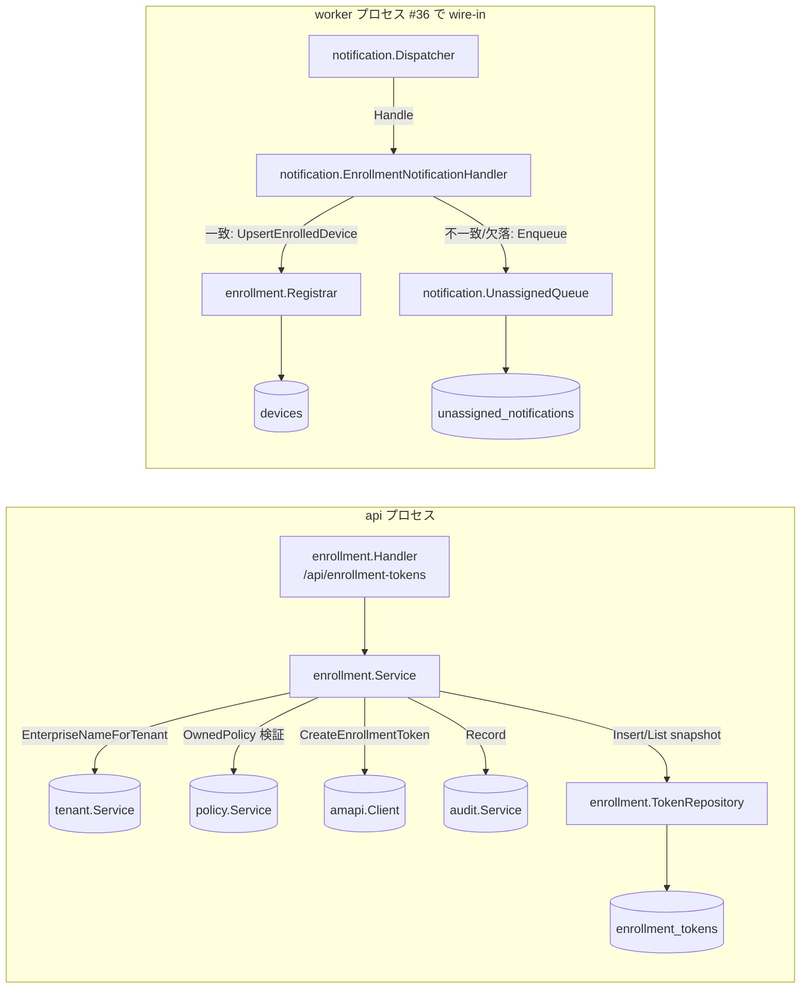
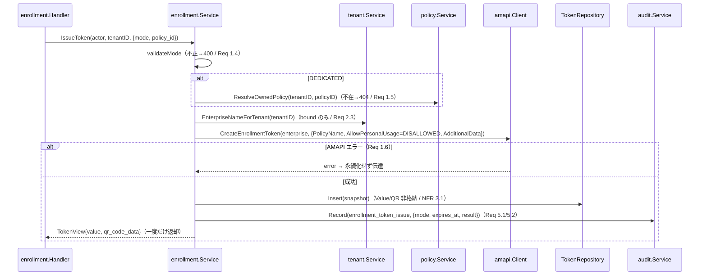

# Design Document

## Overview

**Purpose**: 本機能（B1 エンロール）は、Fully Managed / Dedicated(Kiosk) モードの **エンロールメントトークン発行と QR 表示用データ生成**、および **ENROLLMENT 通知を契機とした発行元テナントの端末インベントリ登録** を TenantAdmin / Operator に提供する。エンロールが成立しないと EMM の起点（ポリシー配信・コマンド・状態可視化）が一切成立しないため、本機能は umbrella #24 MVP の基盤である。

**Users**: TenantAdmin / Operator が tenant-console（別 Issue #15）から `POST /api/enrollment-tokens` を呼んで QR 表示用データを取得し、端末を QR で管理下に置く。AMAPI が返す ENROLLMENT 通知は worker（別 Issue #36 が Dispatcher を配線）経由で本 Issue が所有する ENROLLMENT ドメインハンドラへ dispatch され、`devices` テーブルへ登録される。

**Impact**: 既存の `backend/` Go module（module `github.com/hitoshiichikawa/ae-mdm`、import は `internal/...`）に **新規 domain package `internal/enrollment/`** と **`internal/notification/enrollment_handler.go`** を追加する。既存の AMAPI Client（#34）/ Notification Dispatcher（#39）/ Tenant Service（#38）/ Audit Service（#5）/ Policy Service（#40）/ authz / RLS 基盤を **再利用**し、新規テーブル・新規マイグレーションは作らない（既存 `enrollment_tokens`（0004）/ `devices`（0006）を消費）。cmd/api には token 発行 Handler の Mount を 1 箇所追加する。cmd/worker は変更しない（後述リスク参照）。

> 複雑度: 「複雑（複数モジュール横断）」。enrollment domain 一式 + notification handler + cross-domain 依存倒置 + 既存 Dispatcher/AMAPI/Audit/Policy との配線を含むため、行数は標準（300）を超えるが 600 行バジェット内に収める。

### Goals
- モード別（FULLY_MANAGED / DEDICATED）トークン発行、個人利用不可固定、additionalData への tenant_id/issuer 埋込、QR 表示用データの一度きり返却（秘密値非永続化）を成立させる。
- ENROLLMENT 通知の **additionalData.tenant_id と enterprise 由来 tenant_id の突合** を実装し、一致時のみ発行元テナントへ冪等登録、不一致/欠落時は未割当退避する。
- 発行イベントの監査記録（秘密値除外）と、退避/サポート対象外/処理失敗の構造化ログ観測性を担保する。

### Non-Goals
- エンロール UI（モード選択・QR 描画・エラー表示）— #15 / tenant-console `features/enroll`。
- Pub/Sub クライアント・worker エントリ・Dispatcher の handler map への **本番 wire-in** — #36（後述リスク）。本 Issue は ENROLLMENT ハンドラの実体と結合テストのみを提供。
- STATUS_REPORT / COMMAND 種別処理、Device Service（`GET /api/devices` 等）— 別 Issue（umbrella task 8/9）。
- `enrollment_tokens` / `devices` の新規マイグレーション — 既存 0004 / 0006 を消費。
- 使用済み（one-time 消費）状態の backend 追跡列の新設 — 既存スキーマに列が無く、MVP では追跡しない（Req 4.2 のリスクへ）。

## Architecture

### Existing Architecture Analysis

- **モジュラーモノリス（Go）+ domain package 分割 + RLS 強制マルチテナント**。各 domain package は Service / Repository / 型 / Handler を持ち、**隣接 domain へは interface を介した依存倒置**でのみ参照する（cross-domain な direct struct 参照禁止 / 各 `doc.go` 依存方向規約）。
- 尊重すべき統合点:
  - **AMAPI Client**（`internal/platform/amapi`）: `Client.CreateEnrollmentToken(ctx, enterpriseName, EnrollmentTokenRequest) (EnrollmentToken, error)`。`EnrollmentToken.Value`/`QRCode` は秘密値でログ・永続化に乗せない規約（`enrollment_tokens.go`）。
  - **Notification Dispatcher**（`internal/notification`）: `NotificationHandler.Handle(ctx, Envelope) error`。Dispatcher は enterprise_name→tenant を逆引き済みで **tenant context を確立してから** handler を呼ぶ。既存の未割当退避は「enterprise_name 空/逆引き失敗」時のみ発火し、**additionalData 突合失敗は未対応**（本 Issue の handler が処理）。`UnassignedQueue.Enqueue(ctx, Envelope)` は dedupe 記録 + 退避 INSERT を同一 tx で冪等実行。
  - **Tenant Service**（`internal/tenant`）: `EnterpriseNameForTenant(ctx, id) (string, error)`（bound のみ enterprise_name / 越境は fail-closed NotFound）。
  - **Audit Service**（`internal/audit`）: `Service.Record(ctx, audit.Event) error`（Detail 機密値除外は呼び出し側責務）。
  - **Policy Service**（`internal/policy`）: `Service.Get(ctx, tenantID, policyID) (PolicyView, error)`（不在/越境は非露出 NotFound）。policy の AMAPI policy id は **DB uuid 文字列と一致**する（`policy.service.Create` の命名 `buildAMAPIPolicyName(enterprise, id.String())`）。
  - **authz**（`internal/platform/authz`）: `ResourceEnrollment` は permissionMatrix に登録済み（TenantAdmin/Operator = ActionCreate 許可、Viewer = ActionRead のみ、SuperAdmin/Viewer は create 不可）。`Authorizer.AuthorizeAndLog`。
  - **db/RLS**（`internal/platform/db`）: `WithTenantContext` / `FromContext` / `BeginTxFunc`。

### Architecture Pattern & Boundary Map

**採用パターン**: 既存モジュラーモノリスに新 domain（enrollment）を追加。ENROLLMENT 通知処理は **notification package 内の薄いアダプタ（enrollment_handler.go）→ 依存倒置ポート → enrollment domain の Registrar** で構成する。



**Architecture Integration**:
- 採用パターン: 既存 domain package パターンの踏襲（`policy` を手本）。新規抽象は必要最小限（投機的抽象化を排除）。
- ドメイン／機能境界:
  - **enrollment domain** が所有: token 発行ユースケース（`enrollment_tokens` 書込）と enrollment 端末登録（`devices` upsert）。
  - **notification/enrollment_handler.go** が所有: Envelope パース + additionalData 突合 + 退避/登録の振り分け。デバイス永続化は enrollment domain へ依存倒置。
- 既存パターンの維持: consumer-defines-interface（primitive 型ポートで cross-domain import 回避 / `notification.TenantResolver` を手本）、RLS 二重防御、AMAPI-first + inconsistency ログ（`policy.Service` を手本）。
- 新規コンポーネントの根拠:
  - `enrollment.Registrar`（devices 登録）: notification package は他 domain を import 禁止（`notification/doc.go`）。ENROLLMENT 端末登録の実体を enrollment domain に置き、notification は primitive 型ポート経由で呼ぶことでドメイン所有権境界を保つ。
  - `notification.EnrollmentNotificationHandler`: additionalData 突合と退避判定は Envelope / UnassignedQueue を必要とし、それらは notification package 内にある。突合ロジックを notification 側に置くことで Dispatcher 無改変（#39 は本 Issue scope 外）で additionalData 突合失敗の退避を実現する。

### Technology Stack

| Layer | Choice / Version | Role in Feature | Notes |
|-------|------------------|-----------------|-------|
| Frontend / CLI | （対象外 / #15） | QR 描画は tenant-console | 本 Issue は QR 表示用データ（Value/QRCode 文字列）を返すのみ |
| Backend / Services | Go 1.22+, chi router, pgx/v5 | `enrollment.Service`/`Handler`/`Registrar` + `notification.EnrollmentNotificationHandler` | 既存 amapi / notification / tenant / audit / policy / authz を再利用 |
| Data / Storage | PostgreSQL 16（RLS） | `enrollment_tokens`（0004）/ `devices`（0006）を消費 | 新規マイグレーションなし |
| Messaging / Events | Cloud Pub/Sub（AMAPI ENROLLMENT 通知） | Dispatcher 経由で本 handler へ dispatch | worker wire-in は #36 |
| Infrastructure / Runtime | 既存 api / worker プロセス | cmd/api に Handler Mount 追加 / cmd/worker 無変更 | — |

## File Structure Plan

### Directory Structure

```
backend/internal/enrollment/            # 新規 domain package（Requirement 1/2/3/4/5）
├── doc.go               # package doc + 依存方向規約（policy/doc.go を手本）
├── types.go             # Mode enum(fully_managed/dedicated), IssueRequest/TokenView/TokenSummary DTO,
│                        #   AdditionalData 構造体, sentinel error（ErrInvalidMode/ErrPolicyRequired 等）,
│                        #    port IF（enterpriseResolver / policyChecker / eventRecorder）
├── service.go           # Service IF + 実装（IssueToken / ListTokens）: 検証→policy 検証→enterprise 解決
│                        #   →AMAPI 発行→snapshot 永続化→監査記録。秘密値非永続化・非監査
├── repository.go        # TokenRepository（enrollment_tokens の Insert / List、tenant-scoped RLS）
├── registration.go      # Registrar（devices への冪等 upsert / UpsertEnrolledDevice）
├── handler.go           # /api/enrollment-tokens Handler（POST 発行 / GET 一覧）+ authz + エラー写像
└── *_test.go            # service / handler / types の in-package 単体テスト（StubClient + fake ports）

backend/internal/notification/
├── enrollment_handler.go        # 新規: EnrollmentNotificationHandler（NotificationHandler 実装）
│                                #   Envelope.Payload parse → additionalData 突合 → 一致:Registrar / 不一致:Enqueue
│                                #   + Android<10 サポート対象外判定。EnrollmentRegistrar port を宣言
└── enrollment_handler_test.go   # 単体テスト（fake registrar + 実 UnassignedQueue は結合側 / fake here）

backend/test/integration/
└── enrollment_flow_test.go      # 結合テスト（Req 6）: 発行→模擬 ENROLLMENT→devices 登録 / 突合不一致退避 / 冪等
```

### Modified Files
- `backend/cmd/api/main.go` — enrollment domain の DI 配線（TokenRepository / Service / Handler）と `routers.API.Mount("/enrollment-tokens", handler)` を追加。既存 `amapiClient` / `auditSvc` / `tenantSvc` / `authorizer` を再利用し、`policySvc`（現状 `buildPolicyHandler` 内部で構築）を main レベルへ引き上げて enrollment の policyChecker アダプタと共有する。cmd/worker は変更しない。

## Requirements Traceability

| Req | Summary | Components | Interfaces / Flows |
|-----|---------|------------|--------------------|
| 1.1 | FULLY_MANAGED 発行（個人利用不可 + QR データ） | enrollment.Service, amapi.Client, enrollment.Handler | POST /api/enrollment-tokens（AllowPersonalUsage=DISALLOWED）|
| 1.2 | DEDICATED 発行（個人利用不可 + Kiosk policy 紐付） | enrollment.Service, policyChecker, amapi.Client | Service.IssueToken（PolicyName=policy id）|
| 1.3 | additionalData に tenant_id + 発行者付与 | enrollment.Service | AdditionalData JSON encode |
| 1.4 | 不正/未指定モード → 生成せずエラー | enrollment.Service | validateMode → ErrInvalidMode(400) |
| 1.5 | DEDICATED で policy 未指定/自テナント不在 → エラー | enrollment.Service, policyChecker | ResolveOwnedPolicy → ErrPolicyRequired/NotFound |
| 1.6 | AMAPI 再試行不可エラー → 永続化せず伝達 | enrollment.Service | AMAPI-first, error 時 no-persist |
| 2.1 | TenantAdmin/Operator 許可 | enrollment.Handler, authz | AuthorizeAndLog(ActionCreate, ResourceEnrollment) |
| 2.2 | Viewer 拒否 | authz permissionMatrix | matrix 未登録 → 403 |
| 2.3 | 越境発行拒否・存在非露出 | enrollment.Handler, tenant.Service | TargetTenantID=own + EnterpriseNameForTenant fail-closed |
| 3.1 | 突合一致 → 発行元テナントへ登録/更新 | notification.EnrollmentNotificationHandler, enrollment.Registrar | UpsertEnrolledDevice（RLS tenant ctx）|
| 3.2 | 突合不一致 → 未割当退避・無更新 | notification.EnrollmentNotificationHandler, UnassignedQueue | Enqueue + return nil |
| 3.3 | additionalData tenant_id 欠落 → 未割当退避 | notification.EnrollmentNotificationHandler, UnassignedQueue | Enqueue + return nil |
| 3.4 | 重複通知 → 冪等更新（重複登録なし） | enrollment.Registrar | INSERT ... ON CONFLICT (tenant_id, amapi_device_name) DO UPDATE |
| 3.5 | Android<10 → compliance「サポート対象外」 | notification.EnrollmentNotificationHandler, enrollment.Registrar | androidVersion 判定 → compliance_status='unsupported' |
| 3.6 | 一時的処理失敗 → 再処理保持 | notification.EnrollmentNotificationHandler | transient error 返却 → Dispatcher nack |
| 4.1 | 期限切れトークン → 登録せず旨を伝達 | notification path, enrollment.Handler(GET) | 無効 token は通知不着 → 未登録 / GET 一覧の expired 派生 |
| 4.2 | 使用済みトークン → 登録せず旨を伝達 | notification path | AMAPI one-time 消費 → 通知不着 → 未登録（used 追跡はリスク参照）|
| 5.1 | 発行監査（発行者/テナント/モード/有効期限/結果） | enrollment.Service, audit.Service | Record(event_type=enrollment_token_issue) |
| 5.2 | 監査に秘密値（Value/QR）を含めない | enrollment.Service | Detail に安全 field のみ |
| 6.1 | 結合: 発行→通知→登録 | enrollment_flow_test | 実 DB + in-test Dispatcher |
| 6.2 | 結合: 突合不一致 → 未割当退避 | enrollment_flow_test | UnassignedQueue.List で確認 |
| 6.3 | 結合: 重複通知 → 重複登録なし | enrollment_flow_test | devices 件数 1 のまま |
| NFR 1.1 | Android 10+ サポート | notification.EnrollmentNotificationHandler | unsupported 分類（platform 制約）|
| NFR 2.1 | テナント A 通知でテナント B を更新しない | EnrollmentNotificationHandler, RLS | ctx tenant 突合 + tenant-scoped upsert |
| NFR 2.2 | テナント一意特定不能時は無更新 | EnrollmentNotificationHandler | 突合不一致/欠落 → 退避のみ |
| NFR 3.1 | 秘密値を log/監査/永続化に保存しない | enrollment.Service, TokenRepository | snapshot に Value/QR 非格納・ログ message_id 限定 |
| NFR 4.1 | 退避/サポート対象外/失敗の構造化ログ | EnrollmentNotificationHandler | 非機密 field の WARN ログ |

## Components and Interfaces

### Enrollment Domain

#### enrollment.Service

| Field | Detail |
|-------|--------|
| Intent | トークン発行ユースケース（検証→policy 検証→enterprise 解決→AMAPI 発行→snapshot 永続化→監査）と一覧参照の単一所有者 |
| Requirements | 1.1, 1.2, 1.3, 1.4, 1.5, 1.6, 4.1, 5.1, 5.2, NFR 3.1 |

**Responsibilities & Constraints**
- FULLY_MANAGED/DEDICATED 双方で `AllowPersonalUsage=PERSONAL_USAGE_DISALLOWED` を固定（Req 1.1/1.2）。DEDICATED は policyChecker で自テナント policy 存在を検証し、AMAPI policy id（= DB uuid 文字列）を `PolicyName` に設定（Req 1.2/1.5）。
- additionalData を `{"tenant_id","issued_by","mode"}` の JSON 文字列として組み立て、AMAPI へ渡すと同時に `enrollment_tokens.additional_data` に snapshot 保存（Req 1.3）。`mode` は ENROLLMENT 登録時の `devices.mode` 決定に使う内部 metadata。
- AMAPI-first 順序: `CreateEnrollmentToken` 失敗（再試行不可含む）は snapshot を永続化せず error を伝達（Req 1.6）。永続化失敗は AMAPI との乖離として inconsistency ERROR ログ（`policy.Service` 同様、MVP は補償なし）。
- `Value`/`QRCode`（秘密値）は snapshot・監査 Detail・構造化ログに一切載せず、`TokenView` として **HTTP 応答で一度だけ返却**（NFR 3.1 / Req 5.2）。
- 監査は成否いずれの経路でも Record を呼ぶ（Req 5.1）。Detail は `{mode, expires_at, result}` の安全 field のみ。

**Dependencies**
- Inbound: `enrollment.Handler` — token 発行/一覧（Critical）
- Outbound: `enterpriseResolver`（tenant.Service 実装 / enterprise 解決 Critical）, `policyChecker`（policy.Service アダプタ / DEDICATED 検証 Important）, `amapi.Client`（発行 Critical）, `eventRecorder`（audit.Service / 監査 Important）, `TokenRepository`（snapshot Critical）
- External: AMAPI（enrollmentTokens.create 経由）

**Contracts**: Service [x] / API [ ] / Event [ ] / Batch [ ] / State [ ]

##### Service Interface

```go
type Service interface {
    // IssueToken はモード別トークンを発行し QR 表示用データ（Value/QRCode）を含む TokenView を返す。
    IssueToken(ctx context.Context, actor, tenantID uuid.UUID, in IssueRequest) (TokenView, error)
    // ListTokens は自テナントの発行済みトークン snapshot を expires_at 由来 status 付きで返す（Req 4.1）。
    ListTokens(ctx context.Context, tenantID uuid.UUID) ([]TokenSummary, error)
}

// 依存倒置ポート（primitive 型 / cross-domain import 回避）:
type enterpriseResolver interface { // tenant.Service.EnterpriseNameForTenant が満たす
    EnterpriseNameForTenant(ctx context.Context, id uuid.UUID) (string, error)
}
type policyChecker interface { // cmd/api アダプタ経由で policy.Service を包む
    // ResolveOwnedPolicy は自テナントに policyID が存在すれば AMAPI policy id を返す。不在/越境は NotFound。
    ResolveOwnedPolicy(ctx context.Context, tenantID, policyID uuid.UUID) (amapiPolicyID string, err error)
}
type eventRecorder interface { Record(ctx context.Context, ev audit.Event) error } // audit.Service が満たす
```
- Preconditions: `IssueToken` は tenant-scoped ctx（Handler が確立）。DEDICATED は `in.PolicyID != uuid.Nil`。
- Postconditions: 成功時 `enrollment_tokens` に snapshot 1 行 + 監査 1 件。`TokenView` に Value/QRCode。失敗時は永続化なし（Req 1.6）。
- Invariants: 秘密値は snapshot/監査/ログに非格納（NFR 3.1）。

#### enrollment.TokenRepository

| Field | Detail |
|-------|--------|
| Intent | `enrollment_tokens` の snapshot 永続化と一覧参照（tenant-scoped RLS） |
| Requirements | 1.3, 4.1, NFR 3.1 |

**Responsibilities & Constraints**
- tenant-scoped context のまま `db.BeginTxFunc` で tx を開き、RLS（自テナント限定）に分離を委ねる（`policy.Repository` と同型、SuperAdmin 昇格しない）。
- `Insert` は `(id, tenant_id, amapi_token_name, mode, policy_id, additional_data, expires_at, issued_by)` を bind（`policy_id` は FULLY_MANAGED で NULL）。`Value`/`QRCode` 列は無く保存しない（NFR 3.1）。DB 失敗は `CodeUnavailable` へ wrap。

**Contracts**: Service [x] / API [ ] / Event [ ] / Batch [ ] / State [ ]

```go
type TokenRepository interface {
    Insert(ctx context.Context, row TokenRow) error
    List(ctx context.Context, tenantID uuid.UUID) ([]TokenRow, error)
}
```

#### enrollment.Registrar

| Field | Detail |
|-------|--------|
| Intent | ENROLLMENT 通知で確定した端末を発行元テナントの `devices` へ冪等 upsert する |
| Requirements | 3.1, 3.4, 3.5, NFR 2.1 |

**Responsibilities & Constraints**
- `notification.EnrollmentRegistrar` ポート（primitive 型）を **structural typing で満たす**（enrollment は notification を import しない）。
- ctx の `TenantContext.TenantID`（Dispatcher 確立の enterprise 由来テナント）を bind し、`INSERT INTO devices (id, tenant_id, amapi_device_name, mode, compliance_status) VALUES (uuid.New(), <tenant>, ...) ON CONFLICT (tenant_id, amapi_device_name) DO UPDATE SET mode=EXCLUDED.mode, compliance_status=EXCLUDED.compliance_status` で冪等登録（Req 3.4）。`enrolled_at`/`id` は初回値を保持。
- `compliance_status` は handler が判定した値（`unsupported` / `unknown`）を受け取る（Req 3.5）。`hardware_info`/`software_info` 等は DB default（`{}`）に委ね本 Issue では更新しない（STATUS_REPORT は別 Issue）。
- RLS により ctx テナント以外の行は物理的に更新不能（NFR 2.1）。DB 失敗は `CodeUnavailable`+`IsTransient=true` で返し、handler → Dispatcher の nack（再処理保持 / Req 3.6）へ写像。

**Contracts**: Service [x] / API [ ] / Event [ ] / Batch [ ] / State [ ]

```go
// enrollment 側の公開メソッド（notification.EnrollmentRegistrar を満たす / primitive 型）
func (r *Registrar) UpsertEnrolledDevice(ctx context.Context, amapiDeviceName, mode, complianceStatus string) error
```

#### enrollment.Handler

| Field | Detail |
|-------|--------|
| Intent | `/api/enrollment-tokens` の HTTP I/O + RBAC 判定 + エラー写像（presentation 層） |
| Requirements | 1.1, 1.2, 2.1, 2.2, 2.3, 4.1 |

**Responsibilities & Constraints**
- `httpserver.AuthClaimsFromContext` で actor/tenantID を取得し、`authz.AuthorizeAndLog`（`ResourceEnrollment` × `ActionCreate`(POST) / `ActionRead`(GET)、`TargetTenantID=claims.TenantID`）で own-tenant RBAC 判定。deny は 403、claims 不在は 401（`policy.Handler` と同型）。Viewer は matrix 未登録で POST 403（Req 2.2）、GET は許可（matrix 登録済み）。
- Service が返す `*errors.Error` は最外層で `pkgerrors.WriteHTTP` により Code→HTTP status へ写像（400/403/404/409/422/502/503）。越境/不在は Service/tenant 側で非露出 NotFound（Req 2.3）。
- `chi.Router` を内包し `routers.API.Mount("/enrollment-tokens", h)` で `/api/enrollment-tokens` を成立（`policy.Handler` と同方式）。

**Contracts**: Service [ ] / API [x] / Event [ ] / Batch [ ] / State [ ]

##### API Contract

| Method | Endpoint | Request | Response | Errors |
|--------|----------|---------|----------|--------|
| POST | /api/enrollment-tokens | `IssueRequest{mode, policy_id?, duration?}` | `TokenView{id, mode, expires_at, value, qr_code_data}` 200 | 400(不正モード/policy 欠落), 401, 403(Viewer), 404(policy 不在), 502(AMAPI), 503 |
| GET | /api/enrollment-tokens | — | `[]TokenSummary{id, mode, policy_id?, expires_at, status}` 200 | 401, 403, 503 |

### Notification Domain（本 Issue 追加分）

#### notification.EnrollmentNotificationHandler

| Field | Detail |
|-------|--------|
| Intent | ENROLLMENT 通知の additionalData 突合と、登録/未割当退避の振り分け（`NotificationHandler` 実装） |
| Requirements | 3.1, 3.2, 3.3, 3.5, 3.6, NFR 2.1, NFR 2.2, NFR 4.1 |

**Responsibilities & Constraints**
- `Handle(ctx, env)` 手順:
  1. `env.Payload` を JSON parse し、`name`（= `devices/{id}` を含むリソース名 → amapi_device_name）、`enrollmentTokenData`（= 発行時 additionalData 文字列）、`softwareInfo.androidVersion` を抽出。
  2. `enrollmentTokenData` を JSON parse し `tenant_id`/`mode` を得る。**tenant_id 欠落/parse 不能は退避**（Req 3.3）。
  3. `db.FromContext(ctx).TenantID`（enterprise 由来）と additionalData の `tenant_id` を突合。不一致は退避（Req 3.2 / NFR 2.2）。ctx tenant context 未確立も安全側で退避。
  4. 一致時: `androidVersion` の major が 10 未満なら `compliance_status='unsupported'`（Req 3.5）、それ以外は `'unknown'`。`registrar.UpsertEnrolledDevice(ctx, amapiDeviceName, mode, compliance)` で冪等登録（Req 3.1 / 3.4）。
- 退避主体の決着（設計判断）: **handler が `UnassignedQueue.Enqueue(ctx, env)` を自ら呼び nil を返す**（採用案）。既存 Dispatcher の退避経路は enterprise_name 解決失敗のみ発火し additionalData 突合失敗を扱わないため、Dispatcher 無改変で退避を成立させる。`Enqueue` は内部で SuperAdmin context を確立し dedupe 記録 + 退避 INSERT を同一 tx で冪等実行するため、二重退避しない。handler が nil を返すと Dispatcher が後段で `MarkProcessed` を呼ぶが ON CONFLICT で冪等 no-op（設計上の副作用は無害）。**代替案**（Dispatcher に signal を戻す）は Dispatcher 改変（#39 scope 外）が必要なため不採用。
- 失敗写像: `UpsertEnrolledDevice`/`Enqueue` の transient DB 失敗はそのまま返し Dispatcher の nack（再処理保持 / Req 3.6）へ。退避成功/登録成功は nil（ack）。
- 観測性（NFR 4.1）: 退避（reason=tenant_mismatch/tenant_missing）・サポート対象外記録・処理失敗を、message_id / enterprise_name / notification_type 等の **非機密 field** で構造化 WARN。payload 生値・additionalData 生値は補間しない（NFR 3.1）。

**Dependencies**
- Inbound: `notification.Dispatcher`（handler map に登録 / #36 で wire-in）
- Outbound: `EnrollmentRegistrar`（enrollment.Registrar / devices 登録 Critical）, `UnassignedQueue`（退避 Critical、同 package）
- External: なし

**Contracts**: Service [x] / API [ ] / Event [x] / Batch [ ] / State [ ]

```go
// consumer-defined port（primitive 型 / TenantResolver を手本。enrollment.Registrar が満たす）
type EnrollmentRegistrar interface {
    UpsertEnrolledDevice(ctx context.Context, amapiDeviceName, mode, complianceStatus string) error
}

func NewEnrollmentHandler(registrar EnrollmentRegistrar, unassigned UnassignedQueue, log logger.Logger) NotificationHandler
```
- Preconditions: Dispatcher が tenant context を確立し ENROLLMENT 種別で本 handler を呼ぶ。
- Postconditions: 突合一致→devices 1 行 upsert（ack）。不一致/欠落→unassigned 退避（ack）。transient 失敗→非 ack（nack）。
- Invariants: tenant 突合一致時のみ devices を更新し、ctx テナント以外を更新しない（NFR 2.1）。

## Data Models

### Domain Model
- **enrollment_tokens snapshot**（既存 0004、集約: token）: `mode(fully_managed/dedicated)`, `policy_id nullable`, `additional_data jsonb`, `expires_at`, `issued_by`, `amapi_token_name`。**Value/QRCode は列を持たず永続化しない**（NFR 3.1）。トランザクション境界: 発行 1 件 = Insert 1 tx（tenant-scoped）。
- **devices**（既存 0006、集約: device / 所有は将来の device domain）: enrollment 登録は `id, tenant_id, amapi_device_name, mode, compliance_status` のみを確定。冪等鍵は `UNIQUE(tenant_id, amapi_device_name)`。`compliance_status` 値域は `compliant/non_compliant/unknown/unsupported`。
- **additionalData（値オブジェクト）**: `{"tenant_id":"<uuid>","issued_by":"<uuid>","mode":"fully_managed|dedicated"}`。発行時に AMAPI へ渡し、ENROLLMENT 通知の `enrollmentTokenData` として回送される前提（wire-format 仮定 / リスク参照）。

### 処理フロー



## Error Handling

### Error Strategy
既存 `internal/errors` の Code 体系（`CodeInvalidRequest`=400 / `CodeForbidden`=403 / `CodeNotFound`=404 / `CodeBusinessRule`=422 / `CodeUpstream`=502 / `CodeUnavailable`=503 / `IsTransient`）を再利用。HTTP は `pkgerrors.WriteHTTP`、通知経路は `IsTransient` で ack/nack を写像。

### Error Categories and Responses
- **User Errors (4xx)**: 不正モード/未指定（400, Req 1.4）、DEDICATED policy 欠落・不在（400/404, Req 1.5）、Viewer 拒否（403, Req 2.2）、越境（非露出 404, Req 2.3）。
- **System Errors (5xx / transient)**: AMAPI 5xx/429 は Client が再試行後 `CodeUpstream`(502)（Req 1.6 は再試行不可 = 4xx を非永続化で伝達）。DB 不通は 503 / 通知経路は nack（Req 3.6）。
- **Business / 分類処理**: additionalData 突合不一致/欠落は error でなく **未割当退避 + ack**（Req 3.2/3.3）。Android<10 は error でなく `compliance_status='unsupported'` として登録（Req 3.5）。
- **AMAPI/DB 乖離**: AMAPI 発行成功後の snapshot 永続化失敗は `requires_reconciliation=true` の inconsistency ERROR ログ（`policy.Service` を踏襲、MVP は補償なし）。

## Testing Strategy

- **Unit Tests（enrollment.Service）**: (1) FULLY_MANAGED 発行で `AllowPersonalUsage=DISALLOWED` + additionalData に tenant_id/issuer/mode（Req 1.1/1.3）、(2) 不正モード → ErrInvalidMode で AMAPI 非呼出（Req 1.4）、(3) DEDICATED policy 不在 → 発行せずエラー（Req 1.5）、(4) AMAPI エラー → snapshot 非永続化 + failure 監査（Req 1.6/5.1）、(5) 監査 Detail に Value/QRCode 非混入（Req 5.2/NFR 3.1）。StubClient + fake ports 使用。
- **Unit Tests（notification.EnrollmentNotificationHandler）**: (1) 突合一致 → Registrar.UpsertEnrolledDevice 呼出（Req 3.1）、(2) tenant_id 不一致 → Enqueue のみ・Registrar 非呼出（Req 3.2/NFR 2.1）、(3) tenant_id 欠落 → Enqueue（Req 3.3）、(4) androidVersion<10 → compliance='unsupported'（Req 3.5）、(5) Registrar transient 失敗 → 非 ack error（Req 3.6）。fake registrar / fake unassigned 使用。
- **Unit Tests（enrollment.Handler）**: (1) Viewer POST → 403（Req 2.2）、(2) TenantAdmin/Operator POST 200（Req 2.1）、(3) 不正 JSON → 400。
- **Integration Tests（Req 6 / 実 PostgreSQL、`enrollment_flow_test.go`）**: (1) token 発行（Service 経由 / snapshot 確認）→ 模擬 ENROLLMENT 通知を in-test Dispatcher（enrollment handler 登録）で Handle → `devices` に該当行 1 件（Req 6.1）、(2) additionalData.tenant_id を enterprise 由来と不一致にした通知 → `unassigned_notifications` に退避・`devices` 無変化（Req 6.2/3.2）、(3) 同一 amapi_device_name の通知を 2 回 Handle → `devices` 件数 1 のまま（Req 6.3/3.4）。`notification_dispatch_test.go` の setup 作法（migrate→truncate→app pool→bound tenant seed→newMessage）を踏襲。

## Security Considerations
- **秘密値の非記録（NFR 3.1）**: `EnrollmentToken.Value`/`QRCode` は snapshot 列を持たず、監査 Detail・構造化ログにも載せない。HTTP 応答（`TokenView`）で一度だけ返す。ログは message_id / 非機密 field に限定。
- **テナント分離（Req 2.3 / NFR 2.1 / 2.2）**: 発行は own-tenant RBAC + `EnterpriseNameForTenant` の fail-closed、登録は additionalData 突合 + RLS の二重防御。突合不一致/欠落はいずれのテナントも更新しない。

## リスク / 未決事項（PjM が PR 本文の確認事項へ転記）

1. **additionalData の回送 wire-format（設計仮定 / 要一次情報確認）**: 発行時 additionalData が ENROLLMENT 通知の Device payload に `enrollmentTokenData` として回送される前提で突合を設計した（本機能の根幹）。既存 `verifier.go` が payload `name` を wire-format 仮定で解釈しているのと同レベルの仮定。AMAPI 公式仕様での field 名（`enrollmentTokenData` / `apiLevel` / `softwareInfo.androidVersion`）の最終確認を PR レビューで人間に依頼。乖離時は突合キー/フィールドのみ調整で吸収可能（ロジックは不変）。
2. **「使用済み（消費済み）」判定源（Req 4.2）**: 既存 `enrollment_tokens`（0004）に消費列が無く、AMAPI トークンは one-time 消費。MVP は backend で used 状態を追跡せず、無効トークンでのエンロールは AMAPI が端末側で拒否 → ENROLLMENT 通知不着 → **端末未登録**（observable「登録しない」を構造的に満たす）。used の能動的「伝達」（GET 一覧での used 表示）は列不在のため不可。列追加要否（新規 migration 0018）を人間判断へ。
3. **期限切れの伝達経路（Req 4.1）**: `expires_at` を snapshot 保持し `GET /api/enrollment-tokens` の `status`（active/expired）で派生表示（設計上の伝達経路）。失敗イベント通知の受信要否は #15 の UX 論点として送る。
4. **サポート対象外の観測契機（Req 3.5）**: ENROLLMENT 通知の `softwareInfo.androidVersion` を観測契機として採用（<10 で unsupported 記録）。AMAPI/ADP が <10 端末に対し ENROLLMENT 通知を送出するか（hard reject 時に通知が来ない可能性）は未確定。通知が来ない場合は登録対象が存在せず本 AC は空作用（登録すべき端末が無い）となる旨を人間確認へ。
5. **QR 再表示不可（NFR 3.1）**: 秘密値非永続化により発行後の QR 再表示不可。「発行時一度だけ表示」UX で問題ないかを #15 側で確認。
6. **Operator の発行許可範囲（Req 2.1）**: Issue 指示に従い Operator 発行を許可（permissionMatrix 既登録）。umbrella Req 2.5 との整合を人間確認へ。
7. **worker への wire-in を本 Issue で行わない設計判断**: cmd/worker は現状 `pendingDispatchHandler`（全通知 nack 保持 / #36 pending）。本 Issue で Dispatcher を部分 handler（ENROLLMENT のみ）で wire-in すると STATUS_REPORT/COMMAND が「未登録種別 ack」で **喪失** する回帰が起きるため、worker 配線は #36（全 handler 揃い次第）に委ね、本 Issue は結合テストで in-test Dispatcher により ENROLLMENT 経路を検証する。結果、ENROLLMENT の本番稼働は #36 の worker 配線後。
