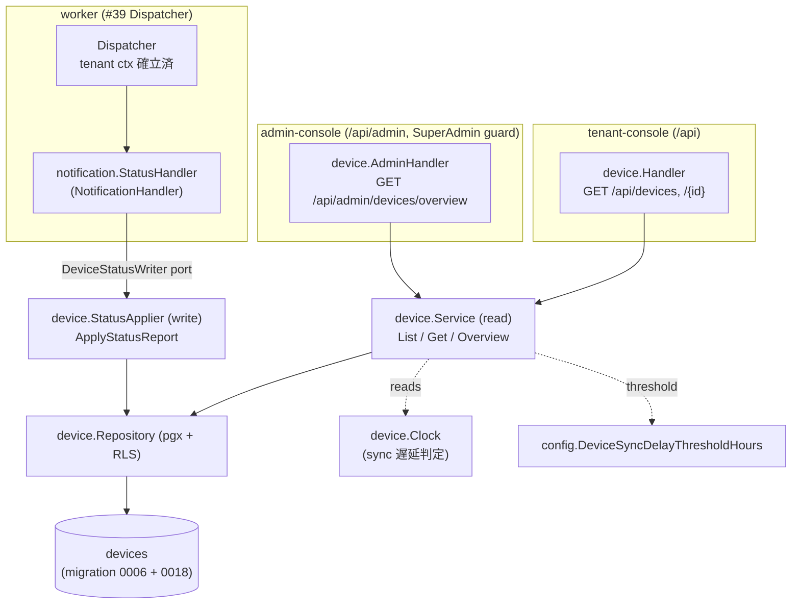

# Design Document

## Overview

**Purpose**: 本 Issue は umbrella #24 の Requirement 5 / 7.5 / NFR 1.2 / 3.2 のバックエンド実装
スライスとして、端末インベントリの **読み取り系機能**（自テナント一覧・詳細・コンプライアンス
分類・同期遅延の可視化）と、SaaS 運営者向けの **全テナント横断 overview**、そして
**STATUS_REPORT 通知を契機とした端末属性の更新** を提供する。端末属性は HTTP からの直接書込み
ではなく通知駆動でのみ反映される点（Req 7.3）を不変条件として型レベルで担保する。

**Users**: tenant-console の TenantAdmin / Operator / Viewer が自テナント端末の現況把握
（一覧・詳細）に、admin-console の SuperAdmin が全テナント横断のリスク俯瞰（overview）に利用する。
STATUS_REPORT 更新は worker（Notification Dispatcher / #39）が受信した通知を契機に非同期で走る。

**Impact**: 新規ドメインパッケージ `internal/device/`（読み取り Service / 書込み StatusApplier /
Repository / 2 Handler）を追加し、`internal/notification/status_handler.go` に STATUS_REPORT の
`NotificationHandler` 実装を追加する。`devices` テーブルは既存（migration 0006）を再利用し、
STATUS_REPORT が報告する適用中ポリシー名を保持する `applied_policy_name` 列と、コンプライアンス
フィルタ一覧の性能担保（NFR 1.1）のための複合 index を新規 migration で追加する。`cmd/api` に
2 エンドポイントを配線する。`cmd/worker` は本 Issue では変更しない（後述 Risks）。

> **分量について**: 本設計は複数モジュール横断（device 6 ファイル + notification handler +
> migration + cmd 配線）のため design-principles「複雑」帯（≤600 行）を適用する。散文は表・図に
> 寄せ、既存コードは `file:line` 参照で示して逐語転載しない。

### Goals
- 自テナント端末の一覧（フィルタ・ページング）／詳細を RLS でテナント分離したまま提供する
- コンプライアンス 4 分類と同期遅延を、既存 `devices` 列 + 設定閾値から算出して可視化する
- SuperAdmin 限定で全テナント横断のテナント別端末数・コンプライアンス内訳を集計する
- STATUS_REPORT 通知から端末属性を冪等・部分更新し、欠落フィールドを破壊しない
- 成功基準: 全 AC（1.1〜7.3 / NFR 1.1・2.1・3.1）がコンポーネント・契約・テストで裏打ちされる

### Non-Goals
- デバイス UI（#13）／リモートコマンド発行（#10）／ポリシー割当 `PUT /api/policies/{id}/assign`（#40 実装済み・別責務）
- ENROLLMENT 通知処理・端末新規登録（別タスク 8）／COMMAND 通知処理
- worker の Dispatcher 本配線（handlers map への status_handler 登録は #36 の責務。後述 Risks）
- 「サポート対象外（unsupported）」への **書込み契機**（読み取り・返却のみ本スコープ / Open Questions）
- 同期遅延・通知欠落の能動アラート機構（push / メール）

## Architecture

### Existing Architecture Analysis
- **ドメイン層 + platform 層**の Go モノリス。各ドメインは `handler.go`（chi / presentation + RBAC）
  → `service.go`（ユースケース）→ `repository.go`（raw pgx + RLS）の 3 層。手本は
  `internal/policy/` と `internal/audit/`。
- **RLS によるテナント分離**: tenant-scoped 参照は `db.BeginTxFunc` で tx を開き、ambient な
  `TenantContext`（TenantContextMiddleware が確立）に分離を委ねる（昇格しない / `policy.Repository`）。
  cross-tenant 参照は `db.WithTenantContext(ctx, {IsSuperAdmin:true})` を確立する（`audit.AdminHandler`
  L164-167 / `tenant.Repository` superAdminContext）。
- **admin-console 経路**は `routers.Admin`（`/api/admin` chain + `RequireAdminConsoleAndSuperAdmin`
  固定ガード継承）へ Mount する（`audit.NewAdminHandler` 手本）。RBAC 二重防御は `authz.Authorizer`。
- **authz マトリクスは provisioned 済み**: `ResourceDevice` × `ActionRead` は tenant-console の
  TenantAdmin/Operator/Viewer と admin-console SuperAdmin に対し既に許可（`authz_test.go` L78/85/224-226）。
  本 Issue で authz は変更しない（呼ぶだけ）。
- **Notification Dispatcher（#39 実装済み）**: `dispatcher.go` は handler 呼び出し前に
  `db.WithTenantContext(ctx, {TenantID})` で tenant RLS context を確立してから
  `handler.Handle(ctx, env)` を呼ぶ（L196-207）。handler は冪等前提（record-after-success）。
  `notification` package は依存方向ルール（`doc.go`）により **他ドメインを import しない**。
  他ドメイン連携は最小 interface の依存逆転で解決する（`TenantResolver` 手本）。

### Architecture Pattern & Boundary Map



**Architecture Integration**:
- **採用パターン**: 既存 3 層（Handler / Service / Repository）を踏襲。読み取り（Service）と
  書込み（StatusApplier）を **別型に分離**し、HTTP handler が参照する `Service` に書込みメソッドを
  一切持たせないことで「HTTP 経由の直接書込み不可」（Req 7.3）を型レベルで担保する。
- **ドメイン／機能境界**: 端末データ所有権は `device` パッケージ。`notification.StatusHandler` は
  payload の wire-format パースと dispatch 配線のみを担い、コンプライアンス分類・DB 書込みは
  device 側（`StatusApplier` → `Repository`）に委譲する。
- **依存方向の判断（重要）**: `notification` は他ドメインを import しない不変条件（doc.go）を維持
  するため、`notification` 側に最小 port `DeviceStatusWriter` と値オブジェクト `StatusReport` を
  定義し、`device.StatusApplier` が **`notification` を import してこれを実装**する
  （`device → notification` の一方向依存。逆方向 import は発生しないため循環しない）。cmd/worker
   配線時（#36）に `StatusApplier` を `StatusHandler` へ注入する（`TenantResolver` と同じ依存逆転
  方式。ただし StatusReport は fields が多く primitive 化が非現実的なため、値オブジェクト共有を選択）。
  - 代替案（不採用）: port を `ApplyStatusReport(ctx, payload []byte)` の primitive 契約にして
    device 側で AMAPI JSON をパースすれば `device → notification` import を避けられるが、payload
    wire-format パースの locus が Verifier（Envelope 生成）と分断される。採用案の方が「通知 payload
    の解釈は notification、ドメイン意味付けは device」の責務分割が明快なため primary とする。
- **新規コンポーネントの根拠**: `device.Clock` は同期遅延判定の現在時刻注入（テスト容易性 /
  `auth.Clock` `audit.Clock` と同型）。`StatusApplier` は Req 7.3 の invariant を型で守るための
  read/write 分離。

### Technology Stack

| Layer | Choice / Version | Role in Feature | Notes |
|-------|------------------|-----------------|-------|
| Backend / Services | Go 1.x + chi v5 | Handler / Service / StatusApplier | 既存 `internal/*` と同構成 |
| Data / Storage | PostgreSQL + pgx v5 + RLS | tenant 分離した参照 / 集計 / 更新 | `db.BeginTxFunc` / `WithTenantContext` |
| Messaging / Events | Cloud Pub/Sub（#39 Dispatcher 経由） | STATUS_REPORT 受信 → StatusHandler | 本 Issue は handler のみ。worker 配線は #36 |
| Infrastructure / Runtime | golang-migrate | `devices` 列追加 + 複合 index | 新規 migration 0018 |

## File Structure Plan

### Directory Structure

```
backend/
├── internal/device/                 # 新規ドメインパッケージ（端末読み取り + STATUS_REPORT 反映）
│   ├── doc.go                       # package doc / 依存方向（device → notification 許可 / RLS 消費方針）
│   ├── types.go                     # 列挙・DTO（DeviceSummary/DeviceDetail/TenantOverview）・ListFilter・DeviceRow・sentinel error
│   ├── clock.go                     # Clock interface + SystemClock（同期遅延判定の時刻注入 / auth・audit と同型）
│   ├── repository.go                # Repository IF + pgx 実装（ListByTenant/GetByID/AggregateOverview/UpdateFromStatusReport）
│   ├── service.go                   # Service（read）IF + 実装：一覧/詳細/overview + コンプライアンス分類・同期遅延判定 helper
│   ├── status_applier.go            # StatusApplier（write）: notification.DeviceStatusWriter を実装（compliance 算出 → Repository 更新）
│   ├── handler.go                   # tenant-console Handler: GET /api/devices, /{id}（query parse / RBAC / error 写像）
│   └── admin_handler.go             # admin-console AdminHandler: GET /api/admin/devices/overview（SuperAdmin 限定）
├── internal/notification/
│   └── status_handler.go            # 新規: StatusHandler（NotificationHandler）+ DeviceStatusWriter port + StatusReport 値オブジェクト + payload parse
└── db/migrations/
    ├── 0018_devices_applied_policy_name_and_compliance_index.up.sql   # applied_policy_name 列追加 + (tenant_id, compliance_status) index
    └── 0018_...down.sql                                               # reversible（列 DROP + index DROP）
```

- **テスト**（対象コード近傍 / CLAUDE.md 規約）: `device/service_test.go` `handler_test.go`
  `admin_handler_test.go` `status_applier_test.go`、`notification/status_handler_test.go`、
  実 DB 結合は `backend/test/integration/device_test.go`（既存 integration と同じ `DATABASE_URL`
  未設定時 `t.Skip` 方式）。
- `handler.go` / `service.go` 内の JSON encode / parseID / decode は `policy.Handler` の
  `writeJSON` / `parseID` と同方式（同パターンにつき個別詳細は Components に記載）。

### Modified Files
- `backend/cmd/api/main.go` — device domain の DI 配線 helper（`buildDeviceHandler` /
  `buildDeviceAdminHandler`）を追加し、`routers.API.Mount("/devices", ...)` /
  `routers.Admin.Mount("/devices/overview", ...)` を配線（既存 (7)〜(10) ブロックと同パターン）。
  authorizer / pool / log / config は既存構築済みインスタンスを再利用する。
- `backend/cmd/api/main_test.go` — `buildDeviceHandler` の型レベル回帰テストを追加（既存
  `buildPolicyHandler` テストと同方針）。
- `backend/cmd/worker/main.go` — **変更しない**（handlers map 登録は #36 の責務 / Risks 参照）。

## Requirements Traceability

| Requirement | Summary | Components | Interfaces / Flows |
|-------------|---------|------------|--------------------|
| 1.1 | 自テナント端末のみ一覧 | Service.List / Repository.ListByTenant | RLS own-tenant SELECT |
| 1.2 | コンプライアンス分類フィルタ | ListFilter.Compliance / Repository | `WHERE compliance_status=$` |
| 1.3 | 管理モードフィルタ | ListFilter.Mode / Repository | `WHERE mode=$` |
| 1.4 | 同期遅延フィルタ | ListFilter.SyncDelayed / Service.cutoff | `WHERE last_status_at < cutoff` |
| 1.5 | ページング | ListFilter.Page/PageSize / Repository | `LIMIT/OFFSET` |
| 1.6 | 未定義フィルタ値の拒否 | Handler.parseListFilter | 400 CodeInvalidRequest |
| 1.7 | 空一覧はエラーにしない | Service.List | 非 nil 空 slice |
| 2.1 | 詳細（モード/ポリシー/HW/SW/最終同期/準拠） | Service.Get / DeviceDetail | RLS own-tenant GET |
| 2.2 | インストール済みアプリ | DeviceDetail.InstalledApps | jsonb 返却 |
| 2.3 | 同期遅延フラグ付与 | Service.Get / DeviceDetail.SyncDelayed | cutoff 比較 |
| 2.4 | 不在端末は 404 | Service.Get / ErrDeviceNotFound | 404 |
| 2.5 | 空属性は空で返す | DeviceDetail（default `{}`/`[]`） | エラーにしない |
| 3.1 | 4 分類で返却 | types.ComplianceStatus / Service | stored enum 返却 |
| 3.2 | 非準拠理由併記 | DeviceDetail.NonComplianceDetails | jsonb 返却 |
| 3.3 | 未観測は「未確認」 | devices.compliance_status DEFAULT 'unknown' | DB default |
| 3.4 | 「サポート対象外」を第 4 分類で返却 | types.ComplianceStatus | read のみ（書込み契機は Open Q） |
| 4.1 | 閾値超過で同期遅延 | Service.isSyncDelayed | `now-last_status_at > threshold` |
| 4.2 | 閾値は設定値（既定 24h） | config.DeviceSyncDelayThresholdHours | 注入 |
| 4.3 | 閾値ちょうどは遅延扱いしない | Service.isSyncDelayed | strict `>` |
| 5.1 | 他テナント端末は存在秘匿 404 | Repository.GetByID（RLS 0 行）/ Service | 汎用 404 |
| 5.2 | 不在と越境で同一応答 | Service.Get / ErrDeviceNotFound | 同一 message |
| 6.1 | テナント別端末数 + 内訳集計 | AdminHandler / Service.Overview / AggregateOverview | SuperAdmin GROUP BY |
| 6.2 | 非 SuperAdmin は 403 | RequireAdminConsoleAndSuperAdmin + authz | 403 |
| 6.3 | tenant_id 絞り込み overview | Service.Overview(filter) | `WHERE tenant_id=$` |
| 6.4 | 端末 0 件は 0 サマリ | AdminHandler / Service.Overview | 空 slice |
| 7.1 | STATUS_REPORT で属性更新 | notification.StatusHandler / StatusApplier / Repository.UpdateFromStatusReport | Dispatcher tenant ctx |
| 7.2 | 部分 payload は欠落を破壊しない | StatusReport 任意フィールド + COALESCE UPDATE | 部分更新 |
| 7.3 | HTTP 直接書込み IF なし | Service に write メソッド無 / StatusApplier 分離 | 型レベル invariant |
| NFR 1.1 | 5,000 端末で p95<1s（分類フィルタ） | migration 0018 複合 index | `(tenant_id, compliance_status)` |
| NFR 2.1 | 受信 60s 以内に反映 | 同期 UPDATE（read-after-write 即時可視） | 結合テストで確認 |
| NFR 3.1 | 恒常的テナント分離 | RLS（全 read 経路）/ SuperAdmin は overview のみ | 分離テスト |

## Components and Interfaces

### Device Domain

#### device.Repository

| Field | Detail |
|-------|--------|
| Intent | `devices` への tenant-scoped 参照・SuperAdmin 集計・STATUS_REPORT 部分更新を raw pgx + RLS で集約 |
| Requirements | 1.1〜1.5, 2.1, 2.2, 5.1, 6.1, 6.3, 6.4, 7.1, 7.2, NFR 1.1, NFR 3.1 |

**Responsibilities & Constraints**
- tenant-scoped メソッド（ListByTenant / GetByID / UpdateFromStatusReport）は ambient な
  `TenantContext`（Handler は Middleware 由来、StatusApplier は Dispatcher 由来）のまま
  `db.BeginTxFunc` で tx を開き RLS に分離を委ねる（**昇格しない** / `policy.Repository` と同方針）。
- `AggregateOverview` は cross-tenant 集計のため、呼び出し側（AdminHandler）が確立した
  SuperAdmin `TenantContext`（`IsSuperAdmin=true`）の ctx を信頼する（`audit.AdminHandler` 手本）。
- 列ごと型付き scan（jsonb は `json.RawMessage`、nullable は pointer）。invariants: 書込みは
  `UpdateFromStatusReport` のみ（HTTP 経路の write メソッドを持たない / Req 7.3）。

**Dependencies**
- Inbound: device.Service（read）, device.StatusApplier（write）(Critical)
- Outbound: `platform/db`（BeginTxFunc / WithTenantContext）(Critical)
- External: PostgreSQL（Critical）

**Contracts**: Service [x] / API [ ] / Event [ ] / Batch [ ] / State [ ]

##### Service Interface

```go
type Repository interface {
    // ListByTenant は自テナント端末をフィルタ + ページングで返す（Req 1.1〜1.5）。
    // syncCutoff は同期遅延フィルタ用の閾値時刻（now-threshold, Service が算出）。
    // filter.SyncDelayed!=nil のとき WHERE last_status_at < syncCutoff（true）/ 遅延でない（false）を適用。
    ListByTenant(ctx context.Context, tenantID uuid.UUID, f ListFilter, syncCutoff time.Time) ([]DeviceRow, error)
    // GetByID は自テナント端末 1 行を返す。0 行（不在 / RLS 越境）は ErrDeviceNotFound（Req 2.4/5.1/5.2）。
    GetByID(ctx context.Context, tenantID, deviceID uuid.UUID) (DeviceRow, error)
    // AggregateOverview は SuperAdmin ctx 下でテナント別 × compliance_status の件数を集計（Req 6.1/6.3/6.4）。
    AggregateOverview(ctx context.Context, tenantFilter *uuid.UUID) ([]TenantComplianceCount, error)
    // UpdateFromStatusReport は amapi_device_name 一致行を部分更新し affected 行数を返す（Req 7.1/7.2）。
    // 各カラムは COALESCE($n, col) で「payload 欠落 → 既存値保持」を実現する。affected=0 は未登録端末。
    UpdateFromStatusReport(ctx context.Context, u StatusApplyInput) (int64, error)
}
```
- Preconditions: tenant-scoped メソッドは ctx に TenantContext（tenantID or SuperAdmin）が確立済み。
- Postconditions: List は 0 件で非 nil 空 slice（Req 1.7）。Get 0 行は `ErrDeviceNotFound`。
- Invariants: 越境行は RLS で SELECT 0 行、UPDATE も RLS 句で 0 行（NFR 3.1）。

#### device.Service（read）

| Field | Detail |
|-------|--------|
| Intent | 一覧/詳細/overview のユースケース + コンプライアンス分類（読み取り）・同期遅延判定 |
| Requirements | 1.1〜1.7, 2.1〜2.5, 3.1〜3.4, 4.1〜4.3, 5.1, 5.2, 6.1, 6.3, 6.4, NFR 3.1 |

**Responsibilities & Constraints**
- `List` は `ListFilter` を Repository へ渡す。現在時刻（Clock.Now）と閾値（config）から
  `syncCutoff = now - threshold` を算出し、フィルタ・per-row `SyncDelayed` 算出の双方で用いる。
- `isSyncDelayed(lastStatusAt *time.Time)`: `lastStatusAt != nil && lastStatusAt.Before(syncCutoff)`
  → true。**strict less-than** で閾値ちょうどは遅延扱いしない（Req 4.3）。`last_status_at` が
  NULL（一度も STATUS_REPORT 未受信）の端末は **遅延扱いしない**（Req 4.1 が「最終同期時刻からの
  経過」を前提とするため。分類は DB default 'unknown' に留まる / 設計判断・Open Questions 参照）。
- `Get` は `DeviceRow` を `DeviceDetail` へ写像。jsonb 空属性は `{}`/`[]` で返す（Req 2.5）。
- `Overview` は `AggregateOverview` の flat な件数行を tenant 単位に畳み込み `[]TenantOverview` に
  する。全 compliance 分類の 0 埋めを行う。集計は `devices` 由来のため、端末 0 件のテナントは
  行に現れない（設計判断: 0 件テナントは列挙しない / Open Questions 参照）。全体 0 件は空 slice（Req 6.4）。
- **write メソッドを持たない**（Req 7.3 を型で担保）。監査記録は行わない（read 系 / #40 と同方針）。

**Dependencies**
- Inbound: device.Handler, device.AdminHandler (Critical)
- Outbound: device.Repository (Critical), device.Clock (Important), config（threshold 値）(Important)

**Contracts**: Service [x] / API [ ] / Event [ ] / Batch [ ] / State [ ]

```go
type Service interface {
    List(ctx context.Context, tenantID uuid.UUID, f ListFilter) ([]DeviceSummary, error)
    Get(ctx context.Context, tenantID, deviceID uuid.UUID) (DeviceDetail, error)
    Overview(ctx context.Context, tenantFilter *uuid.UUID) ([]TenantOverview, error)
}
```

#### device.StatusApplier（write）

| Field | Detail |
|-------|--------|
| Intent | STATUS_REPORT の意味付け（compliance 算出）+ 端末属性の部分更新。read Service と分離した唯一の書込み経路 |
| Requirements | 7.1, 7.2, 7.3, 3.2, NFR 2.1 |

**Responsibilities & Constraints**
- `notification.DeviceStatusWriter` を実装（`device → notification` import）。`notification.StatusReport`
  の任意フィールドを `StatusApplyInput` へ写像する。
- コンプライアンス算出: `StatusReport.NonComplianceDetails` が **payload に存在**するときのみ
  `compliance_status` を導出する（空配列 → `compliant` / 非空 → `non_compliant` + 理由 jsonb）。
  payload に存在しないときは `compliance_status` / `non_compliance_details` を更新しない（Req 7.2）。
  `unsupported` は本経路で書き込まない（Open Questions / 書込み契機はスコープ外）。
- 冪等: Repository の `UpdateFromStatusReport` は amapi_device_name 一致行への UPDATE のため、
  同一 STATUS_REPORT の再適用は安全（Dispatcher は record-after-success 前提 / #39）。
- `affected=0`（未登録端末）は error にせず nil を返し完了扱い（ENROLLMENT 未処理 / Open Questions）。
  構造化 WARN を残す（機密値・payload 生値は補間しない / NFR 3.1）。

**Dependencies**
- Inbound: notification.StatusHandler（port 注入 / cmd/worker #36）(Critical)
- Outbound: device.Repository (Critical)

**Contracts**: Service [x] / API [ ] / Event [x] / Batch [ ] / State [ ]

```go
// device 側が実装（notification.DeviceStatusWriter を満たす）
func (a *StatusApplier) ApplyStatusReport(ctx context.Context, r notification.StatusReport) error
```
- Preconditions: ctx に tenant TenantContext が確立済み（Dispatcher が確立 / #39）。
- Postconditions: 一致端末 1 行が部分更新される、または未登録で no-op（affected=0）。
- Invariants: payload 欠落フィールドは既存値を破壊しない（Req 7.2）。

#### device.Handler（tenant-console）

| Field | Detail |
|-------|--------|
| Intent | `GET /api/devices`（一覧）/ `GET /api/devices/{id}`（詳細）の HTTP I/O + RBAC + error 写像 |
| Requirements | 1.1〜1.7, 2.1〜2.5, 3.x, 4.x, 5.1, 5.2 |

**Responsibilities & Constraints**
- `authorize`（`policy.Handler.authorize` と同型）で own-tenant `ResourceDevice` × `ActionRead` を
  判定。claims 不在は 401、deny は 403（TenantAdmin/Operator/Viewer は許可 / provisioned matrix）。
- `parseListFilter`: `compliance` / `mode` / `sync_state`（例 `delayed`/`ok`）/ `page` / `page_size`
  を parse。**未定義の enum 値は 400**（Req 1.6）。ページング既定は `page=1` / `page_size=50`、
  上限 `page_size<=200`（超過は 200 に clamp、非数値/負は 400）（設計判断 / Open Questions）。
- 詳細の不在 / 越境は Service の `ErrDeviceNotFound`（404 / 汎用 message、存在差非露出 / Req 5.1/5.2）。
- error は `pkgerrors.WriteHTTP` で写像。JSON encode / parseID は `policy.Handler` と同方式。
- `chi.Router` 内包で `routers.API.Mount("/devices", h)` により `/api/devices` 稼働。

**Contracts**: Service [ ] / API [x] / Event [ ] / Batch [ ] / State [ ]

##### API Contract

| Method | Endpoint | Request | Response | Errors |
|--------|----------|---------|----------|--------|
| GET | /api/devices | query: compliance?, mode?, sync_state?, page?, page_size? | []DeviceSummary | 400, 401, 403 |
| GET | /api/devices/{id} | — | DeviceDetail | 401, 403, 404 |

#### device.AdminHandler（admin-console）

| Field | Detail |
|-------|--------|
| Intent | `GET /api/admin/devices/overview`（全テナント横断サマリ）の HTTP I/O + SuperAdmin gate |
| Requirements | 6.1, 6.2, 6.3, 6.4, NFR 3.1 |

**Responsibilities & Constraints**
- `RequireAdminConsoleAndSuperAdmin` 固定ガード配下に Mount（tenant-console aud / 非 SuperAdmin は
  ガードが 403 / Req 6.2）。二重防御で `authz` の cross-tenant `ResourceDevice read` を判定
  （`audit.AdminHandler` の probe-tenant 方式に倣う）。
- SuperAdmin `TenantContext`（`IsSuperAdmin=true`）を `db.WithTenantContext` で確立してから
  `Service.Overview` を呼ぶ（RLS is_superadmin 句で全テナント可視 / `audit.AdminHandler` L164-167）。
- `tenant_id` query（任意 / 不正書式は 400）で単一テナントへ絞り込み（Req 6.3）。空集計は `[]` で 200（Req 6.4）。

**Contracts**: Service [ ] / API [x] / Event [ ] / Batch [ ] / State [ ]

##### API Contract

| Method | Endpoint | Request | Response | Errors |
|--------|----------|---------|----------|--------|
| GET | /api/admin/devices/overview | query: tenant_id? | []TenantOverview | 400, 401, 403 |

### Notification Domain

#### notification.StatusHandler

| Field | Detail |
|-------|--------|
| Intent | STATUS_REPORT payload の wire-format パース + `DeviceStatusWriter` への dispatch 配線 |
| Requirements | 7.1, 7.2 |

**Responsibilities & Constraints**
- `NotificationHandler`（`Handle(ctx, Envelope) error`）を実装。`Envelope.Payload []byte`（AMAPI
  Device の JSON）を `StatusReport` へパースする。空 payload / malformed JSON は
  `*errors.Error{IsTransient:false}`（破棄 ack 相当 / Verifier の分類方針と整合）。
- `StatusReport` は **任意（optional）フィールド**（pointer / `*json.RawMessage`）で「payload に
  存在するか」を保持し、部分更新（Req 7.2）を可能にする。device の識別は AMAPI `name`
  （= `devices.amapi_device_name`）で行う。
- device 依存は `DeviceStatusWriter` port 経由（`notification` は device を import しない /
  doc.go 不変条件）。tenant ctx は Dispatcher が確立済み（本 handler は確立しない）。
- 機密値（payload 生値）を error 文言・構造化ログに補間しない（NFR 3.1）。ログは message_id 中心。

**Dependencies**
- Inbound: notification.Dispatcher（handlers map / #36 で登録）(Critical)
- Outbound: DeviceStatusWriter（= device.StatusApplier / 注入）(Critical)

**Contracts**: Service [x] / API [ ] / Event [x] / Batch [ ] / State [ ]

```go
// notification 側に定義（device が実装）
type DeviceStatusWriter interface {
    ApplyStatusReport(ctx context.Context, r StatusReport) error
}

type StatusReport struct {
    DeviceName           string            // AMAPI name（devices.amapi_device_name 一致キー / 必須）
    LastStatusReportTime *time.Time        // nil = payload 欠落（更新しない）
    AppliedPolicyName    *string           // nil = 欠落
    NonComplianceDetails *json.RawMessage  // nil = 欠落 / 非 nil（[] 含む）で compliance 再判定
    HardwareInfo         *json.RawMessage  // nil = 欠落
    SoftwareInfo         *json.RawMessage  // nil = 欠落
    InstalledApps        *json.RawMessage  // nil = 欠落
}
```
- Preconditions: Envelope.NotificationType == STATUS_REPORT（Dispatcher が振り分け済み）。
- Postconditions: `DeviceStatusWriter.ApplyStatusReport` を 1 回呼ぶ、または parse 失敗で破棄 ack。
- Invariants: `DeviceName` 空は不正 payload として破棄 ack（更新キー不能）。

## Data Models

### Domain Model
- **Device Aggregate**（`devices`）: 端末属性の唯一の所有者。更新は STATUS_REPORT 経由（本 Issue の
  `StatusApplier`）と、ポリシー割当（`applied_policy_id` / #40）のみ。読み取りは RLS でテナント分離。
- **トランザクション境界**: 各参照 / 集計 / 更新は 1 tx 内で完結（`db.BeginTxFunc`）。

### DTO 形状（`device/types.go`）

```go
type ComplianceStatus string // "compliant" | "non_compliant" | "unknown" | "unsupported"
type DeviceMode string       // "fully_managed" | "dedicated"

type ListFilter struct {
    Compliance *ComplianceStatus // nil=無条件
    Mode       *DeviceMode
    SyncDelayed *bool            // nil=無条件 / true=遅延のみ / false=非遅延のみ
    Page       int               // 1-based, 既定 1
    PageSize   int               // 既定 50, 上限 200
}

type DeviceSummary struct { // 一覧 1 行（Req 1.x）
    ID uuid.UUID; AMAPIDeviceName string; Mode DeviceMode
    ComplianceStatus ComplianceStatus; LastStatusAt *time.Time; SyncDelayed bool
}

type DeviceDetail struct { // 詳細（Req 2.x / 3.x / 4.3）
    ID uuid.UUID; AMAPIDeviceName string; Mode DeviceMode
    AppliedPolicyName string                 // STATUS_REPORT 報告値（空可 / Req 2.1 適用中ポリシー）
    HardwareInfo, SoftwareInfo json.RawMessage  // 空は {}（Req 2.5）
    ComplianceStatus ComplianceStatus; NonComplianceDetails json.RawMessage // 空は []（Req 3.2）
    InstalledApps json.RawMessage            // 空は []（Req 2.2 / 2.5）
    LastStatusAt *time.Time; SyncDelayed bool // Req 2.3 / 4.x
    EnrolledAt time.Time
}

type TenantOverview struct { // 横断集計 1 テナント分（Req 6.1）
    TenantID uuid.UUID; DeviceCount int
    Breakdown map[ComplianceStatus]int // 4 分類を 0 埋め
}
```

### Physical Data Model（migration 0018）
- `ALTER TABLE devices ADD COLUMN applied_policy_name text`（nullable）: STATUS_REPORT が報告する
  適用中ポリシー名を保持（Req 2.1 の「適用中ポリシー」/ Req 7.1）。既存 `applied_policy_id`（割当
  intent / #40）とは別概念（設計判断: 報告値を faithful に保持し、FK / 名前解決に依存しない）。
- `CREATE INDEX idx_devices_tenant_compliance ON devices(tenant_id, compliance_status)`: コンプライアンス
  分類フィルタ一覧の p95<1s（NFR 1.1）。同期遅延フィルタは既存 `idx_devices_last_status_at` を活用。
- RLS は既存 `tenant_isolation_devices`（0011）を継承（列追加で新規 RLS 不要）。

## Error Handling

### Error Strategy
- 既存 `internal/errors`（Code → HTTP status + `WriteHTTP` 写像）を踏襲。Handler は独自に status を
  組み立てず Code に委ねる（`policy.Handler` と同方式）。

### Error Categories and Responses
- **User Errors (4xx)**: 未定義フィルタ値 / 不正 page_size → 400（Req 1.6）。claims 不在 → 401。
  RBAC deny → 403（Req 6.2）。不在 / 越境端末 → 404（存在差非露出・同一 message / Req 2.4/5.1/5.2）。
- **System Errors (5xx)**: DB 失敗 → `CodeUnavailable`（503）。STATUS_REPORT 経路の一時失敗は
  `IsTransient=true` で Dispatcher が nack 保持（喪失させない / #39）。恒常失敗（malformed payload）は
  `IsTransient=false` で破棄 ack。
- **Business Logic Errors**: 未登録端末への STATUS_REPORT は error にせず no-op ack + WARN（Open Q）。

## Testing Strategy

- **Unit Tests**:
  1. `isSyncDelayed`: 閾値超過 → 遅延 / 閾値ちょうど → 非遅延（Req 4.3）/ `last_status_at`=NULL → 非遅延
  2. コンプライアンス写像（StatusApplier）: nonComplianceDetails 空→compliant / 非空→non_compliant / 欠落→未更新（Req 7.2）
  3. `parseListFilter`: 未定義 enum → 400（Req 1.6）/ page_size clamp / 既定値
  4. Overview 畳み込み: flat 件数行 → tenant 単位 4 分類 0 埋め / 全体 0 件 → 空 slice（Req 6.4）
  5. StatusHandler.Handle: 空 payload / malformed → 破棄 ack（IsTransient=false）
- **Integration Tests**（実 DB / DATABASE_URL 未設定は Skip）:
  1. STATUS_REPORT → UpdateFromStatusReport → Get で反映確認（read-after-write / NFR 2.1）+ 部分 payload で既存値保持（Req 7.2）
  2. 他テナント端末 ID の詳細要求 → 404（不在と同一応答 / Req 5.1/5.2 / NFR 3.1）
  3. `AggregateOverview` SuperAdmin ctx で全テナント集計 / tenant_id 絞り込み（Req 6.1/6.3）
  4. コンプライアンス / mode / sync フィルタ一覧が該当行のみ返す（Req 1.2〜1.4）
- **E2E / Routing Tests**:
  1. `/api/devices` 未認証 → 401、`/api/admin/devices/overview` を tenant-console / 非 SuperAdmin → 403（Req 6.2）
  2. `cmd/api` 配線スモーク: `buildDeviceHandler` 型レベル回帰（main_test.go）
- **Performance**: `(tenant_id, compliance_status)` index が分類フィルタ SELECT で使われることを
  `EXPLAIN` 手動確認（NFR 1.1 は index 妥当性で担保。負荷試験は本スコープ外）。

## Security Considerations
- テナント分離は RLS（read 全経路）で物理担保。overview のみ SuperAdmin context へ昇格し、
  `RequireAdminConsoleAndSuperAdmin` + authz マトリクスで二重に gate（Req 6.2 / NFR 3.1）。
- 機密値（payload 生値 / hardware・software info の生値）を error 文言・構造化ログに補間しない（NFR 3.1）。

## Risks / Open Questions

**PR「確認事項」候補（人間判断が望ましい / 推測で確定しない）**:
1. **unsupported 書込み契機**: 「サポート対象外」への遷移契機（STATUS_REPORT の Android バージョン
   判定か、エンロールハンドラ側判定か）は未確定。本 Issue は read 側（第 4 分類の返却 / Req 3.4）
   のみ実装し、StatusApplier は `unsupported` を書き込まない。
2. **未登録端末への STATUS_REPORT**: ENROLLMENT 未処理の端末への STATUS_REPORT を、本設計は
   `affected=0` の no-op ack + WARN とする（新規作成しない）。create / hold / discard のいずれが
   正かは要確認。
3. **順序逆転 STATUS_REPORT の stale 抑止**: 本設計は last-write-wins（`last_status_at` 比較ガードを
   置かない）。古いレポートが新しいレポートを上書きしうる。`WHERE last_status_at IS NULL OR
   last_status_at <= report_time` ガードを入れるべきか要確認。

**設計判断（要件を変えずに既定を仮定 / 根拠明記）**:
- `last_status_at`=NULL（未受信）端末は同期遅延扱いしない（Req 4.1 が最終同期時刻の存在を前提とする）。
- overview は `devices` 集計のため端末 0 件テナントは列挙しない（Req 6.4 は全体 0 件の空集計のみ規定）。
- ページング既定 `page_size=50` / 上限 `200`（未定義 / 一般的な運用値）。
- 詳細の「適用中ポリシー」は STATUS_REPORT 報告値 `applied_policy_name` を返す（割当 intent の
  `applied_policy_id` とは別。報告値を faithful に保持する新規列を追加）。

**技術リスク**:
- **migration 番号衝突**: 現行の最大は `0017`（`0017_policies_version_bigint` / #40 merged）。本 Issue は
  `0018` を割り当てるが、in-flight branch（#52 等）も `0018` を使う可能性があり衝突しうる。merge 順で
  再採番が必要になり得る点を PR で明示する。
- **worker 配線境界**: `cmd/worker/main.go` は現在 `pendingDispatchHandler`（暫定）を使用中で、実
  Dispatcher と handlers map の本配線は **#36 の責務**。本 Issue は `StatusHandler` 実装 +
  `device.StatusApplier` + port を提供するのみで、handlers map への登録・worker 変更は行わない。
  end-to-end（Dispatcher → StatusHandler → device 更新）は本 Issue の結合テストで test-only 配線に
  より検証する。#36 側で `notification.NewStatusHandler(statusApplier, log)` を STATUS_REPORT に登録
  すれば本番稼働する。
